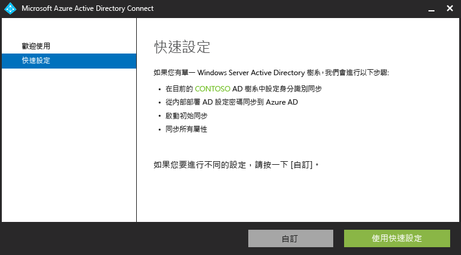

<properties 
	pageTitle="開始使用 Azure AD Connect" 
	description="了解如何下載、安裝和執行 Azure AD Connect 的安裝精靈。" 
	services="active-directory" 
	documentationCenter="" 
	authors="billmath" 
	manager="terrylan" 
	editor="lisatoft"/>

<tags 
	ms.service="azure-active-directory-connect" 
	ms.workload="identity" 
	ms.tgt_pltfrm="na" 
	ms.devlang="na" 
	ms.topic="article" 
	ms.date="04/02/2015" 
	ms.author="billmath"/>

# 開始使用 Azure AD Connect

<a href="/zh-tw/documentation/articles/active-directory-aadconnect/" title="它是什麼" class="current">它是什麼</a> <a href="/zh-tw/documentation/articles/active-directory-aadconnect-how-it-works/" title="運作方式">運作方式</a> <a href="/zh-tw/documentation/articles/active-directory-aadconnect-get-started/" title="開始使用">開始使用</a> <a href="/zh-tw/documentation/articles/active-directory-aadconnect-whats-next/" title="下一步">下一步</a> <a href="/zh-tw/documentation/articles/active-directory-aadconnect-learn-more/" title="深入了解">深入了解</a>

下列文件將協助您開始使用 Azure Active Directory Connect。

## 下載 Azure AD Connect

若要開始使用 Azure AD Connect，您可以使用下列項目下載最新版本：[下載 Azure AD Connect Public Preview](http://connect.microsoft.com/site1164/program8612)

## 安裝 Azure AD Connect 之前
安裝 Azure AD Connect 之前，您需要注意一些事項。

- Azure 訂用帳戶或 [Azure 試用版訂用帳戶](http://azure.microsoft.com/pricing/free-trial/)
- Azure AD Premium 或 [Azure AD Premium 試用版](http://aka.ms/aadptrial)
- 想要與其整合之 Azure AD 租用戶的 Azure AD 全域管理員帳戶
- AD 網域控制站或成員伺服器 (含 Windows Server 2008 或更新版本)
- 本機 Active Directory 的企業系統管理員帳戶
- 選用：測試使用者帳戶來驗證同步處理。 

如果您想要搭配使用 SSO 與 AD FS 選項，則也需要下列項目：

- 您想要的同盟伺服器上的本機系統管理員認證。
- 在想要部署 Web 應用程式 Proxy 角色之任何工作群組 (非加入網域) 伺服器上的本機系統管理員認證。
- 同盟伺服器的 Windows Server 2012 R2 伺服器。
- Web 應用程式 Proxy 的 Windows Server 2012 R2 伺服器。
-  含所想要同盟服務名稱的一個 SSL 憑證的 .pfx 檔案，例如 fs.contoso.com。
- 執行精靈的電腦必須能夠透過 Windows 遠端管理連線到您要安裝 AD FS 或 Web 應用程式 Proxy 的任何其他電腦。

## 安裝 Azure AD Connect

下載 Azure AD Connect 之後，請使用下列項目安裝 Azure AD Connect。

1. 以企業系統管理員身分登入您想要安裝 Azure AD Connect 的伺服器。
2. 瀏覽並按兩下 AzureADConnect.msi
3. 使用快速或自訂設定來逐步執行精靈
4. 選用：使用測試使用者帳戶登入雲端服務 (例如 Office 365) 來進行測試。

## 同步作業服務選用組態
安裝同步處理服務時，您可以將選用組態區段保持未核取狀態，而且 Azure AD Connect 會自動設定所有項目。這包括設定 SQL Server 2012 Express 執行個體，以及建立適當的群組與指派其權限。如果您想要變更預設值，則可以使用下表了解可用的選用組態選項。

選用組態 | 說明 
------------- | ------------- |
SQL Server 名稱 |可讓您指定 SQL Server 名稱和執行個體名稱。如果您已經有想要使用的 ad 資料庫伺服器，請選擇這個選項。
服務帳戶 |Azure AD Connect 預設會建立服務帳戶，以供同步處理服務使用。引起的問題是密碼是自動產生的，但安裝 Azure AD Connect 的人員不知。在大多數情況下，這沒問題，但是，如果您想要進行一些進階組態 (例如，將範圍設為已同步處理的組織單位)，則會想要建立帳戶，並選擇自己的密碼。 |
權限 | Azure AD Connect 預設會在安裝同步處理服務時建立四個群組。這些群組如下：[系統管理員] 群組、[操作員] 群組、[瀏覽] 群組和 [密碼重設群組]。如果您想要指定自己的群組，則可以在這裡這麼做。
匯入設定 |如果您是從 Azure AD Sync 的 DirSync 匯入組態資訊，請使用此選項。|

## 快速安裝
選取 [快速設定] 是預設選項，而且是其中一個最常見的實例。這樣做時，Azure AD Connect 會使用密碼雜湊同步處理選項部署同步處理。這僅適用於單一樹系，而且可讓您的使用者使用其內部部署密碼來登入雲端。使用快速安裝會在完成安裝之後自動開始同步處理。使用此選項，只要簡短地按六下即可將內部部署目錄擴充至雲端。

## 自訂安裝

使用自訂安裝，您可以選取數個不同的選項。下表說明在選取自訂安裝選項時可用的精靈頁面。

頁面名稱 | 說明
-------------------    | ------------- | 
使用者登入|在此頁面上，您可以選擇使用 [密碼同步處理]、[與 AD FS 同盟] 或兩者都不使用。
連線至您的目錄|在此頁面上，您可以新增想要與其同步處理的一個或多個目錄。
同步處理篩選| 您可以在這裡決定是要同步處理所有使用者和群組，還是要為每個目錄指定一個群組並只對它們同步處理。
內部部署身分識別|您可以在這裡指定使用者在 [連線至您的目錄] 頁面中所新增的所有目錄中只出現一次，或他們存在於多個目錄中。如果使用者存在於多個目錄中，則您必須選擇可在目錄中唯一識別這些使用者的屬性。例如，mail 屬性、ObjectSID 或 SAMAccountName 是用來唯一識別使用者的所有通用屬性。
Azure 身分識別|在此頁面上，您可以指定想要用於身分識別同盟的來源錨點。
選用性功能|如需您可以選取之選用性功能的簡短說明，請使用下表。

選用性功能 | 說明
-------------------    | ------------- | 
Exchange 混合部署 |「Exchange 混合部署」功能透過將一組特定屬性從 Azure AD 同步處理回內部部署目錄，以允許 Exchange 信箱同時存在於內部部署和 Azure 中。
Azure AD 應用程式和屬性篩選|透過啟用 Azure AD 應用程式和屬性篩選，可將這組同步處理的屬性調整為精靈後續頁面上的特定一組屬性。這會在精靈中開啟兩個額外的組態頁面。  
密碼回寫|透過啟用密碼回寫，使用 Azure AD 所產生的密碼變更會回寫至內部部署目錄。
使用者回寫|透過啟用使用者回寫，在 Azure AD 中所建立的使用者會回寫至內部部署目錄。這會在精靈中開啟一個額外的組態頁面。  
裝置同步處理|透過啟用裝置同步處理，裝置組態可以寫入至 Azure AD。
目錄擴充屬性同步處理|透過啟用目錄擴充屬性同步處理，指定的屬性將會同步處理至 Azure AD。這會在精靈中開啟一個額外的組態頁面。  

如需使用同步處理規則編輯器和宣告式佈建的額外組態選項 (例如，變更預設組態)，請參閱[管理 Azure AD Connect](active-directory-aadconnect-whats-next.md)

## Azure AD Connect 支援元件

下列是每個必要條件和支援元件的清單，而 Azure AD Connect 將這些必要條件和支援元件安裝於在其上設定 Azure AD Connect 的伺服器。此清單適用於基本快速安裝。如果您選擇在 [安裝同步處理服務] 頁面上使用不同的 SQL Server，則不會安裝下面所列的 SQL Server 2012 元件。

- Forefront Identity Manager Azure Active Directory Connector
- Microsoft SQL Server 2012 命令列公用程式
- Microsoft SQL Server 2012 Native Client
- Microsoft SQL Server 2012 Express LocalDB
- Azure Active Directory Module for Windows PowerShell
- Microsoft Online Services Sign-In Assistant for IT Professionals
- Microsoft Visual C++ 2013 Redistribution Package

**其他資源**

* [在雲端中使用內部部署身分識別基礎結構](active-directory-aadconnect.md)
* [Azure AD Connect 運作方式](active-directory-aadconnect-how-it-works.md)
* [使用 Azure AD Connect 的下一步](active-directory-aadconnect-whats-next.md)
* [深入了解](active-directory-aadconnect-learn-more.md)
* [MSDN 上的 Azure AD Connect](https://msdn.microsoft.com/library/azure/dn832695.aspx)

<!---HONumber=58--> 