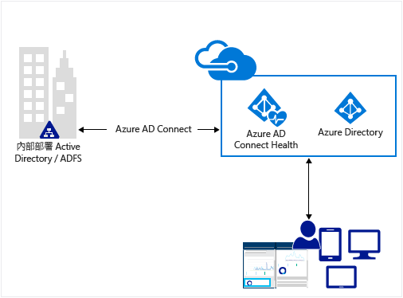
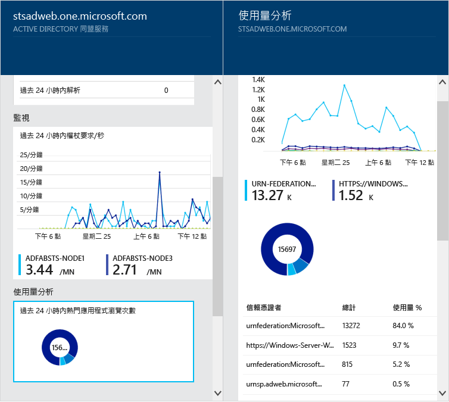
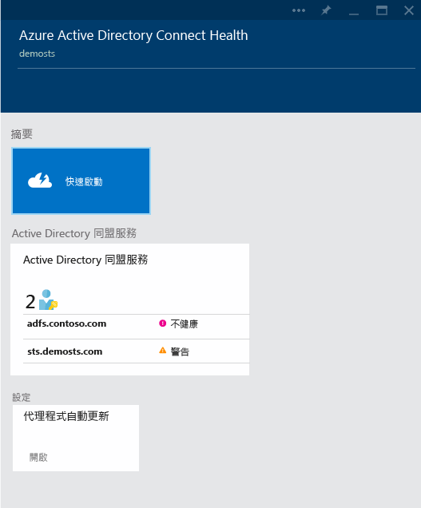
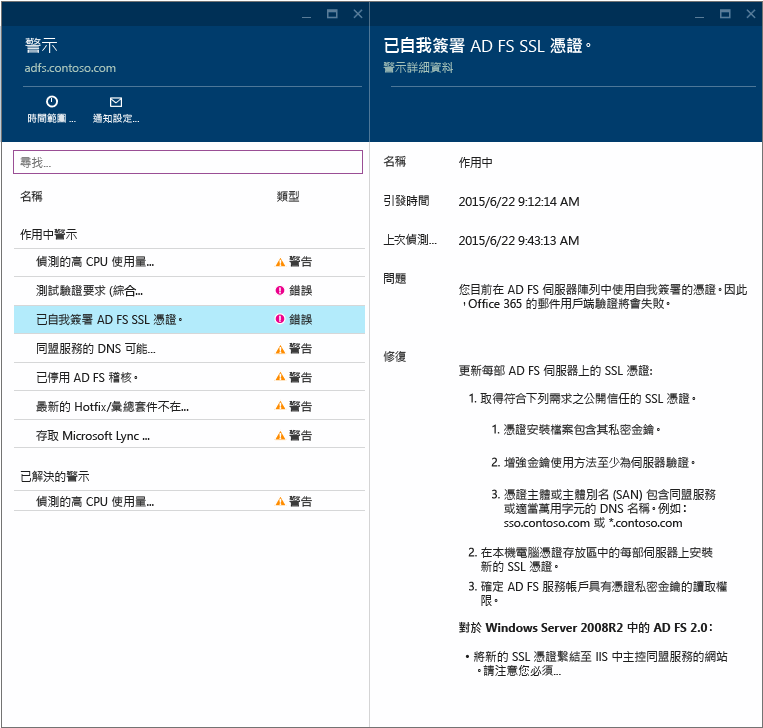
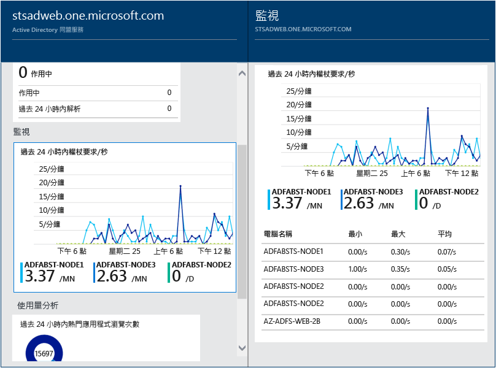
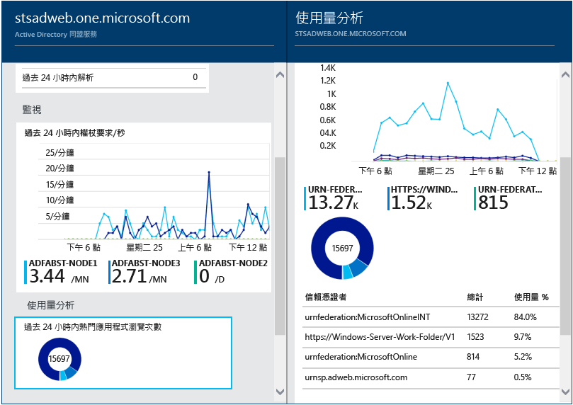

<properties 
	pageTitle="在雲端中監視內部部署身分識別基礎結構。" 
	description="這是 Azure AD Connect Health 頁面，其中說明它的功能，以及您可能會使用它的原因。" 
	services="active-directory" 
	documentationCenter="" 
	authors="billmath" 
	manager="swadhwa" 
	editor="curtand"/>

<tags 
	ms.service="active-directory" 
	ms.workload="identity" 
	ms.tgt_pltfrm="na" 
	ms.devlang="na" 
	ms.topic="get-started-article" 
	ms.date="07/12/2015" 
	ms.author="billmath"/>

# 在雲端中監視內部部署身分識別基礎結構

Azure AD Connect Health 可協助您監視和了解內部部署身分識別基礎結構。它可讓您檢視警示、效能、使用模式、組態設定，並讓您穩定連線至 Office 365 ，還有更多功能。這些功能必須使用安裝在目標伺服器上的代理程式才可完成。如需 Azure AD Connect Health 需求和安裝的相關資訊，請參閱 [Azure AD Connect Health 需求](active-directory-aadconnect-health-requirements.md)。

這些資訊會全部呈現在 Azure AD Connect Health 入口網站中。您可以使用 Azure AD Connect Health 入口網站檢視警示、效能監視和使用量分析。這些資訊會全部呈現在容易找到的同一位置中，您便不必浪費時間尋找需要的資訊。

Azure AD Connect Health 未來更新的內容包括額外監視，以及其他身分識別元件和服務 (例如 Azure AD Connect 同步處理服務) 的深入資訊。因此，它透過身分識別透鏡提供單一儀表板，讓您能擁有更穩健、良好的整合式環境，使用者便能夠充分利用以增進工作能力。

## 使用 Azure AD Connect Health 的原因

將內部部署目錄與 Azure AD 整合可提供通用身分識別供存取雲端和內部部署資源，進而讓您的使用者更具生產力。然而，整合後帶來的挑戰是，必須確保此環境良好健全，才能讓使用者從任何裝置可靠地存取內部部署和雲端中的資源。Azure AD Connect Health 提供簡易的雲端方法，監視及深入了解用來存取 Office 365 或其他 Azure AD 應用程式的內部部署身分識別基本結構。使用方式相當簡單，您只需將代理程式安裝在各個內部部署身分識別伺服器中即可。

適用於 AD FS 的 Azure AD Connect Health 支援 Windows Server 2008/2008 R2 中的 AD FS 2.0，以及 Windows Server 2012/2012 R2 中的 AD FS。其中也包括提供外部網路存取驗證支援的任何 AD FS Proxy 或 Web 應用程式 Proxy 伺服器。適用於 AD FS 的 Azure AD Connect Health 提供下列一組主要功能：

- 檢視警示並據此採取行動，以穩定存取受 AD FS 保護的應用程式 (包括 Azure AD)
- 重大警示的電子郵件通知
- 檢視效能資料以判斷容量規劃
- 詳細檢視 AD FS 登入模式，以判斷異常狀況或建立容量規劃基準

下列影片將提供 Azure AD Connect Health 的概觀：

[AZURE.VIDEO azure-ad-connect-health--monitor-you-identity-bridge]

## 第一次從 Azure 入口網站使用 Azure Active Directory Connect Health
若要開始使用 Azure Active Directory Connect Health，請遵循下列步驟進行。請記住，在 Azure AD Connect Health 執行個體中出現任何資料之前，您必須先在目標伺服器上安裝 Azure AD Connect Health 代理程式。若要下載 Azure AD Connect Health 代理程式，請從第一個刀鋒視窗中選取 [開始使用並取得工具]。您也可以使用下面的連結直接下載代理程式。若要使用 Azure Active Directory Connect Health，請執行下列操作：

1. 登入 [Microsoft Azure 入口網站](https://portal.azure.com/)。
2. 前往 Marketplace 並搜尋 Azure Active Directory Connect Health，或選取 Marketplace，然後選取 [安全性] 和 [身分識別] 可以存取 Azure Active Directory Connect Health。
3. 在簡介刀鋒視窗 (刀鋒視窗是整體檢視的一個片段。您可以將刀鋒視窗視為視窗或飛出) 上，按一下 [建立]。這將會開啟另一個刀鋒視窗，其中包含您的目錄資訊。
4. 在目錄刀鋒視窗上，按一下 [建立]。如果您沒有 Azure Active Directory Premium 授權，您將需要一個授權，才能使用 Azure AD Connect Health。如需 Azure AD Premium 的相關資訊，請參閱「開始使用 Azure AD Premium」。

## Azure Active Directory Connect Health 入口網站
Azure AD Connect Health 入口網站可讓您檢視警示、效能監視和使用量分析。在第一次存取 Azure AD Connect Health 時，將會為您顯示第一個刀鋒視窗。刀鋒視窗是整體檢視的一個片段。您可以將刀鋒視窗視為視窗。您看到的第一個刀鋒視窗會顯示 [開始使用]、[服務] 和 [設定]。以下螢幕擷取畫面是各自的簡短說明。

- **開始使用** – 選取此選項將會開啟 [開始使用] 刀鋒視窗。在這裡，您將可以透過選擇 [取得工具、存取文件及提供意見反應] 來下載 Azure AD Connect Health 代理程式。
- **Active Directory Federation Services** – 這表示 Azure AD Connect Health 目前正在監視的所有 AD FS 服務。出現在此區段的選項將會在以下一節中討論。請參閱「Azure Active Directory Connect Health 服務」。
- 設定 – 這可讓您開啟或關閉下列選項：
<ol>
1. 自動更新可將 Azure AD Connect Health 代理程式自動更新為最新版本：這表示您將會在發佈最新版的 Azure AD Connect Health 代理程式時，自動更新為最新版本。此選項預設為啟用狀態。
2. 僅允許 Microsoft 存取您的 Azure AD 目錄的健康狀況資料供疑難排解之用：這表示如果啟用此選項，Microsoft 將可以看到您所看到的相同資料。這可能有助於進行問題的疑難排解和協助。此選項預設為停用狀態。

## Azure Active Directory Connect Health 服務
此區段表示 Azure AD Connect Health 正在監視的作用中服務以及這些服務的執行個體。按一下省略符號，將會開啟一個刀鋒視窗，其中會顯示所有執行個體。

選取其中一個執行個體，Azure AD Connect Health 將會一個刀鋒視窗，其中包含該服務執行個體的相關資訊。在這裡您將會找到關於您的執行個體的豐富資訊。這項資訊包括概觀、屬性、警示、監視和使用情況分析。如需這些內容的相關資訊，請參閱本頁頂端的後續章節的連結。

----------------------------------------------------------------------------------------------------------
## 下載 Azure AD Connect Health 代理程式

若要開始使用 Azure AD Connect Health，您可以在此下載最新版的代理程式：[下載 Azure AD Connect Health 代理程式](http://go.microsoft.com/fwlink/?LinkID=518973)。 請確定您已從 Marketplace 中加入服務，才可安裝代理程式。

----------------------------------------------------------------------------------------------------------

## Azure Active Directory Connect Health 警示
[Azure AD Connect Health 警示] 區段將為您提供作用中警示的清單。每個警示都包含相關資訊、解決步驟，以及相關文件的連結。選取作用中或已解決的警示，您將會看到一個包含額外資訊的新刀鋒視窗，以及解決警示可以採取的步驟，和其他文件的連結。您也可以檢視過去已解決的警示的歷史資料。

選取警示，將會為您提供其他資訊，以及解決警示可以採取的步驟，和其他文件的連結。

## Azure Active Directory Connect Health 效能監視
Azure AD Connect Health 效能監視會提供關於度量的監視資訊。選取 [監視] 方塊將會開啟一個刀鋒視窗，以提供關於度量的詳細的資訊。

選取刀鋒視窗頂端的 [篩選] 選項，您可以依伺服器篩選以查看個別伺服器的度量。若要變更度量，只要在監視刀鋒視窗底下的監視圖表上按一下滑鼠右鍵，並選取 [編輯圖表]。接著，在開啟的新刀鋒視窗中，您可以從下拉式清單中選取其他度量，並指定檢視效能資料的時間範圍。

## Azure Active Directory Connect Health 使用情況分析和報告
Azure AD Connect Health 使用情況分析會分析您的同盟伺服器的驗證流量。選取使用情況分析方塊將會開啟使用情況分析刀鋒視窗，以顯示度量和群組。

>[AZURE.NOTE]若要搭配 AD FS 使用使用情況分析，您必須確定已啟用 AD FS 稽核。如需詳細資訊，請參閱「Azure AD Connect Health 需求」。

若要選取其他度量，請指定時間範圍；若要變更群組，只要在使用情況分析圖表上按一下滑鼠右鍵，並選取 [編輯圖表]。接著，您可以指定時間範圍、變更或選取度量，以及變更群組。您可以根據不同的「度量」檢視驗證流量的分佈，並使用相關的「分組依據」參數，為每個度量分組，如下所述。

| 度量 | 分組依據 | 分組是什麼意思，為什麼分組很有用？ |
| ------ | -------- | -------------------------------------------- |
| 要求總數：同盟服務所處理的要求的總數 | 全部 | 這將會顯示未分組的要求總數的計數。 |
| | 應用程式 | 此選項將會根據目標信賴憑證者，為要求總數分組。這個分組對於了解哪個應用程式收到多少百分比的總流量非常有幫助。 |
| | 伺服器 | 此選項將會根據處理要求的伺服器，為要求總數分組。這個分組對於了解總流量的負載分佈非常有幫助。 |
| | 加入工作場所 | 此選項將會根據要求是否來自已加入工作場所的裝置 (已知)，為要求總數分組。這個分組對於了解是否使用識別基礎結構未知的裝置存取您的資源非常有幫助。 |
| | 驗證方法 | 此選項將會根據用於驗證的驗證方法，為要求總數分組。這個分組對於了解用於驗證的常見驗證方法非常有幫助。以下是可能的驗證方法<ol> <li>Windows 整合式驗證 (Windows)</li> <li>表單型驗證 (表單)</li> <li>SSO (單一登入)</li> <li>X 509 憑證驗證 (憑證)</li>  請注意，如果同盟伺服器收到包含 SSO Cookie 的要求，則該要求會列入 SSO (單一登入)。在這種情況下，如果 Cookie 有效，則不會要求使用者提供認證，並不間斷地存取應用程式。如果您有多個同盟伺服器所保護的信賴憑證者，則此情況非常常見。 |
| | 網路位置 | 此選項將會根據使用者的網路位置，為要求總數分組。它可以是內部網路或外部網路。這個分組對於了解流量百分比是來自內部網路還是外部網路非常有幫助。 |
| 失敗要求總數：同盟服務所處理的失敗要求總數。  (此度量僅能在適用於 Windows Server 2012 R2 的 AD FS 上使用)| 錯誤類型 | 這將會根據預先定義的錯誤類型，顯示錯誤數目。這個分組對於了解常見的錯誤類型非常有幫助。<ul><li>不正確的使用者名稱或密碼：由於不正確的使用者名稱或密碼而導致的錯誤。</li> <li>「外部網路鎖定」：由於從外部網路鎖定的使用者收到要求而導致的失敗</li><li>「過期的密碼」：由於使用者使用已過期的密碼登入而導致的失敗。</li><li>「停用的帳戶」：由於使用者使用已停用的帳戶登入而導致的失敗。</li><li>「裝置驗證」：由於使用者無法使用裝置驗證進行驗證而導致的失敗。</li><li>「使用者憑證驗證」:由於使用者因為憑證無效而無法進行驗證所導致的失敗。</li><li>「MFA」：由於使用者無法使用 Multi Factor Authentication 來進行驗證而導致的失敗。</li><li>「其他認證」：「發佈授權」：由於授權失敗而導致的失敗。</li><li>「發佈委派」：由於發佈委派錯誤而導致的失敗。</li><li>「權杖接受」：由於 ADFS 拒絕來自第三方身分識別提供者的權杖而導致的失敗。</li><li>「通訊協定」：由於通訊協定錯誤而導致的失敗。</li><li>「未知」：全部攔截。不適合已定義的類別的其他任何失敗。</li> |
| | 伺服器 | 這將會根據伺服器，為錯誤分組。這對於了解跨伺服器的錯誤分佈非常有幫助。分佈不平均可能是伺服器處於錯誤狀態的指標。 |
| | 網路位置 | 這將會根據要求的網路位置 (內部網路與外部網路)，為錯誤分組。這對於了解失敗的要求類型非常有幫助。 |
| | 應用程式 | 這將會根據目標應用程式 (信賴憑證者)，為失敗分組。這對於了解哪個目標應用程式將看到最多錯誤數目非常有幫助。 |
| 使用者計數：系統中有效的唯一使用者的平均數目 | 全部 | 這會提供在所選時間配量內使用同盟服務的使用者平均數目的計數。系統不會為使用者分組。 平均值將取決於選取的時間配量。 |
| | 應用程式 | 這將會根據目標應用程式 (信賴憑證者)，為使用者的平均數目分組。這對於了解有多少使用者正在使用哪一個應用程式非常有幫助。 |

## 接下來
若要開始使用 Azure AD Connect Health，請參閱 [Azure AD Connect Health 需求](active-directory-aadconnect-health-requirements.md)。一旦您安裝代理程式並收集資料之後，請參閱 [Azure AD Connect Health 操作](active-directory-aadconnect-health-operations.md)，以取得有關設定 Azure AD Connect Health 或簽出[常見問題集](active-directory-aadconnect-health-faq.md)的詳細資訊。

**其他資源**

* [MSDN 上的 Azure AD Connect Health](https://msdn.microsoft.com/library/azure/dn906722.aspx)

 

<!---HONumber=August15_HO6-->