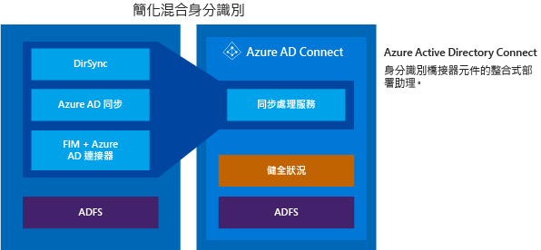

<properties
	pageTitle="Azure AD Connect：整合內部部署身分識別與 Azure Active Directory。| Microsoft Azure"
	description="Azure AD Connect 是一種工具，用來整合您的內部部署身分識別系統 (例如 Windows Server Active Directory) 與 Azure Active Directory，並將您的使用者連線到 Office 365、Azure 和數千種 SaaS 應用程式。本主題說明 Azure AD Connect 的各項功能，並提供 Azure AD Connect 運作方式、如何安裝、設定和自訂的相關資訊。"
    keywords="Azure AD Connect 簡介, Azure AD Connect 概觀, 何謂 Azure AD Connect, 安裝 active directory"
	services="active-directory"
	documentationCenter=""
	authors="andkjell"
	manager="stevenpo"
	editor="curtand"/>

<tags
	ms.service="active-directory"
	ms.workload="identity"
	ms.tgt_pltfrm="na"
	ms.devlang="na"
	ms.topic="get-started-article"
	ms.date="01/25/2016"
	ms.author="andkjell;billmath"/>

# 整合內部部署身分識別與 Azure Active Directory
Azure AD Connect 是一種工具，用來整合您的內部部署身分識別系統 (例如 Windows Server Active Directory) 與 Azure Active Directory，並將您的使用者連線到 Office 365、Azure 和 1000 種以上的 SaaS 應用程式。本主題提供完整指南，指引您如何準備和部署必要元件，讓您的使用者使用他們今日用來存取現有的公司應用程式的同一身分識別，來存取雲端服務。

## 使用 Azure AD Connect 的理由
將內部部署目錄與 Azure AD 整合可提供一個通用身分識別來存取雲端和內部部署資源，讓使用者變得更有生產力。透過此整合，使用者和組織可以享受到下列好處：

- 使用者可以使用單一身分識別來存取內部部署應用程式和雲端服務，例如 Office 365。

- 單一工具即可提供輕鬆進行同步處理和登入的部署經驗。

- 提供您案例的最新功能。Azure AD Connect 會取代舊版的身分識別整合工具，如 DirSync 和 Azure AD Sync。如需詳細資訊，請參閱[目錄整合工具比較](active-directory-aadconnect-get-started-tools-comparison.md)。

### Azure AD Connect 運作方式

Azure Active Directory Connect 由三個主要部分組成。它們是同步處理服務、選用性 Active Directory Federation Services 部分，以及使用 [Azure AD Connect Health](active-directory-aadconnect-health.md) 所執行的監控部分。

 

- 同步處理 - 此組件是由先前發行為 [Dirsync 和 Azure AAD Sync](active-directory-aadconnect-get-started-tools-comparison.md) 的元件和功能所組成。這是負責建立使用者和群組的組件。它也會負責確保您內部部署環境中的使用者和群組資訊和雲端的符合。
- AD FS - 這是 Azure AD Connect 的選用性組件，而且可以用來使用內部部署 AD FS 基礎結構來設定混合環境。組織可以使用此組件來處理複雜部署，而複雜部署包括網域加入 SSO、AD 登入原則的強制執行以及智慧卡或協力廠商 MFA 這類項目。
- 狀況監控 - Azure AD Connect Health 可以提供 AD FS 伺服器的健全監控，並在 Azure 入口網站中提供檢視此活動的中央位置。如需詳細資訊，請參閱 [Azure Active Directory Connect Health](active-directory-aadconnect-health.md)。

## 安裝 Azure AD Connect。

您可以在 [Microsoft 下載中心](http://go.microsoft.com/fwlink/?LinkId=615771)下載 Azure AD Connect。

| 方案 | 案例 |
| ----- | ----- |
| 開始之前 | <li>[Azure AD Connect：硬體和必要條件](active-directory-aadconnect-prerequisites.md)</li> |
| [快速設定](active-directory-aadconnect-get-started-express.md) | <li>如果您有單一樹系 AD 時的建議和預設選項。</li> <li>使用密碼同步處理以相同的密碼進行使用者登入。</li>
| [自訂設定](active-directory-aadconnect-get-started-custom.md) | <li>有多個樹系時使用。支援許多內部部署[拓撲](active-directory-aadconnect-topologies.md)。</li> <li>自訂您登入的選項，例如同盟的 ADFS 或使用協力廠商身分識別提供者。</li> <li>自訂同步處理功能，例如篩選和回寫。</li>
| [從 DirSync 升級](active-directory-aadconnect-dirsync-upgrade-get-started.md) | <li>如果您有已在執行中的現有 DirSync 伺服器。</li>
| 從 Azure AD Sync 升級 | <li>這是完美的就地升級。</li>

[安裝後](active-directory-aadconnect-whats-next.md)，您應該確認它是依照預期方式運作，並將授權指派給使用者。

### 安裝 Azure AD Connect 的後續步驟

| 主題 | |
| --------- | --------- |
| 下載 Azure AD Connect | [下載 Azure AD Connect](http://go.microsoft.com/fwlink/?LinkId=615771) |
| 使用快速設定進行安裝 | [快速安裝 Azure AD Connect](active-directory-aadconnect-get-started-express.md) |
| 使用自訂設定進行安裝 | [自訂 Azure AD Connect 安裝](active-directory-aadconnect-get-started-custom.md) |
| 從 DirSync 升級 | [從 Azure AD Sync 工具 (DirSync) 升級](active-directory-aadconnect-dirsync-upgrade-get-started.md) |
| 安裝之後 | [驗證安裝和指派授權](active-directory-aadconnect-whats-next.md) |

### 深入了解安裝 Azure AD Connect

您也想要準備[操作](active-directory-aadconnectsync-operations.md)考量。您可能想要有一個待命伺服器，讓您可在[災害](active-directory-aadconnectsync-operations.md#disaster-recovery)發生時輕鬆地容錯移轉。如果您打算進行頻繁的組態變更，則應該規劃[預備模式](active-directory-aadconnectsync-operations.md#staging-mode) 伺服器。

| 主題 | |
| --------- | --------- |
| 支援的拓撲 | [Azure AD Connect 的拓撲](active-directory-aadconnect-topologies.md) |
| 設計概念 | [Azure AD Connect 的設計概念](active-directory-aadconnect-design-concepts.md) |
| 用於安裝的帳戶 | [進一步了解 Azure AD Connect 認證和權限](active-directory-aadconnect-accounts-permissions.md) |
| 作業規劃 | [Azure AD Connect 同步處理：作業工作和考量](active-directory-aadconnectsync-operations.md) |
| 使用者登入選項 | [Azure AD Connect 使用者登入選項](active-directory-aadconnect-user-signin.md) |

## 設定功能
Azure AD Connect 隨附數個您可以選擇性地開啟或預設為啟用的功能。在某些情況下，有些功能可能需要特定案例和拓撲中的其他組態。

[篩選](active-directory-aadconnectsync-configure-filtering.md)是在您想要限制 Azure AD 可同步處理哪些物件時使用。依預設，會同步處理所有使用者、連絡人、群組和 Windows 10 電腦，但您可以根據網域、OU 或屬性限制此作業。

[密碼同步處理](active-directory-aadconnectsync-implement-password-synchronization.md)可將 Active Directory 中的密碼雜湊同步處理至 Azure AD。這可讓使用者在內部部署與雲端中使用相同的密碼，但只在某個位置管理此密碼。因為它會使用您的內部部署 Active Directory，所以也可讓您使用自己的密碼原則。

[密碼回寫](active-directory-passwords-getting-started.md)將可讓您的使用者在雲端中變更和重設其密碼，並套用您的內部部署密碼原則。

[裝置回寫](active-directory-aadconnect-get-started-custom-device-writeback.md)將可讓 Azure AD 中註冊的裝置寫回至內部部署 Active Directory，以便可以使用該裝置進行條件式存取。

[防止意外刪除](active-directory-aadconnectsync-feature-prevent-accidental-deletes.md)功能預設為開啟，它將保護您的雲端目錄，避免同時進行多次刪除。依預設，它將允許每次執行 500 個刪除，而且可以根據貴組織的大小變更此值。

### 設定功能的後續步驟

| 主題 | |
| --------- | --------- |
| 設定篩選 | [Azure AD Connect 同步處理：設定篩選](active-directory-aadconnectsync-configure-filtering.md) |
| 密碼同步處理 | [Azure AD Connect 同步處理：實作密碼同步處理](active-directory-aadconnectsync-implement-password-synchronization.md) |
| 密碼回寫 | [開始使用密碼管理](active-directory-passwords-getting-started.md) |
| 裝置回寫 | [在 Azure AD Connect 中啟用裝置回寫](active-directory-aadconnect-get-started-custom-device-writeback.md) |
| 防止意外刪除 | [Azure AD Connect 同步處理：防止意外刪除](active-directory-aadconnectsync-feature-prevent-accidental-deletes.md) |

## 自訂 Azure AD Connect 同步處理
Azure AD Connect 同步處理隨附一個適用於大部分客戶和拓撲的預設組態。但總是會有一些情況，預設組態將不適用，因而必須進行調整。支援依照本節和連結主題所述進行變更。

如果您之前沒有使用過同步處理拓撲，建議您從[技術概念](active-directory-aadconnectsync-technical-concepts.md)中了解拓撲的基本概念和術語。Azure AD Connect 是 MIIS2003、ILM2007 和 FIM2010 的進化。即使有些東西相同，但改變的卻更多。

[預設組態](active-directory-aadconnectsync-understanding-default-configuration.md)會假設組態中可能有多個樹系。在那些拓撲中，使用者物件可能會表示為另一個樹系中的連絡人。使用者也可能在另一個資源樹系中具有連結的信箱。預設組態的行為已載明於[使用者和連絡人](active-directory-aadconnectsync-understanding-users-and-contacts.md)中。

同步處理中的組態模型稱為[宣告式佈建](active-directory-aadconnectsync-understanding-declarative-provisioning-expressions.md)。進階屬性流程會使用[函式](active-directory-aadconnectsync-functions-reference.md)來表示屬性轉換。您可以使用 Azure AD Connect 隨附的工具來查看整個組態。如果您需要對組態進行變更，請確定您遵循[最佳作法](active-directory-aadconnectsync-best-practices-changing-default-configuration.md)，因為當有新版本可用時，將可以更輕鬆地採用這些版本。

### 自訂 Azure AD Connect 同步處理的後續步驟。

| 主題 | |
| --------- | --------- |
| 技術概念 | [Azure AD Connect 同步處理：技術概念](active-directory-aadconnectsync-technical-concepts.md) |
| 了解預設組態 | [Azure AD Connect 同步處理：了解預設組態](active-directory-aadconnectsync-understanding-default-configuration.md) |
| 了解使用者和連絡人 | [Azure AD Connect 同步處理：了解使用者和連絡人](active-directory-aadconnectsync-understanding-users-and-contacts.md) |
| 宣告式佈建 | [Azure AD Connect 同步處理：了解宣告式佈建運算式](active-directory-aadconnectsync-understanding-declarative-provisioning-expressions.md) |
| 宣告式佈建函式參考 | [Azure AD Connect 同步處理：函式參考](active-directory-aadconnectsync-functions-reference.md) |
| 變更預設組態 | [變更預設組態的最佳作法](active-directory-aadconnectsync-best-practices-changing-default-configuration.md) |

## 詳細資訊和參考

| 主題 | |
| --------- | --------- |
| 版本歷程記錄 | [版本歷程記錄](active-directory-aadconnect-version-history.md) |
| 比較 DirSync、Azure ADSync 和 Azure AD Connect | [目錄整合工具比較](active-directory-aadconnect-get-started-tools-comparison.md) |
| 同步處理的屬性 | [同步處理的屬性](active-directory-aadconnectsync-attributes-synchronized.md) |
| 使用 Azure AD Connect Health 進行監控 | [Azure AD Connect Health](active-directory-aadconnect-health.md) |
| 常見問題集 | [Azure AD Connect 常見問題集](active-directory-aadconnect-faq.md) |

**其他資源**

關於擴充您的內部部署目錄至雲端的 Ignite 2015 簡報。

[AZURE.VIDEO microsoft-ignite-2015-extending-on-premises-directories-to-the-cloud-made-easy-with-azure-active-directory-connect]

<!---HONumber=AcomDC_0128_2016-->