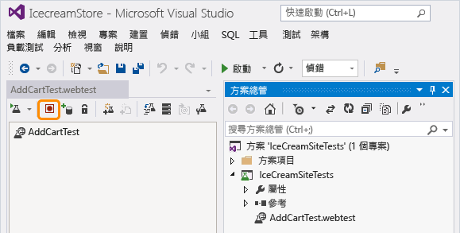
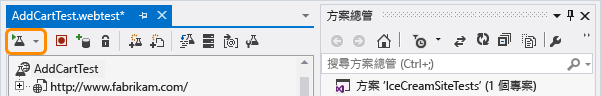
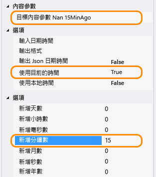
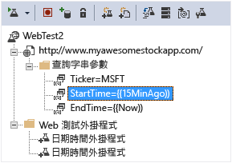

<properties title="Monitor any web site's availability and responsiveness" pageTitle="監視任何網站的可用性和回應性" description="在 Application Insights 中設定 Web 測試。如果網站無法使用或回應緩慢，將收到警示。" metaKeywords="analytics web test availability" authors="awills"  manager="kamrani" />

<tags ms.service="application-insights" ms.workload="tbd" ms.tgt_pltfrm="ibiza" ms.devlang="na" ms.topic="article" ms.date="2014-10-30" ms.author="awills" />
 
# 監視任何網站的可用性和回應性

開發 Web 應用程式之後，您可以設定 Web 測試來監視其可用性和回應性。Application Insights 會定期傳送來自全球各地的 Web 要求，如果應用程式回應太慢或完全沒有回應，則會警告您。

您可以為公用網際網路可存取的任何 HTTP 端點設定 Web 測試。

*這是 Azure 網站嗎？只是在[在網站分頁中建立 Web 測試：][azurewebtest]。*

1. [建立新的資源？](#create)
1. [設定 Web 測試](#setup)
1. [檢視結果](#monitor)
2. [如果您看到失敗...](#failures)
2. [多重步驟 Web 測試](#multistep)
1. [編輯或停用測試](#edit)

 [影片](#video)
 [後續步驟](#next)

## 設定 Web 測試

### 1. 建立新的資源？

如果您已經為這個應用程式[設定 Application Insights 資源][start]，而且您想要在相同位置中查看可用性資料，請略過此步驟。

註冊 [Microsoft Azure](http://azure.com)，移至 [Preview 入口網站](https://portal.azure.com)，然後建立新的 Application Insights 資源。 

### 2. 建立 Web 測試

在應用程式的 [概觀] 分頁中，點選 webtests 磚。 

*已經有一些 Web 測試？請點選 webtests 磚，然後選擇 [Add Webtest]。*

設定測試詳細資料。

- **此 URL** 必須可在公用網際網路上看見。它可以包含查詢字串 - 例如，您可以訓練一下您的資料庫。如果 URL 解析為重新導向，我們將會跟隨它，最多 10 個重新導向。

[- **測試位置**] 供我們的伺服器從這些位置將 Web 要求傳送至您的 URL。請選擇兩個或三個，以便區分網站的問題與網路問題。不能選取三個以上。

- **成功準則**：
    **HTTP 傳回碼**：200 很常見。 

    **內容比對**字串，例如「歡迎！」我們將測試它出現在每個回應中。必須是單純字串，不含萬用字元。別忘了，如果頁面內容變更，則可能需要更新。

- **警示**：依預設，如果持續 15 分鐘重複失敗，則會傳送警示給您。但您可以將它變更為更敏感或更不敏感，也可以變更通知的電子郵件地址。

#### 測試更多 URL

您可以隨意為更多 URL 加入更多測試。例如，除了測試首頁，您也可以測試搜尋的 URL 來確定資料庫在執行中。

### 3. 檢視可用性報告

1-2 分鐘後，在概觀分頁上按一下 [重新整理]。(在此版本中，不會自動重新整理)。

[概觀] 分頁上的圖表會結合此應用程式的所有 Web 測試的結果。

#### 網頁元件

在測試中會要求影像、樣式表、指令碼及其他靜態元件。  

記錄的回應時間是所有元件完成載入所花費的時間。

如果有任何元件無法載入，測試會標示為失敗。

## 如果您看到失敗...

點選 webtests 分頁以查看每個測試的個別結果 。

開啟特定的 Web 測試。

向下捲動至 [**失敗的測試**] 並挑選結果。

結果會顯示失敗的原因。

如需詳細資訊，請下載結果檔案並在 Visual Studio 中檢查。

##多重步驟 Web 測試

您可以監視涉及一連串 URL 的案例。例如，如果您正在監視銷售網站，您可以測試將項目加入購物車正確運作。 

若要建立多重步驟測試，您可以使用 Visual Studio 來記錄案例，然後將記錄結果上傳至 Application Insights。Application Insights 將會不時地重新執行案例，並確認回應。

#### 1. 記錄案例

使用 Visual Studio Ultimate 來記錄 Web 工作階段。

1. 建立 Web 效能測試專案。
    
2. 開啟 .webtest 檔案，並開始記錄。
    
3. 在測試中執行您要模擬的使用者動作：開啟您的網站、將產品加入購物車等等。然後停止測試。 
    
    不要讓案例太長。以 100 個步驟和 2 分鐘為限。
4. 在 Visual Studio 中執行測試，以確定可以運作。
    Web 測試執行器會開啟網頁瀏覽器，並重複您已記錄的動作。請確定運作如您所預期。 
    
 

(請勿在 Web 測試程式碼中插入迴圈。)

#### 2. 將 Web 測試上載至 Application Insights

在 Application Insights 入口網站中，建立新的 Web 測試。

選取多重步驟測試，並上傳 .webtest 檔案。

就像在單一 url 測試中一樣，以相同的方式檢視您的測試結果和任何失敗。 

失敗的常見原因是在測試執行太長。不可執行超過兩分鐘。

### 將時間和隨機數字插入多重步驟測試中

假設您要測試的工具會從外部來源取得與時間相關的資料，例如股票。當您記錄 Web 測試時，您必須使用特定的時間，但您將它們設為測試的參數：StartTime 和 EndTime。

當您執行測試時，您希望 EndTime 永遠為目前時間，而 StartTime 為 15 分鐘前。

Web 測試外掛程式提供這種作法。

1. 針對您想要的每個變數參數值，各加入一個 Web 測試外掛程式。在 Web 測試工具列中，選擇 [**Add Web Test Plugin**]。

    

    在此範例中，我們將使用日期時間外掛程式的兩個執行個體。其中一個執行個體用於「15 分鐘前」，另一個用於「現在」。 

2. 開啟每個外掛程式的屬性。指定名稱給它，並設為使用目前的時間。對其中一個，設定 [加入分鐘] = -15。

    

3. 在 Web 測試參數中，使用 {{plug-in name}} 來參考外掛程式名稱。

    

現在將您的測試上傳至入口網站。在每次執行測試時，它會使用動態值。

##  編輯或停用測試

開啟個別測試來編輯或停用。

當您在服務上進行維護時，您可能會想要停用 Web 測試。

## 影片

> [AZURE.VIDEO monitoring-availability-with-application-insights]

## 後續步驟

[搜尋診斷記錄][diagnostic]

[疑難排解][qna]

[AZURE.INCLUDE [app-insights-learn-more](../includes/app-insights-learn-more.md)]

[azurewebtest]: ../insights-create-web-tests/
