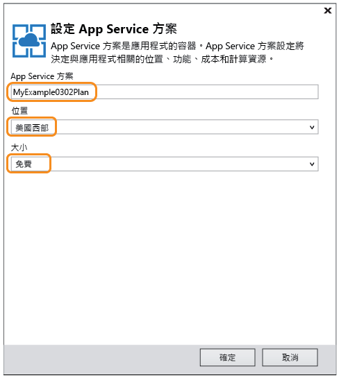
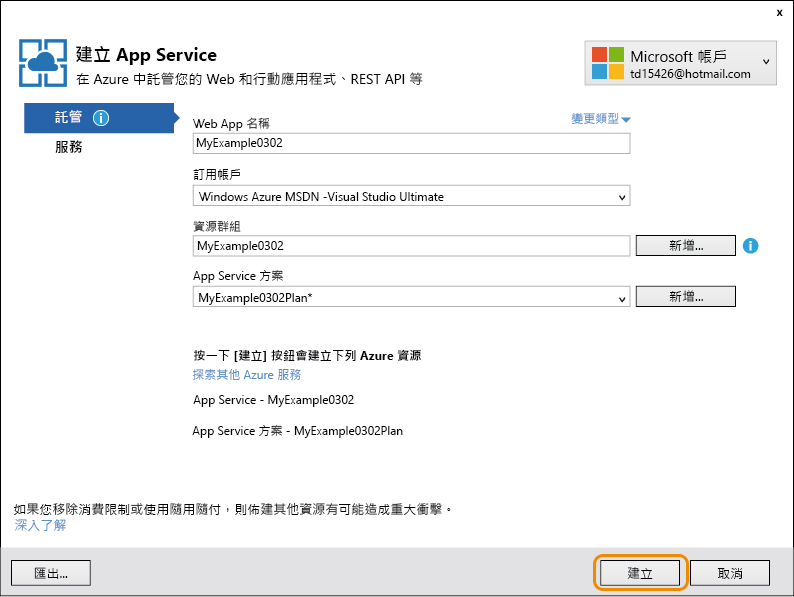

<properties
	pageTitle="在 Azure App Service 中開始使用 API Apps 和 ASP.NET | Microsoft Azure"
	description="了解如何在 Azure App Service 使用 Visual Studio 2015 建立、部署和取用 ASP.NET API 應用程式。"
	services="app-service\api"
	documentationCenter=".net"
	authors="tdykstra"
	manager="wpickett"
	editor=""/>

<tags
	ms.service="app-service-api"
	ms.workload="na"
	ms.tgt_pltfrm="dotnet"
	ms.devlang="na"
	ms.topic="hero-article"
	ms.date="03/09/2016"
	ms.author="tdykstra"/>

# 在 Azure App Service 中開始使用 API Apps 和 ASP.NET

[AZURE.INCLUDE [選取器](../../includes/app-service-api-get-started-selector.md)]

## 概觀

本文是一系列教學課程的第一篇，文章中將會說明如何使用 Azure App Service 中有助於開發和裝載 API 的功能：

* 整合的 API 中繼資料支援
* CORS 支援
* 驗證和授權支援

您將會在 Azure App Service 中把範例應用程式部署到兩個 [API 應用程式](app-service-api-apps-why-best-platform.md)和一個 Web 應用程式。此範例應用程式是個待辦事項清單，具有 AngularJS 單一頁面應用程式 (SPA) 前端、ASP.NET Web API 中介層和 ASP.NET Web API 資料層，詳情如下圖所示。

以下是 SPA 前端的螢幕擷取畫面。

一旦完成本教學課程，您將會擁有兩個在 App Service API 應用程式中啟動並執行的 Web API。完成下列教學課程之後，您將會擁有在雲端中執行的整個應用程式，以及在 App Service Web 應用程式中的 SPA。而在後續的教學課程中，您則會新增驗證和授權。

## 您將學到什麼

在本教學課程中，您將了解：

* 如何透過 Visual Studio 2015 的內建工具，在 Azure App Service 中使用 API 應用程式和 Web 應用程式。
* 如何使用 Swashbuckle NuGet 封裝來動態產生 Swagger API 定義 JSON，以便自動進行 API 探索。
* 如何使用自動產生的用戶端程式碼，從 .NET 用戶端取用 API 應用程式。
* 如何使用 Azure 入口網站設定 API 應用程式中繼資料的端點。

## 先決條件

[AZURE.INCLUDE [必要條件](../../includes/app-service-api-dotnet-get-started-prereqs.md)]

## 下載範例應用程式 

1. 下載 [Azure-Samples/app-service-api-dotnet-to-do-list](https://github.com/Azure-Samples/app-service-api-dotnet-todo-list) 儲存機制。

	您可以按一下 [下載 ZIP] 按鈕，或複製本機電腦上的儲存機制。

2. 在 Visual Studio 2015 或 2013 中開啟 ToDoList 解決方案。

	Visual Studio 方案是使用簡單的待辦事項項目的範例應用程式，而這些項目則是由描述和擁有者所組成。

		public class ToDoItem 
		{ 
		    public int ID { get; set; } 
		    public string Description { get; set; } 
		    public string Owner { get; set; } 
		} 
 
	此方案包含三個專案：

	

	* **ToDoListAngular** - 前端：呼叫中介層的 AngularJS SPA。 

	* **ToDoListAPI** - 中介層：呼叫資料層以對待辦事項項目執行 CRUD 作業的 ASP.NET Web API 專案。

	* **ToDoListDataAPI** - 資料層：對待辦事項項目執行 CRUD 作業的 ASP.NET Web API 專案。待辦事項項目會儲存在記憶體中，這表示每當應用程式重新啟動時，所有變更都會遺失。

	中介層會在呼叫資料層時，於 `Owner` 欄位中提供使用者識別碼。在您下載的程式碼中，使用者識別碼一律為 "*"。當您在稍後的教學課程中新增驗證時，中介層會對資料層提供實際的使用者識別碼。

2. 建置解決方案以還原 NuGet 封裝。

### 選擇性：在本機執行應用程式

在本節中，您會確認您可以在本機執行用戶端，並可於 API 在本機執行時予以呼叫。

**附註：**因為 Internet Explorer 和 Edge 瀏覽器允許 `http://localhost` URL 所發出或收到的跨原始來源 JavaScript 呼叫，因此這些指示也適用於這些瀏覽器。如果您使用 Chrome，請使用 `--disable-web-security` 參數啟動瀏覽器。如果您使用 Firefox，則請略過本節。

1. 將三個專案全都設定為啟始專案，先起始 ToDoListDataAPI，然後依序是 ToDoListAPI 和 ToDoListAngular (在 [方案總管] 中，以滑鼠右鍵按一下方案，按一下 [屬性]，選取 [多個啟始專案]，以正確順序放置專案，然後將每個專案的 [動作] 設定為 [啟動])。  

2. 按 F5 啟動專案。

	三個瀏覽器視窗隨即開啟。有兩個瀏覽器視窗顯示 HTTP 403 錯誤頁面 (不允許瀏覽目錄)，這是對 Web API 專案而言很正常。第三個瀏覽器視窗會顯示 AngularJS UI。

3. 在顯示 AngularJS UI 的瀏覽器視窗中，按一下 [待辦事項清單] 索引標籤。

	該 UI 會顯示兩個預設的待辦事項項目。

	

4. 新增、編輯和刪除待辦事項項目，以查看應用程式的運作情形。

	您所做的變更會儲存在記憶體中，當您重新啟動應用程式時，這些變更將會遺失。

3. 關閉瀏覽器視窗。

## 使用 Swagger 中繼資料和 UI

Azure App Service 內建支援 [Swagger 2.0](http://swagger.io/) API 中繼資料。每個 API 應用程式都會指定負責以 Swagger JSON 格式傳回 API 中繼資料的 URL 端點。從該端點傳回的中繼資料可以用來產生用戶端程式碼。

ASP.NET Web API 專案可以使用 [Swashbuckle](https://www.nuget.org/packages/Swashbuckle) NuGet 封裝，動態產生 Swagger 中繼資料。Swashbuckle NuGet 封裝已安裝在您所下載的 ToDoListDataAPI 和 ToDoListAPI 專案中。

在教學課程的這一節中，請看一下所產生的 Swagger 2.0 中繼資料，然後試用以 Swagger 中繼資料為基礎的測試 UI。

2. 將 ToDoListDataAPI 專案設定為起始專案。 
 
4. 按 F5 以在偵錯模式中執行專案。

	瀏覽器會開啟並顯示 [HTTP 403 錯誤] 頁面。

12. 在瀏覽器的位址列中，於 URL 結尾加入 `swagger/docs/v1`，然後按 Enter 鍵 (URL 會是 `http://localhost:45914/swagger/docs/v1`)。

	這是 Swashbuckle 用來傳回 API 的 Swagger 2.0 JSON 中繼資料的預設 URL。

	如果您是使用 Internet Explorer，瀏覽器會提示您下載 *v1.json* 檔案。

	

	如果您是使用 Chrome、Firefox 或 Edge，瀏覽器會在瀏覽器視窗中顯示 JSON。

	

	下列範例顯示 API 的 Swagger 中繼資料的第一個區段 (包含 Get 方法的定義)。此中繼資料可驅動您將在下列步驟中使用的 Swagger UI，而您將在本教學課程稍後的章節中使用它來自動產生用戶端程式碼。

		{
		  "swagger": "2.0",
		  "info": {
		    "version": "v1",
		    "title": "ToDoListDataAPI"
		  },
		  "host": "localhost:45914",
		  "schemes": [ "http" ],
		  "paths": {
		    "/api/ToDoList": {
		      "get": {
		        "tags": [ "ToDoList" ],
		        "operationId": "ToDoList_GetByOwner",
		        "consumes": [ ],
		        "produces": [ "application/json", "text/json", "application/xml", "text/xml" ],
		        "parameters": [
		          {
		            "name": "owner",
		            "in": "query",
		            "required": true,
		            "type": "string"
		          }
		        ],
		        "responses": {
		          "200": {
		            "description": "OK",
		            "schema": {
		              "type": "array",
		              "items": { "$ref": "#/definitions/ToDoItem" }
		            }
		          }
		        },
		        "deprecated": false
		      },

1. 關閉瀏覽器。

3. 在 [方案總管] 的 ToDoListDataAPI 專案中，開啟 *App\_Start\\SwaggerConfig.cs* 檔案，然後向下捲動至下列程式碼並予以取消註解。

		/*
		    })
		.EnableSwaggerUi(c =>
		    {
		*/

	*SwaggerConfig.cs* 檔案建立於您在專案中安裝 Swashbuckle 封裝時。此檔案會提供數種方式來設定 Swashbuckle。

	您已取消註解的程式碼會啟用您將使用於下列步驟中的 Swagger UI。當您使用 API 應用程式專案範本建立 Web API 專案時，基於安全性考量，預設會註解化此程式碼。

5. 再次執行此專案。

3. 在瀏覽器的位址列中，於 URL 結尾加入 `swagger`，然後按 Enter 鍵 (URL 會是 `http://localhost:45914/swagger`)。

4. 當 Swagger UI 頁面出現時，按一下 [ToDoList] 以查看可用的方法。

	

5. 按一下 [取得]。

6. 輸入星號來做為 `owner` 參數的值，然後按一下 [立即試用]。

	

	Swagger UI 會呼叫 ToDoList Get 方法並顯示回應碼和 JSON 結果。

	

6. 按一下 [Post]，然後按一下 [模型結構描述] 之下的方塊。

	按一下模型結構描述會預先填入輸入方塊，而您可以在其中指定 Post 方法的參數值。(如果這不適用於 Internet Explorer，請使用不同的瀏覽器或在下一個步驟中手動輸入參數值。)

	

7. 在 `contact` 參數輸入方塊中變更 JSON，讓它看起來如同下列範例，或以您自己的描述文字替代：

		{
		  "ID": 2,
		  "Description": "buy the dog a toy",
		  "Owner": "*"
		}

10. 按一下 [立即試用]。

	ToDoList API 會傳回表示成功的 HTTP 204 回應碼。

11. 按一下 [Get] > [立即試用]。

	Get 方法回應現在包含新的待辦事項項目。

12. 也請試用 Put、Delete 和 Get by ID方法。

14. 關閉瀏覽器。

Swashbuckle 可搭配任何 ASP.NET Web API 專案使用。如果您要將 Swagger 中繼資料產生新增至現有的專案，只需安裝 Swashbuckle 封裝。

**注意：**Swagger 中繼資料包含每個 API 作業的唯一識別碼。根據預設，Swashbuckle 可能會為 Web API 控制器方法產生重複的 Swagger 作業識別碼。如果控制器有多載的 HTTP 方法，例如 `Get()` 和 `Get(id)`，就會發生此情況。如需如何處理多載的相關資訊，請參閱[自訂 Swashbuckle 產生的 API 定義](app-service-api-dotnet-swashbuckle-customize.md)。如果您在 Visual Studio 中使用 Azure API 應用程式範本建立 Web API 專案，*SwaggerConfig.cs* 檔案中就會自動新增用來產生唯一作業識別碼的程式碼。

## 在 Azure 中建立 API 應用程式並將 ToDoListAPI 專案部署至該應用程式

在本節中，您會使用已整合至 Visual Studio 的 [發佈 Web] 精靈中的 Azure 工具，在 Azure 中建立新的 API 應用程式。然後您會將 ToDoListDataAPI 專案部署到新的 API 應用程式，並藉由再次執行 Swagger UI 來呼叫 API，而這次則是在雲端執行。

1. 在 [方案總管] 中，以滑鼠右鍵按一下 ToDoListDataAPI 專案，然後按一下 [發佈]。

	

3.  在 [發佈 Web] 精靈的 [設定檔] 步驟中，按一下 [Microsoft Azure App Service]。

	

4. 如果您尚未登入，請登入您的 Azure 帳戶；或者如果過期，請重新整理您的認證。

4. 在 [App Service] 對話方塊中，選擇您想要使用的 Azure [訂用帳戶]，然後按一下 [新增]。

	

	[建立 App Service] 對話方塊的 [主控] 索引標籤中隨即出現。

	因為您正在部署已安裝 Swashbuckle 的 Web API 專案，所以 Visual Studio 假設您要建立 API 應用程式。這是以 [API 應用程式名稱] 標題以及 [變更類型] 下拉式清單設為 [API 應用程式] 的這個事實所指出。

	

	 應用程式類型並不會決定可供新的 API 應用程式、Web 應用程式或行動應用程式使用的功能。這些教學課程中顯示的所有 API 應用程式功能可供上述三種類型使用。唯一的差別在於 Azure 入口網站為了識別應用程式類型而顯示的圖示和文字，以及功能列在入口網站中某些頁面上的順序。您稍後將在本教學課程中看見 Azure 入口網站；這是用來管理 Azure 資源的 Web 介面。

	在這些教學課程中，SPA 前端正在 Web 應用程式中執行，而每個 Web API 後端正在 API 應用程式中執行，但如果三個項目都是 Web 應用程式或者都是 API 應用程式，則所有項目的運作方式都相同。此外，單一 API 應用程式或 Web 應用程式都可以裝載 SPA 前端和中間層後端。

4. 在 azurewebsites.net 網域中輸入獨有的 [API 應用程式名稱]，例如 ToDoListDataAPI 加上數字，使它成為獨有名稱。

	Visual Studio 會將日期時間字串附加至專案名稱，藉此提議唯一的名稱。如果想要的話，您可以接受該名稱。

	如果您輸入了其他人已使用的名稱，您就會在右邊看到紅色驚嘆號，而不是綠色勾號，這代表您需要輸入不同的名稱。

	Azure 將使用這個名稱做為應用程式 URL 的前置詞。完整的 URL 組合是這個名稱加上 *.azurewebsites.net*。例如，若名稱為 `ToDoListDataAPI`，URL 會是 `todolistdataapi.azurewebsites.net`。

6. 在 [資源群組] 下拉式清單中，按一下 [新增]，然後輸入 "ToDoListGroup" 或其他您偏好使用的名稱。

	資源群組是 Azure 資源的集合，例如 API 應用程式、資料庫、VM 等等。在本教學課程中，最好建立新的資源群組，因為這麼做即可在一個步驟中輕鬆刪除您為本教學課程建立的所有 Azure 資源。

	此方塊可讓您選取現有的[資源群組](../azure-portal/resource-group-portal.md)，或藉由輸入與您的訂用帳戶中任何現有的資源群組不同的名稱，以建立新的資源群組。

4. 按一下 [App Service 方案] 下拉式清單旁邊的 [新增] 按鈕。

	螢幕擷取畫面顯示 [API 應用程式名稱]、[訂用帳戶] 和 [資源群組] 的範例值 -- 您的值會有所不同。

	

	在下列步驟中，您會為新的資源群組建立 App Service 方案。App Service 方案會指定 API 應用程式執行所在的計算資源。例如，如果您選擇免費層，則 API 應用程式會在共用 VM 上執行，若為某些付費層，它則會在專用 VM 上執行。如需 App Service 方案的詳細資訊，請參閱 [App Service 方案概觀](../app-service/azure-web-sites-web-hosting-plans-in-depth-overview.md)。

5. 在 [設定 App Service 方案] 對話方塊中，輸入 "ToDoListPlan" 或其他您偏好使用的名稱。

5. 在 [位置] 下拉式清單中，選擇最接近您的位置。

	這個設定會指定應用程式將執行所在的 Azure 資料中心。您可以在本教學課程中選取任何區域，這不會造成顯著的差異。但是對於生產用的應用程式，您的伺服器應盡可能靠近存取該應用程式的用戶端，以將[延遲](http://www.bing.com/search?q=web%20latency%20introduction&qs=n&form=QBRE&pq=web%20latency%20introduction&sc=1-24&sp=-1&sk=&cvid=eefff99dfc864d25a75a83740f1e0090)降到最低。

5. 在 [大小] 下拉式清單中，按一下 [免費]。

	在本教學課程中，免費定價層會提供足夠的效能。

6. 在 [設定 App Service 方案] 對話方塊中，按一下 [確定]。

	

7. 在 [建立 App Service] 對話方塊中，按一下 [建立]。

	

	Visual Studio 會建立 API 應用程式。

	**注意：**有其他方法可在 Azure App Service 中建立 API 應用程式。例如，在 Visual Studio 中，當您建立新的專案時，您可以為其建立 Azure 資源，方法就如同您剛才看到的現有專案。您也可以使用 [Azure 入口網站](https://portal.azure.com/)、[適用於 Windows PowerShell 的 Azure Cmdlet](../powershell-install-configure.md) 或[跨平台命令列介面](../xplat-cli.md)來建立 API 應用程式。

	當 Visual Studio 完成 API 應用程式建立時，它會建立發佈設定檔，其中包含新 API 應用程式所需的所有設定。在下列步驟中，您可以使用新的發佈設定檔來部署專案。

8. 在 [發佈 Web] 精靈的 [連接] 索引標籤中，按 [下一步]。

	您可以改為繼續進行並馬上按一下 [發佈]，立即將此專案部署至新的 API 應用程式，但是在本教學課程中，您將會歷經此對話方塊的其他索引標籤，了解可在其中執行哪些操作。

	

	下一個索引標籤是 [設定] 索引標籤。您可以在此變更組建組態索引標籤，以部署用於[遠端偵錯](../app-service-web/web-sites-dotnet-troubleshoot-visual-studio.md#remotedebug)的偵錯組建。此索引標籤也會提供數個 [檔案發佈選項]：

	* 在目的地移除多餘的檔案
	* 在發行期間預先編譯
	* 從 App\_Data 資料夾中排除檔案

	在本教學課程中，您不需要這些。如需它們執行了哪些作業的說明，請參閱[操作說明：在 Visual Studio 中使用單鍵發佈來部署 Web 專案](https://msdn.microsoft.com/library/dd465337.aspx)。

14. 按 [下一步]。

	

	[預覽] 索引標籤讓您有機會查看哪些檔案即將從您的專案複製到 API 應用程式。當您將專案部署至您先前已部署至的 API 應用程式時，只會複製已變更的檔案。如果您想要查看即將複製的項目清單，可以按一下 [開始預覽] 按鈕。

15. 按一下 [發行]。

	

	Visual Studio 會將 ToDoListDataAPI 專案部署到新的 API 應用程式。[輸出] 視窗會記錄成功的部署，而在開啟至 API 應用程式 URL 的瀏覽器視窗會出現 [已成功建立] 頁面。

	

	

11. 在瀏覽器的位址列中將 "swagger" 新增至 URL，然後按 Enter 鍵(URL 會是 `http://{apiappname}.azurewebsites.net/swagger`)。

	瀏覽器會顯示您稍早看到的相同 Swagger UI，但該 UI 現在在雲端執行。試用 Get 方法，然後您會看到您返回預設的 2 個待辦事項項目，因為您稍早所做的變更已儲存在本機電腦的記憶體中。

12. 開啟 [Azure 入口網站](https://portal.azure.com/)。

	Azure 入口網站是用來管理 Azure 資源 (例如 API 應用程式) 的 Web 介面。
 
14. 按一下 [瀏覽] > [應用程式服務]。

	

15. 在 [應用程式服務] 刀鋒視窗中，尋找並按一下新的 API 應用程式。(在 Azure 入口網站中，在右側開啟的視窗稱為「刀鋒視窗」。)

	

	有兩個刀鋒視窗會開啟，其中一個包含 API 應用程式的概觀，另一個包含您可以檢視和變更的一長串設定。

16. 在 [設定] 刀鋒視窗中，尋找 [API] 區段並按一下 [API 定義]。

	

	[API 定義] 刀鋒視窗可讓您指定會以 JSON 格式傳回 Swagger 2.0 中繼資料的 URL。當 Visual Studio 建立 API 應用程式時，它會將 API 定義 URL 設定為您稍早所見的 Swashbuckle 產生的中繼資料預設值，也就是 API 應用程式的基底 URL 加上 `/swagger/docs/v1`。

	

	當您選取要對其產生用戶端程式碼的 API 應用程式時，Visual Studio 會從這個 URL 擷取中繼資料。

##  使用所產生的用戶端程式碼取用 API 應用程式

將 Swagger 整合到 Azure API 應用程式的優點之一，就是自動產生程式碼。產生的用戶端類別讓您能更容易地撰寫會呼叫 API 應用程式的程式碼。

在這一節中，您將了解如何從 ASP.NET Web API 程式碼取用 API 應用程式。

### 產生用戶端程式碼

您可以利用 Visual Studio，或從命令列來為 API 應用程式產生用戶端程式碼。在本教學課程中，您將使用 Visual Studio。如需了解如何從命令列進行這項作業，請參閱 GitHub.com 上 [Azure/autorest](https://github.com/azure/autorest) 儲存機制的讀我檔案。

ToDoListAPI 專案已有產生的用戶端程式碼，但是您要將其刪除，然後予以重新產生，以了解其作業方式。

1. 在 Visual Studio [方案總管] 的 ToDoListAPI 專案中，刪除 [ToDoListDataAPI] 資料夾。

	此資料夾先前已透過您即將進行的程式碼產生程序加以建立。

	

2. 以滑鼠右鍵按一下 ToDoListAPI 專案，然後按一下 [新增] > [REST API 用戶端]。

	

3. 在 [加入 REST API 用戶端] 對話方塊中，依序按一下 [Swagger URL] 和 [選取 Azure 資產]。

	

8. 在 [App Service] 對話方塊中，展開您在本教學課程中使用的資源群組，選取您的 API 應用程式，然後按一下 [確定]。

	

	此對話方塊可讓您用數種方法組織清單中的 API 應用程式，以免您有太多 API 應用程式而無法捲動。此外，也可讓您輸入搜尋字串來依名稱篩選 API 應用程式。

	請注意，當您返回 [加入 REST API 用戶端] 對話方塊時，文字方塊中已填入您稍早在入口網站中看到的 API 定義 URL 值。

	

	取得用於產生程式碼之中繼資料的令一個方法是直接輸入 URL，而不需透過瀏覽對話方塊。另一個替代方法是使用 [選取現有的 Swagger 中繼資料檔案] 選項。例如，如果您要在部署至 Azure 之前產生用戶端程式碼，您可以在本機執行 Web API 專案、移至可提供 Swagger JSON 檔案的 URL、儲存檔案，然後在此處予以選取。

9. 在 [加入 REST API 用戶端] 對話方塊中，按一下 [確定]。

	Visual Studio 會建立以 API 應用程式命名的資料夾，並且產生用戶端類別。

	

5. 在 ToDoListAPI 專案中，開啟 Controllers\\ToDoListController.cs，查看可使用所產生的用戶端呼叫 API 的程式碼。

	下列程式碼片段示範此程式碼如何具現化用戶端物件和呼叫 Get 方法。

		private ToDoListDataAPI db = new ToDoListDataAPI(new Uri(ConfigurationManager.AppSettings["toDoListDataAPIURL"]));
		
		public ActionResult Index()
		{
		    return View(db.Contacts.Get());
		}

	建構函式參數會從 `toDoListDataAPIURL` 應用程式設定取得端點 URL。在 Web.config 檔案中，該值設為 API 專案的本機 IIS Express URL，以便讓您在本機執行應用程式。如果您省略建構函式參數，預設端點會是您產生程式碼的 URL。

6. 將會根據您的 API 應用程式名稱，以不同的名稱產生您的用戶端類別；在 Controllers\\ToDoListController.cs 中變更此程式碼，讓類型名稱符合您的專案中產生的內容。例如，如果您將 API 應用程式命名為 ToDoListDataAPI0121，程式碼看起來會像下面的範例：

		private ToDoListDataAPI0121 db = new ToDoListDataAPI0121(new Uri(ConfigurationManager.AppSettings["toDoListDataAPIURL"]));
		
		public ActionResult Index()
		{
		    return View(db.Contacts.Get());
		}

### 建立 API 應用程式來裝載中間層

1. 在 [方案總管] 中，以滑鼠右鍵按一下 ToDoListAPI 專案 (而非 ToDoListDataAPI)，然後按一下 [發佈]。

3.  在 [發佈 Web] 精靈的 [設定檔] 索引標籤中，按一下 [Microsoft Azure App Service]。

5. 在 [App Service] 對話方塊中，按一下 [新增]。

3. 在 [建立 App Service] 對話方塊的 [主控] 索引標籤中，輸入 [API 應用程式名稱]，而該名稱在 azurewebsites.net 網域中必須是唯一名稱。

5. 選擇您要使用的 Azure [訂用帳戶]。

6. 在 [資源群組] 下拉式清單中，選擇您稍早建立的資源群組。

4. 在 [App Service 方案] 下拉式清單中，選擇您稍早建立的同一個方案。它將會預設為該值。

7. 按一下 [建立]。

	Visual Studio 會建立 API 應用程式、建立其發佈設定檔，並顯示 [發佈 Web] 精靈的 [連接] 步驟。

3.  在 [發佈 Web] 精靈的 [連接] 步驟中，按一下 [發佈]。

	Visual Studio 會將 ToDoListAPI 專案部署到新的 API 應用程式，並將瀏覽器開啟至 API 應用程式的 URL。[已成功建立] 頁面隨即出現。

### 在中介層 API 應用程式中設定資料層 API 應用程式 URL

如果您現在呼叫中介層 API 應用程式，它會使用仍在 Web.config 檔案中的 localhost URL 嘗試呼叫資料層。在這一節中，您會將資料層 API 應用程式 URL 輸入到中介層 API 應用程式中的環境設定。當中介層 API 應用程式中的程式碼擷取資料層 URL 設定時，環境設定會覆寫 Web.config 檔案中的內容。
 
1. 移至 [Azure 入口網站](https://portal.azure.com/)，然後瀏覽至您建立以裝載 TodoListAPI (中介層) 專案之 API 應用程式的 [API 應用程式] 刀鋒視窗。

2. 在 API 應用程式的 [設定] 刀鋒視窗中，按一下 [應用程式設定]。
 
4. 在 API 應用程式的 [應用程式設定] 刀鋒視窗中，向下捲動至 [應用程式設定] 區段，並加入下列應用程式金鑰和值：

	| **Key** | toDoListDataAPIURL |
	|---|---|
	| **值** | https://{your 資料層 API 應用程式名稱}.azurewebsites.net |
	| **範例** | https://todolistdataapi0121.azurewebsites.net |

4. 按一下 [儲存]。

	

	在 Azure 中執行程式碼時，這個值現在會覆寫 Web.config 檔案中的 localhost URL。

### 進行測試以確認 ToDoListAPI 會呼叫 ToDoListDataAPI

11. 在瀏覽器視窗中，瀏覽至您剛才建立的新中介層 API 應用程式的 URL (按一下入口網站中 API 應用程式的主要刀鋒視窗中的 URL，即可抵達)。

13. 在瀏覽器的位址列中將 "swagger" 新增至 URL，然後按 Enter 鍵(URL 會是 `http://{apiappname}.azurewebsites.net/swagger`)。

	瀏覽器會顯示您稍早在 ToDoListDataAPI 所看到的相同 Swagger UI，但現在 `owner` 不是 Get 作業的必要欄位，因為中介層 API 應用程式會為您將該值傳送到資料層 API 應用程式。(當您進行驗證教學課程時，中介層會傳送 `owner` 參數的實際使用者識別碼；它現在是硬式編碼星號。)

12. 試用 Get 方法和其他方法來確認中介層 API 應用程式會成功呼叫資料層 API 應用程式。

	

如需所產生的用戶端的詳細資訊，請參閱 [AutoRest GitHub 儲存機制](https://github.com/azure/autorest)。如需使用所產生用戶端的相關問題協助，請開啟 [AutoRest 儲存機制中的問題](https://github.com/azure/autorest/issues)。

##  選擇性：從頭開始建立 API 應用程式專案

在本教學課程中，您會下載 ASP.NET Web API 專案以便部署至 App Service，而非從頭開始建立新的專案。若要建立打算部署到 API 應用程式的專案，您可以建立一般 Web API 專案並安裝 Swashbuckle 封裝，也可以使用 [Azure API 應用程式] 新專案範本。若要使用該範本，請按一下 [檔案] > [新增] > [專案] > [ASP.NET Web 應用程式] > [Azure API 應用程式]。

[Azure API 應用程式] 專案範本等同於選擇 [空白] ASP.NET 4.5.2 範本、按一下核取方塊以加入 Web API 支援，然後安裝 Swashbuckle 封裝。此外，範本會加入為了避免建立重複的 Swagger 作業識別碼而設計的某些 Swashbuckle 組態程式碼。

## 選擇性：變更應用程式類型

如[稍早](#apptype)所述，API 應用程式、Web 應用程式和行動應用程式之間的唯一差異是在入口網站中的表示方式。因為它們都有相同的功能，所以不需要變更應用程式類型。

不過，如果您想要變更入口網站表示方式，方法很簡單。比方說，您可以執行下列步驟，將您剛才建立的其中一個 API 應用程式變更為 Web 應用程式。

1. 開啟 [資源總管]。

2. 在左導覽窗格中，展開 [訂用帳戶]，然後展開您先前使用的訂用帳戶。

4. 展開 resourceGroups，然後展開您先前使用的資源群組。

5. 依序展開 Microsoft.Web、sites，然後選取您要變更的 API 應用程式。

6. 按一下 [**編輯**]。

8. 尋找 `kind` 屬性，然後將它從 "api" 變更為 "WebApp"。

	

9. 按一下 [放置]。

10. 移至 Azure 入口網站，您會看到圖示已變更以反映新的應用程式類型。

## 選擇性： Azure Resource Manager 範本中的 API 定義 URL

在本教學課程中，您已了解 Visual Studio 和 Azure 入口網站中的 API 定義 URL。您也可以使用 [Azure PowerShell](../powershell-install-configure.md) 和 [Azure CLI](../xplat-cli-install.md) 等命令列工具中的 [範Azure Resource Manager 範本](../resource-group-authoring-templates.md)，設定 API 應用程式的 API 定義 URL。

如需可設定 API 定義屬性之 Azure Resource Manager 範本的範例，請開啟[本教學課程的範例應用程式儲存機制中的 azuredeploy.json 檔案](https://github.com/azure-samples/app-service-api-dotnet-todo-list/blob/master/azuredeploy.json)。找出如下列範例所示的範本區段：

		"apiDefinition": {
		  "url": "https://todolistdataapi.azurewebsites.net/swagger/docs/v1"
		}

## 後續步驟

在本教學課程中，您已了解如何建立 API 應用程式、對其部署程式碼、為其產生用戶端程式碼，以及從 .NET 用戶端取用應用程式。API Apps 入門系列中的下一個教學課程示範如何[使用 CORS 從 JavaScript 用戶端取用 API 應用程式](app-service-api-cors-consume-javascript.md)。本系列的教學課程稍後會顯示如何實作驗證與授權。

<!---HONumber=AcomDC_0323_2016-->