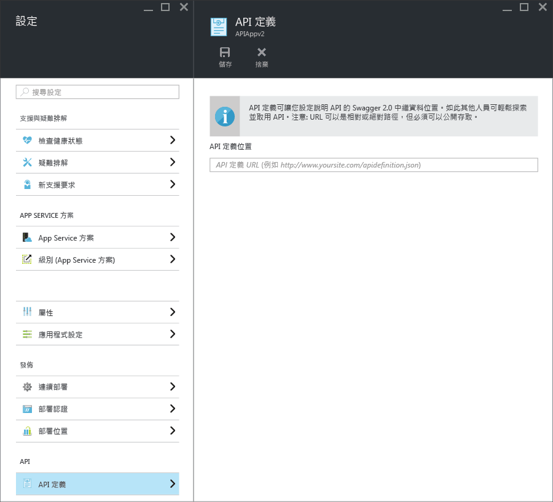

<properties
	pageTitle="適用於 API 探索及產生程式碼用的 App Service API Apps 中繼資料 | Microsoft Azure"
	description="了解 Azure App Service 中的 API 應用程式如何使用 Swagger 中繼資料來協助 API 探索和產生程式碼。"
	services="app-service\api"
	documentationCenter=".net"
	authors="tdykstra"
	manager="wpickett"
	editor=""/>

<tags
	ms.service="app-service-api"
	ms.workload="na"
	ms.tgt_pltfrm="na"
	ms.devlang="na"
	ms.topic="get-started-article"
	ms.date="11/25/2015"
	ms.author="tdykstra"/>

# 適用於 API 探索及產生程式碼用的 App Service API Apps 中繼資料 

App Service API Apps 內建支援 [Swagger 2.0](http://swagger.io/) API 中繼資料。您不需要使用 Swagger，但如果您使用 Swagger，就能利用可讓探索和使用變得更加容易的 API Apps 功能。

## Swagger 端點

您可以指定端點來為 API 應用程式提供 Swagger 2.0 JSON 中繼資料，做為該 API 應用程式的屬性。端點可以與 API 應用程式的基底 URL 或絕對 URL 相關。絕對 URL 可以指向 API 應用程式以外的地方。

這個 URL 必須可公開存取 (也就是未受使用者或服務驗證的保護)。

在 [Azure 入口網站](https://portal.azure.com/)中，您可以在 [API 定義] 刀鋒視窗看到及變更端點 URL 。

當您使用 Visual Studio 建立 API 應用程式時，API 定義端點會自動設為 API 應用程式的基底 URL，加上 `/swagger/docs/v1`。這是 [Swashbuckle](https://www.nuget.org/packages/Swashbuckle) NuGet 封裝用來為 ASP.NET Web API 專案提供動態產生的 Swagger 中繼資料的預設 URL。

## 產生程式碼

將 Swagger 整合到 Azure API 應用程式的好處之一，就是自動產生程式碼。產生的用戶端類別讓您能更容易地撰寫會呼叫 API 應用程式的程式碼。

您可以利用 Visual Studio，或從命令列來為 API 應用程式產生用戶端程式碼。如需了解如何在 Visual Studio 中為 ASP.NET Web API 專案產生用戶端類別，請參閱 [開始使用 API 應用程式和 ASP.NET](app-service-api-dotnet-get-started.md#codegen)。如需了解如何為所有支援的語言從命令列進行這項作業，請參閱 GitHub.com 上 [Azure/autorest](https://github.com/azure/autorest) 儲存機制的讀我檔案。
 
## 後續步驟

如需逐步解說的教學課程來引導您建立、部署及使用 API 應用程式，請參閱[開始使用 Azure App Service 中的 API 應用程式](app-service-api-dotnet-get-started.md)。

<!---HONumber=AcomDC_1203_2015-->