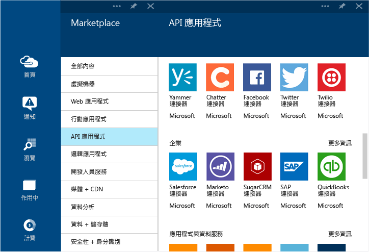

<properties 
	pageTitle="什麼是連接器和 BizTalk API 應用程式" 
	description="了解 API 應用程式、連接器和 BizTalk API 應用程式" 
	services="app-service\logic" 
	documentationCenter="" 
	authors="MandiOhlinger" 
	manager="erikre" 
	editor=""/>

<tags 
	ms.service="app-service-logic" 
	ms.workload="integration" 
	ms.tgt_pltfrm="na" 
	ms.devlang="na" 
	ms.topic="get-started-article" 
	ms.date="02/18/2016" 
	ms.author="mandia"/>

# 什麼是連接器和 BizTalk API 應用程式
>[AZURE.NOTE] 這一版的文章適用於邏輯應用程式 2014-12-01-preview 結構描述版本。

Azure 應用程式服務是根據可擴充性和通用連線性的原則，透過 API 應用程式建立的。*連接器* 是一種著重於連線性的 API 應用程式。連接器 (例如任何其他 API 應用程式) 是從 Web 應用程式、行動應用程式和邏輯應用程式使用的。連接器可讓您輕鬆地連接到現有的服務並協助您管理驗證、提供監視、分析功能等等。

所有開發人員均可建立自己的 API 應用程式並私下進行部署。將來，開發人員可以透過市集共用及販售其自訂建立的 API 應用程式。

為了加快開發人員透過 Azure 應用程式服務建置解決方案的速度，Azure 團隊在 Marketplace 新增了多種連接器，以因應許多常見案例的需求。此外，為了將應用程式服務的功能觸及更複雜且進階的整合案例，我們也提供了許多高階和 BizTalk 功能。

Azure 應用程式服務中有不同的服務「層」可用。所有層都包含連接器和 API 應用程式，包括其完整功能。

[應用程式服務定價](https://azure.microsoft.com/pricing/details/app-service/)會描述這些服務層，也會列出這些層內含的項目。下列各節描述 BizTalk API 應用程式和連接器的各種類別。

## 混合式連接器 
混合式連接器可透過 [SAP](app-service-logic-connector-sap.md)、[Oracle](app-service-logic-connector-oracle.md)、[DB2](app-service-logic-connector-db2.md)、[Informix](app-service-logic-connector-informix.md) 和 WebSphere MQ 的連線，將應用程式服務進一步延伸至企業中。

## EAI 和 EDI 服務
建置業務關鍵應用程式時需要的不只是連線。以 Microsoft 領先業界的整合平台 BizTalk Server 做為基礎，BizTalk API 應用程式提供進階的整合功能，可以輕鬆地融入您的 Web、行動和邏輯應用程式中。其中某些整合功能包含[驗證](app-service-logic-xml-validator.md)、[擷取](app-service-logic-xpath-extract.md)、[轉換](app-service-logic-transform-xml-documents.md)、[編碼器](app-service-logic-connector-jsonencoder.md)、[交易夥伴管理](app-service-logic-connector-tpm.md)以及 EDI 格式 (如 [X12](app-service-logic-connector-x12.md)、[EDIFACT](app-service-logic-connector-edifact.md) 和 [AS2](app-service-logic-connector-as2.md)) 的支援。

其他資源：[企業對企業連接器和 API 應用程式](app-service-logic-b2b-connectors.md) [建立 B2B 程序](app-service-logic-create-a-b2b-process.md) [建立交易夥伴協議](app-service-logic-create-a-trading-partner-agreement.md) [追蹤 B2B 訊息](app-service-logic-track-b2b-messages.md)

## 規則
商務規則包含可控制商務程序的原則和決策。規則通常屬動態並因為不同原因而隨著時間改變，包括業務規劃、法規和其他原因。[應用程式服務中的 BizTalk 規則](app-service-logic-use-biztalk-rules.md)可讓您將這些原則與您的應用程式碼分離，使變更程序更簡單、更快速。

## 連接器和 API 應用程式清單
請參閱[連接器和 API 應用程式清單](app-service-logic-connectors-list.md)，以取得各類別內含的完整連接器和 API 應用程式清單，包括標準連接器、BizTalk EAI、高階連接器等。
 

<!---HONumber=AcomDC_0224_2016-->