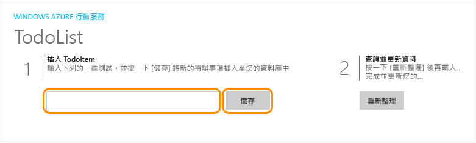
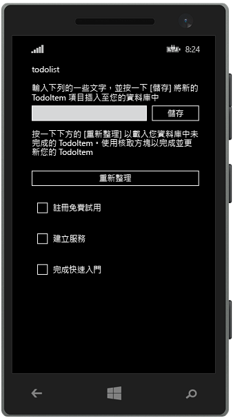

<properties
	pageTitle="在 Azure App Service Mobile Apps 上建立 Windows Runtime 8.1 通用應用程式 | Microsoft Azure"
	description="遵循此教學課程，可開始使用 Azure 行動應用程式後端進行 C#、Visual Basic 或 JavaScript 的 Windows 市集開發。"
	services="app-service\mobile"
	documentationCenter="windows"
	authors="ggailey777"
	manager="dwrede"
	editor=""/>

<tags
	ms.service="app-service-mobile"
	ms.workload="mobile"
	ms.tgt_pltfrm="mobile-windows"
	ms.devlang="dotnet"
	ms.topic="hero-article"
	ms.date="08/14/2015"
	ms.author="glenga"/>

#建立 Windows 應用程式

[AZURE.INCLUDE [app-service-mobile-selector-get-started-preview](../../includes/app-service-mobile-selector-get-started-preview.md)]
&nbsp;  
[AZURE.INCLUDE [app-service-mobile-note-mobile-services-preview](../../includes/app-service-mobile-note-mobile-services-preview.md)]

##概觀

本教學課程說明如何藉由使用 Azure 行動應用程式後端，將雲端型後端服務新增到 Windows Runtime 8.1 通用應用程式。除了一般共用專案之外，通用 Windows 應用程式解決方案也包括 Windows 市集 8.1 和 Windows Phone 市集 8.1 應用程式的專案。

[AZURE.INCLUDE [app-service-mobile-windows-universal-get-started-preview](../../includes/app-service-mobile-windows-universal-get-started-preview.md)]

##必要條件

若要完成此教學課程，您需要下列項目：

* 使用中的 Azure 帳戶。如果您沒有帳戶，可以註冊 Azure 試用版並取得多達 10 個免費的行動應用程式，即使在試用期結束之後仍可繼續使用這些應用程式。如需詳細資訊，請參閱 [Azure 免費試用](http://azure.microsoft.com/pricing/free-trial/)。

* [Visual Studio Community 2013] 或更新版本。

>[AZURE.NOTE]如果您想要在註冊 Azure 帳戶之前先開始使用 Azure App Service，請移至[試用 App Service](http://go.microsoft.com/fwlink/?LinkId=523751&appServiceName=mobile)。您可以於該處，在 App Service 中立即建立短期的入門行動 app - 不需信用卡，不需任何承諾。

##建立新的 Azure 行動 app 後端

[AZURE.INCLUDE [app-service-mobile-dotnet-backend-create-new-service-preview](../../includes/app-service-mobile-dotnet-backend-create-new-service-preview.md)]

## 下載伺服器專案

1. 在 [Azure 入口網站]中，按一下 [全部瀏覽] > [Web Apps]，然後按一下您剛建立的行動應用程式後端。

2. 在行動應用程式後端中，按一下 [所有設定]，然後在 [行動應用程式] 底下按一下 [快速入門] > [Windows (C#)]。

3. 在 [建立新的應用程式] 的 [下載並執行您的伺服器專案] 之下，按一下 [下載]，將壓縮的專案檔案解壓縮至本機電腦，並在 Visual Studio 中開啟此方案。

4. 建置專案以還原 NuGet 封裝。

##將伺服器專案發佈至 Azure

[AZURE.INCLUDE [app-service-mobile-dotnet-backend-publish-service-preview](../../includes/app-service-mobile-dotnet-backend-publish-service-preview.md)]

##下載並執行用戶端專案

建立行動應用程式後端之後，您可以依照 Azure 入口網站中的簡易快速入門，建立新的應用程式或修改現有的應用程式，以連接到您的行動應用程式後端。

在本節中，您會下載通用 Windows 應用程式範本專案，而該專案已自訂要連接到 Azure 行動應用程式後端。

1. 回到行動應用程式後端的刀鋒視窗中，按一下 [所有設定]，然後在 [行動應用程式] 底下按一下 [快速入門] > [Windows (C#)]。

2.  在 [建立新的應用程式] 的 [下載並執行您的 Windows 專案] 之下，按一下 [下載]，並將壓縮的專案檔案解壓縮至本機電腦。

3. (選擇性) 將通用 Windows 應用程式專案加入至包含伺服器專案的方案。如此即可更輕鬆地在相同的 Visual Studio 方案中偵錯及測試應用程式和後端 (如果您選擇這麼做的話)。

4. 以 Windows 市集應用程式做為啟始專案，按下 F5 鍵以重建專案並啟動 Windows 市集應用程式。

5. 在應用程式的 [插入 TodoItem] 文字方塊中輸入有意義的文字，例如*完成教學課程*，然後按一下 [儲存]。

	

	如此會傳送 POST 要求到 Azure 中代管的新行動應用程式後端。

6. 停止偵錯，以滑鼠右鍵按一下 `<your app name>.WindowsPhone` 專案、按一下 [設定為啟始專案]，然後再次按 F5 鍵。

	

	請注意，從先前步驟中儲存的資料，會在 Windows 應用程式啟動後從行動應用程式載入。

##後續步驟

* [將驗證新增至應用程式](app-service-mobile-dotnet-backend-windows-store-dotnet-get-started-users-preview.md)  了解如何向身分識別提供者驗證應用程式的使用者。

* [將推播通知新增至您的應用程式](app-service-mobile-dotnet-backend-windows-store-dotnet-get-started-push-preview.md)  了解如何將非常基本的推播通知傳送至應用程式。

<!-- Anchors. -->
<!-- Images. -->
<!-- URLs. -->
[Get started with authentication]: app-service-mobile-dotnet-backend-windows-store-dotnet-get-started-users-preview.md
[Mobile App SDK]: http://go.microsoft.com/fwlink/?LinkId=257545
[Azure 入口網站]: https://portal.azure.com/
[Visual Studio Community 2013]: https://go.microsoft.com/fwLink/p/?LinkID=534203

<!----HONumber=Sept15_HO1-->