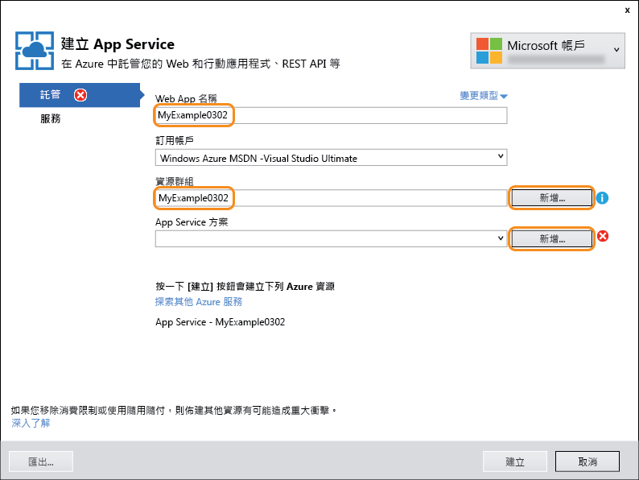
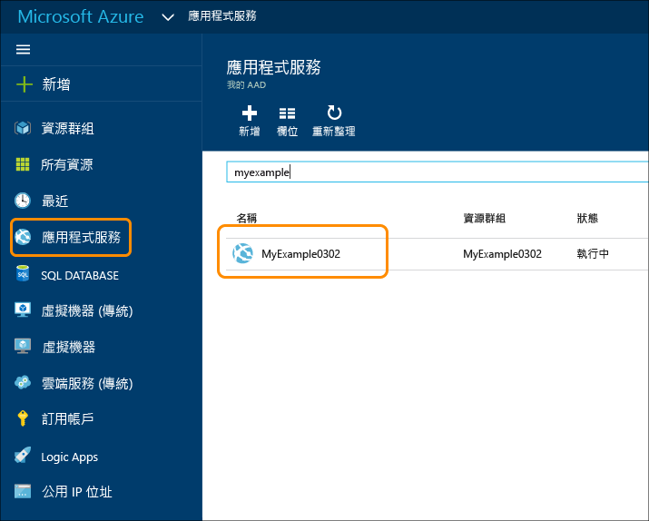

<properties
	pageTitle="使用 Visual Studio 建立 Web 應用程式 | Microsoft Azure"
	description="了解如何在 Visual Studio 中建立 ASP.NET Web 專案，並將它部署到 Azure App Service 中的新 Web 應用程式。"
	services="app-service\web"
	documentationCenter=".net"
	authors="tdykstra"
	manager="wpickett"
	editor=""/>

<tags
	ms.service="app-service-web"
	ms.workload="web"
	ms.tgt_pltfrm="na"
	ms.devlang="dotnet"
	ms.topic="hero-article"
	ms.date="03/02/2016"
	ms.author="tdykstra"/>

# 在 Azure App Service 中使用 Visual Studio 建立 ASP.NET Web 應用程式

> [AZURE.SELECTOR]
- [.Net](web-sites-dotnet-get-started.md)
- [Node.js](app-service-web-nodejs-get-started.md)
- [Java](web-sites-java-get-started.md)
- [PHP - Git](web-sites-php-mysql-deploy-use-git.md)
- [PHP - FTP](web-sites-php-mysql-deploy-use-ftp.md)
- [Python](web-sites-python-ptvs-django-mysql.md)

## 概觀

本教學課程示範如何使用 Visual Studio 2015，將 ASP.NET Web 應用程式部署至 [Azure App Service 中的 Web 應用程式](app-service-web-overview.md)。本教學課程假設您是先前沒有 Azure 使用經驗的 ASP.NET 開發人員。完成此教學課程後，您將有個簡單的 Web 應用程式已在雲端中啟動並執行。

下圖顯示完成的應用程式：

您將了解：

* 如何在 Visual Studio 中建立新的 Web 專案時建立新的 App Service Web 應用程式。
* 如何使用 Visual Studio 將 Web 專案部署到 App Service Web 應用程式。
* 說明如何使用 [Azure 入口網站](/features/azure-portal/)來監控及管理您的 Web 應用程式。

本教學課程最後的[疑難排解](#troubleshooting)一節會概述發生問題時的處理方式，而[後續步驟](#next-steps)一節則提供其他會更深入探討如何使用 Azure App Service 之教學課程的連結。

> [AZURE.NOTE] 請幫助我們規劃本教學課程的範圍和方法 -- 如果您有希望涵蓋在入門教學課程中的主題，請在本教學課程結尾的 [Disqus 註解](#comments)中留下意見反應。

[AZURE.INCLUDE [必要條件](../../includes/app-service-web-dotnet-get-started-prereqs.md)]

## 在 Azure App Service 中建立 Web 專案和 Web 應用程式

第一個步驟是在 Visual Studio 和 Azure App Service 的 Web 應用程式中建立 Web 專案。完成時，您會將專案部署至 Web 應用程式，以使其可在網際網路上提供使用。

圖表會說明您所要進行的建立和部署步驟。

1. 開啟 Visual Studio 2015。

2. 按一下 [檔案] > [新增] > [專案]。

3. 在 [新增專案] 對話方塊中，依序按一下 [Visual C#] > [Web] > [ASP.NET Web 應用程式] \(如有需要，您可以選擇 [Visual Basic])。

3. 確定已選取 [.NET Framework 4.5.2] 來做為目標架構。

4.  [Azure Application Insights](../application-insights/app-insights-overview.md) 會監視您 Web 應用程式的可用性、效能和使用情形。在您安裝 Visual Studio 後第一次建立 Web 專案時，預設會勾選 [在專案中新增 Application Insights] 核取方塊。如果您不想嘗試 Application Insights，但系統預設已勾選，請清除該核取方塊。

4. 將應用程式命名為 MyExample。

5. 按一下 [確定]。

	![[新增專案] 對話方塊](./media/web-sites-dotnet-get-started/GS13newprojdb.png)

5. 在 [新增 ASP.NET 專案] 對話方塊中，選取 [MVC] 範本。

7. 按一下 [變更驗證]。

	![[新增 ASP.NET 專案] 對話方塊](./media/web-sites-dotnet-get-started/GS13changeauth.png)

6. 在 [變更驗證] 對話方塊中，按一下 [不需要驗證]，然後按一下 [確定]。

	

	您為此教學課程建立的應用程式十分簡單，不支援使用者登入。

5. 在 [新建 ASP.NET 專案] 核取方塊中的 [Microsoft Azure] 區段，確認已選取 [在雲端託管]，並在下拉式清單中選取 [App Service]。

	![[新增 ASP.NET 專案] 對話方塊](./media/web-sites-dotnet-get-started/GS13newaspnetprojdb.png)

	這些設定可指示 Visual Studio 為 Web 專案建立 Azure Web 應用程式。

6. 按一下 [確定]。

5. 如果您尚未登入 Azure，Visual Studio 會提示您登入。使用您用來管理 Azure 訂用帳戶之帳戶的識別碼和密碼來登入。

	當您登入時，[建立 App Service] 對話方塊會詢問您要建立什麼資源。

	

3. 在 [建立 App Service] 對話方塊中，輸入 Web 應用程式名稱，而該名稱在 azurewebsites.net 網域中必須是唯一名稱。例如，您可以將它命名為 MyExample 並於右邊加上數字，使其成為唯一的名稱，例如 MyExample810。如果預設的 Web 名稱針對您所建立，則它將是唯一的，且您可以使用該名稱。

	如果有其他人使用了您輸入的名稱，您就會在右邊看到紅色驚嘆號，而不是綠色勾號，這代表您必須輸入不同的名稱。

	應用程式的 URL 是這個名稱加上 .azurewebsites.net (如 [Web 應用程式名稱] 文字方塊旁所示)。例如，若名稱為 `MyExample810`，則 URL 是 `myexample810.azurewebsites.net`。

	[後續步驟](#next-steps)一節會連結到說明自己的自訂網域如何與 Azure Web 應用程式搭配使用的教學課程。

6. 在 [資源群組] 方塊旁，按一下 [新增]，然後輸入 "MyExample" 或其他您偏好的名稱。

	此組合方塊可讓您選取現有的資源群組，或藉由輸入與您的訂用帳戶中任何現有的資源群組不同的名稱，以建立新的資源群組。

	資源群組是 Azure 資源的集合，例如 Web 應用程式、資料庫和 VM。在本教學課程中，最好建立新的資源群組，因為這麼做即可在一個步驟中輕鬆刪除您為本教學課程建立的所有 Azure 資源。如需詳細資訊，請參閱 [Azure Resource Manager 概觀](../resource-group-overview.md)。

4. 按一下 [App Service 方案] 下拉式清單旁邊的 [新增] 按鈕。

	

	螢幕擷取畫面顯示 [Web 應用程式名稱]、[訂用帳戶] 和 [資源群組] 的範例值 -- 您的值會有所不同。

	在下列步驟中，您會為新的資源群組建立 App Service 方案。App Service 方案會指定 Web 應用程式執行所在的計算資源。例如，如果您選擇免費層，則 API 應用程式會在共用 VM 上執行，若為某些付費層，它則會在專用 VM 上執行。如需詳細資訊，請參閱 [App Service 方案概觀](../app-service/azure-web-sites-web-hosting-plans-in-depth-overview.md)。

5. 在 [設定 App Service 方案] 對話方塊中，輸入 "MyExamplePlan" 或其他您偏好的名稱。

5. 在 [位置] 下拉式清單中，選擇最接近您的位置。

	這個設定會指定應用程式將執行所在的 Azure 資料中心。您可以在本教學課程中選取任何區域，這不會造成顯著的差異。但是對於生產用的應用程式，您的伺服器應盡可能靠近存取該應用程式的用戶端，以將[延遲](http://www.bing.com/search?q=web%20latency%20introduction&qs=n&form=QBRE&pq=web%20latency%20introduction&sc=1-24&sp=-1&sk=&cvid=eefff99dfc864d25a75a83740f1e0090)降到最低。

5. 在 [大小] 下拉式清單中，按一下 [免費]。

	在本教學課程中，免費定價層會提供足夠的效能。

6. 在 [設定 App Service 方案] 對話方塊中，按一下 [確定]。

	

7. 在 [建立 App Service] 對話方塊中，按一下 [建立]。

	

	通常在不到一分鐘的時間內，Visual Studio 就會建立 Web 專案和 Web 應用程式。

	[方案總管] 視窗會顯示新專案中的檔案和資料夾。

	

	[Azure App Service 活動] 視窗會顯示已建立 Web 應用程式。

	![在 [Azure App Service 活動] 視窗中建立的 Web 應用程式](./media/web-sites-dotnet-get-started/GS13sitecreated1.png)

	您可以在 Visual Studio 的 [雲端總管] 視窗中看到 Web 應用程式。

	![在 [雲端總管] 中建立的 Web 應用程式](./media/web-sites-dotnet-get-started/siteinse.png)
	
	此視窗可讓您檢視和管理各種 Azure 資源。螢幕擷取畫面只顯示 Web 應用程式，但是您會在 [雲端總管] 視窗中看到更多資源類型。以滑鼠右鍵按一下 Web 應用程式等資源，以查看其管理選項。

## 將 Web 專案部署至 Azure Web 應用程式

在本節中，您會將 Web 專案部署到 Web 應用程式，如圖表中的步驟 2 所示。

1. 在 [方案總管] 中以滑鼠右鍵按一下專案，再選擇 [發行]。

	![在 Visual Studio 功能表中選擇 [發佈]](./media/web-sites-dotnet-get-started/choosepublish.png)

	[發佈 Web] 精靈會在幾秒鐘後出現。此精靈會開啟某個發佈設定檔，其中包含能將 Web 專案部署到新 Web 應用程式的設定。如果您想要部署到不同的 Web 應用程式，可以按一下 [設定檔] 索引標籤來建立不同的設定檔。在本教學課程中，您會接受部署到您稍早建立的 Web 應用程式的設定。

	發佈設定檔包含用於部署的使用者名稱和密碼。這些認證已事先為您產生，因此您不需要加以輸入或變更。密碼會加密並存放在 `Properties\PublishProfiles` 資料夾的使用者專屬隱藏檔案中。

8. 在 [發佈 Web] 精靈的 [連線] 索引標籤中，按 [下一步]。

	![在 [發佈 Web] 精靈的 [連線] 索引標籤中按 [下一步]](./media/web-sites-dotnet-get-started/GS13ValidateConnection.png)

	下一個索引標籤是 [設定] 索引標籤。您可以在此變更組建組態索引標籤，以部署用於[遠端偵錯](../app-service-web/web-sites-dotnet-troubleshoot-visual-studio.md#remotedebug)的偵錯組建。此索引標籤也會提供數個 [檔案發佈選項]：

	* 在目的地移除多餘的檔案
	* 在發行期間預先編譯
	* 從 App\_Data 資料夾中排除檔案

	在本教學課程中，您不需要這些。如需它們執行了哪些作業的說明，請參閱[操作說明：在 Visual Studio 中使用單鍵發佈來部署 Web 專案](https://msdn.microsoft.com/library/dd465337.aspx)。

10. 在 [設定] 索引標籤上，按 [下一步]。

	![[發佈 Web] 精靈的 [設定] 索引標籤](./media/web-sites-dotnet-get-started/GS13SettingsTab.png)

	接下來按一下 [預覽] 索引標籤。您可以查看即將從您的專案複製到 API 應用程式的檔案。當您將專案部署至您先前已部署至的 API 應用程式時，只會複製已變更的檔案。如果您想要查看即將複製的項目清單，可以按一下 [開始預覽] 按鈕。

11. 在 [預覽] 索引標籤上，按一下 [發佈]。

	![[發佈 Web] 精靈的 [預覽] 索引標籤](./media/web-sites-dotnet-get-started/GS13previewoutput.png)

	當您按一下 [發佈] 時，Visual Studio 就會開始將檔案複製至 Azure 伺服器。這可能需要數分鐘的時間。

	[輸出] 與 [Azure App Service 活動] 視窗會顯示已採取的部署動作，並回報部署作業已順利完成。

	![報告部署成功的 Visual Studio [輸出] 視窗](./media/web-sites-dotnet-get-started/PublishOutput.png)

	部署成功時，即會自動在預設瀏覽器中開啟已部署之 Web 應用程式的 URL，而您建立的應用程式現在正在雲端中執行。瀏覽器網址列中的 URL 會顯示 Web 應用程式是從網際網路載入。

	

> [AZURE.TIP] 您可以啟用 [Web 單鍵發佈] 工具列來加快部署速度，方法是依序按一下 [檢視] > [工具列]，然後選取 [Web 單鍵發佈]。您可以使用工具列來選取設定檔、按一下按鈕來發佈，或按一下按鈕來開啟 [發佈 Web] 精靈。
> 

## 在 Azure 入口網站中監控及管理 Web 應用程式

[Azure 入口網站](/services/management-portal/)是您可以用來管理及監控 Azure 服務 (例如，您剛建立的 Web 應用程式) 的 Web 介面。在教學課程的這一節中，您會了解可在入口網站中執行的一些作業。

1. 在瀏覽器中，移至 [https://portal.azure.com](https://portal.azure.com)，然後用您管理 Azure 帳戶的認證登入。

2. 按一下 [應用程式服務]，然後按一下您 Web 應用程式的名稱。

	

	[Web 應用程式] 刀鋒視窗會顯示您 Web 應用程式的設定和使用量統計資料概觀。(在右側開啟的視窗稱為「刀鋒視窗」。)

	![Azure 入口網站中的 [Web 應用程式] 刀鋒視窗](./media/web-sites-dotnet-get-started/portaldashboard.png)

	您的 Web 應用程式還沒有太多流量，因此圖形中可能不會顯示任何項目。當您瀏覽到自己應用程式時，請重新整理頁面數次，然後重新整理入口網站頁面，您就會看見頁面出現部分統計資料。

3. [設定] 刀鋒視窗會顯示更多可用來設定您 Web 應用程式的選項。

	![Azure 入口網站中的 [設定] 刀鋒視窗](./media/web-sites-dotnet-get-started/portalconfigure1.png)

	請注意 [發佈] 區段中的 [部署認證] 連結。您可以在此建立用於部署的自訂使用者名稱和密碼。按一下刀鋒視窗頂端的 [儲存] 按鈕以提交變更。如果您建立新的使用者名稱和密碼，則必須在 Web 專案之 [發佈 Web] 精靈的 [連線] 索引標籤中輸入相同的值。
	
	此螢幕擷取畫面只是 [設定] 刀鋒視窗的部分檢視。此刀鋒視窗還有許多區段並未顯示出來。

4. 按一下 [設定] 刀鋒視窗中 [一般] 區段的 [應用程式設定]，以查看您可在入口網站中設定的設定種類範例。

	例如，您可以控制 Web 應用程式所使用的 .NET 版本、啟用各種功能 (像是 [WebSockets](/blog/2013/11/14/introduction-to-websockets-on-windows-azure-web-sites/))，以及設定[連接字串值](/blog/2013/07/17/windows-azure-web-sites-how-application-strings-and-connection-strings-work/)。

	![Azure 入口網站中的 [Web 應用程式設定] 索引標籤](./media/web-sites-dotnet-get-started/portalconfigure2.png)

這些只是入口網站的少數幾個功能而已。您也可以建立新的 Web 應用程式、刪除現有的 Web 應用程式、停止及重新啟動 Web 應用程式，以及管理其他類型的 Azure 服務，例如資料庫和虛擬機器。

## 刪除 Azure Web 應用程式

當您不再需要用到為了本教學課程所建立的 Web 應用程式時，您可以將它刪除。

若要刪除 Web 應用程式，簡單的方法是按一下 Azure 入口網站的 [Web 應用程式] 刀鋒視窗頂端的 [刪除] 按鈕。更好的方法是刪除您建立來包含 Web 應用程式的資源群組。在本教學課程中，資源群組只包含 Web 應用程式，但資源群組通常包含相關資源的集合。比方說，當您刪除 Web 應用程式時，該 Web 應用程式所使用的資料庫或 Azure 儲存體帳戶可能也不再需要用到。如果您刪除資源群組，就能刪除它所包含的所有項目。若要使用 Azure 入口網站刪除資源群組，請執行下列步驟。

1. 移至 [Azure 入口網站](https://portal.azure.com)的首頁。

2. 按一下 [資源群組]。

3. 在資源群組清單中，按一下您想要刪除的資源群組。

	當 [資源群組] 刀鋒視窗出現時，其中將會有它所包含的資源清單。

4. 在 [資源群組] 刀鋒視窗中，按一下 [刪除]。

	

## 疑難排解

如果您在進行本教學課程時遇到問題，請確定您使用的是最新版 Azure SDK for .NET。若要這麼做，最簡單的方法是[下載 Azure SDK for Visual Studio 2015](http://go.microsoft.com/fwlink/?linkid=518003)；如果您已安裝最新版本，Web Platform Installer 會指出不需要進行安裝。

如果您位於公司網路內，並嘗試透過防火牆部署至 Azure App Service，請確定連接埠 443 和 8172 已針對 Web Deploy 開啟。如果您無法開啟這些連接埠，請參閱下面的＜後續步驟＞一節以了解其他部署選項。

在 Azure App Service 中執行 ASP .NET Web 應用程式之後，您可能會想要深入了解可簡化疑難排解步驟的 Visual Studio 功能。如需記錄和遠端偵錯等功能的相關資訊，請參閱[在 Visual Studio 中疑難排解 Azure Web 應用程式](web-sites-dotnet-troubleshoot-visual-studio.md)。

## 後續步驟

在本教學課程中，您已了解如何建立簡易的 Web 應用程式，並將其部署至 Azure Web 應用程式。以下是有助於您深入了解 Azure App Service 的一些相關主題和資源。

* 如何將現有 Web 專案部署至新的 Web 應用程式

	若要啟動現有 Web 專案的部署程序，請以滑鼠右鍵按一下 [方案總管] 中的專案，然後按一下 [發佈]。選擇 [Microsoft Azure App Service] 做為發佈目標。然後選擇現有 Azure Web 應用程式做為目標，或按一下 [新增] 來建立新的 Web 應用程式。如果您按一下 [新增] 來建立新的 Web 應用程式，其程序和您在本教學課程的這邊所看到的一樣。

* 建立 Web 應用程式的其他方式

	您也可以使用 [Azure 入口網站](https://portal.azure.com/)、[適用於 Windows PowerShell 的 Azure Cmdlet](../powershell-install-configure.md) 或[跨平台命令列介面](../xplat-cli.md)來建立 Web 應用程式。

* 如何建立 API 應用程式

	您已了解如何建立主要目的為託管網站的 Azure App Service 執行個體。這類執行個體稱為 Web 應用程式。App Service 的專屬功能也可協助輕鬆開發、測試和託管 API。主要是為了裝載 API 的 App Service 執行個體稱為 API 應用程式。如需詳細資訊，請參閱[在 Azure App Service 中開始使用 API Apps 和 ASP.NET](../app-service-api/app-service-api-dotnet-get-started.md)。

* 部署 Web 專案的其他方式

	如需了解藉由使用 Visual Studio，或是藉由使用[原始檔控制系統](http://www.asp.net/aspnet/overview/developing-apps-with-windows-azure/building-real-world-cloud-apps-with-windows-azure/source-control)來[自動化部署](http://www.asp.net/aspnet/overview/developing-apps-with-windows-azure/building-real-world-cloud-apps-with-windows-azure/continuous-integration-and-continuous-delivery)，來將 Web 專案部署到 Web 應用程式的其他方式，請參閱[如何部署 Azure Web 應用程式](web-sites-deploy.md)。

* 如何新增自訂網域名稱和 SSL

	如需如何使用 SSL 和您自己的網域 (例如 www.contoso.com，而非 contoso.azurewebsites.net) 的相關資訊，請參閱下列資源：

	* [在 Azure App Service 中設定自訂網域名稱](web-sites-custom-domain-name.md)
	* [對 Azure 網站啟用 HTTPS](web-sites-configure-ssl-certificate.md)

* 如何新增即時功能，例如交談

	對於交談服務、遊戲或股市行情等即時功能，您可以使用 [ASP.NET SignalR](http://www.asp.net/signalr) 搭配 [WebSockets](/blog/2013/11/14/introduction-to-websockets-on-windows-azure-web-sites/) 傳輸方法來獲得最佳效能。如需詳細資訊，請參閱[搭配使用 SignalR 和 Azure Web 應用程式](http://www.asp.net/signalr/overview/signalr-20/getting-started-with-signalr-20/using-signalr-with-windows-azure-web-sites)。

* 如何在 App Service、Azure 雲端服務和 Web 應用程式的 Azure 虛擬機器之間進行選擇

	在 Azure 中，您可以在 App Service Web Apps 中執行 Web 應用程式 (如本教學課程所示)，或在雲端服務或虛擬機器中執行。如需詳細資訊，請參閱 [Azure Web 應用程式、雲端服務和 VM：每一項的使用時機](/manage/services/web-sites/choose-web-app-service/)。

<!---HONumber=AcomDC_0406_2016-->