<properties
	pageTitle="在 Azure App Service 中建立 ASP.NET Web 應用程式 | Microsoft Azure"
	description="本教學課程說明如何在 Visual Studio 2013 中建立 ASP.NET Web 專案，並將它部署到 Azure App Service 中的 Web應用程式。"
	services="app-service\web"
	documentationCenter=".net"
	authors="tdykstra"
	manager="wpickett"
	editor="jimbe"/>

<tags
	ms.service="app-service-web"
	ms.workload="web"
	ms.tgt_pltfrm="na"
	ms.devlang="dotnet"
	ms.topic="hero-article"
	ms.date="08/10/2015"
	ms.author="tdykstra"/>

# 在 Azure App Service 中建立 ASP.NET Web 應用程式

> [AZURE.SELECTOR]
- [.Net](web-sites-dotnet-get-started.md)
- [Node.js](web-sites-nodejs-develop-deploy-mac.md)
- [Java](web-sites-java-get-started.md)
- [PHP - Git](web-sites-php-mysql-deploy-use-git.md)
- [PHP - FTP](web-sites-php-mysql-deploy-use-ftp.md)
- [Python](web-sites-python-ptvs-django-mysql.md)

## 概觀

本教學課程示範如何使用 Visual Studio 2015 或 Visual Studio 2013，來建立 ASP.NET Web 應用程式並將其部署至 [Azure App Service 中的 Web App](app-service-web-overview.md)。本教學課程假設您先前沒有使用 Azure 或 ASP.NET 的經驗。完成此教學課程後，您將有個簡單的 Web 應用程式已在雲端中啟動並執行。

下圖顯示完成的應用程式：

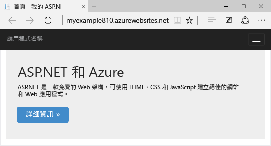

您將了解：

* 如何安裝 Azure SDK 好讓電腦適合用於進行 Azure 開發。
* 如何建立 Visual Studio ASP.NET Web 專案，並將該專案部署至 Azure Web 應用程式。
* 如何對 Web 專案進行變更，並重新部署應用程式。
* 說明如何使用 [Azure 入口網站](/overview/preview-portal/)來監控及管理您的 Web App。

##註冊 Microsoft Azure

您需要有 Azure 帳戶才能完成此教學課程。您可以：

* [免費申請 Azure 帳戶](/pricing/free-trial/?WT.mc_id=A261C142F)。您將取得可試用付費 Azure 服務的額度。即使在額度用完後，您仍可保留帳戶，並使用免費的 Azure 服務和功能，例如 Azure App Service 中的 Web Apps 功能。
* [啟用 MSDN 訂戶權益](/pricing/member-offers/msdn-benefits-details/?WT.mc_id=A261C142F)。您的 MSDN 訂閱每月會提供您額度，您可以用在 Azure 付費服務。

> [AZURE.NOTE]如果您想要在註冊 Azure 帳戶之前先開始使用 Azure App Service，請移至[試用 App Service](http://go.microsoft.com/fwlink/?LinkId=523751)。您可以於該處，在 App Service 中立即建立短期的入門 Web app - 不需信用卡，不需任何承諾。

在此影片中，Scott Hanselman 示範註冊免費試用的 Microsoft Azure 有多容易。(持續時間：1:58)

> [AZURE.VIDEO sign-up-for-microsoft-azure]

[AZURE.INCLUDE [install-sdk-2015-2013](../../includes/install-sdk-2015-2013.md)]

## 建立專案和 Web App

第一個步驟是在 Visual Studio 和 Azure App Service 的 Web 應用程式中建立 Web 專案。完成時，您會將專案部署至 Web 應用程式，以使其可在網際網路上提供使用。

圖表會說明您所要進行的建立和部署步驟。

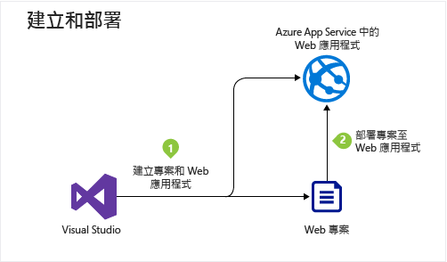

1. 開啟 Visual Studio 2015 或 Visual Studio 2013。

	如果您使用 Visual Studio 2013，畫面會與螢幕擷取畫面稍有不同，但程序基本上都相同。

2. 從 [檔案] 功能表，按一下 [新增] > [專案]。

3. 在 [新增專案] 對話方塊中，按一下 [C#] > [Web] > [ASP.NET Web 應用程式]。如有需要，您可以選擇 [Visual Basic]。

3. 確定已選取 [.NET Framework 4.5.2] 作為目標架構。

4.  [Azure Application Insights](app-insights-overview.md) 會監視 Web App 的可用性、效能和使用量。如果您不想要試用，請清除 [將 Application Insights 加入專案] 核取方塊。

4. 將應用程式命名為 **MyExample**。

5. 按一下 [確定]。

	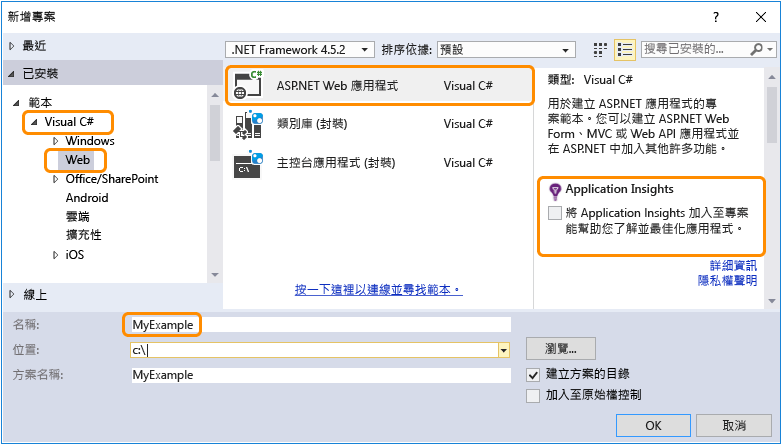

5. 在 [新增 ASP.NET 專案] 對話方塊中，選取 [MVC] 範本。

	[MVC](http://www.asp.net/mvc) 是用於開發 Web App 的 ASP.NET 架構。

7. 按一下 [變更驗證]。

	![[New ASP.NET Project] 對話方塊](./media/web-sites-dotnet-get-started/GS13changeauth.png)

6. 在 [變更驗證] 對話方塊中，按一下 [不需要驗證]，然後按一下 [確定]。

	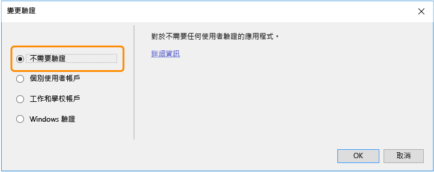

	您正在建立的範例應用程式無法讓使用者登入。[後續步驟](#next-steps)一節會連結到實作驗證和授權的教學課程。

5. 在 [新增 ASP.NET 專案] 對話方塊中，讓 [Microsoft Azure] 下的設定保持不變，然後按一下 [確定]。

	![[New ASP.NET Project] 對話方塊](./media/web-sites-dotnet-get-started/GS13newaspnetprojdb.png)

	預設設定會指定 Visual Studio 將為您的 Web 專案建立 Azure Web 應用程式。在教學課程的下一節中，您會將 Web 專案部署至新建立的 Web 應用程式。

5. 如果您尚未登入 Azure，Visual Studio 會提示您登入。使用您用來管理 Azure 訂用帳戶之帳戶的識別碼和密碼來登入。

	當您登入時，[設定 Microsoft Azure Web 應用程式設定] 對話方塊會詢問您要建立哪些資源。

	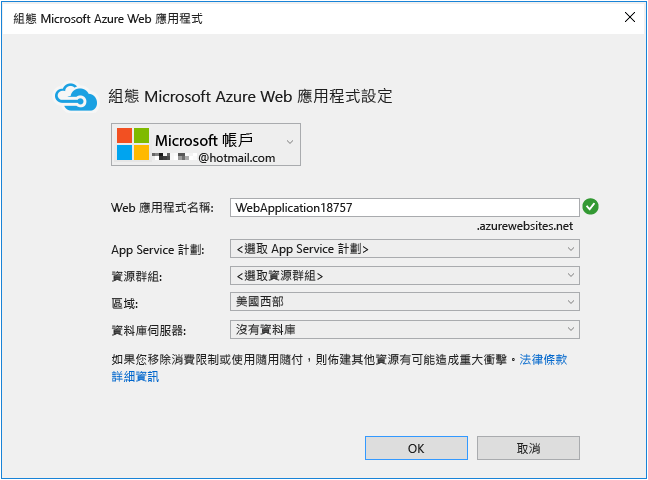

3. 在 [設定 Microsoft Azure Web 應用程式設定] 對話方塊中，輸入在 *azurewebsites.net* 網域中唯一的 **Web 應用程式名稱**。例如，您可以將它命名為 MyExample 並於右邊加上數字，使其成為唯一的名稱，例如 MyExample810。如果預設的 Web 名稱針對您所建立，則它將是唯一的，且您可以使用該名稱。

	如果有其他人使用了您輸入的名稱，您就會在右邊看到紅色驚嘆號，而不是綠色勾號，這代表您需要輸入不同的名稱。

	Azure 將使用這個名稱做為應用程式 URL 的前置詞。完整的 URL 組合是這個名稱加上 *.azurewebsites.net* (如 [Web 應用程式名稱] 文字方塊旁所示)。例如，若名稱為 `MyExample810`，URL 會是 `MyExample810.azurewebsites.net`。URL 必須是唯一的。

4. 在 [App Service 方案] 下拉式清單中，選取 [建立新的 App Service 方案]。

	[後續步驟](#next-steps)一節含有 App Service 方案相關資訊的連結。

5. 針對方案名稱輸入 **MyExamplePlan** 或其他您偏好使用的名稱。

6. 在 [資源群組] 下拉式清單中，選取 [建立新的資源群組]。

	[後續步驟](#next-steps)一節含有資源群組相關資訊的連結。

5. 針對資源群組名稱輸入 **MyExampleGroup** 或其他您偏好使用的名稱。

5. 在 [區域] 下拉式清單中，選擇最接近您的位置。

	這個設定會指定 Web 應用程式將執行所在的 Azure 資料中心。您可以在本教學課程中選取任何區域，這不會造成顯著的差異。但是對於生產環境 Web App，您的 Web 伺服器應盡可能靠近存取您網站的瀏覽器，以將[延遲](http://www.bing.com/search?q=web%20latency%20introduction&qs=n&form=QBRE&pq=web%20latency%20introduction&sc=1-24&sp=-1&sk=&cvid=eefff99dfc864d25a75a83740f1e0090)降到最低。

5. 保留資料庫欄位不變。

	在本教學課程中，您不會使用資料庫。[後續步驟](#next-steps)小節會提供示範如何使用資料庫的教學課程連結。

6. 按一下 [確定]。

	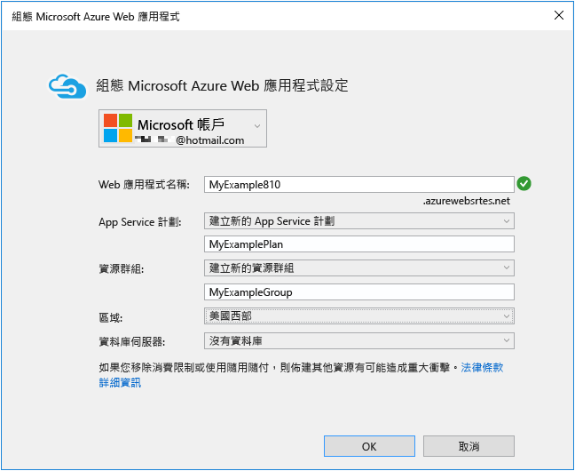

	在數秒後，Visual Studio 會在您指定的資料夾中建立 Web 專案，並在您指定的 Azure 區域中建立 Web 應用程式。

	[方案總管] 視窗會顯示新專案中的檔案和資料夾。

	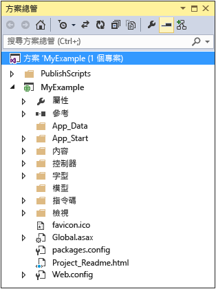

	[Azure App Service 活動] 視窗會顯示已建立 Web 應用程式。

	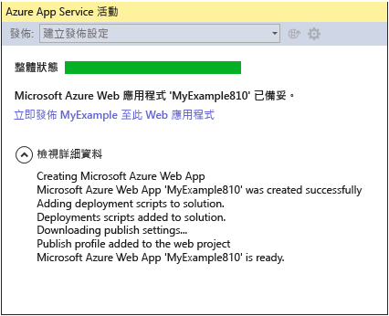

	因此，您可以在 [伺服器總管] 中檢視該 Web 應用程式。

	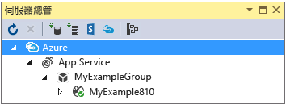

## 將專案部署至 Web App

在本節中，您會將 Web 專案部署到 Web App，如圖表中的步驟 2 所示。

7. 在 [Azure App Service 活動] 視窗中，按一下 [立即將 MyExample 發行至這個 Web 應用程式]。

	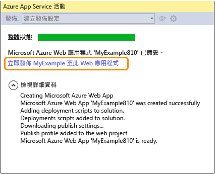

	[發佈 Web] 精靈會在數秒後出現。

	Visual Studio 要將您的專案部署至 Azure 所需的設定，已儲存在*發行設定檔*中。您可以使用此精靈來檢閱及變更這些設定。

8. 在 [發佈 Web] 精靈的 [連接] 索引標籤中，按 [下一步]。

	Visual Studio 提供您部署至 Azure Web 應用程式所需的所有設定。

	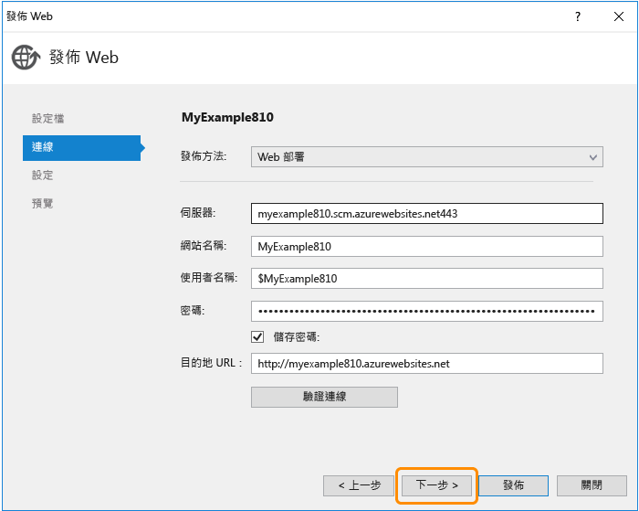

10. 在 [設定] 索引標籤中，按 [下一步]。

	您可以接受 [組態] 和 [檔案發行選項] 的預設值。

	您可以使用 [組態] 下拉式清單，來部署用於遠端偵錯的偵錯組建。[後續步驟](#next-steps)一節會連結至說明如何從遠端以偵錯模式執行 Visual Studio 的教學課程。

	![[設定] 索引標籤](./media/web-sites-dotnet-get-started/GS13SettingsTab.png)

11. 在 [預覽] 索引標籤中，按一下 [發佈]。

	如果您想要查看哪些檔案會複製到 Azure，可以按一下 [開始預覽]，然後按一下 [發佈]。

	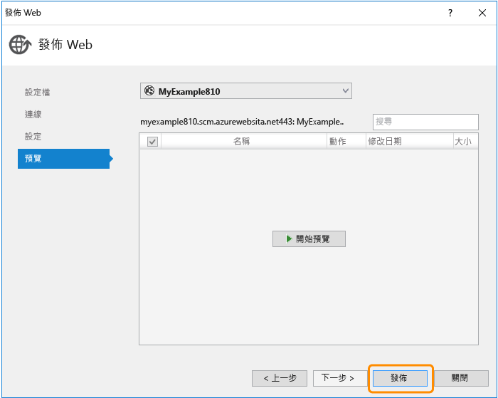

	Visual Studio 隨即開始進行將檔案複製至 Azure 伺服器的程序。

	[輸出] 與 [Azure App Service 活動] 視窗會顯示已採取的部署動作，並報告部署作業已順利完成。

	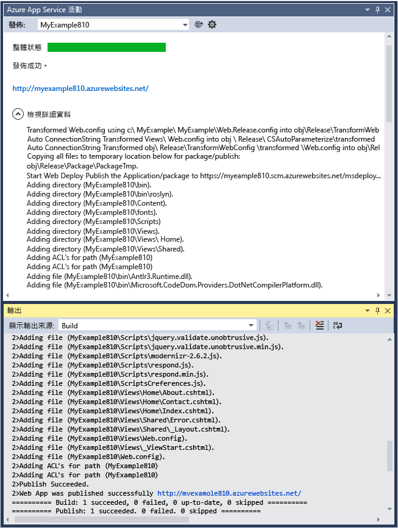

	部署成功時，即會自動在預設瀏覽器中開啟已部署之 Web 應用程式的 URL，而您建立的應用程式現在正在雲端中執行。瀏覽器網址列中的 URL 會顯示 Web 應用程式是從網際網路載入。

	

13. 關閉瀏覽器。

## 進行變更並重新部署

本教學課程章節是選擇性的。您將會變更首頁的 **h1** 標題、在開發電腦上本機執行專案以驗證變更，然後將變更部署至 Azure。

2. 在 [方案總管] 中開啟 **Views/Home/Index.cshtml** 或 **.vbhtml** 檔案，將 **h1** 標題從 "ASP.NET" 變更為 "ASP.NET and Azure"，並儲存檔案。

	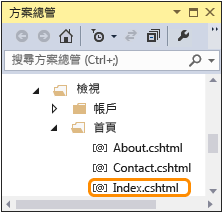

	

1. 在本機電腦上執行 Web 應用程式，然後按 CTRL+F5 檢視更新的標題。

	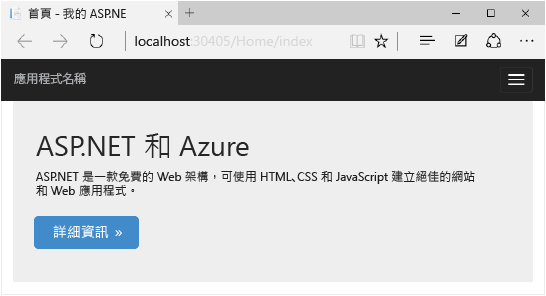

	`localhost` URL 顯示它正在本機電腦上執行。根據預設，它會在 IIS Express 中執行，其為 IIS 的輕量型版本，專為在 Web 應用程式開發期間使用而設計。

1. 關閉瀏覽器。

1. 在 [方案總管] 中以滑鼠右鍵按一下專案，再選擇 [發行]。

	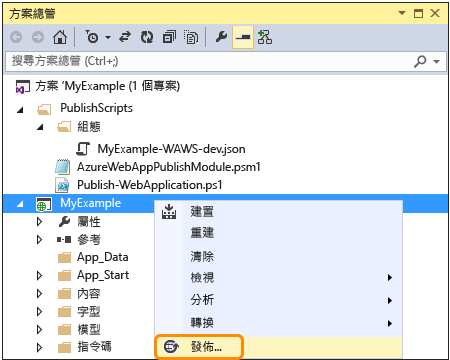

	[發佈 Web] 精靈的 [預覽] 索引標籤隨即出現。以往如果需要變更任何發佈設定，您會選擇不同的索引標籤，但現在您只需要使用相同的設定來重新部署。

2. 在 [發行 Web] 精靈中，按一下 [發行]。

	

	Visual Studio 會將專案部署至 Azure，並在預設瀏覽器中開啟 Web 應用程式。

	

**提示：**您可以啟用 [Web 單鍵發行] 工具列，以加快部署速度。按一下 [檢視] > [工具列]，然後選取 [Web 單鍵發佈]。您可以使用工具列來選取設定檔、按一下按鈕來發佈，或按一下按鈕來開啟 [發佈 Web] 精靈。

## 在 Azure 入口網站中監控及管理 Web 應用程式

[Azure 入口網站](/services/management-portal/)是您可以用來管理及監控 Azure 服務 (例如，您剛建立的 Web App) 的 Web 介面。在教學課程的這一節中，您會了解可在入口網站中執行的一些作業。

1. 在瀏覽器中，移至 [https://portal.azure.com](https://portal.azure.com)，然後以您的 Azure 認證登入。

2. 按一下 [全部瀏覽] > [Web Apps]，然後按一下 Web App 的名稱。

	[Web App] 刀鋒視窗會顯示 Web App 的設定和使用量統計資料概觀。

	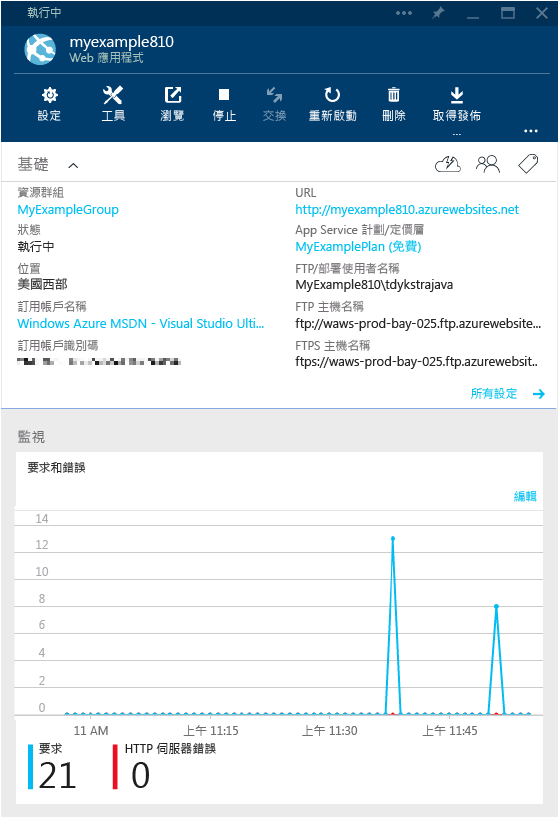

	此時您的 Web 應用程式並沒有太多流量，且在圖形中可能不會顯示任何項目。如果您瀏覽至應用程式，請重新整理頁面數次，然後重新整理入口網站頁面，您就能看見某些統計資料。

3. 按一下 [設定]，以查看更多可用來設定 Web App 的選項。

	您會看到一份設定類型清單。

	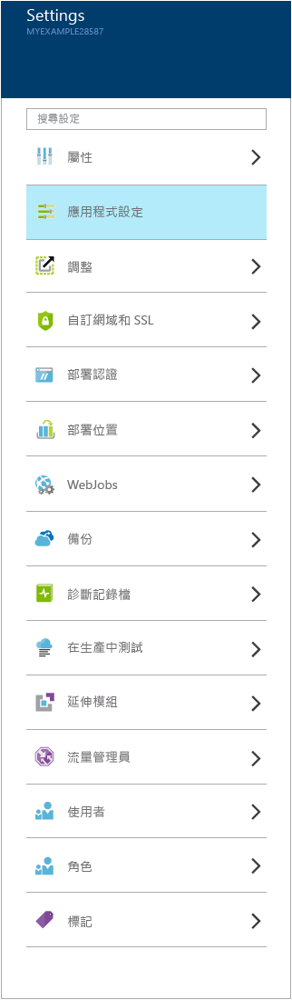

4. 按一下 [應用程式設定]，以查看您可以在入口網站中設定的設定種類範例。

	例如，您可以控制適用於 Web App 的 .NET 版本、啟用像是 [WebSockets](/blog/2013/11/14/introduction-to-websockets-on-windows-azure-web-sites/) 的功能、設定[連接字串值](/blog/2013/07/17/windows-azure-web-sites-how-application-strings-and-connection-strings-work/)等動作。

	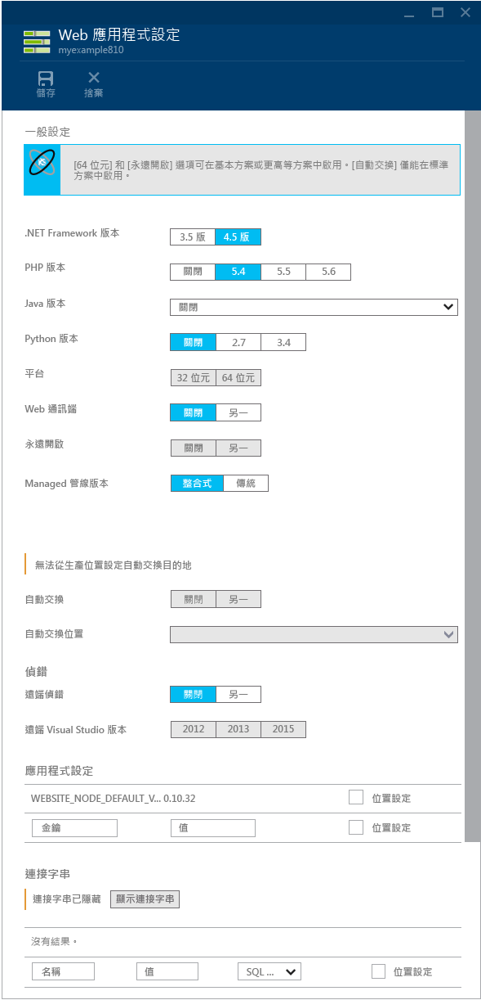

這些只是入口網站的部分功能。您也可以建立新的 Web 應用程式、刪除現有的 Web 應用程式、停止及重新啟動 Web 應用程式，以及管理其他類型的 Azure 服務，例如資料庫和虛擬機器。

## 後續步驟

在本教學課程中，您已了解如何建立簡易的 Web 應用程式，並將其部署至 Azure Web 應用程式。以下是有助於您深入了解 Azure App Service 中 Web 應用程式的一些相關主題和資源。

* 部署 Web 專案的其他方式

	在本教學課程中，您看到在同一個作業中建立並部署 Web 應用程式的最快速方式。如需如何使用 Visual Studio 或透過[來源控制系統](http://www.asp.net/aspnet/overview/developing-apps-with-windows-azure/building-real-world-cloud-apps-with-windows-azure/continuous-integration-and-continuous-delivery)來[自動化部署](http://www.asp.net/aspnet/overview/developing-apps-with-windows-azure/building-real-world-cloud-apps-with-windows-azure/source-control)的其他部署方式概觀，請參閱[如何部署 Azure Web 應用程式](web-sites-deploy.md)。

	Visual Studio 也可產生您可以用來將部署自動化的 Windows PowerShell 指令碼。如需詳細資訊，請參閱[自動化各個項目 (使用 Azure 建置真實世界的雲端應用程式)](http://www.asp.net/aspnet/overview/developing-apps-with-windows-azure/building-real-world-cloud-apps-with-windows-azure/automate-everything) (英文)。

* 如何在 Visual Studio 中管理 Web 應用程式

	如需可在 [伺服器總管] 中執行之 Web 應用程式管理功能的相關資訊，請參閱[在 Visual Studio 中疑難排解 Azure Web 應用程式](web-sites-dotnet-troubleshoot-visual-studio.md)。

* 如何疑難排解 Web 應用程式

	Visual Studio 提供的功能，讓您能輕鬆檢視即時產生的 Azure 記錄。您也可以在 Azure 中遠端執行偵錯模式。如需詳細資訊，請參閱[在 Visual Studio 中疑難排解 Azure Web 應用程式](web-sites-dotnet-troubleshoot-visual-studio.md)。

* 如何新增資料庫與授權功能

	如需觀看教學課程來了解如何存取資料庫以及將某些應用程式功能限定給授權使用者，請參閱[將使用成員資格、OAuth 和 SQL Database 的安全 ASP.NET MVC 應用程式部署至 Azure Web 應用程式](/develop/net/tutorials/web-site-with-sql-database/)。

* 如何新增自訂網域名稱和 SSL

	如需如何使用 SSL 和您自己的網域 (例如 www.contoso.com，而非 contoso.azurewebsites.net) 的相關資訊，請參閱下列資源：

	* [在 Azure App Service 中設定自訂網域名稱](web-sites-custom-domain-name.md)
	* [對 Azure 網站啟用 HTTPS](web-sites-configure-ssl-certificate.md)

* 如何避免閒置逾時之後的喚醒等待時間

	根據預設，Web 應用程式如果閒置一段時間，就會卸載。卸載 Web 應用程式後的第一個要求必須等待 Web 應用程式重新載入。若要避免這種等待時間，您可以啟用 AlwaysOn 功能。如需詳細資訊，請參閱[如何設定 Web App](web-sites-configure.md) 中的組態選項。

* 如何新增即時功能，例如交談

	如果您的 Web App 將包含即時功能 (例如，交談服務、遊戲或股市行情)，您可以使用 [ASP.NET SignalR](http://www.asp.net/signalr) 與 [WebSockets](/blog/2013/11/14/introduction-to-websockets-on-windows-azure-web-sites/) 傳輸方法來獲得最佳效能。如需詳細資訊，請參閱[搭配使用 SignalR 和 Azure Web 應用程式](http://www.asp.net/signalr/overview/signalr-20/getting-started-with-signalr-20/using-signalr-with-windows-azure-web-sites)。

* 如何在 App Service、Azure 雲端服務和 Web 應用程式的 Azure 虛擬機器之間進行選擇

	在 Azure 中，您可以在 App Service Web Apps 中執行 Web 應用程式 (如本教學課程所示)，或在雲端服務或虛擬機器中執行。如需詳細資訊，請參閱 [Azure Web App、雲端服務和 VM：每一項的使用時機](/manage/services/web-sites/choose-web-app-service/)。

* [如何選擇或建立 App Service 方案](../app-service/azure-web-sites-web-hosting-plans-in-depth-overview.md)

* [如何選擇或建立資源群組](../azure-preview-portal-using-resource-groups.md)

## 變更的項目
* 如需從網站變更為 App Service 的指南，請參閱 [Azure App Service 及現有的 Azure 服務](http://go.microsoft.com/fwlink/?LinkId=529714)。
* 如需從舊的入口網站變更為新入口網站的指南，請參閱[瀏覽 Azure 入口網站的參考](http://go.microsoft.com/fwlink/?LinkId=529715)。

<!---HONumber=Sept15_HO4-->