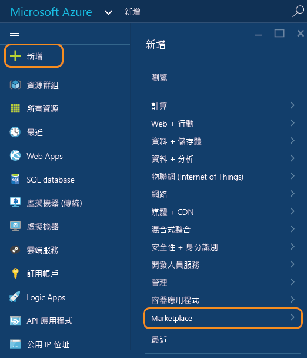
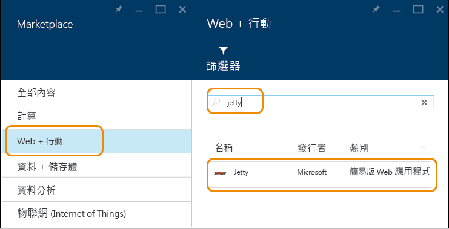
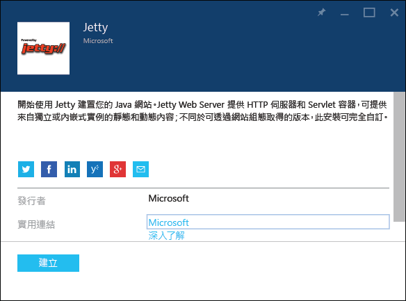
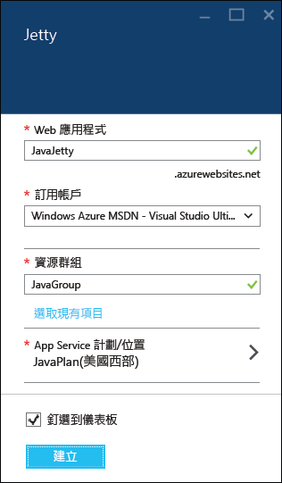
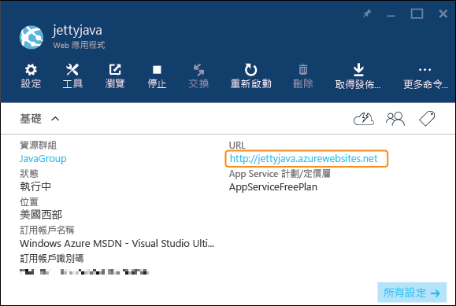

<properties
	pageTitle="Creare un'app Web Java in Azure App Service | Microsoft Azure"
	description="Questa esercitazione illustra come distribuire un'app Web Java nel servizio app di Azure."
	services="app-service\web"
	documentationCenter="java"
	authors="rmcmurray"
	manager="wpickett"
	editor="jimbe"/>
<tags
	ms.service="app-service-web"
	ms.workload="web"
	ms.tgt_pltfrm="na"
	ms.devlang="Java"
	ms.topic="hero-article"
	ms.date="08/31/2015"
	ms.author="robmcm"/>

# Creazione di un'app Web Java nel servizio app di Azure

> [AZURE.SELECTOR]
- [.Net](web-sites-dotnet-get-started.md)
- [Node.js](web-sites-nodejs-develop-deploy-mac.md)
- [Java](web-sites-java-get-started.md)
- [PHP - Git](web-sites-php-mysql-deploy-use-git.md)
- [PHP - FTP](web-sites-php-mysql-deploy-use-ftp.md)
- [Python](web-sites-python-ptvs-django-mysql.md)

Questa esercitazione illustra come creare un'[app Web Java nel servizio app di Azure](http://go.microsoft.com/fwlink/?LinkId=529714) tramite il portale di anteprima di Azure. È possibile scegliere un modello di app Web in Azure Marketplace o creare un'app Web generica e configurarla manualmente per Java.

Se non si vuole usare nessuna di queste tecniche, ad esempio perché si preferisce personalizzare il proprio contenitore di applicazioni, vedere [Caricare un'app Web Java personalizzata in Azure](web-sites-java-custom-upload.md).

> [AZURE.NOTE]Per completare l'esercitazione, è necessario un account Microsoft Azure. Se non si dispone di un account, è possibile [attivare i benefici della sottoscrizione MSDN][] oppure [iscriversi per ottenere una versione di valutazione gratuita][].
>
> Per iniziare a usare Servizio app di Azure prima di registrarsi per ottenere un account Azure, passare alla pagina [Prova il servizio app][]. In questa pagina è possibile creare immediatamente un'app Web iniziale temporanea in App Service. Non è necessario fornire una carta di credito né impegnarsi in alcun modo.

## Scegliere un modello di app Web da Azure Marketplace

Questa sezione illustra come usare Azure Marketplace per creare un'app Web Java.

1. Accedere al [portale di anteprima di Azure](https://portal.azure.com/).

2. Fare clic su **Nuovo > Marketplace**.

	

5. Fare clic su **Web e dispositivi mobili**.

	Potrebbe essere necessario scorrere verso sinistra per vedere il pannello **Marketplace** dove è possibile selezionare **Web e dispositivi mobili**.

6. Nella casella di testo di ricerca immettere il nome di un server applicazioni Java, ad esempio **Apache Tomcat** o **Jetty** e quindi premere INVIO.

4. Nei risultati della ricerca fare clic sul server applicazioni Java.

	

5. Nel primo pannello **Apache Tomcat** o **Jetty** fare clic su **Crea**.

	

4. Nel pannello successivo **Apache Tomcat** o **Jetty** immettere un nome per l'app Web nella casella **App Web**.

	Il nome deve essere univoco nel dominio azurewebsites.net perché l'URL dell'app Web sarà {nome}.azurewebsites.net. Se il nome immesso non è univoco, nella casella di testo verrà visualizzato un punto esclamativo rosso.

5. Selezionare un **Gruppo di risorse** o crearne uno nuovo.

	Per altre informazioni sui gruppi di risorse, vedere [Uso del portale di anteprima di Azure per gestire le risorse di Azure](../resource-group-portal.md).

5. Selezionare un **Piano di servizio app/Località** o crearne uno nuovo.

	Per altre informazioni sui piani del servizio app, vedere [Panoramica approfondita dei piani del servizio app di Azure](../azure-web-sites-web-hosting-plans-in-depth-overview.md).

6. Fare clic su **Crea**.

	

	In meno di un minuto Azure completa la creazione della nuova app Web.

7. Fare clic su **App Web > {nuova app Web personale}**.

8. Fare clic su **URL** per passare al nuovo sito.

	

	Se si è scelto Tomcat, viene visualizzata una pagina simile all'esempio seguente.

	

	Se si è scelto Jetty, viene visualizzata una pagina simile all'esempio seguente.

	

Ora che è stata creata un'app Web con un contenitore per le app, vedere la sezione [Passaggi successivi](#next-steps) per informazioni su come caricare l'applicazione nell'app Web.

## Creare un'app Web e configurarla manualmente per Java

Questa sezione illustra come creare un'app Web e configurarla manualmente per Java.

1. Accedere al [portale di anteprima di Azure](https://portal.azure.com/).

2. Fare clic su **Nuovo > Web e dispositivi mobili**.

6. Fare clic su **App Web**.

4. Immettere un nome per l'app Web nella casella **App Web**.

	Il nome deve essere univoco nel dominio azurewebsites.net perché l'URL dell'app Web sarà {nome}.azurewebsites.net. Se il nome immesso non è univoco, nella casella di testo verrà visualizzato un punto esclamativo rosso.

5. Selezionare un **Gruppo di risorse** o crearne uno nuovo.

	Per altre informazioni sui gruppi di risorse, vedere [Uso del portale di anteprima di Azure per gestire le risorse di Azure](../resource-group-portal.md).

5. Selezionare un **Piano di servizio app/Località** o crearne uno nuovo.

	Per altre informazioni sui piani del servizio app, vedere [Panoramica approfondita dei piani del servizio app di Azure](../azure-web-sites-web-hosting-plans-in-depth-overview.md).

6. Fare clic su **Crea**.
 
11. Una volta creata l'app Web, fare clic su **App Web > {app Web personale}**.
 
13. Nel pannello **App Web** fare clic su **Impostazioni**.

12. Fare clic su **Impostazioni applicazione**.

13. Scegliere la **Versione Java** desiderata.

14. Selezionare il **Contenitore Web** desiderato.

15. Fare clic su **Salva**.

	Dopo alcuni secondi, l'app Web diventerà basata su Java.

7. Fare clic su **App Web > {nuova app Web personale}**.

8. Fare clic su **URL** per passare al nuovo sito.

	La pagina Web conferma che è stata creata un'app Web basata su Java.

## Passaggi successivi

A questo punto è disponibile un server applicazioni Java in esecuzione nell'app Web nel servizio app di Azure. Per distribuire codice personalizzato all'app Web, vedere [Aggiungere un'applicazione o una pagina Web a un'app Web Java](web-sites-java-add-app.md).

Per altre informazioni sullo sviluppo di applicazioni Java in Azure, vedere il [Centro per sviluppatori Java](/develop/java/).

<!-- External Links -->
[attivare i benefici della sottoscrizione MSDN]: http://go.microsoft.com/fwlink/?LinkId=623901
[iscriversi per ottenere una versione di valutazione gratuita]: http://go.microsoft.com/fwlink/?LinkId=623901

[Prova il servizio app]: http://go.microsoft.com/fwlink/?LinkId=523751

<!---HONumber=Oct15_HO4-->