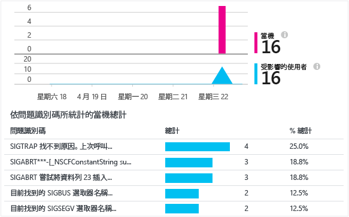

<properties
    pageTitle="Android 應用程式的分析 | Microsoft Azure"
    description="分析 Android 應用程式的使用情况和效能。"
    services="application-insights"
    documentationCenter="android"
    authors="alancameronwills"
    manager="douge"/>

<tags
    ms.service="application-insights"
    ms.workload="mobile"
    ms.tgt_pltfrm="mobile-android"
    ms.devlang="na"
    ms.topic="get-started-article"
	ms.date="11/14/2015"
    ms.author="awills"/>

# Android 應用程式的分析

Visual Studio Application Insights 可讓您監視行動應用程式的使用量、事件及當機。

> [AZURE.NOTE]我們建議使用 [HockeyApp](http://support.hockeyapp.net/kb/client-integration-android/hockeyapp-for-android-sdk) 來獲得當機報告、分析、散發和意見反應管理。

## 需求

您需要：

* [Microsoft Azure](http://azure.com) 訂用帳戶。您使用 Microsoft 帳戶登入，可能是針對 Windows、XBox Live 或其他 Microsoft 雲端服務具備的帳戶。
* Android Studio
* Android SDK 版本 9 或更新版本。

## 建立 Application Insights 資源

在 [Azure 入口網站][portal] 中，建立新的 Application Insights 資源。選取 [Android] 選項。

![按一下 [新增]、[開發人員服務]、[Application Insights]](./media/app-insights-android/11-new.png)

開啟的刀鋒視窗是您要查看您的應用程式效能和使用量資料的位置。若要在下次登入 Azure 時回到此位置，您應該會在開始畫面上發現它的磚。或者按一下 [瀏覽] 以尋找它。

## 設定

請遵循[設定指南](https://github.com/Microsoft/ApplicationInsights-Android#-3-setup)。


## 使用 SDK

初始化 SDK，並開始追蹤遙測。

將下列匯入新增至您 App 的根活動：

```java

     import com.microsoft.applicationinsights.library.ApplicationInsights;
```

並且將下列程式碼加入至活動的 `onCreate` 回呼：

```java

    ApplicationInsights.setup(this.getApplicationContext(), this.getApplication());
    ApplicationInsights.start();
```

一旦呼叫 `ApplicationInsights.start()` 之後，SDK 就會開始追蹤 android 生命週期活動和任何未處理的例外狀況。

> [AZURE.NOTE]應用程式生命週期事件只會在 Android SDK 15 版以上 (冰淇淋三明治+) 收集。

此外，可以收集自訂事件、追蹤、度量和處理的例外狀況。使用任一個 [Application Insights API][api] 來傳送遙測。

* TrackEvent(eventName) 用於其他使用者動作
* TrackTrace(logEvent) 用於[診斷記錄][diagnostic]
* TrackHandledException(exception) 用在 catch 子句中
* TrackMetric(name, value) 用在背景工作，以傳送未附加到特定事件之度量的一般報告

下列程式碼是初始化和手動遙測集合的範例：

```java

    public class MyActivity extends Activity {

      @Override
      protected void onCreate(Bundle savedInstanceState) {

        ApplicationInsights.setup(this);
        //... other initialization code ...//
        ApplicationInsights.start();

        // track telemetry data
        TelemetryClient client = TelemetryClient.getInstance();
        HashMap<String, String> properties = new HashMap<String, String>();
        properties.put("property1", "my custom property");
        client.trackEvent("sample event", properties);
        client.trackTrace("sample trace");
        client.trackMetric("sample metric", 3);
        client.trackHandledException(new Exception("sample exception"));
      }
    }
```

## <a name="run"></a>執行專案

執行您的應用程式 (在 Windows 中按 SHIFT+F10、在 OS X 中按 CTRL+R) 以產生遙測。

## 在 Application Insights 中檢視資料

返回 http://portal.azure.com 並且瀏覽至您的 Application Insights 資源。

按一下 [搜尋] 以開啟 [診斷搜尋][diagnostic] - 這是前幾個事件顯示的位置。如果您看不到任何資料，請稍做等待後再按一下 [重新整理]。

![按一下 [診斷搜尋]](./media/app-insights-android/21-search.png)

使用您的 App 時，[概觀] 刀鋒視窗上會顯示資料。

![[概觀] 刀鋒視窗](./media/app-insights-android/22-oview.png)

按一下任何圖表以查看詳細資料。例如，當機：




## <a name="usage"></a>後續步驟

[追蹤應用程式的使用量][track]

[診斷搜尋][diagnostic]

[計量瀏覽器][metrics]

[疑難排解][qna]


<!--Link references-->

[api]: app-insights-api-custom-events-metrics.md
[diagnostic]: app-insights-diagnostic-search.md
[metrics]: app-insights-metrics-explorer.md
[portal]: http://portal.azure.com/
[qna]: app-insights-troubleshoot-faq.md
[track]: app-insights-api-custom-events-metrics.md

<!---HONumber=Nov15_HO4-->