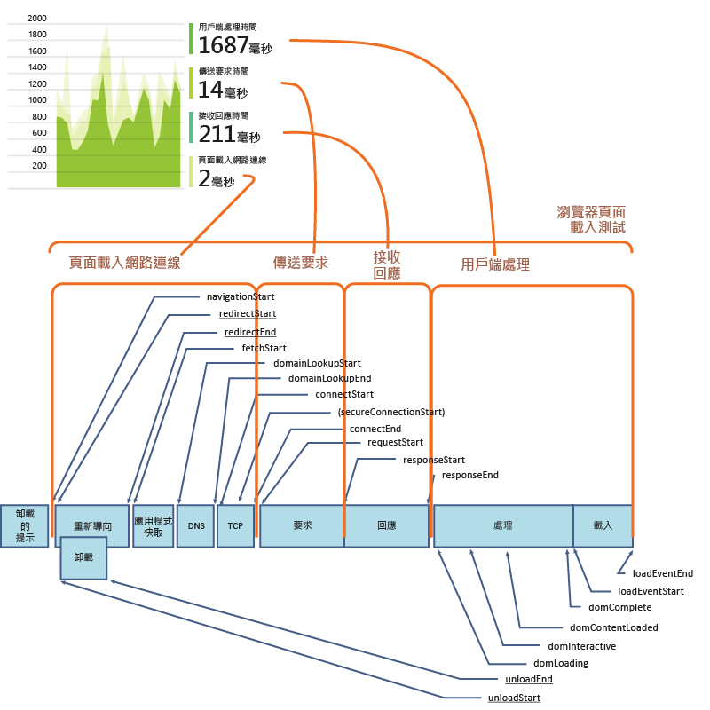
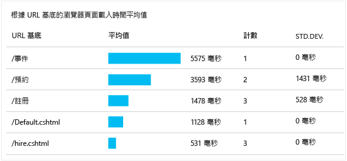
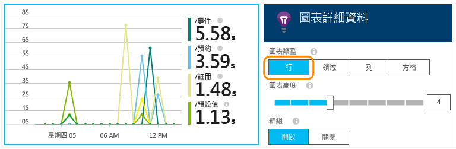
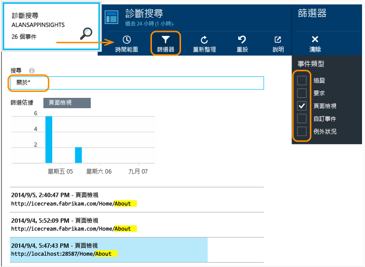

<properties
	pageTitle="JavaScript Web App 適用的 Application Insights | Microsoft Azure"
	description="取得頁面檢視和工作階段計數、Web 用戶端資料，並追蹤使用量模式。Detect exceptions and performance issues in JavaScript web pages."
	services="application-insights"
    documentationCenter=""
	authors="alancameronwills"
	manager="douge"/>

<tags
	ms.service="application-insights"
	ms.workload="tbd"
	ms.tgt_pltfrm="ibiza"
	ms.devlang="na"
	ms.topic="get-started-article"
	ms.date="02/19/2016"
	ms.author="awills"/>

# 適用於網頁的 Application Insights

[AZURE.INCLUDE [app-insights-selector-get-started-dotnet](../../includes/app-insights-selector-get-started-dotnet.md)]

了解您的網頁或應用程式的效能和使用量。將 Visual Studio Application Insights 新增至您的頁面指令碼，您會取得頁面載入的時間和 AJAX 呼叫、計數和瀏覽器例外狀況與 AJAX 失敗的詳細資料，以及使用者和工作階段的計數。這些項目可以依據頁面、用戶端作業系統和瀏覽器版本、地區位置和其他維度分割。您也可以對失敗計數或緩慢頁面載入設定警示。

您可以在任何網頁中使用 Application Insights - 您剛剛加入 JavaScript 的簡短片段。如果您的 Web 服務是 [Java](app-insights-java-get-started.md) 或 [ASP.NET](app-insights-asp-net.md)，您可以整合來自您的伺服器和用戶端的遙測。

您將需要 [Microsoft Azure](https://azure.com) 訂用帳戶。如果您的小組擁有組織訂用帳戶，請洽詢擁有者將您的 Microsoft 帳戶新增至其中。有免費定價層，因此開發和小規模的使用不需要任何成本。

## 為您的網頁設定 Application Insights

您可能已經擁有它。如果您的應用程式是新的 ASP.NET 專案，而且您選擇在 Visual Studio 中的 [新增專案] 對話方塊加入 Application Insights，指令碼即已加入，您就已經完成所有設定。

否則，您必須在網頁加入程式碼片段，如下所示。

### 開啟 Application Insights 資源

Application Insights 資源是您的頁面的效能和使用量相關資料顯示的位置。

登入 [Azure 入口網站](https://portal.azure.com)。

如果您已經設定好應用程式伺服器端的監視，您已經擁有資源：

![選擇 [瀏覽]、[開發人員服務]、[Application Insights]。](./media/app-insights-javascript/01-find.png)

如果您沒有資源，請建立資源：

![選擇 [新增]、[開發人員服務]、[Application Insights]。](./media/app-insights-javascript/01-create.png)

*已經有問題了嗎？* [建立資源的詳細資訊](app-insights-create-new-resource.md)。

### 將 SDK 指令碼加入至您的應用程式或網頁

在快速入門中，取得網頁指令碼：

![在您的應用程式概觀刀鋒視窗中，選擇 [快速入門]，取得程式碼以監視我的網頁。複製指令碼。](./media/app-insights-javascript/02-monitor-web-page.png)

在您想要追蹤的每一頁的 `<head>` 標記之前插入指令碼。如果您的網站有主版頁面，您可以那裡放入指令碼。例如：

* 在 ASP.NET MVC 專案中，可放在 `View\Shared\_Layout.cshtml` 中
* 在 SharePoint 網站中，在控制台中開啟[站台設定/主要頁面](app-insights-sharepoint.md)。

指令碼包含檢測金鑰，會將資料導向您的 Application Insights 資源。

([進一步說明指令碼。](http://apmtips.com/blog/2015/03/18/javascript-snippet-explained/))

*(如果您使用的是已知網頁架構，請在 Application Insights 配接器附近尋找。例如，有 [AngularJS 模組](http://ngmodules.org/modules/angular-appinsights)。)*

## 詳細組態

您可以設定數種[參數](https://github.com/Microsoft/ApplicationInsights-JS/blob/master/API-reference.md#config)，但是在大部分情況下，您應該不需要這麼做。例如，您可以停用或限制每個頁面檢視報告的 Ajax 呼叫的數目 (以減少流量)；或者您可以設定偵錯模式，讓遙測透過管線迅速移動而不需要批次處理。

若要設定這些參數，在程式碼片段中尋找這一行，並在後面加入多個以逗號分隔的項目：

    })({
      instrumentationKey: "..."
      // Insert here
    });

[可用參數](https://github.com/Microsoft/ApplicationInsights-JS/blob/master/API-reference.md#config)包括：

    // Send telemetry immediately without batching.
    // Remember to remove this when no longer required, as it
    // can affect browser performance.
    enableDebug: true,

    // Don't log browser exceptions.
    disableExceptionTracking: true,

    // Limit number of Ajax calls logged, to reduce traffic.
    maxAjaxCallsPerView: 10, // default is 500

    // Set these dynamically for an authenticated user.
    appUserId: string,
    accountId: string,

## 執行您的應用程式

執行您的 Web 應用程式，稍微使用一下來產生遙測，並等候數秒鐘。您可以在開發電腦上使用 **F5** 執行應用程式，或發佈應用程式讓使用者處理。

如果您想要檢查 Web 應用程式傳送至 Application Insights 的遙測，請使用您瀏覽器的偵錯工具 (在許多瀏覽器上為 **F12**)。資料會傳送至 dc.services.visualstudio.com。

## 探索瀏覽器效能資料

開啟瀏覽器刀鋒視窗，以顯示使用者瀏覽器的彙總效能資料。

![在 portal.azure.com 中，開啟您的應用程式資源然後按一下 [設定]、[瀏覽器]。](./media/app-insights-javascript/03.png)

*仍沒有資料？ 按一下頁面頂端的 [**重新整理**]。仍然沒有嗎？ 請參閱[疑難排解](app-insights-troubleshoot-faq.md)。*

[瀏覽器] 刀鋒視窗是[計量瀏覽器刀鋒視窗](app-insights-metrics-explorer.md)，具有預設篩選器與圖表選項。如果您想要的話，可以編輯時間範圍、篩選器和圖表組態，並將結果儲存為我的最愛。按一下 [還原預設值] 以返回原始刀鋒視窗組態。

## 頁面載入效能

最上層是頁面載入時間的分段圖表。圖表高度總計表示從您的應用程式載入頁面並且在您的使用者瀏覽器中顯示頁面的平均時間。時間是從瀏覽器傳送初始 HTTP 要求開始測量，直到已經處理所有同步載入事件，包括版面配置和執行中指令碼。不包含例如從 AJAX 呼叫載入 Web 組件的非同步工作。

圖表會將總頁面載入時間分段為 [W3C 所定義的標準時間](http://www.w3.org/TR/navigation-timing/#processing-model)。

請注意，*網路連接*時間通常低於您所預期的時間，因為它是從瀏覽器到伺服器之所有要求的平均值。許多個別要求的連接時間為 0，因為已經有與伺服器的作用中連線。

### 載入緩慢？

頁面載入緩慢是您的使用者不滿的主要來源。如果圖表指出頁面載入緩慢，很容易就能執行某些診斷研究。

圖表會顯示您的應用程式中所有頁面載入的平均時間。若要查看問題是否僅限於特定頁面，請進一步查看刀鋒視窗，其中有依據網頁 URL 分段的方格：

請注意頁面檢視計數和標準差。如果頁面計數非常低，則問題不太會影響使用者。高的標準差 (相當於平均值本身) 表示個別測量之間的變化。

**放大某個 URL 和整頁檢視。** 按一下任何頁面名稱，即可查看針對該 URL 篩選的瀏覽器圖表的刀鋒視窗，接著是網頁檢視的執行個體。

按一下 `...` 以取得該事件之屬性的完整清單，或檢查 Ajax 呼叫和相關的事件。如果它們是同步的，緩慢的 Ajax 呼叫會影響整體頁面載入時間。相關的事件包含伺服器要求相同的 URL (如果您已在 Web 伺服器上設定 Application Insights)。

**經過一段時間的網頁效能。** 回到 [瀏覽器] 刀鋒視窗，將 [頁面檢視載入時間] 方格變更為折線圖，以查看在特定時間是否有尖峰：

**依據其他維度來分段。** 或許您的網頁在特定瀏覽器、用戶端作業系統或使用者位置載入時較緩慢？ 加入具有 **Group-by** 維度的圖表和實驗。

## AJAX 效能

請確定您的網頁中的任何 AJAX 呼叫執行狀況良好。它們通常是用來以非同步方式填入網頁的組件。雖然可能會立即載入整個網頁，您的使用者可能會對於盯著空白網頁組件，等候其中的資料出現感到挫折。

從您的網頁進行的 AJAX 呼叫會顯示在 [瀏覽器] 刀鋒視窗中做為相依項目。

在刀鋒視窗的上方有摘要圖表：

在下方有詳細方格：

按一下任何資料列以取得特定詳細資料。

> [AZURE.NOTE] 如果您刪除刀鋒視窗上的 [瀏覽器] 篩選器，伺服器和 AJAX 相依項目將包含在這些圖表中。按一下 [還原預設值] 以重新設定篩選器。

**若要深入失敗的 Ajax 呼叫**，請向下捲動至 [相依性失敗] 方格，然後按一下資料列以查看特定執行個體。

按一下 `...` 以取得 Ajax 呼叫的完整遙測。

### 未報告任何 Ajax 呼叫？

Ajax 呼叫包含從您的網頁指令碼所做的任何 HTTP 呼叫。如果您沒有看到這些報告，請檢查程式碼片段未設定 `disableAjaxTracking` 或 `maxAjaxCallsPerView` [參數](https://github.com/Microsoft/ApplicationInsights-JS/blob/master/API-reference.md#config)。

## 瀏覽器例外狀況

在 [瀏覽器] 刀鋒視窗上，有例外狀況摘要圖表，進一步的刀鋒視窗中有例外狀況類型的方格。

如果您沒有看到報告的瀏覽器例外狀況，請檢查程式碼片段未設定 `disableExceptionTracking` [參數](https://github.com/Microsoft/ApplicationInsights-JS/blob/master/API-reference.md#config)。

## 檢查個別的頁面檢視事件

頁面檢視遙測資料一般是由 Application Insights 進行分析，而您只會看見以所有使用者為單位平均計算的累積報告。然而在偵錯時，您也可以查看個別的頁面檢視事件。

在 [Diagnostic Search] 分頁中，將 [篩選器] 設定為 [網頁檢視]。

選取任一事件以查看詳細資料。在詳細資料頁面中，按一下 "..." 來查看更多詳細資料。

> [AZURE.NOTE] 如果您使用[搜尋](app-insights-diagnostic-search.md)，請注意，您必須比對完整字詞："Abou" 和 "bout" 與 "About" 不相符，但是 "Abou* " 相符。此外，您不能將萬用字元當做搜尋詞彙的開頭。例如，搜尋 "*bou" 將無法與 "About" 相符。

> [深入了解診斷搜尋](app-insights-diagnostic-search.md)

### 頁面檢視屬性

* **網頁檢視期間**：載入網頁並開始執行指令碼所花費的時間。具體來說，開始載入頁面及執行 trackPageView 之間的間隔。如果您在指令碼的初始設定之後將 trackPageView 從一般位置移走，它會反映不同的值。

## 自訂頁面計數

依預設，每當用戶端瀏覽器載入新頁面時，頁面計數便會發生。不過您也許會想要計算其他頁面檢視。例如，由於頁面可能會將內容顯示在索引標籤中，因此您想要在使用者切換索引標籤時計算一次頁面。抑或是頁面中的 JavaScript 程式碼可能會在未變更瀏覽器 URL 的情況下載入新內容。

請將與以下範例相似的 JavaScript 呼叫插入用戶端程式碼中的適當位置：

    appInsights.trackPageView(myPageName);

頁面名稱可能會含有與 URL 相同的字元，不過 "#" 或 "?" 之後的任何字元都將遭到忽略。

## 使用情況追蹤

想要了解使用者如何使用您的應用程式嗎？

* [深入了解使用情況追蹤](app-insights-web-track-usage.md)
* [深入了解自訂事件和計量 API](app-insights-api-custom-events-metrics.md)。

#### 影片：追蹤使用量

> [AZURE.VIDEO tracking-usage-with-application-insights]

##  後續步驟

* [追蹤流量](app-insights-web-track-usage.md)
* [自訂事件和計量](app-insights-api-custom-events-metrics.md)
* [Build-measure-learn](app-insights-overview-usage.md)

<!---HONumber=AcomDC_0224_2016-->