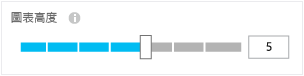

<properties
	pageTitle="使用 Application Insights 入口網站"
	description="使用 Application Insights 進行使用量分析的概觀"
	services="application-insights"
    documentationCenter=""
	authors="alancameronwills"
	manager="douge"/>

<tags
	ms.service="application-insights"
	ms.workload="tbd"
	ms.tgt_pltfrm="ibiza"
	ms.devlang="multiple"
	ms.topic="article" 
	ms.date="08/17/2015"
	ms.author="awills"/>

# 使用 Application Insights 入口網站

[在您的專案上設定 Application Insights](app-insights-get-started.md) 之後，有關應用程式效能和使用情況的遙測資料會出現在 [Azure 入口網站](https://portal.azure.com)之專案的 Application Insights 資源中。

## 在 Azure 中尋找您的遙測

登入 [Azure 入口網站](https://portal.azure.com)，並瀏覽至您為應用程式建立的 Application Insights 資源。

![按一下 [瀏覽]，選取 [Application Insights]，然後選取您的應用程式。](./media/app-insights-portal/00-start.png)

[概觀] 頁面可提供您一些基本的遙測以及連結等。內容取決於您的應用程式類型，並且可以自訂。

## 應用程式概觀刀鋒視窗

應用程式的 [概觀] 刀鋒視窗 (頁面) 會顯示最重要的圖表來監視效能和使用方式。內容取決於您的應用程式的類型，並且您可以在任何情況下自訂。

### 自訂 [概觀] 刀鋒視窗 

選擇您要在 [概觀] 上查看的內容。您可以在 [自訂] 中插入區段標題、拖曳磚和圖表、移除項目以及從組件庫中加入新的磚和圖表。

![按一下 [...] 與 [自訂]。拖曳磚和圖表。從組件庫加入磚。](./media/app-insights-portal/020-customize.png)

## 建立您自己的度量圖表和格線

### 編輯圖表和格線

若要對分頁加入新圖表：

![在 [計量瀏覽器] 中，選擇 [加入圖表]](./media/app-insights-metrics-explorer/04-add.png)

選取現有或新圖表來編輯其顯示的內容：

您可以在圖表上顯示一個以上的度量，不過，可以一起顯示的組合有一些限制。只要您選取一個度量，便會停用某些其他度量。

如果您編寫[自訂度量](app-insights-api-custom-events-metrics.md#track-metric)到您的應用程式 (對 TrackMetric 和 TrackEvent 呼叫)，會在這裡予以列出。

### 分段資料

選取圖表或格線，將分組切換成開啟，並選取要分組依據的屬性：

![選取 [分組開啟]，然後在 [群組依據] 中選取屬性](./media/app-insights-metrics-explorer/15-segment.png)

如果您將自訂度量編寫至您的應用程式，並且它們包含[屬性值](app-insights-api-custom-events-metrics.md#properties)，將可以在清單中選取屬性。

圖表是否對分段的資料來說太小？ 調整其高度：

### 篩選資料

若只要查看選取的一組屬性值的度量：

![按一下 [篩選器]，然後檢查一些值](./media/app-insights-metrics-explorer/19-filter.png)

如果您不為特定屬性選取任何值，這與將它們全選相同：該屬性上沒有篩選器。

請注意每個屬性值旁的事件計數。選取一個屬性的值時，會調整計數與其他屬性值。

### 儲存您的度量分頁

建立一些圖表後，請將它們儲存為我的最愛。如果您使用組織帳戶，可以選擇是否要將它與他小組成員分享。

![選擇 [我的最愛]](./media/app-insights-metrics-explorer/21-favorite-save.png)

若要再次查看分頁，請**前往 [概觀] 分頁**，並開啟 [我的最愛]：

![在 [概觀] 分頁中，選擇 [我的最愛]](./media/app-insights-metrics-explorer/22-favorite-get.png)

如果儲存時選擇「相對」時間範圍，會以最新度量更新分頁。如果選擇「絕對」時間範圍，它會每次都顯示相同資料。

### 重設分頁

如果您編輯分頁，但之後想要回到原始儲存的集合，只需要按一下 [重設]。

![在 [計量瀏覽器] 上方的按鈕中](./media/app-insights-metrics-explorer/17-reset.png)

## 建立搜尋頁面

開啟診斷搜尋：

開啟 [篩選器] 分頁並選擇要查看的事件類型。(如果之後想要還原您所開啟分頁的篩選器，請按一下 [重設]。)

### 依據屬性值篩選

您可以依屬性的值篩選事件。可用的屬性因您所選取的事件類型而定。

例如，找出具有特定回應代碼的要求。

未對特定屬性選擇值與選擇所有值具有相同效果；它會將對該屬性的篩選切換成關閉。

### 縮小搜尋

篩選器值右側的計數顯示目前篩選的集合中有多少個出現次數。

在此範例中，很明顯 `Reports/Employees` 要求造成多數的 500 錯誤：

此外，如果您也想要查看在這段時間其他事件發生的情況，可以勾選 [**包含未定義屬性的事件**]。

### 儲存搜尋

設定需要的所有篩選器之後，您可以將搜尋儲存為我的最愛。如果您使用組織帳戶，可以選擇是否要將它與他小組成員分享。

![按一下 [我的最愛]，設定名稱，然後按一下 [儲存]](./media/app-insights-diagnostic-search/08-favorite-save.png)

若要再次查看搜尋，請**前往 [概觀] 分頁**，並開啟 [我的最愛]：

如果儲存時使用「相對」時間範圍，重新開啟的分頁會具有最新資料。如果儲存時使用「絕對」時間範圍，則會每次都看到相同資料。

<!---HONumber=August15_HO8-->