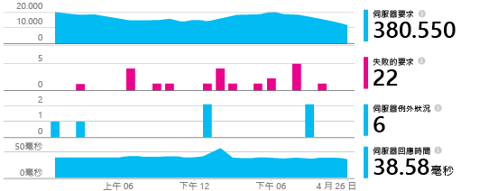
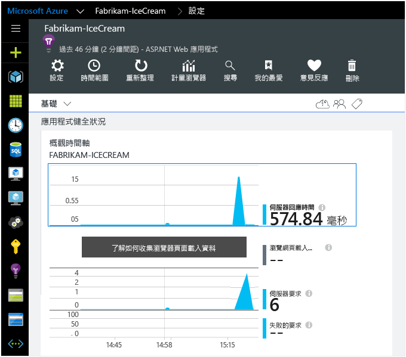

<properties
	pageTitle="加入 Application Insights SDK 監視 ASP.NET App | Microsoft Azure"
	description="使用 Application Insights 分析內部部署或 Microsoft Azure Web 應用程式的使用情況、可用性和效能。"
	services="application-insights"
	documentationCenter=".net"
	authors="alancameronwills"
	manager="douge"/>

<tags
	ms.service="application-insights"
	ms.workload="tbd"
	ms.tgt_pltfrm="ibiza"
	ms.devlang="na"
	ms.topic="get-started-article"
	ms.date="08/05/2015"
	ms.author="awills"/>

# 加入 Application Insights SDK 監視 ASP.NET 應用程式

*Application Insights 目前僅供預覽。*

[AZURE.INCLUDE [app-insights-selector-get-started](../../includes/app-insights-selector-get-started.md)]

Visual Studio Application Insights 監視您的即時應用程式，協助您[偵測並診斷效能問題和例外狀況][detect]，同時[探索應用程式的使用情況][knowUsers]。它可以搭配各種不同的應用程式類型。這適用於裝載在專屬內部部署 IIS 伺服器或 Azure VM 上的應用程式，以及 Azure Web 應用程式。

*另請參閱：*

* [ASP.NET 5](app-insights-asp-net-five.md)
* [裝置應用程式和 Java 伺服器][platforms]

#### 開始之前

對於許多應用程式類型，[Visual Studio 可以將 Application Insights 加入至您的應用程式](#ide)，而且您幾乎不會察覺。為了讓您清楚了解整個運作情形，本文將帶您手動完成這些步驟。

您需要：

* [Microsoft Azure](http://azure.com) 訂用帳戶。如果您的小組或組織擁有 Azure 訂用帳戶，擁有者就可以使用您的 [Microsoft 帳戶](http://live.com)將您加入。
* Visual Studio 2013 或更新版本。

##  1.建立 Application Insights 資源

登入 [Azure 入口網站][portal]，並建立新的 Application Insights 資源。選擇 ASP.NET 做為應用程式類型。

![按一下 [新增]，然後按一下 [Application Insights]](./media/app-insights-start-monitoring-app-health-usage/01-new-asp.png)

Azure 中的[資源][roles]是服務的執行個體。此資源是來自您應用程式的遙測將經過分析並呈現的地方。

應用程式類型的選擇會設定[計量瀏覽器][metrics]中可見的資源刀鋒視窗和屬性的預設內容。

#### 檢測金鑰的副本

該金鑰識別資源，您很快就會將它安裝在 SDK 中，以將資源導向資料。

![按一下 [屬性]，選取金鑰，然後按下 CTRL+C](./media/app-insights-start-monitoring-app-health-usage/02-props-asp.png)

您剛才所完成用來建立新資源的步驟是開始監視任何應用程式的好方法。現在您可以將資料傳送給它。

##  2.在應用程式中安裝 SDK

安裝和設定 Application Insights SDK 會視您正在使用的平台而有所不同。對於 ASP.NET 應用程式而言，這非常輕鬆。

1. 在 Visual Studio 中，編輯桌面應用程式專案的 NuGet 封裝。

    ![以滑鼠右鍵按一下專案，然後選取 [管理 NuGet 封裝]](./media/app-insights-start-monitoring-app-health-usage/03-nuget.png)

2. 安裝 Web Apps 適用的 Application Insights SDK。

    

3. 編輯 ApplicationInsights.config (已由 NuGet 安裝加入)。在結尾標記前面插入此內容：

    `<InstrumentationKey>` *您複製的檢測金鑰* `</InstrumentationKey>`

    (或者，您可以在 App 中[撰寫一些程式碼來設定金鑰][apikey])。

#### 若要升級至未來的 SDK 版本

我們隨時會發行新版的 SDK。

若要升級至[新版的 SDK](app-insights-release-notes-dotnet.md)，請再次開啟 NuGet 封裝管理員，並篩選出已安裝的封裝。選取 **Microsoft.ApplicationInsights.Web** 然後選擇 [升級]。

如果您已對 ApplicationInsights.config 進行任何的自訂，請在升級前儲存複本，並在升級後合併您的變更到新版本中。

##  3.執行專案

使用 **F5** 執行應用程式並立即試用：開啟不同的頁面來產生一些遙測。

在 Visual Studio 中，您可以看見已傳送到的事件計數。

##  4.檢視遙測

返回 [Azure 入口網站][portal]，並且瀏覽至您的 Application Insights 資源。

在 [概觀] 圖表中尋找資料。剛開始的時候，您只會看見一或兩個資料點。例如：

按一下任何圖表以查看詳細度量。[深入了解度量。][perf]

現在部署應用程式並觀看資料累積情形。

以偵錯模式執行時，系統會透過管線迅速傳送遙測資料，因此您應該可以在幾秒內看見資料。在部署應用程式時，資料累積會較為緩慢。

#### 沒有資料？

* 開啟 [[搜尋][diagnostic]] 磚來查看個別事件。
* 使用應用程式、開啟不同頁面，以產生一些遙測。
* 請稍等片刻，然後按一下 [重新整理]。圖表會定期自行重新整理，但是如果您在等待一些要顯示的資料，您可以手動重新整理。
* 請參閱[疑難排解][qna]。

#### 組建伺服器發生問題？

請參閱[此疑難排解項目](app-insights-troubleshoot-faq.md#NuGetBuild)。

## 5\.加入相依性追蹤

SDK 需要一些協助，才能取得某些資料的存取權。特別是，您需要這個額外步驟才能自動測量您的應用程式對資料庫、REST API 和其他外部元件的呼叫。這些相依性度量對於協助您診斷效能問題的價值難以衡量。

#### 如果您的應用程式是在您的 IIS 伺服器中執行

使用系統管理員權限登入您的伺服器，並安裝 [Application Insights 狀態監視器](http://go.microsoft.com/fwlink/?LinkId=506648)。

(即使 App 不是使用 SDK 建置，您也可以使用狀態監視器[檢測已在執行的 App](app-insights-monitor-performance-live-website-now.md))。

#### 如果您的 app 是 Azure Web 應用程式

在您的 Azure Web 應用程式的控制台中，加入 Application Insights 延伸模組。

![在您的 Web 應用程式中，[工具]、[效能監視]、[新增]、[Application Insights]](./media/app-insights-start-monitoring-app-health-usage/05-extend.png)

(延伸模組只能協助使用 SDK 建置的 app。與狀態監視器不同，它無法檢測現有的應用程式。)

## 6\.加入用戶端監視

您已安裝會從應用程式的伺服器 (後端) 傳送遙測資料的 SDK。現在您可以加入用戶端監視。這可提供有關在用戶端中發生的使用者、工作階段、頁面檢視和任何例外狀況或損毀的相關資料。

您也可以撰寫自己的程式碼，來追蹤您的使用者使用您的應用程式，徹底得知詳細的點按和按鍵層級。

#### 如果您的用戶端是網頁瀏覽器

如果您的 app 顯示網頁，請在每一頁加入 JavaScript 程式碼片段。從您的 Application Insights 資源取得程式碼：

![在您的 Web 應用程式中，開啟 [快速入門]，然後按一下 [取得程式碼來監視我的網頁]](./media/app-insights-start-monitoring-app-health-usage/02-monitor-web-page.png)

請注意，此程式碼包含可識別您的應用程式資源的檢測金鑰。

[進一步了解網頁追蹤。](app-insights-web-track-usage.md)

#### 如果您的用戶端是裝置 app

如果您的應用程式為用戶端 (例如電話或其他裝置) 提供服務，請將[適當的 SDK](app-insights-platforms.md) 加入至您的裝置 App。

如果您使用與伺服器 SDK 相同的檢測金鑰來設定用戶端 SDK，將整合兩個資料流，讓您同時看到。

## 7\.完成安裝

若要取得您的應用程式的全方位檢視，您還可以執行一些動作：

* [設定 Web 測試][availability]，以確認應用程式處於線上狀態且能夠回應。
* 從您最喜愛的記錄架構[擷取記錄追蹤][netlogs]
* 在用戶端、伺服器或兩者，[追蹤自訂事件和度量][api]，以深入了解應用程式的使用情況。

##  自動化方式

我們在這份文件的開頭提過，我們會告訴您如何以手動方式建立 Application Insights 資源，然後再安裝 SDK。我們相信這可以協助您了解該程序的兩個部分。但對於 ASP.NET 應用程式 (以及其他許多應用程式) 而言，還有更快速的自動化方式。

您需要有 [Visual Studio](http://go.microsoft.com/fwlink/?linkid=397827&clcid=0x409) (2013 Update 3 或更新版本)，以及 [Microsoft Azure](http://azure.com) 中的帳戶。

#### 對於新專案

當您在 Visual Studio 中建立新專案時，請務必選取 [加入 Application Insights]。

Visual Studio 會在 Application Insights 中建立資源，將 SDK 加入至專案，並將金鑰放在 `.config` 檔案中。

如果專案有網頁，則還會將 [JavaScript SDK][client] 加入至主版網頁。

#### ... 對於現有專案

在 [方案總管] 中以滑鼠右鍵按一下專案，然後選擇 [加入 Application Insights]。

Visual Studio 會在 Application Insights 中建立資源，將 SDK 加入至專案，並將金鑰放在 `.config` 檔案中。

在此情況下，不會將 [JavaScript SDK][client] 加入至網頁 - 建議在下一步再這樣做。

#### 設定選項

如果這是您第一次使用，系統會要求您登入或註冊 Microsoft Azure Preview。(該帳戶與 Visual Studio Online 帳戶彼此獨立)。

如果此應用程式是更大應用程式的一部分，您可以使用 [**組態設定**]，將它放在與其他元件相同的資源群組中。

*沒有 Application Insights 選項嗎？ 請檢查您是否使用 Visual Studio 2013 Update 3 或更新版本，而且是否已在 [擴充功能和更新] 中啟用 Application Insights Tools。*

#### 從專案開啟 Application Insights

## 影片

> [AZURE.VIDEO getting-started-with-application-insights]

<!--Link references-->

[api]: app-insights-api-custom-events-metrics.md
[apikey]: app-insights-api-custom-events-metrics.md#ikey
[availability]: app-insights-monitor-web-app-availability.md
[azure]: ../insights-perf-analytics.md
[client]: app-insights-javascript.md
[detect]: app-insights-detect-triage-diagnose.md
[diagnostic]: app-insights-diagnostic-search.md
[knowUsers]: app-insights-overview-usage.md
[metrics]: app-insights-metrics-explorer.md
[netlogs]: app-insights-asp-net-trace-logs.md
[perf]: app-insights-web-monitor-performance.md
[platforms]: app-insights-platforms.md
[portal]: http://portal.azure.com/
[qna]: app-insights-troubleshoot-faq.md
[redfield]: app-insights-monitor-performance-live-website-now.md
[roles]: app-insights-resources-roles-access-control.md
[start]: app-insights-get-started.md

<!---HONumber=August15_HO9-->