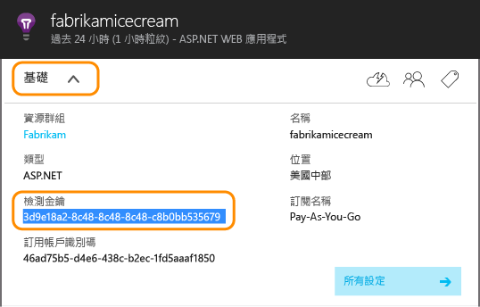
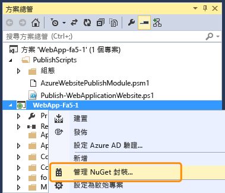
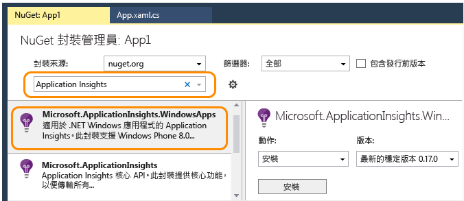
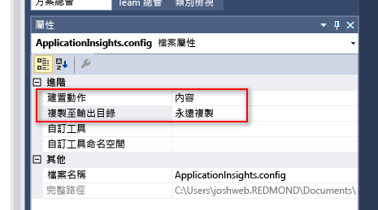
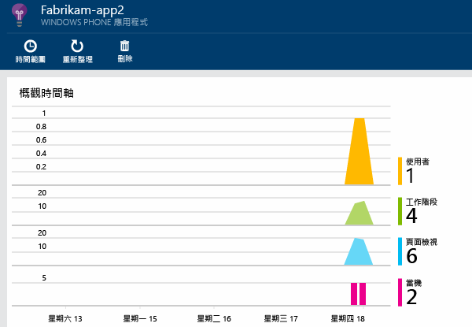

<properties
	pageTitle="Windows Phone 和市集應用程式的分析 | Microsoft Azure"
	description="分析 Windows 裝置應用程式的使用情况和效能。"
	services="application-insights"
    documentationCenter="windows"
	authors="alancameronwills"
	manager="douge"/>

<tags
	ms.service="application-insights"
	ms.workload="tbd"
	ms.tgt_pltfrm="ibiza"
	ms.devlang="na"
	ms.topic="get-started-article"
	ms.date="02/19/2016"
	ms.author="awills"/>

# Windows Phone 和市集應用程式的分析

Microsoft 為裝置 devOps 提供兩個解決方案：適用於用戶端分析的 [HockeyApp](http://hockeyapp.net/)；以及適用於伺服器端的 [Application Insights](app-insights-overview.md)。

[HockeyApp](http://hockeyapp.net/) 是我們的行動 DevOps 解決方案，適用於 iOS、OS X、Android 或 Windows 裝置應用程式，以及以 Xamarin、Cordova 和 Unity 為基礎的跨平台應用程式。利用該解決方案，您可以將組建散發給 Beta 版測試人員、收集損毀資料，以及取得使用者度量和意見反應。與 Visual Studio Team Services 整合，您即可輕鬆建置部署和工作項目整合。

請移至：

* [HockeyApp](http://support.hockeyapp.net/kb)
* [HockeyApp 部落格](http://hockeyapp.net/blog/)
* 加入 [Hockeyapp Preseason](http://hockeyapp.net/preseason/) 以提早取得版本。

如果您的應用程式有伺服器端，請使用 [Application Insights](app-insights-overview.md) 在 [ASP.NET](app-insights-asp-net.md) 或 [J2EE](app-insights-java-get-started.md) 上監視您的應用程式的 Web 伺服器端。

## 適用於您的 Windows 裝置的 Application Insights SDK

雖然我們建議 HockeyApp，另外還有舊版的 Application Insights SDK 可讓您監視 Windows 裝置應用程式的[損毀][windowsCrash]和[使用量][windowsUsage]。

請注意，較舊的裝置 SDK 支援將即將淘汰。


若要安裝較舊的 SDK，您需要：

* [Microsoft Azure][azure] 訂用帳戶。
* Visual Studio 2013 或更新版本。


### 1\.取得 Application Insights 資源 

在 [Azure 入口網站][portal] 中，建立 Application Insights 資源。

建立新的資源：

![選擇 [新增]、[開發人員服務]、[Application Insights]](./media/app-insights-windows-get-started/01-new.png)

Azure 中的[資源][roles]是服務的執行個體。此資源是來自您應用程式的遙測將經過分析並呈現的地方。

#### 複製檢測金鑰

此金鑰識別資源。您很快就需要用它來設定 SDK 將資料傳送給資源。




### 2\.將 Application Insights SDK 加入至應用程式

在 Visual Studio 中，將適當的 SDK 加入至專案。


* 如果是 C++ 應用程式，請使用 [C++ SDK](https://github.com/Microsoft/ApplicationInsights-CPP) 而不是以下說明的 NuGet 封裝。

如果是 Windows Universal 應用程式，請對 Windows Phone 專案與 Windows 專案重複以下步驟。

1. 在 [方案總管] 中以滑鼠右鍵按一下專案，然後選擇 [**管理 NuGet 封裝**]。

    

2. 搜尋「Application Insights」。

    

3. 選擇**適用於 Windows 應用程式的 Application Insights**

4. 將 ApplicationInsights.config 檔案加入至您專案的根目錄，並插入從入口網站複製的檢測金鑰。此組態檔的範例 XML 如下所示。

	```xml

		<?xml version="1.0" encoding="utf-8" ?>
		<ApplicationInsights>
			<InstrumentationKey>YOUR COPIED INSTRUMENTATION KEY</InstrumentationKey>
		</ApplicationInsights>
	```

    設定 ApplicationInsights.config 檔案的屬性：[建置動作] == [內容] 而 [複製到輸出目錄] == [一律複製]。
	
	

5. 加入下列的初始化程式碼。最好是將此程式碼加入至 `App()` 建構函式。如果您在其他地方加入，您可能會遺漏第一個 PageViews 的自動集合。

```C#

	public App()
	{
	   // Add this initilization line. 
	   WindowsAppInitializer.InitializeAsync();
	
	   this.InitializeComponent();
	   this.Suspending += OnSuspending;
	}  
```

**Windows 通用 App**：對 [手機] 和 [市集] 專案重複這些步驟。[Windows 8.1 通用應用程式的範例](https://github.com/Microsoft/ApplicationInsights-Home/tree/master/Samples/Windows%208.1%20Universal)。

### <a name="network"></a>3.對應用程式啟用網路存取

如果應用程式尚未[要求連出網路存取](https://msdn.microsoft.com/library/windows/apps/hh452752.aspx)，您必須將此功能加入至它的資訊清單，當做[必要功能](https://msdn.microsoft.com/library/windows/apps/br211477.aspx)。

### <a name="run"></a>4.執行專案

[使用 F5 執行應用程式](http://msdn.microsoft.com/library/windows/apps/bg161304.aspx)並使用它，以產生一些遙測。

在 Visual Studio 中，您可以看見已接收到的事件計數。


在偵測模式下，遙測一產生就立即送出。在發行模式下，遙測會先儲存在裝置上，只在應用程式恢復時才傳送。


### <a name="monitor"></a>5.查看監視資料

從專案開啟 Application Insights。


剛開始的時候，您只會看見一或兩個資料點。例如：



如果您預期有更多資料，請在幾秒之後按一下 [重新整理]。

按一下任何圖表以查看詳細資料。


### <a name="deploy"></a>5.將應用程式發行至市集

[發佈應用程式](http://dev.windows.com/publish)，並觀察資料隨著使用者下載和使用它而累積。

### 自訂您的遙測

#### 選擇收集器

Application Insights SDK 包含數個收集器，它會從您的應用程式中自動收集不同類型的資料。根據預設，它們都是作用中。但是，您可以選擇要在應用程式建構函式中初始化的收集器：

    WindowsAppInitializer.InitializeAsync( "00000000-0000-0000-0000-000000000000",
       WindowsCollectors.Metadata
       | WindowsCollectors.PageView
       | WindowsCollectors.Session 
       | WindowsCollectors.UnhandledException);

#### 傳送您自己的遙測資料

使用 [API][api] 將事件、度量和診斷資料傳送至 Application Insights。簡言之：

```C#

 var tc = new TelemetryClient(); // Call once per thread

 // Send a user action or goal:
 tc.TrackEvent("Win Game");

 // Send a metric:
 tc.TrackMetric("Queue Length", q.Length);

 // Provide properties by which you can filter events:
 var properties = new Dictionary{"game", game.Name};

 // Provide metrics associated with an event:
 var measurements = new Dictionary{"score", game.score};

 tc.TrackEvent("Win Game", properties, measurements);

```

如需詳細資訊，請參閱[自訂事件和度量][api]。

## 後續步驟

* [偵測和診斷應用程式中的損毀][windowsCrash]
* [深入了解度量][metrics]
* [深入了解診斷搜尋][diagnostic]
* [追蹤應用程式的使用量][windowsUsage]
* [使用 API 傳送自訂遙測][api]
* [疑難排解][qna]

* [使用 HockeyApp 進行您的應用程式的當機分析、Beta 散發和意見反應](http://hockeyapp.net/)


<!--Link references-->

[api]: app-insights-api-custom-events-metrics.md
[azure]: ../insights-perf-analytics.md
[diagnostic]: app-insights-diagnostic-search.md
[metrics]: app-insights-metrics-explorer.md
[portal]: http://portal.azure.com/
[qna]: app-insights-troubleshoot-faq.md
[roles]: app-insights-resources-roles-access-control.md
[windowsCrash]: app-insights-windows-crashes.md
[windowsUsage]: app-insights-windows-usage.md

<!---HONumber=AcomDC_0224_2016-->