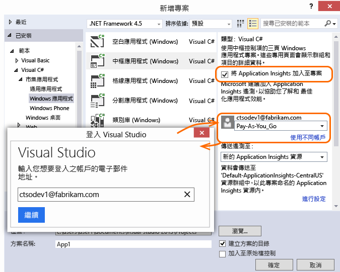
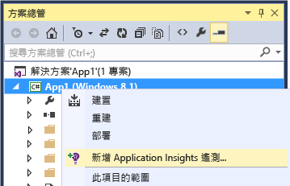

<properties
	pageTitle="Windows Phone 和市集應用程式的分析 | Microsoft Azure"
	description="分析 Windows 裝置應用程式的使用情况和效能。"
	services="application-insights"
    documentationCenter="windows"
	authors="alancameronwills"
	manager="douge"/>

<tags
	ms.service="application-insights"
	ms.workload="tbd"
	ms.tgt_pltfrm="ibiza"
	ms.devlang="na"
	ms.topic="get-started-article"
	ms.date="11/11/2015"
	ms.author="awills"/>

# Windows Phone 和市集應用程式的分析


Visual Studio Application Insights 可讓您監視已發佈的應用程式的使用情況和效能。


> [AZURE.NOTE]我們建議使用 [HockeyApp](http://support.hockeyapp.net/kb/client-integration-windows-and-windows-phone/hockeyapp-for-windows-store-apps-and-windows-phone-store-apps) 來獲得當機報告、分析、散發和意見反應管理。


## 為您的 Windows 裝置專案設定 Application Insights

您需要：

* [Microsoft Azure][azure] 訂用帳戶。
* Visual Studio 2013 或更新版本。

**C++ UAP 應用程式** -請參閱 [Application Insights C++ 設定指南](https://github.com/Microsoft/ApplicationInsights-CPP)

### <a name="new"></a>如果您要建立新的 Windows 應用程式專案...

在 [新增專案] 對話方塊中，選取 [Application Insights]。

系統要求您登入時，請使用 Azure 帳戶的認證。




### <a name="existing"></a>或者如果是現有的專案...

從 [方案總管] 加入 Application Insights。


 **Windows 通用應用程式**：對 [手機] 和 [市集] 專案重複這些步驟。[Windows 8.1 通用應用程式的範例](https://github.com/Microsoft/ApplicationInsights-Home/tree/master/Samples/Windows%208.1%20Universal)。

## <a name="network"></a>3.對應用程式啟用網路存取

如果應用程式尚未[要求網際網路存取](https://msdn.microsoft.com/library/windows/apps/hh452752.aspx)，您必須將此功能加入至它的資訊清單，當做[必要功能](https://msdn.microsoft.com/library/windows/apps/br211477.aspx)。

## <a name="run"></a>4.執行專案

[使用 F5 執行應用程式](http://msdn.microsoft.com/library/windows/apps/bg161304.aspx)並使用它，以產生一些遙測。

在 Visual Studio 中，您可以看見已接收到的事件計數。


在偵測模式下，遙測一產生就立即送出。在發行模式下，遙測會先儲存在裝置上，只在應用程式恢復時才傳送。


## <a name="monitor"></a>5.查看監視資料

在 [Azure 入口網站](https://portal.azure.com)中，開啟您先前建立的 Application Insights 資源。

剛開始的時候，您只會看見一或兩個資料點。例如：


如果您預期有更多資料，請在幾秒之後按一下 [重新整理]。

按一下任何圖表以查看詳細資料。


## <a name="deploy"></a>5.將應用程式發行至市集

[發佈應用程式](http://dev.windows.com/publish)，並觀察資料隨著使用者下載和使用它而累積。

## 自訂您的遙測

#### 選擇收集器

Application Insights SDK 包含數個收集器，它會從您的應用程式中自動收集不同類型的資料。根據預設，它們都是作用中。但是，您可以選擇要在應用程式建構函式中初始化的收集器：

    WindowsAppInitializer.InitializeAsync( "00000000-0000-0000-0000-000000000000",
       WindowsCollectors.Metadata
       | WindowsCollectors.PageView
       | WindowsCollectors.Session
       | WindowsCollectors.UnhandledException);

#### 傳送您自己的遙測資料

使用 [API][api] 將事件、度量和診斷資料傳送至 Application Insights。簡言之：

```C#

 var tc = new TelemetryClient(); // Call once per thread

 // Send a user action or goal:
 tc.TrackEvent("Win Game");

 // Send a metric:
 tc.TrackMetric("Queue Length", q.Length);

 // Provide properties by which you can filter events:
 var properties = new Dictionary{"game", game.Name};

 // Provide metrics associated with an event:
 var measurements = new Dictionary{"score", game.score};

 tc.TrackEvent("Win Game", properties, measurements);

```

如需詳細資訊，請參閱 [API 概觀：自訂事件和度量][api]。

## 後續步驟

* [偵測和診斷應用程式中的損毀][windowsCrash]
* [深入了解度量][metrics]
* [深入了解診斷搜尋][diagnostic]


## 升級到新版的 SDK

當[新的 SDK 版本發行](app-insights-release-notes-windows.md)時：

* 以滑鼠右鍵按一下專案，然後選擇 [管理 NuGet 封裝]。
* 選取已安裝的 Application Insights 封裝，然後選擇 [動作：升級]。


## <a name="usage"></a>後續步驟


[偵測和診斷應用程式中的損毀][windowsCrash]

[擷取及搜尋診斷記錄][diagnostic]


[追蹤應用程式的使用量][windowsUsage]

[使用 API 傳送自訂遙測][api]

[疑難排解][qna]


<!--Link references-->

[api]: app-insights-api-custom-events-metrics.md
[azure]: ../insights-perf-analytics.md
[diagnostic]: app-insights-diagnostic-search.md
[metrics]: app-insights-metrics-explorer.md
[portal]: http://portal.azure.com/
[qna]: app-insights-troubleshoot-faq.md
[roles]: app-insights-resources-roles-access-control.md
[windowsCrash]: app-insights-windows-crashes.md
[windowsUsage]: app-insights-windows-usage.md

<!---HONumber=Nov15_HO4-->