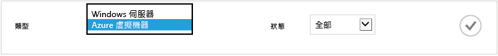
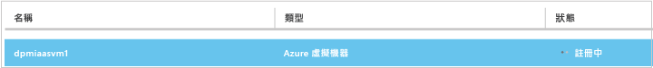
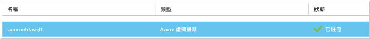
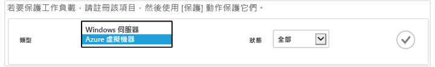
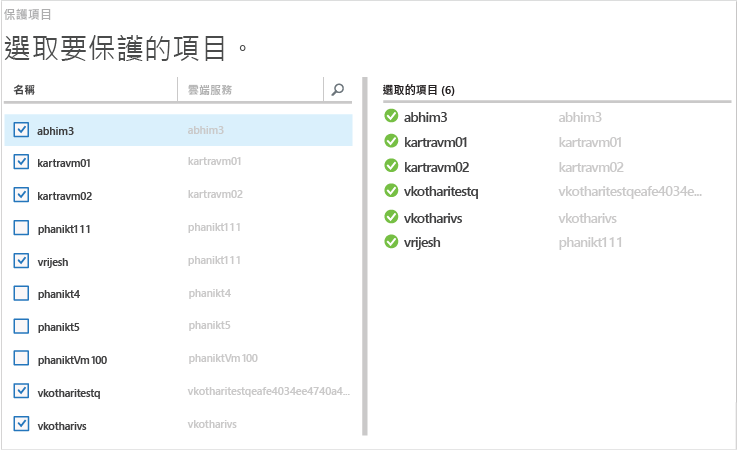
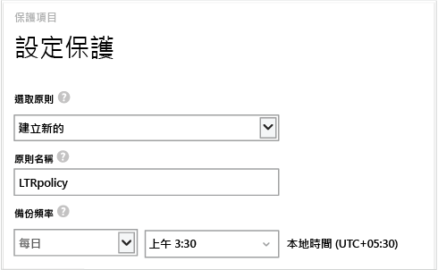
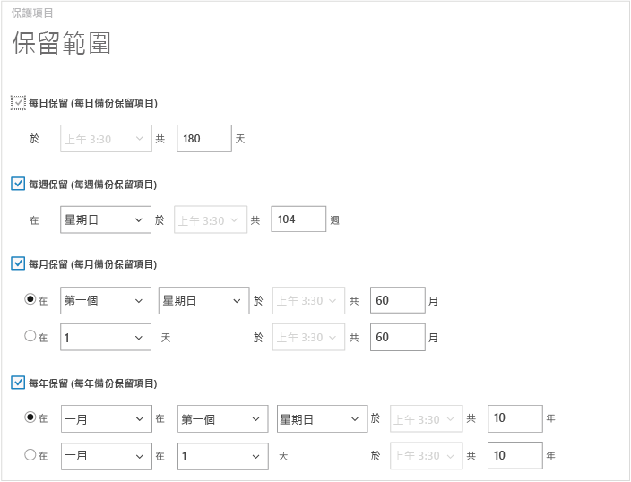
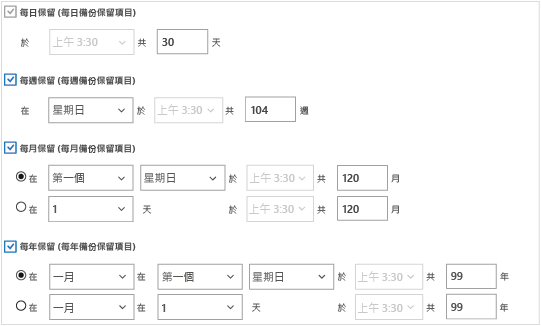
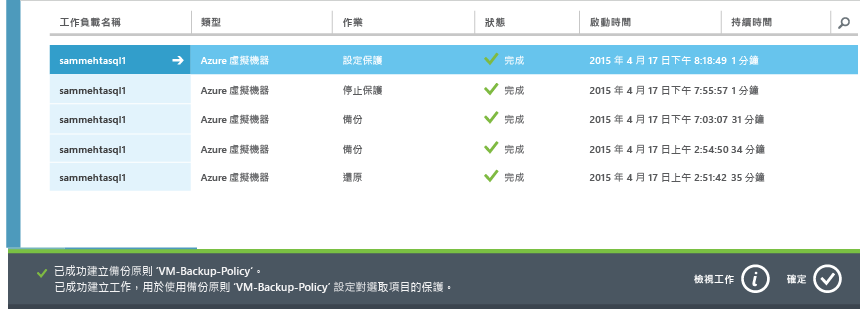
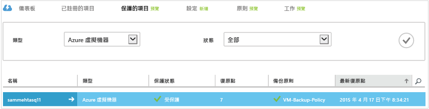

<properties
	pageTitle="使用 Azure 備份保護 Azure 中的 VM |Microsoft Azure"
	description="使用 Azure 備份服務保護 Azure VM。教學課程會說明如何在 Azure 中建立保存庫、註冊 VM、建立原則和保護 VM。"
	services="backup"
	documentationCenter=""
	authors="markgalioto"
	manager="jwhit"
	editor=""/>

<tags
	ms.service="backup"
	ms.workload="storage-backup-recovery"
	ms.tgt_pltfrm="na"
	ms.devlang="na"
	ms.topic="hero-article"
	ms.date="03/07/2016"
	ms.author="markgal; jimpark"/>

# 先睹為快：備份 Azure 虛擬機器

本文是教學課程，將會引導您完成一組用於準備 Azure 環境以便備份 Azure 虛擬機器 (VM) 的步驟。本教學課程假設您的 Azure 訂用帳戶中已有 VM，且您已採取措施以允許備份服務存取 VM。概括而言，您會完成以下這些步驟。

1. 建立或登入您的 Azure 訂用帳戶。
2. 在與 VM 相同的區域中建立備份保存庫，或識別現有的備份保存庫。
3. 使用 Azure 入口網站來探索並註冊訂用帳戶中的虛擬機器。
4. 在虛擬機器上安裝 VM 代理程式 (如果您使用 Azure 資源庫中的 VM，則 VM 代理程式已經存在)。
5. 建立用來保護虛擬機器的原則。
6. 執行備份。

>[AZURE.NOTE] Azure 有兩種用來建立和使用資源的部署模型： [Resource Manager 和傳統](../resource-manager-deployment-model.md)。Azure 備份服務目前不支援以 Azure Resource Manager (ARM) 為基礎的虛擬機器 (也稱為 IaaS V2 虛擬機器)。由於 Iaas V2 VM 是在新的 Azure 入口網站發行時才推出，因此本教學課程當初在設計時是適用於可在 Azure 傳統入口網站中建立的 VM 類型。

## 步驟 1 - 為 VM 建立備份保存庫

備份保存庫是一個實體，會儲存歷來建立的所有備份和復原點。備份保存庫也包含備份虛擬機器時將套用的備份原則。

此影像顯示各種「Azure 備份」實體之間的關係：
    

若要建立備份保存庫：

1. 登入 [Azure 入口網站](http://manage.windowsazure.com/)。

2. 在 Azure 入口網站中，按一下 [新增] > [資料服務] > [復原服務] > [備份保存庫] > [快速建立] \(請參閱下圖)。

    

3. 在 [名稱] 中，輸入易記名稱來識別保存庫。必須是 Azure 訂用帳戶中唯一的名稱。輸入包含 2 到 50 個字元的名稱。該名稱必須以字母開頭，而且只可以包含字母、數字和連字號。

4. 在 [**區域**] 中，選取保存庫的地理區域。保存庫必須與您想要保護的虛擬機器位於相同區域。

    如果您不確定 VM 的所在區域，請關閉保存庫建立對話方塊，並移至入口網站的虛擬機器清單。如果您的虛擬機器位於多個區域，您必須在每個區域中建立備份保存庫，不過請在建立好第一個區域的保存庫後再到下一個區域建立。儲存備份資料時，不需要指定儲存體帳戶，備份保存庫和「Azure 備份」服務會自動處理此作業。

5. 在 [訂用帳戶] 中，選取您希望與備份保存庫相關聯的訂用帳戶。只有在您的組織帳戶與多個 Azure 訂用帳戶相關聯時，才會有多個選擇。

6. 按一下 [建立保存庫]。要等備份保存庫建立好，可能需要一些時間。監視位於入口網站底部的狀態通知。

    

    將有一則訊息確認已成功建立保存庫。該保存庫將會在 [復原服務] 頁面中以 [使用中] 狀態列出。

    

7. 在 [復原服務] 頁面的保存庫清單中，按一下您建立的保存庫以啟動 [快速啟動] 頁面。

    

8. 在 [快速啟動] 頁面上，按一下 [設定] 以開啟儲存體複寫選項。
    

9. 在 [儲存體複寫] 選項上，選擇保存庫的複寫選項。

    

    根據預設，保存庫具有異地備援儲存體。如果您使用 Azure 做為主要的備份儲存體端點，則建議您繼續使用異地備援儲存體。如果您使用 Azure 做為非主要的備份儲存體端點，則可以考慮選擇本地備援儲存體，以減少在 Azure 中儲存資料的成本。在此[概觀](../storage/storage-redundancy.md)中，深入了解[異地備援](../storage/storage-redundancy.md#geo-redundant-storage)和[本地備援](../storage/storage-redundancy.md#locally-redundant-storage)儲存體選項。

選擇好保存庫的儲存體選項後，就可以開始建立 VM 與保存庫的關聯。若要開始關聯，請探索及註冊 Azure 虛擬機器。

## 步驟 2 - 探索及註冊 Azure 虛擬機器
在向保存庫註冊 VM 前，請先執行探索程序，以確保能夠識別任何加入至訂用帳戶的新虛擬機器。此程序會在 Azure 中查詢訂用帳戶中的虛擬機器清單，以及其他資訊，例如雲端服務名稱、區域等。

1. 登入 [Azure 入口網站](http://manage.windowsazure.com/)。

2. 在 Azure 傳統入口網站中，按一下 [復原服務] 以開啟復原服務保存庫清單。
    

3. 在 [復原服務] 保存庫清單中，選取要用來備份 VM 的保存庫。

    當您選取保存庫時，它會開啟在 [快速啟動] 頁面中。

4. 在保存庫功能表 (位於頁面頂端) 中，按一下 [註冊的項目]。

5. 在 [類型] 功能表中選取 [Azure 虛擬機器]。

    

6. 按一下頁面底部的 [**探索**]。
    

    在列表顯示虛擬機器時，探索程序可能需花費幾分鐘的時間。畫面底部會有通知讓您知道程序正在執行中。

    

    程序完成時，通知隨即變更。

    

7. 按一下頁面底部的 [註冊]。
    

8. 在 [註冊項目] 捷徑功能表中，選取您想要註冊的虛擬機器。如果有兩個以上同名的虛擬機器，請使用雲端服務加以區別。

    >[AZURE.TIP] 您可以同時註冊多個虛擬機器。

    系統會為您所選取的每個虛擬機器建立一個工作。

9. 按一下通知中的 [檢視工作]，以移至 [工作] 頁面。

    

    虛擬機器也會連同註冊作業的狀態，出現在已註冊的項目清單中。

    

    作業完成時，狀態會改變以反映已註冊的狀態。

    

## 步驟 3 - 在虛擬機器中安裝 VM 代理程式

Azure VM 代理程式必須安裝在 Azure 虛擬機器上，備份擴充功能才能運作。如果 VM 是建立自 Azure 資源庫，則 VM 代理程式已存在於虛擬機器上。不過，從內部部署資料中心移轉的 VM 不會安裝 VM 代理程式。在這種情況下，必須明確安裝 VM 代理程式。在您嘗試備份 Azure VM 之前，請先確定已在虛擬機器上正確安裝 Azure VM 代理程式 (請參閱下表)。如果您建立自訂 VM，請先[確定已選取 [安裝 VM 代理程式] 核取方塊](../virtual-machines/virtual-machines-extensions-agent-about.md)，再佈建虛擬機器。

深入了解 [VM 代理程式](https://go.microsoft.com/fwLink/?LinkID=390493&clcid=0x409)和[如何安裝](../virtual-machines/virtual-machines-extensions-install.md)。

下表提供適用於 Windows 和 Linux VM 之 VM 代理程式的其他資訊。

| **作業** | **Windows** | **Linux** |
| --- | --- | --- |
| 安裝 VM 代理程式 | <li>下載並安裝[代理程式 MSI](http://go.microsoft.com/fwlink/?LinkID=394789&clcid=0x409)。您需要有系統管理員權限，才能完成安裝。<li>[更新 VM 屬性](http://blogs.msdn.com/b/mast/archive/2014/04/08/install-the-vm-agent-on-an-existing-azure-vm.aspx)以表示已安裝代理程式。 | <li>從 GitHub 安裝最新的 [Linux 代理程式](https://github.com/Azure/WALinuxAgent)。您需要有系統管理員權限，才能完成安裝。<li> [更新 VM 屬性](http://blogs.msdn.com/b/mast/archive/2014/04/08/install-the-vm-agent-on-an-existing-azure-vm.aspx)以表示已安裝代理程式。 |
| 更新 VM 代理程式 | 更新 VM 代理程式與重新安裝 [VM 代理程式二進位檔](http://go.microsoft.com/fwlink/?LinkID=394789&clcid=0x409)一樣簡單。 確定在更新 VM 代理程式時，沒有任何執行中的備份作業。 | 請遵循[更新 Linux VM 代理程式](../virtual-machines-linux-update-agent.md)上的指示。 確定在更新 VM 代理程式時，沒有任何執行中的備份作業。 |
| 驗證 VM 代理程式安裝 | <li>瀏覽至 Azure VM 中的 C:\\WindowsAzure\\Packages 資料夾。<li>您應該會發現有 WaAppAgent.exe 檔案。<li> 在該檔案上按一下滑鼠右鍵，移至 [屬性]，然後選取 [詳細資料] 索引標籤。[產品版本] 欄位應為 2.6.1198.718 或更高版本。 | N/A |

### 備份擴充功能

虛擬機器上安裝了 VM 代理程式後，Azure 備份服務就會在 VM 代理程式上安裝備份擴充功能。Azure 備份服務無需使用者介入，即可順暢地升級和修補備份擴充功能。

無論 VM 是否在執行，備份服務都會安裝備份擴充功能。執行中的 VM 提供了取得應用程式一致復原點的絕佳機會。不過，即使 VM 已關閉而無法安裝擴充功能，Azure 備份服務仍會繼續備份 VM。這稱為離線 VM。在此情況下，復原點將會是「當機時保持一致」。

## 步驟 4 - 保護 Azure 虛擬機器
現在，您可以設定虛擬機器的備份和保留原則。使用單一保護動作可以保護多個虛擬機器。2015 年 5 月之後建立的 Azure 備份保存庫，會隨附內建於保存庫的預設原則。這項預設原則會隨附 30 天預設保留和每日一次的備份排程。

1. 在 Azure 入口網站中，瀏覽至 [復原服務] 下的備份保存庫，然後按一下 [註冊的項目]。
2. 從下拉式選單中選取 [Azure 虛擬機器]。

    

3. 按一下頁面底部的 [保護]。
    ![按一下 [保護]](./media/backup-azure-vms-first-look/protect-icon.png)

    [保護項目精靈] 隨即出現，只列出已註冊但未受保護的虛擬機器。

    

4. 選取您要保護的虛擬機器。

    如果有兩個以上同名的虛擬機器，請使用雲端服務來區別虛擬機器。

5. 在 [設定保護] 上，選取現有原則或建立新原則，以保護您所識別的虛擬機器。

    每一個備份原則可以有多個相關聯的虛擬機器。但無論何時，虛擬機器只能與一個原則相關聯。

    

    >[AZURE.NOTE] 備份原則中包含排定備份的保留配置。如果您選取現有的備份原則，將無法在下一個步驟中修改保留選項。

6. 在 [保留範圍] 上，定義特定備份點的每日、每週、每月和每年範圍。

    

    保留期原則會指定儲存備份的時間長度。您可以根據進行備份的時間指定不同的保留原則。例如，為了進行稽核，每一季結尾所進行的備份會需要保留較長期間，而每日進行的備份 (可充當作業的復原點) 則只需要保留 90 天。

    

    在此範例影像中：

    - **每日的保留原則**：每日所進行的備份會儲存 30 天。
    - **每週的保留原則**：每個星期天所進行的備份會保留 104 週。
    - **每月的保留原則**：每月最後一個星期日所進行的備份會保留 120 個月。
    - **每年的保留原則**：每年一月第一個星期日所進行的備份會保留 99 年。

    建立的工作可設定保護原則，並將虛擬機器與您所選取的每個虛擬機器的該項原則相關聯。

6. 按一下 [工作]，然後選擇正確的篩選器來檢視 [設定保護] 工作的清單。

    

## 步驟 5 - 初始備份

在虛擬機器受到原則保護後，您可以在 [受保護項目] 索引標籤上檢視該關聯性。在 VM 執行初始備份前，[保護狀態] 會顯示為 [受保護 - (待執行初始備份)]。根據預設，第一個排定的備份是*初始備份*。

若要在設定保護之後立即觸發初始備份：

1. 在 [受保護項目] 頁面上，按一下頁面底部的 [立即備份] 按鈕。
    ![[立即備份] 圖示](./media/backup-azure-vms-first-look/backup-now-icon.png)

    Azure 備份服務會初始備份作業建立備份工作。

2. 按一下 [工作] 索引標籤來檢視工作清單。

    

    >[AZURE.NOTE] 在備份工作進行時，Azure 備份服務會發出命令給每個虛擬機器中的備份擴充功能，以排清所有寫入並取得一致的快照。

    初始備份完成後，[受保護的項目] 索引標籤中的虛擬機器狀態會顯示為 [受保護]。

    

    >[AZURE.NOTE] 備份虛擬機器是本機的程序。您無法將虛擬機器從一個區域備份到另一個區域中的備份保存庫。因此，對於每一個有 VM 需要備份的 Azure 區域，必須在該區域中至少建立一個備份保存庫。

## 後續步驟
現在您已成功備份 VM，接下來有幾個可能相關的步驟。最合乎邏輯的步驟是讓自己熟悉如何將資料還原到 VM，不過，也有能夠協助您了解如何確保資料安全並持續降低成本的管理工作。

- [管理和監視虛擬機器](backup-azure-manage-vms.md)
- [還原虛擬機器](backup-azure-restore-vms.md)
- [疑難排解指引](backup-azure-vms-troubleshoot.md)

## 有疑問嗎？
如果您有問題，或希望我們加入任何功能，請[傳送意見反應給我們](http://aka.ms/azurebackup_feedback)。

<!---HONumber=AcomDC_0316_2016-->

