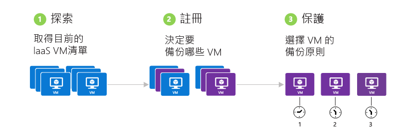
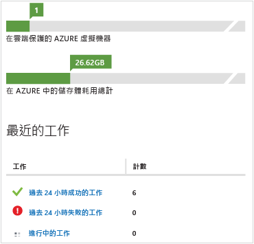

<properties
	pageTitle="Azure 虛擬機器備份 - 備份 | Microsoft Azure"
	description="了解如何在註冊之後備份 Azure 虛擬機器"
	services="backup"
	documentationCenter=""
	authors="aashishr"
	manager="shreeshd"
	editor=""/>

<tags ms.service="backup" ms.workload="storage-backup-recovery" ms.tgt_pltfrm="na" ms.devlang="na" ms.topic="hero-article" ms.date="09/01/2015" ms.author="aashishr"; "jimpark"/>

# 備份 Azure 虛擬機器
本文是備份 Azure 虛擬機器的基本指南。繼續之前，請確定已符合所有[先決條件](backup-azure-vms-introduction.md#prerequisites)。

備份 Azure 虛擬機器需要三個主要步驟：

>[AZURE.NOTE]虛擬機器備份位於本機。指定之 Azure 區域的備份保存庫不允許您從另一個 Azure 區域備份虛擬機器。因此，對於每一個有 VM 需要備份的 Azure 區域，必須在該區域中至少建立 1 個備份保存庫。

## 1\.探索 Azure 虛擬機器
探索程序會在 Azure 中查詢訂用帳戶中的虛擬機器清單，以及其他資訊，例如雲端服務名稱、地區等。第一個步驟一定都是執行探索程序。這是為了確保識別任何加入至訂用帳戶的新虛擬機器。

### 觸發探索程序

1. 瀏覽至備份保存庫 (位於 Azure 入口網站的 [復原服務] 下方)，然後按一下 [已註冊的項目] 索引標籤。

2. 在下拉式功能表中，選擇 [Azure 虛擬機器] 做為工作負載類型，然後按一下 [選取] 按鈕。

    

3. 按一下頁面底部的 [**探索**] 按鈕。
  

4. 在列表顯示虛擬機器時，探索程序可能會執行幾分鐘。探索程序執行時，畫面底部會出現快顯通知。

    

5. 探索程序完成時會出現快顯通知。

    

##  2\.註冊 Azure 虛擬機器
虛擬機器必須先向 Azure 備份服務註冊，才能受到保護。註冊程序的主要目標是將虛擬機器與 Azure Backup 服務產生關聯。註冊通常是一次性活動。

>[AZURE.NOTE]註冊步驟期間不會安裝備份擴充功能。現在會在排定的備份作業中安裝和更新備份代理程式。

### 註冊虛擬機器

1. 瀏覽至備份保存庫 (位於 Azure 入口網站的 [復原服務] 下方)，然後按一下 [已註冊的項目] 索引標籤。

2. 在下拉式功能表中，選擇 [Azure 虛擬機器] 做為工作負載類型，然後按一下 [選取] 按鈕。

    

3. 按一下頁面底部的 [註冊] 按鈕。

4. 在 [註冊項目] 捷徑功能表中，選擇您想要註冊的虛擬機器。如果有兩個以上同名的虛擬機器，請使用雲端服務來區別虛擬機器。

    **註冊**作業可以大規模進行，也就是可以一次選取多個要註冊的虛擬機器。如此可大幅減少為了準備虛擬機器來備份而投入的一次性工作量。

5. 每一個應該註冊的虛擬機器都會建立一項工作。快顯通知會顯示此活動的狀態。按一下 [檢視工作] 以移至 [工作] 頁面。

    

6. 虛擬機器也會出現在已註冊的項目清單中，而且會顯示註冊作業的狀態。

    

7. 作業完成時，入口網站中的狀態會改變來反映已註冊的狀態。

    

## 3\.保護：備份 Azure 虛擬機器
此步驟涉及到設定虛擬機器的備份和保留原則。若要保護虛擬機器，請執行下列步驟：

1. 瀏覽至備份保存庫 (位於 Azure 入口網站的 [復原服務] 下方)，然後按一下 [已註冊的項目] 索引標籤。
2. 在下拉式功能表中，選擇 [Azure 虛擬機器] 做為工作負載類型，然後按一下 [選取] 按鈕。

    

3. 按一下頁面底部的 [保護] 按鈕。[保護項目] 精靈隨即出現。

4. [保護項目] 精靈可讓您選取要保護的虛擬機器。如果有兩個以上同名的虛擬機器，請使用雲端服務來區別虛擬機器。

    **保護**作業可以大規模進行，也就是可以一次選取多個要註冊的虛擬機器。如此可大幅減少為了保護虛擬機器而投入的工作量。

5. 在 [**保護項目**] 精靈的第二個畫面，選擇備份和保留原則來備份已選取的虛擬機器。從現有的一組原則中挑選，或定義新的原則。

    在每個備份保存庫中，您可以有多個備份原則。原則反映應該如何排程和保留備份的詳細資料。例如，一個備份原則可能是每天上午 10:00 備份，另一個備份原則可能是每週上午 6:00 備份。多個備份原則可讓虛擬機器基礎結構在排定備份時更有彈性。

    每一個備份原則可以有多個相關聯的虛擬機器。無論何時，虛擬機器只能與一個原則相關聯。

6. 每個虛擬機器會建立一項工作，以設定保護原則並將虛擬機器與原則相關聯。按一下 [工作] 索引標籤，選擇正確的篩選器來檢視 [設定保護] 工作的清單。

    

## 後置保護活動

### 安裝備份擴充功能

Azure 備份服務會自動處理備份擴充功能的升級和修補，完全不會干擾使用者。如此可減輕備份產品經常對使用者造成的「代理程式管理負擔」。

#### 離線 VM
如果 VM 正在執行，表示已安裝備份擴充功能。執行中的 VM 也提供最大的機會來取得應用程式一致點。不過，即使 VM 已關閉且無法安裝擴充功能 (也稱為離線 VM)，Azure 備份服務仍會繼續備份 VM。一致性會受影響，在此情況下，復原點為*檔案系統一致*。

### 初始備份
虛擬機器受到原則保護之後，就會出現在 [受保護的項目] 索引標籤下，狀態為 [受保護 - (擱置中的初始備份)]。根據預設，第一個排定的備份是初始備份。若要在設定保護之後立即觸發初始備份，請使用 [受保護的項目] 頁面底部的 [立即備份] 按鈕。

Azure 備份服務會初始備份作業建立備份工作。按一下 [工作] 索引標籤來檢視工作清單。在備份工作進行時，Azure 備份服務會發出命令給每個虛擬機器中的備份擴充功能，以排清所有寫入並取得一致的快照。

初始備份完成後，在 [受保護的項目] 索引標籤中，虛擬機器的 [保護狀態] 會顯示為 [受保護]。

### 檢視備份狀態和詳細資料
虛擬機器受到保護後，[**儀表板**] 頁面摘要中的虛擬機器計數也會遞增。此外，[儀表板] 頁面會顯示過去 24 小時內成功、失敗及仍在進行中的工作數目。按一下任何一個類別可在 [工作] 頁面中深入查看該類別。

## 復原點的一致性
處理備份資料時，客戶會擔心 VM 還原之後的行為。客戶常見的問題包括：

- 虛擬機器會啟動嗎？
- 資料會存在磁碟上嗎？會遺失任何資料嗎？
- 應用程式能夠讀取資料嗎？資料會損毀嗎？
- 應用程式還可辨識資料嗎？應用程式讀取的資料仍保有自我一致性嗎？

下表說明在 Azure VM 備份和還原期間遇到的一致性類型。

| 一致性 | 以 VSS 基礎 | 說明和詳細資料 |
|-------------|-----------|---------|
| 應用程式一致性 | 是 | 這是處理 Microsoft 工作負載的理想位置，因為它可確保：<ol><li>VM *開機*。<li>*不會毀損*。<li>*不會遺失資料*。<li> 資料會與使用資料的應用程式保持一致，方法是在備份期間使用 VSS 將應用程式納入。</ol> 磁碟區快照服務 (VSS) 確保資料正確寫入儲存體。大部分 Microsoft 工作負載都有 VSS 寫入器，負責執行與資料一致性有關的工作負載特定動作。例如，Microsoft SQL Server 的 VSS 寫入器可確保正確寫入交易記錄檔和資料庫。   對於 Azure VM 備份，取得應用程式一致復原點表示備份擴充功能可以叫用 VSS 工作流程，並在取得 VM 快照之前*正確*完成。當然，這表示也都已叫用 Azure VM 中所有應用程式的 VSS 寫入器。  了解 [VSS 的基本知識](http://blogs.technet.com/b/josebda/archive/2007/10/10/the-basics-of-the-volume-shadow-copy-service-vss.aspx)深入[運作方式](https://technet.microsoft.com/library/cc785914%28v=ws.10%29.aspx)的詳細資料。 |
| 檔案系統一致性 | 是 - 適用於 Windows 電腦 | 有兩種情況，復原點具有檔案系統一致性：<ul><li>在 Azure 中備份 Linux VM，因為 Linux 沒有相當於 VSS 的平台。<li>在 Azure 中備份 Windows VM 期間 VSS 失敗。</li></ul> 在這兩種情況中，可採取的最佳做法是確保：<ol><li>VM *開機*。<li>*不會損毀*。<li>*不會遺失資料*。</ol> 應用程式需要在還原的資料上實作自己的「修正」機制。|
| 損毀一致性 | 否 | 此狀況相當於電腦「當機」(經由軟體重設或硬體重設)。這通常發生於 Azure 虛擬機器在備份期間關閉時。對於 Azure 虛擬機器備份，取得損毀一致復原點表示 Azure 備份不保證儲存媒體上的資料一致性 - 無論從作業系統還是應用程式的觀點來說都一樣。只有備份時已存在磁碟上的資料才會擷取並備份。    在大部分情況下，作業系統會開機，但並不保證一定如此。隨後通常是執行磁碟檢查程序 (如 chkdsk) 以修正任何損毀錯誤。記憶體中任何未完全排清到磁碟的資料或寫入將會遺失。如果需要進行資料復原，應用程式通常會接著進行其本身的驗證機制。對於 Azure VM 備份，取得損毀一致復原點表示 Azure 備份不保證儲存體上的資料一致性 - 無論從 OS 還是應用程式的觀點來說都一樣。這通常發生在備份時 Azure VM 關閉。  例如，如果交易記錄中有項目不存在資料庫中，則資料庫軟體會執行復原，直到資料變成一致為止。在處理跨多個虛擬磁碟的資料時 (例如跨距磁碟區)，損毀一致復原點不保證資料的正確性。|

## 效能與資源使用率
如同內部部署的備份軟體一樣，在 Azure 中備份 VM 也需要規劃容量和資源使用率。[Azure 儲存體限制](azure-subscription-service-limits.md#storage-limits)定義如何建構 VM 部署，以發揮最大效能和儘可能不影響執行中的工作負載。有兩個主要的 Azure 儲存體限制會影響備份效能：

+ 每一儲存體帳戶的輸出上限
+ 每一儲存體帳戶的總要求率

從客戶儲存體帳戶中複製備份資料時，這些資料會計入儲存體帳戶的 IOPS 和輸出 (儲存體輸送量) 度量內。同時，虛擬機器也會執行並耗用 IOPS 和輸送量。目標是要確保總流量 (備份與虛擬機器) 不超過儲存體帳戶限制。

備份會竭盡所能耗用資源，目標是儘速完成備份。不過，所有 IO 作業都受限於 [單一 Blob 的目標輸送量]，上限為*每秒 60MB*。為了加速備份程序，系統會嘗試*平行*備份 VM 的每個磁碟。因此，如果 VM 有 4 個磁碟，則 Azure 備份會嘗試平行備份所有 4 個磁碟。因此，判斷從客戶儲存體帳戶輸出的備份流量時，唯一最重要的因素就是從儲存體帳戶備份的**磁碟數目**。

影響效能的第二個因素是**備份排程**。如果您將所有 VM 設定為同時備份，則*平行*備份的磁碟數目會增加，因為 Azure 備份會嘗試盡可能備份更多磁碟。因此，為了減少從儲存體帳戶輸出的備份流量，一種作法是確保在不同的時段備份 VM，時間不要重疊。

### 容量規劃
綜合考量所有這些因素，即可知需要妥善規劃儲存體帳戶的使用方式。下載 [VM 備份容量規劃 Excel 工作表](https://gallery.technet.microsoft.com/Azure-Backup-Storage-a46d7e33)，以了解磁碟和備份排程選項所產生的影響。

### 備份輸送量
針對每個要備份的磁碟，Azure 備份會讀取磁碟上的區塊，只儲存已變更的資料 (增量備份)。下表顯示從 Azure 備份可預期的平均輸送量值：

| 備份作業 | 最佳輸送量 |
| ---------------- | ---------- |
| 初始備份 | 160 Mbps |
| 增量備份 (DR) | 640 Mbps    如果磁碟上有很多分散的資料需要備份，此輸送量會大幅下降 |

您可利用此值來估計備份特定大小的磁碟將花費的時間。

### VM 備份時間總計
雖然大部分的時間花費在讀取和複製資料，但備份 VM 所花費的全部時間還包含其他作業：

1. [安裝或更新備份擴充功能](backup-azure-vms.md#offline-vms)所花費的時間
2. 佇列等候時間：因為服務正在處理多個客戶的備份，備份作業可能不會立即啟動。VM 的平均等候時間是 15-30 分鐘。

## 錯誤疑難排解
針對虛擬機器備份期間遇到的錯誤，取得詳盡的因應措施清單：[虛擬機器備份的疑難排解](backup-azure-vms-troubleshoot.md)

## 後續步驟

若要深入了解開始使用 Azure 備份，請參閱：

- [還原虛擬機器](backup-azure-restore-vms.md)
- [管理虛擬機器](backup-azure-manage-vms.md)

<!---HONumber=September15_HO1-->