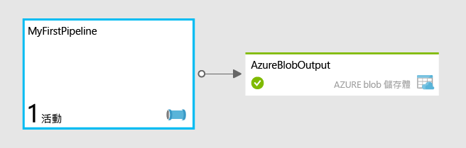

<properties
	pageTitle="開始使用 Azure Data Factory"
	description="本教學課程示範如何建立使用 Azure HDInsight 轉換資料的範例資料管線。"
	services="data-factory"
	documentationCenter=""
	authors="spelluru"
	manager="jhubbard"
	editor="monicar"/>

<tags
	ms.service="data-factory"
	ms.workload="data-services"
	ms.tgt_pltfrm="na"
	ms.devlang="na"
	ms.topic="hero-article" 
	ms.date="12/18/2015"
	ms.author="spelluru"/>

# 開始使用 Azure Data Factory
> [AZURE.SELECTOR]
- [Tutorial Overview](data-factory-build-your-first-pipeline.md)
- [Using Data Factory Editor](data-factory-build-your-first-pipeline-using-editor.md)
- [Using PowerShell](data-factory-build-your-first-pipeline-using-powershell.md)
- [Using Visual Studio](data-factory-build-your-first-pipeline-using-vs.md)
- [Using Resource Manager Template](data-factory-build-your-first-pipeline-using-arm.md)

本文可協助您開始建置您的第一個 Azure Data Factory。

> [AZURE.NOTE] 本文不提供 Azure Data Factory 服務的概念性概觀。如需有關服務的詳細概觀，請參閱 [Azure Data Factory 簡介](data-factory-introduction.md)。

## 教學課程概觀
本教學課程將逐步帶您建置並執行第一個 Data Factory 所需的步驟。您會在 Data Factory 中建立一個管線，可轉換/處理輸入資料以產生輸出資料。

## 必要條件
開始進行本教學課程之前，您必須具備下列必要條件：

1.	**Azure 訂用帳戶** - 如果您沒有 Azure 訂用帳戶，只需要幾分鐘就可以建立免費試用帳戶。請參閱[免費試用](https://azure.microsoft.com/pricing/free-trial/)一文了解如何取得免費試用帳戶。

2.	**Azure 儲存體** – 在本教學課程中，您將使用 Azure 儲存體帳戶來儲存資料。如果您沒有 Azure 儲存體帳戶，請參閱[建立儲存體帳戶](../storage/storage-create-storage-account.md#create-a-storage-account)一文。建立儲存體帳戶之後，您必須取得用來存取儲存體的帳戶金鑰。請參閱[檢視、複製和重新產生儲存體存取金鑰](../storage/storage-create-storage-account.md#view-copy-and-regenerate-storage-access-keys)。

## 本教學課程涵蓋哪些內容？	
**Azure Data Factory** 可讓您以資料驅動型工作流程的方式，撰寫資料**移動**和資料**處理**工作。您將了解如何建置第一個管線，每個月使用 HDInsight 來轉換及分析 Web 記錄檔。

在本教學課程中，您將執行下列步驟：

1.	建立 **Data Factory**。Data Factory 可以包含一或多個資料管線，可移動和處理資料。 
2.	建立**連結的服務**。您會建立一個連結的服務，以將資料存放區或計算服務連結到 Data Factory。像是 Azure 儲存體的資料存放區會保留管線中的活動輸入/輸出資料。計算服務 (例如 Azure HDInsight 處理/轉換資料)。    
3.	建立輸入和輸出**資料集**。輸入資料集表示管線中的活動輸入，而輸出資料集表示活動的輸出。
3.	建立**管線**。管線可以有一或多個活動 (例如「複製活動」)，以便從來源將資料複製到目的地 (或) HDInsight Hive 活動，並使用 Hive 指令碼轉換輸入資料以產生輸出資料。本範例使用執行 Hive 指令碼的 HDInsight Hive 活動。指令碼首先會建立一個參照儲存在 Azure Blob 儲存體中的原始 Web 記錄資料的外部資料表，再依年份或月份分割原始資料。

您的第一個管線名為 **MyFirstPipeline**，使用 Hive 活動來轉換並分析您上傳到 Azure Blob 儲存體中 **adfgetstarted** 容器 (adfgetstarted/inputdata) 中 **inputdata** 資料夾的 Web 記錄檔。
 

在本教學課程中，adfgetstarted (容器) => inputdata (資料夾) 包含一個名為 input.log 的檔案。此記錄檔包含三個月的項目，分別是：2014 年 1 月、2 月和 3 月。這裡是輸入檔中每個月份的資料列範例。

	2014-01-01,02:01:09,SAMPLEWEBSITE,GET,/blogposts/mvc4/step2.png,X-ARR-LOG-ID=2ec4b8ad-3cf0-4442-93ab-837317ece6a1,80,-,1.54.23.196,Mozilla/5.0+(Windows+NT+6.3;+WOW64)+AppleWebKit/537.36+(KHTML,+like+Gecko)+Chrome/31.0.1650.63+Safari/537.36,-,http://weblogs.asp.net/sample/archive/2007/12/09/asp-net-mvc-framework-part-4-handling-form-edit-and-post-scenarios.aspx,\N,200,0,0,53175,871 
	2014-02-01,02:01:10,SAMPLEWEBSITE,GET,/blogposts/mvc4/step7.png,X-ARR-LOG-ID=d7472a26-431a-4a4d-99eb-c7b4fda2cf4c,80,-,1.54.23.196,Mozilla/5.0+(Windows+NT+6.3;+WOW64)+AppleWebKit/537.36+(KHTML,+like+Gecko)+Chrome/31.0.1650.63+Safari/537.36,-,http://weblogs.asp.net/sample/archive/2007/12/09/asp-net-mvc-framework-part-4-handling-form-edit-and-post-scenarios.aspx,\N,200,0,0,30184,871
	2014-03-01,02:01:10,SAMPLEWEBSITE,GET,/blogposts/mvc4/step7.png,X-ARR-LOG-ID=d7472a26-431a-4a4d-99eb-c7b4fda2cf4c,80,-,1.54.23.196,Mozilla/5.0+(Windows+NT+6.3;+WOW64)+AppleWebKit/537.36+(KHTML,+like+Gecko)+Chrome/31.0.1650.63+Safari/537.36,-,http://weblogs.asp.net/sample/archive/2007/12/09/asp-net-mvc-framework-part-4-handling-form-edit-and-post-scenarios.aspx,\N,200,0,0,30184,871

當管線使用 HDInsight Hive 活動處理檔案時，活動會在依年份和月份分割輸入資料的 HDInsight 叢集中執行 Hive 指令碼。指令碼會建立三個輸出資料夾，包含每個月份項目的檔案。

	adfgetstarted/partitioneddata/year=2014/month=1/000000_0
	adfgetstarted/partitioneddata/year=2014/month=2/000000_0
	adfgetstarted/partitioneddata/year=2014/month=3/000000_0

如上所示的範例行中，第一行 (標有 2014-01-01) 會寫入 month=1 資料夾中的 000000\_0 檔案。同樣地，第二行會寫入 month=2 資料夾中的檔案；而第三行會寫入 month=3 資料夾中的檔案。

## 將教學課程使用的檔案上傳到 Azure 儲存體
開始教學課程之前，您必須準備內含教學課程所需檔案的 Azure 儲存體。

您將在本節進行下列工作：

2. 將 Hive 查詢檔案 (HQL) 上傳到 adfgetstarted 容器中的 [指令碼] 資料夾。
3. 將輸入檔案上傳到 adfgetstarted 容器中的 [inputdata] 資料夾。 

### 建立 HQL 指令碼檔案 

1. 啟動 [記事本]，並貼上下列 HQL 指令碼。此 Hive 指令碼會建立兩個外部資料表：**WebLogsRaw** 和 **WebLogsPartitioned**。按一下功能表上的 [檔案]，並選取 [另存新檔]。切換至硬碟機上的 **C:\\adfgetstarted** 資料夾。在 [檔案類型] 欄位選取 [所有檔案 (*.*)]。在 [檔案名稱]輸入 **partitionweblogs.hql**。確認已將對話方塊底部的 [編碼] 欄位設為 [ANSI]。如果沒有，請將它設為 [ANSI]。  
	
		set hive.exec.dynamic.partition.mode=nonstrict;
		
		DROP TABLE IF EXISTS WebLogsRaw; 
		CREATE TABLE WebLogsRaw (
		  date  date,
		  time  string,
		  ssitename string,
		  csmethod  string,
		  csuristem  string,
		  csuriquery string,
		  sport int,
		  susername string,
		  cipcsUserAgent string,
		  csCookie string,
		  csReferer string,
		  cshost  string,
		  scstatus  int,
		  scsubstatus  int,
		  scwin32status  int,
		  scbytes int,
		  csbytes int,
		  timetaken int
		)
		ROW FORMAT DELIMITED FIELDS TERMINATED BY ' '
		LINES TERMINATED BY '\n' 
		tblproperties ("skip.header.line.count"="2");
		
		LOAD DATA INPATH '${hiveconf:inputtable}' OVERWRITE INTO TABLE WebLogsRaw;
		
		DROP TABLE IF EXISTS WebLogsPartitioned ; 
		create external table WebLogsPartitioned (  
		  date  date,
		  time  string,
		  ssitename string,
		  csmethod  string,
		  csuristem  string,
		  csuriquery string,
		  sport int,
		  susername string,
		  cipcsUserAgent string,
		  csCookie string,
		  csReferer string,
		  cshost  string,
		  scstatus  int,
		  scsubstatus  int,
		  scwin32status  int,
		  scbytes int,
		  csbytes int,
		  timetaken int
		)
		partitioned by ( year int, month int)
		ROW FORMAT DELIMITED FIELDS TERMINATED BY ',' 
		STORED AS TEXTFILE 
		LOCATION '${hiveconf:partitionedtable}';
		
		INSERT INTO TABLE WebLogsPartitioned  PARTITION( year , month) 
		SELECT
		  date,
		  time,
		  ssitename,
		  csmethod,
		  csuristem,
		  csuriquery,
		  sport,
		  susername,
		  cipcsUserAgent,
		  csCookie,
		  csReferer,
		  cshost,
		  scstatus,
		  scsubstatus,
		  scwin32status,
		  scbytes,
		  csbytes,
		  timetaken,
		  year(date),
		  month(date)
		FROM WebLogsRaw

### 建立範例輸入檔案
使用記事本，在 **c:\\adfgetstarted** 中建立名為 **input.log** 的檔案，內容如下：

	#Software: Microsoft Internet Information Services 8.0
	#Fields: date time s-sitename cs-method cs-uri-stem cs-uri-query s-port cs-username c-ip cs(User-Agent) cs(Cookie) cs(Referer) cs-host sc-status sc-substatus sc-win32-status sc-bytes cs-bytes time-taken
	2014-01-01 02:01:09 SAMPLEWEBSITE GET /blogposts/mvc4/step2.png X-ARR-LOG-ID=2ec4b8ad-3cf0-4442-93ab-837317ece6a1 80 - 1.54.23.196 Mozilla/5.0+(Windows+NT+6.3;+WOW64)+AppleWebKit/537.36+(KHTML,+like+Gecko)+Chrome/31.0.1650.63+Safari/537.36 - http://weblogs.asp.net/sample/archive/2007/12/09/asp-net-mvc-framework-part-4-handling-form-edit-and-post-scenarios.aspx www.sample.com 200 0 0 53175 871 46
	2014-01-01 02:01:09 SAMPLEWEBSITE GET /blogposts/mvc4/step3.png X-ARR-LOG-ID=9eace870-2f49-4efd-b204-0d170da46b4a 80 - 1.54.23.196 Mozilla/5.0+(Windows+NT+6.3;+WOW64)+AppleWebKit/537.36+(KHTML,+like+Gecko)+Chrome/31.0.1650.63+Safari/537.36 - http://weblogs.asp.net/sample/archive/2007/12/09/asp-net-mvc-framework-part-4-handling-form-edit-and-post-scenarios.aspx www.sample.com 200 0 0 51237 871 32
	2014-01-01 02:01:09 SAMPLEWEBSITE GET /blogposts/mvc4/step4.png X-ARR-LOG-ID=4bea5b3d-8ac9-46c9-9b8c-ec3e9500cbea 80 - 1.54.23.196 Mozilla/5.0+(Windows+NT+6.3;+WOW64)+AppleWebKit/537.36+(KHTML,+like+Gecko)+Chrome/31.0.1650.63+Safari/537.36 - http://weblogs.asp.net/sample/archive/2007/12/09/asp-net-mvc-framework-part-4-handling-form-edit-and-post-scenarios.aspx www.sample.com 200 0 0 72177 871 47
	2014-01-01 02:01:09 SAMPLEWEBSITE GET /blogposts/mvc4/step5.png X-ARR-LOG-ID=9b0c14b1-434d-495a-9b0d-46775194257b 80 - 1.54.23.196 Mozilla/5.0+(Windows+NT+6.3;+WOW64)+AppleWebKit/537.36+(KHTML,+like+Gecko)+Chrome/31.0.1650.63+Safari/537.36 - http://weblogs.asp.net/sample/archive/2007/12/09/asp-net-mvc-framework-part-4-handling-form-edit-and-post-scenarios.aspx www.sample.com 200 0 0 37931 871 32
	2014-01-01 02:01:09 SAMPLEWEBSITE GET /blogposts/mvc4/step6.png X-ARR-LOG-ID=f99cff81-ec38-4a13-b2fe-21b10adca996 80 - 1.54.23.196 Mozilla/5.0+(Windows+NT+6.3;+WOW64)+AppleWebKit/537.36+(KHTML,+like+Gecko)+Chrome/31.0.1650.63+Safari/537.36 - http://weblogs.asp.net/sample/archive/2007/12/09/asp-net-mvc-framework-part-4-handling-form-edit-and-post-scenarios.aspx www.sample.com 200 0 0 27146 871 47
	2014-01-01 02:01:09 SAMPLEWEBSITE GET /blogposts/mvc4/step1.png X-ARR-LOG-ID=af94d3b4-8e05-4871-82c4-638f866d4e83 80 - 1.54.23.196 Mozilla/5.0+(Windows+NT+6.3;+WOW64)+AppleWebKit/537.36+(KHTML,+like+Gecko)+Chrome/31.0.1650.63+Safari/537.36 - http://weblogs.asp.net/sample/archive/2007/12/09/asp-net-mvc-framework-part-4-handling-form-edit-and-post-scenarios.aspx www.sample.com 200 0 0 66259 871 140
	2014-02-01 02:01:10 SAMPLEWEBSITE GET /blogposts/mvc4/step7.png X-ARR-LOG-ID=d7472a26-431a-4a4d-99eb-c7b4fda2cf4c 80 - 1.54.23.196 Mozilla/5.0+(Windows+NT+6.3;+WOW64)+AppleWebKit/537.36+(KHTML,+like+Gecko)+Chrome/31.0.1650.63+Safari/537.36 - http://weblogs.asp.net/sample/archive/2007/12/09/asp-net-mvc-framework-part-4-handling-form-edit-and-post-scenarios.aspx www.sample.com 200 0 0 30184 871 47
	2014-02-01 02:01:10 SAMPLEWEBSITE GET /blogposts/mvc4/step7.png X-ARR-LOG-ID=d7472a26-431a-4a4d-99eb-c7b4fda2cf4c 80 - 1.54.23.196 Mozilla/5.0+(Windows+NT+6.3;+WOW64)+AppleWebKit/537.36+(KHTML,+like+Gecko)+Chrome/31.0.1650.63+Safari/537.36 - http://weblogs.asp.net/sample/archive/2007/12/09/asp-net-mvc-framework-part-4-handling-form-edit-and-post-scenarios.aspx www.sample.com 200 0 0 30184 871 47
	2014-02-01 02:01:10 SAMPLEWEBSITE GET /blogposts/mvc4/step7.png X-ARR-LOG-ID=d7472a26-431a-4a4d-99eb-c7b4fda2cf4c 80 - 1.54.23.196 Mozilla/5.0+(Windows+NT+6.3;+WOW64)+AppleWebKit/537.36+(KHTML,+like+Gecko)+Chrome/31.0.1650.63+Safari/537.36 - http://weblogs.asp.net/sample/archive/2007/12/09/asp-net-mvc-framework-part-4-handling-form-edit-and-post-scenarios.aspx www.sample.com 200 0 0 30184 871 47
	2014-02-01 02:01:10 SAMPLEWEBSITE GET /blogposts/mvc4/step7.png X-ARR-LOG-ID=d7472a26-431a-4a4d-99eb-c7b4fda2cf4c 80 - 1.54.23.196 Mozilla/5.0+(Windows+NT+6.3;+WOW64)+AppleWebKit/537.36+(KHTML,+like+Gecko)+Chrome/31.0.1650.63+Safari/537.36 - http://weblogs.asp.net/sample/archive/2007/12/09/asp-net-mvc-framework-part-4-handling-form-edit-and-post-scenarios.aspx www.sample.com 200 0 0 30184 871 47
	2014-02-01 02:01:10 SAMPLEWEBSITE GET /blogposts/mvc4/step7.png X-ARR-LOG-ID=d7472a26-431a-4a4d-99eb-c7b4fda2cf4c 80 - 1.54.23.196 Mozilla/5.0+(Windows+NT+6.3;+WOW64)+AppleWebKit/537.36+(KHTML,+like+Gecko)+Chrome/31.0.1650.63+Safari/537.36 - http://weblogs.asp.net/sample/archive/2007/12/09/asp-net-mvc-framework-part-4-handling-form-edit-and-post-scenarios.aspx www.sample.com 200 0 0 30184 871 47
	2014-02-01 02:01:10 SAMPLEWEBSITE GET /blogposts/mvc4/step7.png X-ARR-LOG-ID=d7472a26-431a-4a4d-99eb-c7b4fda2cf4c 80 - 1.54.23.196 Mozilla/5.0+(Windows+NT+6.3;+WOW64)+AppleWebKit/537.36+(KHTML,+like+Gecko)+Chrome/31.0.1650.63+Safari/537.36 - http://weblogs.asp.net/sample/archive/2007/12/09/asp-net-mvc-framework-part-4-handling-form-edit-and-post-scenarios.aspx www.sample.com 200 0 0 30184 871 47
	2014-02-01 02:01:10 SAMPLEWEBSITE GET /blogposts/mvc4/step7.png X-ARR-LOG-ID=d7472a26-431a-4a4d-99eb-c7b4fda2cf4c 80 - 1.54.23.196 Mozilla/5.0+(Windows+NT+6.3;+WOW64)+AppleWebKit/537.36+(KHTML,+like+Gecko)+Chrome/31.0.1650.63+Safari/537.36 - http://weblogs.asp.net/sample/archive/2007/12/09/asp-net-mvc-framework-part-4-handling-form-edit-and-post-scenarios.aspx www.sample.com 200 0 0 30184 871 47
	2014-02-01 02:01:10 SAMPLEWEBSITE GET /blogposts/mvc4/step7.png X-ARR-LOG-ID=d7472a26-431a-4a4d-99eb-c7b4fda2cf4c 80 - 1.54.23.196 Mozilla/5.0+(Windows+NT+6.3;+WOW64)+AppleWebKit/537.36+(KHTML,+like+Gecko)+Chrome/31.0.1650.63+Safari/537.36 - http://weblogs.asp.net/sample/archive/2007/12/09/asp-net-mvc-framework-part-4-handling-form-edit-and-post-scenarios.aspx www.sample.com 200 0 0 30184 871 47
	2014-03-01 02:01:10 SAMPLEWEBSITE GET /blogposts/mvc4/step7.png X-ARR-LOG-ID=d7472a26-431a-4a4d-99eb-c7b4fda2cf4c 80 - 1.54.23.196 Mozilla/5.0+(Windows+NT+6.3;+WOW64)+AppleWebKit/537.36+(KHTML,+like+Gecko)+Chrome/31.0.1650.63+Safari/537.36 - http://weblogs.asp.net/sample/archive/2007/12/09/asp-net-mvc-framework-part-4-handling-form-edit-and-post-scenarios.aspx www.sample.com 200 0 0 30184 871 47
	2014-03-01 02:01:10 SAMPLEWEBSITE GET /blogposts/mvc4/step7.png X-ARR-LOG-ID=d7472a26-431a-4a4d-99eb-c7b4fda2cf4c 80 - 1.54.23.196 Mozilla/5.0+(Windows+NT+6.3;+WOW64)+AppleWebKit/537.36+(KHTML,+like+Gecko)+Chrome/31.0.1650.63+Safari/537.36 - http://weblogs.asp.net/sample/archive/2007/12/09/asp-net-mvc-framework-part-4-handling-form-edit-and-post-scenarios.aspx www.sample.com 200 0 0 30184 871 47
	2014-03-01 02:01:10 SAMPLEWEBSITE GET /blogposts/mvc4/step7.png X-ARR-LOG-ID=d7472a26-431a-4a4d-99eb-c7b4fda2cf4c 80 - 1.54.23.196 Mozilla/5.0+(Windows+NT+6.3;+WOW64)+AppleWebKit/537.36+(KHTML,+like+Gecko)+Chrome/31.0.1650.63+Safari/537.36 - http://weblogs.asp.net/sample/archive/2007/12/09/asp-net-mvc-framework-part-4-handling-form-edit-and-post-scenarios.aspx www.sample.com 200 0 0 30184 871 47
	2014-03-01 02:01:10 SAMPLEWEBSITE GET /blogposts/mvc4/step7.png X-ARR-LOG-ID=d7472a26-431a-4a4d-99eb-c7b4fda2cf4c 80 - 1.54.23.196 Mozilla/5.0+(Windows+NT+6.3;+WOW64)+AppleWebKit/537.36+(KHTML,+like+Gecko)+Chrome/31.0.1650.63+Safari/537.36 - http://weblogs.asp.net/sample/archive/2007/12/09/asp-net-mvc-framework-part-4-handling-form-edit-and-post-scenarios.aspx www.sample.com 200 0 0 30184 871 47
	2014-03-01 02:01:10 SAMPLEWEBSITE GET /blogposts/mvc4/step7.png X-ARR-LOG-ID=d7472a26-431a-4a4d-99eb-c7b4fda2cf4c 80 - 1.54.23.196 Mozilla/5.0+(Windows+NT+6.3;+WOW64)+AppleWebKit/537.36+(KHTML,+like+Gecko)+Chrome/31.0.1650.63+Safari/537.36 - http://weblogs.asp.net/sample/archive/2007/12/09/asp-net-mvc-framework-part-4-handling-form-edit-and-post-scenarios.aspx www.sample.com 200 0 0 30184 871 47

### 將輸入檔案和 HQL 檔案上傳到您的 Azure Blob 儲存體

您可以使用任何工具 (例如：[Microsoft Azure 儲存體總管](http://storageexplorer.com/)、CloudXPlorer by ClumsyLeaf Software) 來執行這項工作。本節提供使用 AzCopy 工具的指示。
	 
2. 為教學課程準備 Azure 儲存體：
	1. 下載[最新版本的 **AzCopy**](http://aka.ms/downloadazcopy)，或[最新預覽版本](http://aka.ms/downloadazcopypr)。請參閱[如何使用 AzCopy](../storage/storage-use-azcopy.md) 一文以取得使用公用程式的指示。
	2. AzCopy 安裝之後，您可以在命令提示字元中執行下列命令，將其新增到系統路徑。 
	
			set path=%path%;C:\Program Files (x86)\Microsoft SDKs\Azure\AzCopy

	3. 瀏覽至 c:\adfgetstarted 資料夾，然後執行下列命令將 **input.log** 檔案上傳到儲存體帳戶 (**adfgetstarted** 容器和 **inputdata** 資料夾)。使用您的儲存體帳戶名稱取代 StorageAccountName，並使用儲存體帳戶金鑰取代儲存體金鑰。

			AzCopy /Source:. /Dest:https://<storageaccountname>.blob.core.windows.net/adfgetstarted/inputdata /DestKey:<storagekey>  /Pattern:input.log

		> [AZURE.NOTE] 上述命令會在您的 Azure Blob 儲存體建立名為 **adfgetstarted** 的容器，並從您的本機磁碟將 **partitionweblogs.hql** 檔案複製到該容器中的 **inputdata** 資料夾。
	
	5. 檔案成功上傳之後，您會看見來自 AzCopy 的輸出，如下所示。
	
			Finished 1 of total 1 file(s).
			[2015/12/16 23:07:33] Transfer summary:
			-----------------
			Total files transferred: 1
			Transfer successfully:   1
			Transfer skipped:        0
			Transfer failed:         0
			Elapsed time:            00.00:00:01
	1. 執行下列命令，將 **partitionweblogs.hql** 檔案上傳到 **adfgetstarted** 容器的**指令碼**資料夾中。命令如下： 
	
			AzCopy /Source:. /Dest:https://<storageaccountname>.blob.core.windows.net/adfgetstarted/script /DestKey:<storagekey>  /Pattern:partitionweblogs.hql

您現在即可準備開始本教學課程。按一下上方的其中一個索引標籤，使用下列工具建立第一個 Azure Data Factory。

- Azure 入口網站 (Data Factory 編輯器)
- Azure PowerShell
- Visual Studio
- Azure 資源管理員範本 

<!---HONumber=AcomDC_0128_2016-->