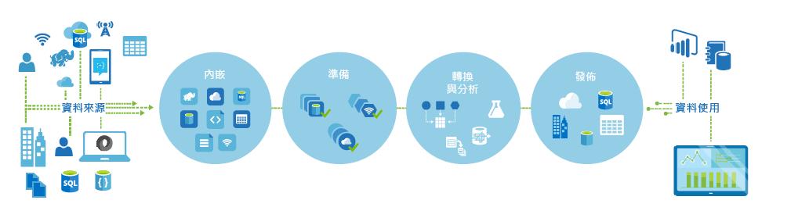
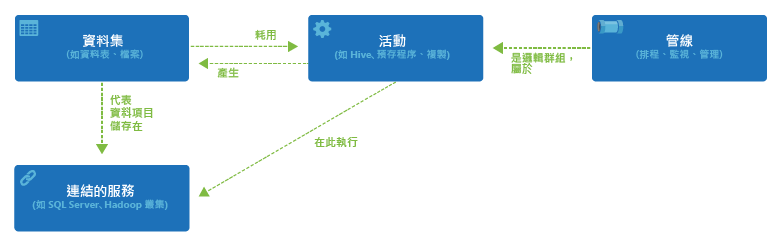

<properties 
	pageTitle="Azure Data Factory 簡介" 
	description="了解如何使用 Azure Data Factory 服務撰寫資料處理、資料儲存和資料移動服務，以建立產生可信資訊的管線。" 
	services="data-factory" 
	documentationCenter="" 
	authors="spelluru" 
	manager="jhubbard" 
	editor="monicar"/>

<tags 
	ms.service="data-factory" 
	ms.workload="data-services" 
	ms.tgt_pltfrm="na" 
	ms.devlang="na" 
	ms.topic="get-started-article" 
	ms.date="02/09/2016" 
	ms.author="spelluru"/>

# Azure Data Factory 服務簡介

## 概觀
Data Factory 是雲端架構資料整合服務，用來協調以及自動移動和轉換資料。就像製造廠運轉設備來取得原物料並將之轉換成成品一樣，Data Factory 會協調現有服務的流程來收集原始資料，並將之轉換成隨時可用的資訊。

Data Factory 會在內部部署、雲端資料來源和 SaaS 之間運作，以便擷取、準備、轉換、分析及發行您的資料。利用 [Azure HDInsight (Hadoop)](http://azure.microsoft.com/documentation/services/hdinsight/) 和 [Azure Batch](https://azure.microsoft.com/documentation/services/batch/) 這類的服務，使用 Data Factory 將服務撰寫到所管理的資料流程管線，以符合計算巨量資料的需求，另外也可以使用 [Azure Machine Learning](https://azure.microsoft.com/documentation/services/machine-learning/) 實施您的分析解決方案。不僅僅是表格式的監視檢視，還使用了豐富的視覺效果呈現 Data Factory，來快速顯示歷程和資料管線之間的相依性。從單一的統一檢視來監視所有的資料流程管線，輕鬆找出問題並設定監視警示。

**圖 1。** 從許多不同的內部部署資料來源收集資料、擷取和準備資料，透過各種轉換來組織並分析資料，然後發行隨時可用的資料以供使用。

您可以視需求隨時使用 Data Factory，在可靠的排程下收集各種外型和大小的資料，並加以轉換和發行，以便得到深入的了解。Data Factory 用來建立高度可用的資料流管線，適用於不同產業中的許多案例並滿足其分析管的需求。線上零售商根據客戶瀏覽行為利用它來產生個人化[產品建議](data-factory-product-reco-usecase.md)。遊戲工作室利用它來了解[其行銷活動的效率](data-factory-customer-profiling-usecase.md)。藉由檢閱[客戶個案研究](data-factory-customer-case-studies.md)，直接向我們的客戶了解他們使用 Data Factory 的方法和原因。

> [AZURE.VIDEO azure-data-factory-overview]

## 重要概念

Azure Data Factory 有幾個主要實體會共同運作，來定義輸入和輸出資料、處理事件以及執行指定之資料流程所需的排程和資源。

**圖 2.** 資料集、活動、管線和連結服務之間的關聯性。

### 活動
活動會定義在您資料上執行的動作。每個活動會取得零或多個[資料集](data-factory-create-datasets.md)做為輸入，並產生一或多個資料集做為輸出。活動代表 Azure Data Factory 中的協調流程單位。例如，您可能會使用[複製活動](data-factory-data-movement-activities.md)來協調從一個資料集複製資料到另一個資料集的流程。同樣地，您可能會使用在 Azure HDInsight 叢集上執行 Hive 查詢的 [Hive 活動](data-factory-data-transformation-activities.md)，來轉換或分析您的資料。Azure Data Factory 提供大量的資料轉換、分析和資料移動活動。

### 管線
[管線](data-factory-create-pipelines.md)是活動的邏輯性群組。可用來將活動群組成一個單位，共同執行任務。比方說，清除記錄檔資料可能需要照順序進行數個轉換活動。此順序可能會有複雜的排程和相依性，需要加以協調流程並自動化。這些活動全都可以群組成名為 “CleanLogFiles” 的單一管線。接著 “CleanLogFiles” 就能夠以單一單位來進行部署、排程或刪除，而不需要一一管理各個活動。

### 資料集
[資料集](data-factory-create-datasets.md)是具名的參考/指標，指向您要用來當做活動輸入或輸出的資料。資料集會在包括資料表、檔案、資料夾和文件在內的各種資料存放區中，識別資料結構。

### 連結的服務
連結的服務會定義 Data Factory 所需的資訊，以便連接到外部資源。Data Factory 中的連結服務，有兩個用途：

- 用來代表資料存放區，其中包含 (但不限於) 內部部署 SQL Server、Oracle DB、檔案共用或 Azure Blob Storage 帳戶。如前所述，資料集代表透過連結服務連接到 Data Factory 之資料存放區中的架構。
- 用來代表可裝載活動執行的計算資源。例如，“HDInsightHive Activity” 會在 HDInsight Hadoop 叢集上執行。

有了資料集、活動、管線和連結的服務這四個簡單的概念之後，您隨時可以開始使用！ 您可以從頭開始[建置您的第一個管線](data-factory-build-your-first-pipeline.md)，或是依照我們 [Data Factory 範例](data-factory-samples.md)文章中的指示，部署現成的樣本。

## 支援的區域
目前您可以在**美國西部**和**北歐**區域建立 Data Factory。不過，Data Factory 可以存取其他 Azure 區域的資料存放區和計算資料，以在資料存放區之間移動資料或使用計算服務處理資料。

Azure Data Factory 本身不會儲存任何資料。它可讓您建立資料驅動的流程，以協調[所支援資料存放區](data-factory-data-movement-activities.md#supported-data-stores)之間的資料移動，以及使用[計算服務](data-factory-compute-linked-services.md)在其他區域或內部部署環境中處理資料。它也可讓您使用程式設計方式和 UI 機制[監視和管理工作流程](data-factory-monitor-manage-pipelines.md)。

請注意，即使 Azure Data Factory 只能在**美國西部**和**北歐**區域使用，但 Data Factory 中支援資料移動的服務可在[全球](data-factory-data-movement-activities.md#global)好幾個區域中使用。如果資料存放區位於防火牆後面，則會改由內部部署環境中所安裝的[資料管理閘道器](data-factory-move-data-between-onprem-and-cloud.md)移動資料。

如需範例，讓我們假設您的計算環境 (例如 Azure HDInsight 叢集和 Azure 機器學習服務) 即將用盡西歐區域的資源。您可以在北歐建立和運用 Azure Data Factory 執行個體，並用它排程您在西歐區域之計算環境上的工作。只要幾毫秒的時間，Data Factory 服務就能觸發計算環境上的作業，但執行計算環境上作業所需的時間則不會改變。

未來我們計畫讓 Azure 在每個地理位置都能支援 Azure Data Factory。
  

<!---HONumber=AcomDC_0302_2016-->