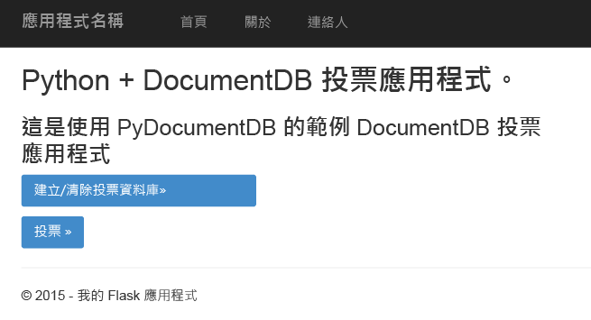
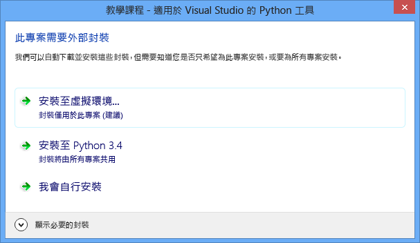
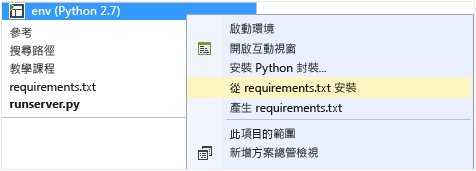
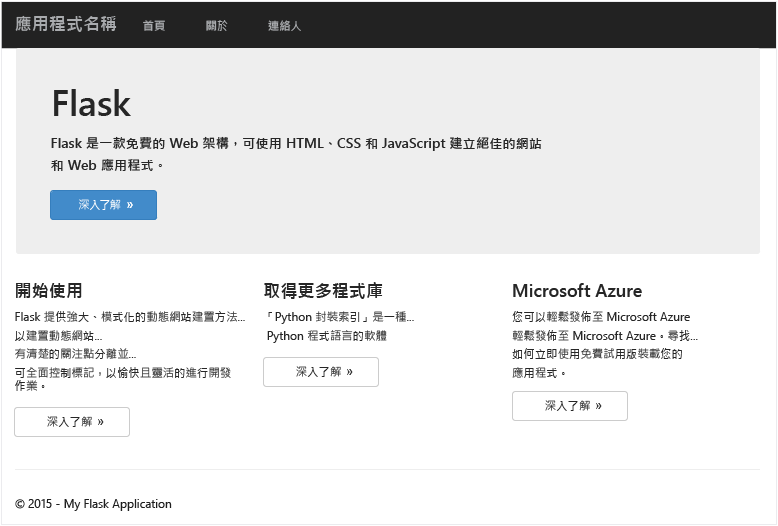
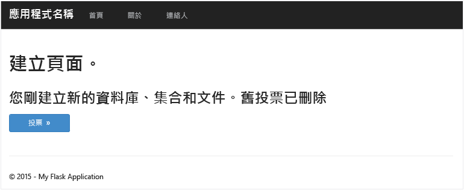
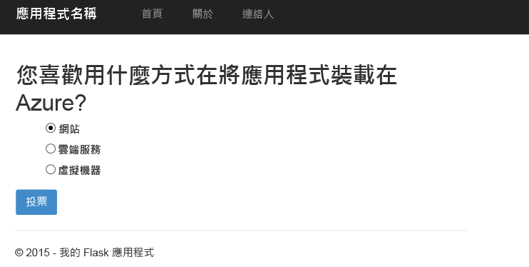
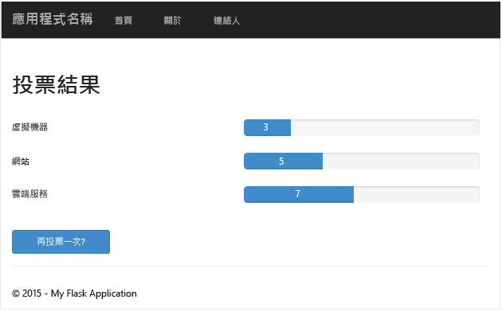

<properties
    pageTitle="使用 DocumentDB 進行 Python Flask Web 應用程式開發 | Microsoft Azure"
    description="檢閱有關如何使用 DocumentDB 來儲存和存取 Azure 上主控之 Python Flask Web 應用程式資料的資訊。尋找應用程式開發解決方案。" 
	keywords="Application development, database tutorial, python flask, python web application, python web development, documentdb, azure, Microsoft azure"
    services="documentdb"
    documentationCenter="python"
    authors="ryancrawcour"
    manager="jhubbard"
    editor="cgronlun"/>

<tags
    ms.service="documentdb"
    ms.workload="data-management"
    ms.tgt_pltfrm="na"
    ms.devlang="python"
    ms.topic="hero-article"
    ms.date="09/21/2015"
    ms.author="ryancraw"/>

# 使用 DocumentDB 進行 Python Flask Web 應用程式開發

為了特別說明客戶要如何有效率地利用 Azure DocumentDB 來儲存和查詢 JSON 文件，本文件提供如何使用 Azure Document DB 建置投票 Web 應用程式的端對端 Python Web 應用程式教學課程。

本教學課程說明如何使用 Azure 所提供的 DocumentDB 服務，來儲存和存取 Azure 上所託管 Python Web 應用程式的資料，並假設您先前已有使用 Python 和 Azure 網站的經驗。

此資料庫教學課程涵蓋：

1. 建立和佈建 DocumentDB 帳戶。
2. 建立 Python MVC 應用程式。
3. 從 Web 應用程式連線到 Azure DocumentDB 和使用 Azure DocumentDB。
4. 將 Web 應用程式部署至 Azure 網站。

按照本教學課程進行後，您將建置可讓您舉行投票活動的簡單投票應用程式。

## 資料庫教學課程必要條件

在依照本文中的指示進行之前，您應確定已安裝下列項目：

- [Visual Studio 2013](http://www.visualstudio.com/) 或更高版本，或免費版本的 Visual Studio Express。
- [這裡][]的 Python Tools for Visual Studio。
- [這裡][1]提供的 Azure SDK for Visual Studio 2013 2.4 版或更高版本。
- [這裡][2]的 Python 2.7。
- [這裡][3]的 Microsoft Visual C++ Compiler for Python 2.7。

## 步驟 1：建立 DocumentDB 資料庫帳戶

讓我們從建立 DocumentDB 帳戶開始。如果您已經擁有帳戶，可以跳到[步驟 2：建立新的 Python Flask Web 應用程式](#Step-2:-Create-a-new-Python-Flask-Web-Application)。

[AZURE.INCLUDE [documentdb-create-dbaccount](../../includes/documentdb-create-dbaccount.md)]

[AZURE.INCLUDE [documentdb-keys](../../includes/documentdb-keys.md)]

 我們現在將從頭開始逐步解說如何建立新的 Python Flask Web 應用程式。

## 步驟 2：建立新的 Python Flask Web 應用程式

1. 開啟 Visual Studio，並依序按一下 [檔案] -> [新增專案] -> [Python] -> [Flask Web 專案]，然後建立名為 **tutorial** 的新專案。

	對於 Python Flask 的初學者而言，此 Web 應用程式開發架構可協助我們在 Python 中更快速地建置 Web 應用程式。[按一下這裡可存取 Flask 教學課程][] (英文)。

	![Visual Studio 中左側為反白顯示的 Python、中間為選取的「Python Flask Web 專案」，以及 [名稱] 方塊中名稱為 tutorial 的 [新增專案] 視窗螢幕擷取畫面](./media/documentdb-python-application/image9.png)

2. 系統會詢問您是否要安裝外部套件。按一下 [安裝到虛擬環境]。因為 PyDocumentDB 目前不支援 Python 3.x，所以請務必使用 Python 2.7 做為基底環境。這會設定專案所需的 Python 虛擬環境。

	

## 步驟 3：修改 Python Flask Web 應用程式

### 將 Python Flask 封裝新增至專案

專案設定好之後，您需要新增專案所需的特定 Flask 封裝，包括 pydocumentdb (DocumentDB 的 Python 封裝)。

1. 開啟名為 **requirements.txt** 的檔案，並以下列內容取代：

    	flask==0.9
    	flask-mail==0.7.6
    	sqlalchemy==0.7.9
    	flask-sqlalchemy==0.16
    	sqlalchemy-migrate==0.7.2
    	flask-whooshalchemy==0.55a
    	flask-wtf==0.8.4
    	pytz==2013b
    	flask-babel==0.8
    	flup
    	pydocumentdb>=1.0.0

2. 以滑鼠右鍵按一下 [env]，然後按一下 [從 requirements.txt 安裝]。

	

> [AZURE.NOTE]在罕見情況下，輸出視窗中可能會出現失敗。如果發生此情形，請檢查錯誤是否與清除有關。有時是清理失敗，但安裝卻成功 (在輸出視窗中向上捲動來驗證這一點)。如果發生這種情況，您可以放心繼續進行。

### 驗證虛擬環境

讓我們來確定一切都安裝正確。

- 按下 **F5** 啟動網站。這會啟動 Flask 開發伺服器和您的網頁瀏覽器。應該會出現下列網頁。

	

### 建立資料庫、集合和文件定義

現在讓我們建立您的投票應用程式。

- 在 [方案總管] 中，以滑鼠右鍵按一下名為 **tutorial** 的資料夾來新增 Python 檔案。將檔案命名為 **forms.py**。  

    	from flask.ext.wtf import Form
    	from wtforms import RadioField

    	class VoteForm(Form):
        	deploy_preference  = RadioField('Deployment Preference', choices=[
            	('Web Site', 'Web Site'),
            	('Cloud Service', 'Cloud Service'),
            	('Virtual Machine', 'Virtual Machine')], default='Web Site')

### 將必要匯入新增至 views.py

- 在 **views.py** 頂端新增下列匯入陳述式。這些陳述式會匯入 DocumentDB 的 PythonSDK 和 Flask 封裝。

    	from forms import VoteForm
    	import config
    	import pydocumentdb.document_client as document_client

### 建立資料庫、集合和文件

- 將下列程式碼新增至 **views.py**。此程式碼可建立表單所使用的資料庫。請勿刪除 **views.py** 中的任何現有程式碼。只需將它附加至結尾。

    	@app.route('/create')
    	def create():
        	"""Renders the contact page."""
        	client = document_client.DocumentClient(config.DOCUMENTDB_HOST, {'masterKey': config.DOCUMENTDB_KEY})

        	# Attempt to delete the database.  This allows this to be used to recreate as well as create
        	try:
            	db = next((data for data in client.ReadDatabases() if data['id'] == config.DOCUMENTDB_DATABASE))
            	client.DeleteDatabase(db['_self'])
        	except:
            	pass

       		# Create database
        	db = client.CreateDatabase({ 'id': config.DOCUMENTDB_DATABASE })
        	# Create collection
        	collection = client.CreateCollection(db['_self'],{ 'id': config.DOCUMENTDB_COLLECTION }, { 'offerType': 'S1' })
        	# Create document
        	document = client.CreateDocument(collection['_self'],
            	{ 'id': config.DOCUMENTDB_DOCUMENT,
            	'Web Site': 0,
            	'Cloud Service': 0,
            	'Virtual Machine': 0,
            	'name': config.DOCUMENTDB_DOCUMENT })

        	return render_template(
            	'create.html',
            	title='Create Page',
            	year=datetime.now().year,
            	message='You just created a new database, collection, and document.  Your old votes have been deleted')

> [AZURE.TIP]**CreateCollection** 方法會採用選擇性的 **RequestOptions** 做為第三個參數。這可以用來指定集合的優惠類型。如果未提供 offerType 值，則將會使用預設的優惠類型來建立集合。如需 DocumentDB 優惠類型的詳細資訊，請參閱 [DocumentDB 中的效能層級](documentdb-performance-levels.md)。
>
### 讀取資料庫、集合、文件並送出表單

- 將下列程式碼新增至 **views.py**。此程式碼可設定表單並讀取資料庫、集合和文件。請勿刪除 **views.py** 中的任何現有程式碼。只需將它附加至結尾。

    	@app.route('/vote', methods=['GET', 'POST'])
    	def vote():
        	form = VoteForm()
        	replaced_document ={}
        	if form.validate_on_submit(): # is user submitted vote  
            	client = document_client.DocumentClient(config.DOCUMENTDB_HOST, {'masterKey': config.DOCUMENTDB_KEY})

            	# Read databases and take the first since the id should not be duplicated.
            	db = next((data for data in client.ReadDatabases() if data['id'] == config.DOCUMENTDB_DATABASE))

            	# Read collections and take the first since the id should not be duplicated.
            	coll = next((coll for coll in client.ReadCollections(db['_self']) if coll['id'] == config.DOCUMENTDB_COLLECTION))

            	# Read documents and take the first since the id should not be duplicated.
            	doc = next((doc for doc in client.ReadDocuments(coll['_self']) if doc['id'] == config.DOCUMENTDB_DOCUMENT))

            	# Take the data from the deploy_preference and increment your database
            	doc[form.deploy_preference.data] = doc[form.deploy_preference.data] + 1
            	replaced_document = client.ReplaceDocument(doc['_self'], doc)

            	# Create a model to pass to results.html
            	class VoteObject:
                	choices = dict()
                	total_votes = 0

            	vote_object = VoteObject()
            	vote_object.choices = {
                	"Web Site" : doc['Web Site'],
                	"Cloud Service" : doc['Cloud Service'],
                	"Virtual Machine" : doc['Virtual Machine']
            	}
            	vote_object.total_votes = sum(vote_object.choices.values())

            	return render_template(
                	'results.html',
                	year=datetime.now().year,
                	vote_object = vote_object)

        	else :
            	return render_template(
                	'vote.html',
                	title = 'Vote',
                	year=datetime.now().year,
                	form = form)

### 建立 HTML 檔案

在 [範本] 資料夾下，新增下列 html 檔案：create.html、results.html、vote.html。

1. 將下列程式碼新增至 **create.html**。此程式碼可顯示訊息，指出我們已建立新的資料庫、集合和文件。

    	
    	
    	<h2>{{ title }}.</h2>
    	<h3>{{ message }}</h3>
    	
<a href="{{ url_for('vote') }}" class="btn btn-primary btn-large">Vote &raquo;</a>

    	

2. 將下列程式碼新增至 **results.html**。此程式碼可顯示投票結果。

    	
    	
    	<h2>Results of the vote</h2>
   	 	 

    	
    	

        	
{{choice}}

        	

            	

                	

                    	{{vote_object.choices[choice]}}
                	

            	

        	

    	

    	

    	 
    	<a class="btn btn-primary" href="{{ url_for('vote') }}">Vote again?</a>
    	

3. 將下列程式碼新增至 **vote.html**。此程式碼可顯示投票以及接受投票。註冊投票時，控制權會傳遞給 views.py，我們將在其中辨識投票以及相應地附加文件。

    	
    	
    	<h2>What is your favorite way to host an application on Azure?</h2>
    	<form action="" method="post" name="vote">
        	{{form.hidden_tag()}}
        	{{form.deploy_preference}}
        	<button class="btn btn-primary" type="submit">Vote</button>
    	</form>
    	

4. 使用下列程式碼取代 **index.html** 的內容。此程式碼可做為您應用程式的登陸頁面。

    	
    	
    	<h2>Python + DocumentDB Voting Application.</h2>
    	<h3>This is a sample DocumentDB voting application using PyDocumentDB</h3>
    	
<a href="{{ url_for('create') }}" class="btn btn-primary btn-large">Create/Clear the Voting Database &raquo;</a>

    	
<a href="{{ url_for('vote') }}" class="btn btn-primary btn-large">Vote &raquo;</a>

    	

### 新增組態檔並變更 \_\_init\_\_.py

1. 以滑鼠右鍵按一下專案名稱 tutorial，並新增檔案 **config.py**。Flask 中的表單需要使用此組態檔案。您也可以用它來提供秘密金鑰。但本教學課程不需要用到此金鑰。

2. 將下列程式碼新增至 config.py。變更 **DOCUMENTDB\_HOST** 和 **DOCUMENTDB\_KEY** 的值。

    	CSRF_ENABLED = True
    	SECRET_KEY = 'you-will-never-guess'

    	DOCUMENTDB_HOST = 'https://YOUR_DOCUMENTDB_NAME.documents.azure.com:443/'
    	DOCUMENTDB_KEY = 'YOUR_SECRET_KEY_ENDING_IN_=='

    	DOCUMENTDB_DATABASE = 'voting database'
    	DOCUMENTDB_COLLECTION = 'voting collection'
    	DOCUMENTDB_DOCUMENT = 'voting document'

3. 同樣地，使用下列資訊取代 **\_\_init\_\_.py** 的內容。

    	from flask import Flask
    	app = Flask(__name__)
    	app.config.from_object('config')
    	import tutorial.views

4. 按照上面所說的步驟進行之後，方案總管的外觀應該會變成下面這樣。

	![Visual Studio [方案總管] 視窗的螢幕擷取畫面](./media/documentdb-python-application/image15.png)

## 步驟 4：在本機執行您的 Web 應用程式

1. 按下 F5 或按一下 Visual Studio 中的 [執行] 按鈕，您應該就會在畫面上看到下列內容。

	

2. 按一下 [建立/清除投票資料庫] 來產生資料庫。

	

3. 然後，按一下 [投票]，並選取您的選項。

	

4. 對於您投的每張票，都會讓適當的計數器數字遞增。

	

## 步驟 5：將 Web 應用程式部署至 Azure 網站

您已經擁有可在DocumentDB 正常運作的完整應用程式，我們現在要將此應用程式部署至 Azure 網站。

1. 在 [方案總管] 的 [專案] 上按一下滑鼠右鍵 (請確定您已沒有在本機上執行此應用程式)，然後選取 [發佈]。接著，選取 [Microsoft Azure 網站]。

 	![[方案總管] 中選取之教學課程 (具有反白顯示的 [發佈] 選項) 的螢幕擷取畫面](./media/documentdb-python-application/image20.png)

2. 設定您的 Azure 網站，方法是提供您的認證並按一下 [發佈]。

	![[發佈 Web] 視窗的螢幕擷取畫面](./media/documentdb-python-application/image21.png)

3. 幾秒後，Visual Studio 便會發佈 Web 應用程式並啟動瀏覽器，您可以在瀏覽器中看到您方便好用的應用程式已在 Azure 中執行！

## 後續步驟

恭喜！ 您剛剛已使用 Azure DocumentDB 建置您的第一個 Python Web 應用程式，並將其發佈至 Azure 網站。

我們會根據您的意見反應，經常更新並改善此主題。當您完成教學課程後，請使用位於此頁面頂端及底部的投票按鈕來投票，並務必對您想看到的改善內容提供您的意見反應。如果想要我們直接與您連絡，歡迎在留言中留下電子郵件地址。

若要將其他功能加入您的 Web 應用程式，請檢閱 [DocumentDB Python SDK](https://pypi.python.org/pypi/pydocumentdb) 中提供的 API。

  [按一下這裡可存取 Flask 教學課程]: http://blog.miguelgrinberg.com/post/the-flask-mega-tutorial-part-i-hello-world
  [Visual Studio Express]: http://www.visualstudio.com/products/visual-studio-express-vs.aspx
  [這裡]: http://aka.ms/ptvs
  [1]: http://go.microsoft.com/fwlink/?linkid=254281&clcid=0x409
  [2]: https://www.python.org/downloads/windows/
  [3]: http://aka.ms/vcpython27
  [Microsoft Web Platform Installer]: http://www.microsoft.com/web/downloads/platform.aspx
  [Azure portal]: http://portal.azure.com

<!---HONumber=Sept15_HO4-->