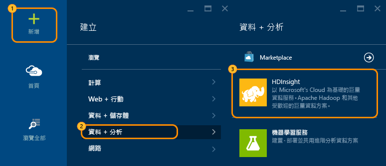
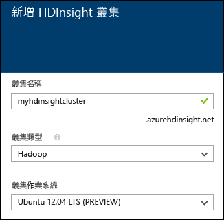
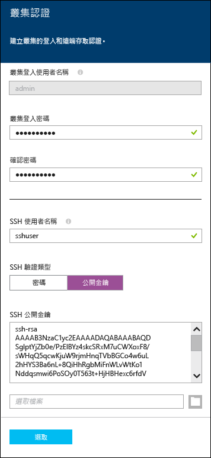
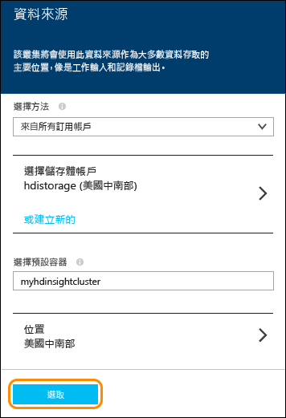
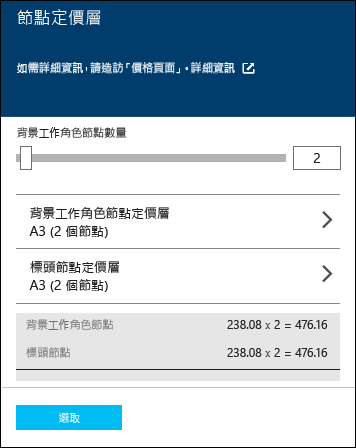

<properties
   	pageTitle="Linux 教學課程：開始使用 Hadoop 和 Hive |Microsoft Azure"
   	description="遵循本 Linux 教學課程，開始在 HDInsight 中使用 Hadoop。了解如何佈建 Linux 叢集，以及使用 Hive 查詢資料。"
   	services="hdinsight"
   	documentationCenter=""
   	authors="nitinme"
   	manager="paulettm"
   	editor="cgronlun"
	tags="azure-portal"/>

<tags
   	ms.service="hdinsight"
   	ms.devlang="na"
   	ms.topic="hero-article"
   	ms.tgt_pltfrm="na"
   	ms.workload="big-data"
   	ms.date="08/07/2015"
   	ms.author="nitinme"/>

# Hadoop 教學課程：在 Linux 開始在 HDInsight 中搭配 Hive 使用 Hadoop (預覽)

> [AZURE.SELECTOR]
- [Windows](hdinsight-hadoop-tutorial-get-started-windows.md)
- [Linux](hdinsight-hadoop-linux-tutorial-get-started.md)

本 Hadoop 教學課程將示範如何在 Linux 上佈建 Hadoop 叢集並執行 Hive 查詢，讓您快速地在 Linux 上開始使用 Azure HDInsight。

> [AZURE.NOTE]如果您是 Hadoop 和巨量資料的新使用者，您可以進一步了解這些術語：<a href="http://go.microsoft.com/fwlink/?LinkId=510084" target="_blank">Apache Hadoop</a><a href="http://go.microsoft.com/fwlink/?LinkId=510086" target="_blank">MapReduce</a>、<a href="http://go.microsoft.com/fwlink/?LinkId=510087" target="_blank">Hadoop 分散式檔案系統 (HDFS)</a> 及 <a href="http://go.microsoft.com/fwlink/?LinkId=510085" target="_blank">Hive</a>。若要了解 HDInsight 如何在 Azure 中啟用 Hadoop，請參閱 [HDInsight 中 Hadoop 的簡介](hdinsight-hadoop-introduction.md)。

## 本教學課程要達成什麼目標？

假設您有一個大型的非結構化資料集，而且您想要在此資料集上執行查詢以擷取一些有用資訊。以下是要達成此目標的作法：

   

## 必要條件

開始進行 Hadoop 的本 Linux 教學課程之前，您必須具備下列條件：

- **Azure 訂用帳戶**。請參閱[取得 Azure 免費試用](http://azure.microsoft.com/documentation/videos/get-azure-free-trial-for-testing-hadoop-in-hdinsight/)。
- **安全殼層 (SSH) 金鑰**。如果您想要使用帶有金鑰的 SSH (而非密碼) 遠端登入到 Linux 叢集。建議使用金鑰的方式，因為它較為安全。如需如何產生 SSH 金鑰的相關指示，請參閱下列文章：
	-  從 Linux 電腦 - [從 Linux、Unix 或 OS X 搭配使用 SSH 與以 Linux 為基礎的 HDInsight (Hadoop)](hdinsight-hadoop-linux-use-ssh-unix.md)。
	-  從 Windows 電腦 - [從 Windows 搭配使用 SSH 與以 Linux 為基礎的 HDInsight (Hadoop)](hdinsight-hadoop-linux-use-ssh-windows.md)。

**預估完成時間：**30 分鐘

## 在 Linux 上佈建 HDInsight 叢集

佈建叢集時，您可以佈建包含 Hadoop 及相關應用程式的 Azure 計算資源。在本節中，您將佈建 HDInsight 3.2 版叢集。您也可以建立其他版本的 Hadoop 叢集。如需相關指示，請參閱〈[使用自訂選項佈建 HDInsight 叢集][hdinsight-provision]〉。如需不同 HDInsight 版本及其 SLA 的相關資訊，請參閱〈[HDInsight 元件版本設定](hdinsight-component-versioning.md)〉。

>[AZURE.NOTE]您也可以建立執行 Windows Server 作業系統的 Hadoop 叢集。如需相關指示，請參閱[在 Windows 上開始使用 HDInsight](hdinsight-hadoop-tutorial-get-started-windows.md)。

**佈建 HDInsight 叢集**

1. 登入 [Azure Preview 入口網站](https://ms.portal.azure.com/)。
2. 請按一下 [新增]、[資料分析]，然後按一下 [HDInsight]。

    

3. 輸入 [叢集名稱]，針對 [叢集類型] 選取 [Hadoop]，然後從 [叢集作業系統] 下拉式清單中選取 [Ubuntu]。如果該叢集可用，其名稱旁會出現綠色核取記號。

	

4. 如果您有多個訂用帳戶，請按一下 [訂用帳戶] 項目，以選取將用於該叢集的 Azure 訂用帳戶。

5. 按一下 [資源群組] 來查看現有資源群組的清單，然後選取其中一個用來建立叢集。或者按一下 [建立新項目]，然後輸入新資源群組的名稱。出現綠色核取記號即表示新群組的名稱可用。

	> [AZURE.NOTE]如果有可用的資源群組，則此項目會預設為現有資源群組的其中一個群組。

6. 按一下 [認證]，然後輸入管理員使用者的密碼。您也必須輸入 [SSH 使用者名稱] 和 [密碼] 或 [公開金鑰]，這會用來驗證 SSH 使用者。建議使用公開金鑰的方法。在底部按一下 [選取] 以儲存認證組態。

	

    > [AZURE.NOTE]SSH 可透過命令列遠端存取 HDInsight 叢集。您在此使用的使用者名稱和密碼或公開金鑰將會在透過 SSH 連接到叢集時使用。此外，SSH 使用者名稱必須是唯一的，因為該名稱會在所有 HDInsight 叢集節點上建立使用者帳戶。以下是一些保留給叢集上的服務使用的帳戶名稱，不能做為 SSH 使用者名稱︰
    >
    > root、hdiuser、storm、hbase、ubuntu、zookeeper、hdfs、yarn、mapred、hbase、hive、oozie、falcon、sqoop、admin、tez、hcat、hdinsight-zookeeper。

	如需搭配 HDInsight 使用 SSH 的詳細資訊，請參閱下列其中一份文件：

	* [從 Linux、Unix 或 OS X 在 HDInsight 上搭配使用 SSH 與以 Linux 為基礎的 Hadoop](hdinsight-hadoop-linux-use-ssh-unix.md)
	* [從 Windows 在 HDInsight 上搭配使用 SSH 與以 Linux 為基礎的 Hadoop](hdinsight-hadoop-linux-use-ssh-windows.md)

7. 按一下 [資料來源] 選擇該叢集的現有資料來源，或建立一個新的資料來源。當您在 HDInsight 中佈建 Hadoop 叢集時，您需要指定一個 Azure 儲存體帳戶。該帳戶特定的 Blob 儲存體容器將被指定為預設檔案系統，如同 Hadoop 分散式檔案系統 (HDFS)。依預設，系統會在與您指定儲存體帳戶的相同資料中心內佈建 HDInsight 叢集。如需詳細資訊，請參閱＜[搭配 HDInsight 使用 Azure Blob 儲存體](hdinsight-use-blob-storage.md)＞。

	

	目前您可以選取 Azure 儲存體帳戶做為 HDInsight 叢集資料來源。請使用下列步驟來了解 [資料來源] 刀鋒視窗上的項目。

	- **選取方法**：將此設為 [來自所有訂用帳戶]，即可瀏覽您所有訂用帳戶中的儲存體帳戶。如果您想要輸入現有儲存體帳戶的 [儲存體名稱] 和 [存取金鑰]，請將此設為 [存取金鑰]。

	- **選取儲存體帳戶 / 建立新的**：請按一下 [選取儲存體帳戶] 來瀏覽並選取您要與叢集關聯的現有儲存體帳戶。或按一下 [建立新項目] 來建立新的儲存體帳戶。使用出現的欄位輸入儲存體帳戶名稱。如果該名稱可用，將會出現綠色核取記號。

	- **選擇預設容器**：使用此選項可輸入要用於該叢集的預設容器名稱。雖然您可以輸入任何名稱，但我們建議您使用與叢集相同的名稱，以便輕易辨識用於這個特定叢集的容器。

	- **位置**：儲存體帳戶所在或將建立帳戶的地理區域。

		> [AZURE.IMPORTANT]選取預設資料來源位置的同時，也會設定 HDInsight 叢集位置。叢集和預設資料來源必須位於相同區域中。

	按一下 [選取] 以儲存資料來源組態。

8. 按一下 [節點定價層] 會顯示將針對此叢集建立之節點的相關資訊。設定該叢集所需的背景工作節點數目。該叢集的預估成本將會顯示在此刀鋒視窗內。

	

	按一下 [選取] 以儲存此節點定價組態。

9. 在 [新的 HDInsight 叢集] 刀鋒視窗中，確認已選取 [釘選到開始面板]，然後按一下 [建立]。這將會建立叢集，並將該叢集磚加入到您 Azure 入口網站的「開始面板」。該圖示可表示該叢集正在佈建，並將在佈建完成後變更為 HDInsight 圖示。

佈建期間|佈建完成
------------------|---------------------
	|

> [AZURE.NOTE]建立叢集需要一些時間，通常約 15 分鐘左右。使用「開始面板」上的圖格或頁面左邊的 [通知] 項目，檢查佈建處理序。

佈建完成後，在「開始面板」按一下該叢集的圖格，以啟動叢集刀鋒視窗。

## 在叢集上提交 Hive 工作
現在您已佈建 HDInsight Linux 叢集，下一個步驟是執行範例 Hive 工作，以查詢 HDInsight 叢集隨附的範例資料 (sample.log)。範例資料包含記錄資訊，包括追蹤、警告、資訊及錯誤。我們查詢此資料以擷取具有特定嚴重性的所有錯誤記錄。您必須執行下列步驟以在 HDInsight Linux 叢集上執行 Hive 查詢：

- 連接到 Linux 叢集
- 執行 Hive 工作

### 連接到叢集

您可以從 Linux 電腦或以 Windows 為基礎的電腦使用 SSH 連線到 Linux 上的 HDInsight 叢集。

**從 Linux 電腦連線**

1. 開啟終端機並輸入下列命令：

		ssh <username>@<clustername>-ssh.azurehdinsight.net

	因為您是使用 [快速建立] 選項佈建叢集，預設的 SSH 使用者名稱是 **hdiuser**。因此，命令必須是：

		ssh hdiuser@myhdinsightcluster-ssh.azurehdinsight.net

2. 出現提示時，輸入您在佈建叢集時所提供的密碼。成功連線後，提示將變更如下：

		hdiuser@headnode-0:~$

**從以 Windows 為基礎的電腦連線**

1. 下載以 Windows 為基礎的用戶端的 <a href="http://www.chiark.greenend.org.uk/~sgtatham/putty/download.html" target="_blank">PuTTY</a>。

2. 開啟 PuTTY。在 [**類別**] 中，按一下 [**工作階段**]。在 [**PuTTY 工作階段的基本選項**] 畫面上，將您的 HDInsight 伺服器的 SSH 位址輸入到 [**主機名稱 (或 IP 位址)**] 欄位。SSH 位址是叢集名稱加上 **-ssh.azurehdinsight.net**。例如，**myhdinsightcluster-ssh.azurehdinsight.net**。

	

3. 若要儲存連線資訊供日後使用，請在 [**儲存的工作階段**] 底下輸入此連線的名稱，然後按一下 [**儲存**]。連線便會加入已儲存的工作階段清單。

4. 按一下 [**開啟**] 來連線到叢集。在提示輸入使用者名稱時，請輸入 **hdiuser**。至於密碼，請輸入您在佈建叢集時指定的密碼。成功連線後，提示將變更如下：

		hdiuser@headnode-0:~$

### 執行 Hive 工作

透過 SSH 連線到叢集後，請使用下列命令來執行 Hive 查詢。

1. 在提示中使用下列命令來啟動 Hive 命令列介面 (CLI)：

		hive

2. 在 CLI 中輸入下列陳述式，使用叢集上已有的範例資料建立新的資料表 **log4jLogs**。

		DROP TABLE log4jLogs;
		CREATE EXTERNAL TABLE log4jLogs(t1 string, t2 string, t3 string, t4 string, t5 string, t6 string, t7 string)
		ROW FORMAT DELIMITED FIELDS TERMINATED BY ' '
		STORED AS TEXTFILE LOCATION 'wasb:///example/data/';
		SELECT t4 AS sev, COUNT(*) AS cnt FROM log4jLogs WHERE t4 = '[ERROR]' GROUP BY t4;

	這些陳述式將執行下列動作：

	- **DROP TABLE** - 刪除資料表和資料檔 (如果資料表已存在)
	- **CREATE EXTERNAL TABLE** - 在 Hive 中建立新的「外部」資料表。外部資料表只會在 Hive 中儲存資料表定義；資料會保留在原始位置。
	- **ROW FORMAT** - 告訴 Hive 如何格式化資料。在此情況下，每個記錄中的欄位會以空格隔開。
	- **STORED AS TEXTFILE LOCATION** - 將資料的儲存位置告訴 Hive (example/data 目錄)，且資料儲存為文字。
	- **SELECT** - 選擇其資料欄 t4 包含值 [ERROR] 的所有資料列計數。

	>[AZURE.NOTE]當您預期以外部來源更新基礎資料 (例如自動化資料上傳程序)，或以其他 MapReduce 作業更新基礎資料，但希望 Hive 查詢一律使用最新資料時，必須使用外部資料表。捨棄外部資料表並*不*會刪除資料，只會刪除資料表定義。

	這會傳回下列輸出：

		Query ID = hdiuser_20150116000202_cceb9c6b-4356-4931-b9a7-2c373ebba493
		Total jobs = 1
		Launching Job 1 out of 1
		Number of reduce tasks not specified. Estimated from input data size: 1
		In order to change the average load for a reducer (in bytes):
		  set hive.exec.reducers.bytes.per.reducer=<number>
		In order to limit the maximum number of reducers:
		  set hive.exec.reducers.max=<number>
		In order to set a constant number of reducers:
		  set mapreduce.job.reduces=<number>
		Starting Job = job_1421200049012_0006, Tracking URL = <URL>:8088/proxy/application_1421200049012_0006/
		Kill Command = /usr/hdp/2.2.1.0-2165/hadoop/bin/hadoop job  -kill job_1421200049012_0006
		Hadoop job information for Stage-1: number of mappers: 1; number of reducers: 1
		2015-01-16 00:02:40,823 Stage-1 map = 0%,  reduce = 0%
		2015-01-16 00:02:55,488 Stage-1 map = 100%,  reduce = 0%, Cumulative CPU 3.32 sec
		2015-01-16 00:03:05,298 Stage-1 map = 100%,  reduce = 100%, Cumulative CPU 5.62 sec
		MapReduce Total cumulative CPU time: 5 seconds 620 msec
		Ended Job = job_1421200049012_0006
		MapReduce Jobs Launched:
		Stage-Stage-1: Map: 1  Reduce: 1   Cumulative CPU: 5.62 sec   HDFS Read: 0 HDFS Write: 0 SUCCESS
		Total MapReduce CPU Time Spent: 5 seconds 620 msec
		OK
		[ERROR]    3
		Time taken: 60.991 seconds, Fetched: 1 row(s)

	請注意，輸出會包含 **[ERROR] 3**，這是因為有三個資料列包含此值。

3. 使用下列陳述式來建立名為 **errorLogs** 的新的「內部」資料表：

		CREATE TABLE IF NOT EXISTS errorLogs (t1 string, t2 string, t3 string, t4 string, t5 string, t6 string, t7 string) STORED AS ORC;
		INSERT OVERWRITE TABLE errorLogs SELECT t1, t2, t3, t4, t5, t6, t7 FROM log4jLogs WHERE t4 = '[ERROR]';

	這些陳述式將執行下列動作：

	- **CREATE TABLE IF NOT EXISTS** - 建立資料表 (如果不存在)。因為未使用 **EXTERNAL** 關鍵字，所以這是內部資料表，而內部資料表儲存在 Hive 資料倉儲中，並完全透過 Hive 所管理。與外部資料表不同，捨棄內部資料表也會同時刪除基礎資料。
	- **STORED AS ORC** - 以最佳化資料列單欄式 (Optimized Row Columnar, ORC) 格式儲存資料。這是高度最佳化且有效率的 Hive 資料儲存格式。
	- **INSERT OVERWRITE ...SELECT** - 從包含 [ERROR] 的 **log4jLogs** 資料表選取資料列，然後將資料插入 **errorLogs** 資料表。

4. 若要確認是否只有資料欄 t4 中包含 [ERROR] 的資料列會儲存至 **errorLogs** 資料表，請使用下列陳述式，從 **errorLogs** 傳回所有資料列：

		SELECT * from errorLogs;

	主控台上應該會顯示下列輸出：

		2012-02-03	18:35:34	SampleClass0	[ERROR]	 incorrect		id
		2012-02-03	18:55:54	SampleClass1	[ERROR]	 incorrect		id
		2012-02-03	19:25:27	SampleClass4	[ERROR]	 incorrect		id
		Time taken: 0.987 seconds, Fetched: 3 row(s)

	傳回的資料應該會全都對應至 [ERROR] 記錄檔。

## 接續步驟
在本 Linux 教學課程中，您已經學會如何使用 HDInsight 在 Linux 上佈建 Hadoop 叢集並使用 SSH 在叢集上執行 Hive 查詢。若要深入了解，請參閱下列文章：

- [使用 Ambari 管理 HDInsight 叢集](hdinsight-hadoop-manage-ambari.md)：以 Linux 為基礎的 HDInsight 叢集使用 Ambari 來管理和監控 Hadoop 服務。在 https://CLUSTERNAME.azurehdinsight.net 的每個叢集上皆可使用 Ambari Web UI。

	> [AZURE.IMPORTANT]相較於許多 Ambari Web 區段都是透過網際網路直接存取，Hadoop 服務的 Web UI (例如 [資源管理員] 或 [工作歷程記錄]) 則需要使用 SSH 通道。如需以 HDInsight 使用 SSH 通道的詳細資訊，請參閱下列文章：
	>
	> * [從 Linux、Unix 或 OS X 在 HDInsight 上搭配使用 SSH 與以 Linux 為基礎的 Hadoop](hdinsight-hadoop-linux-use-ssh-unix.md#tunnel)
	> * [從 Windows 在 HDInsight 上搭配使用 SSH 與以 Linux 為基礎的 Hadoop](hdinsight-hadoop-linux-use-ssh-windows.md#tunnel)

- [使用自訂選項在 Linux 上佈建 HDInsight](hdinsight-hadoop-provision-linux-clusters.md)：了解如何佈建 HDInsight 叢集的詳細資料。

- [在 Linux 上使用 HDInsight](hdinsight-hadoop-linux-information.md)：如果您已經熟悉 Linux 平台上的 Hadoop，本文件提供 Azure 特定資訊的指引，例如：

	* 裝載於叢集上的服務 (例如 Ambari 和 WebHCat) URL
	* Hadoop 檔案和範例在本機檔案系統上的位置
	* Azure 儲存體 (WASB) (而非 HDFS) 做為預設資料儲存體的使用方式

- 如需 Hive 的詳細資訊，或要了解 Pig 和 MapReduce，請參閱下列文章：

	- 〈[搭配 HDInsight 使用 MapReduce][hdinsight-use-mapreduce]〉
	- 〈[搭配 HDInsight 使用 Hivet][hdinsight-use-hive]〉
	- [搭配 HDInsight 使用 Pig][hdinsight-use-pig]

- 如需如何運用 HDInsight 叢集所使用之 Azure 儲存體的詳細資訊，請參閱下列文章：

	- [在 HDInsight 上使用 Azure Blob 儲存體](../hdinsight-use-blob-storage.md)
	- [將資料上傳至 HDInsight][hdinsight-upload-data]

[1]: ../HDInsight/hdinsight-hadoop-visual-studio-tools-get-started.md

[hdinsight-provision]: hdinsight-provision-clusters.md
[hdinsight-admin-powershell]: hdinsight-administer-use-powershell.md
[hdinsight-upload-data]: hdinsight-upload-data.md
[hdinsight-use-mapreduce]: hdinsight-use-mapreduce.md
[hdinsight-use-hive]: hdinsight-use-hive.md
[hdinsight-use-pig]: hdinsight-use-pig.md

[powershell-download]: http://go.microsoft.com/fwlink/p/?linkid=320376&clcid=0x409
[powershell-install-configure]: ../install-configure-powershell.md
[powershell-open]: ../install-configure-powershell.md#Install

[img-hdi-dashboard]: ./media/hdinsight-hadoop-tutorial-get-started-windows/HDI.dashboard.png
[img-hdi-dashboard-query-select]: ./media/hdinsight-hadoop-tutorial-get-started-windows/HDI.dashboard.query.select.png
[img-hdi-dashboard-query-select-result]: ./media/hdinsight-hadoop-tutorial-get-started-windows/HDI.dashboard.query.select.result.png
[img-hdi-dashboard-query-select-result-output]: ./media/hdinsight-hadoop-tutorial-get-started-windows/HDI.dashboard.query.select.result.output.png
[img-hdi-dashboard-query-browse-output]: ./media/hdinsight-hadoop-tutorial-get-started-windows/HDI.dashboard.query.browse.output.png
[image-hdi-clusterstatus]: ./media/hdinsight-hadoop-tutorial-get-started-windows/HDI.ClusterStatus.png
[image-hdi-gettingstarted-powerquery-importdata]: ./media/hdinsight-hadoop-tutorial-get-started-windows/HDI.GettingStarted.PowerQuery.ImportData.png
[image-hdi-gettingstarted-powerquery-importdata2]: ./media/hdinsight-hadoop-tutorial-get-started-windows/HDI.GettingStarted.PowerQuery.ImportData2.png

<!---HONumber=Sept15_HO3-->