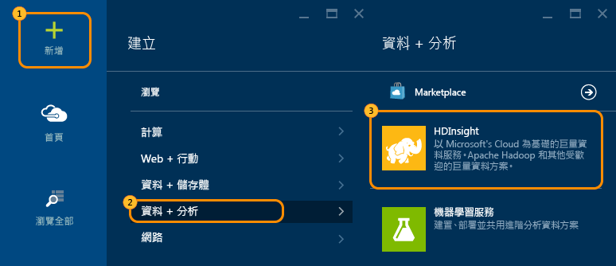
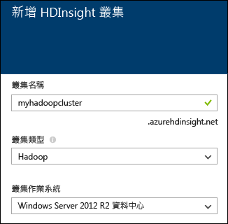
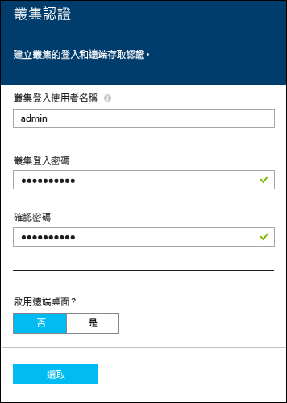
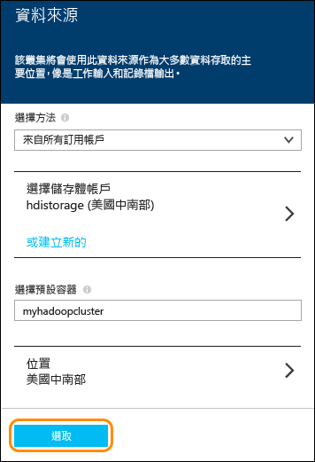
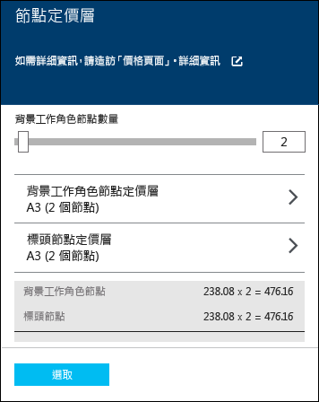

<properties
   pageTitle="Hadoop 教學課程：開始在 Windows 上使用 Hadoop |Microsoft Azure"
   description="開始使用 HDInsight 中的 Hadoop。了解如何在 Windows 上佈建 Hadoop 叢集、在資料上執行 Hive 查詢和在 Excel 中輸出分析。"
   services="hdinsight"
   documentationCenter=""
   authors="nitinme"
   manager="paulettm"
   editor="cgronlun"
   tags="azure-portal"/>

<tags
   ms.service="hdinsight"
   ms.devlang="na"
   ms.topic="hero-article"
   ms.tgt_pltfrm="na"
   ms.workload="big-data"
   ms.date="08/07/2015"
   ms.author="nitinme"/>

# Hadoop 教學課程：開始在 Windows 上使用 Hadoop 與 HDInsight 的 Hive 查詢

> [AZURE.SELECTOR]
- [Windows](../hdinsight-hadoop-tutorial-get-started-windows.md)
- [Linux](../hdinsight-hadoop-linux-tutorial-get-started.md)

為了協助您了解在 Windows 上的 Hadoop 並開始使用 HDInsight，本教學課程為您示範如何在 Hadoop 叢集上執行 Hive 查詢非結構化資料，並且接著在 Microsoft Excel 中分析結果。

[AZURE.INCLUDE [hdinsight-azure-preview-portal](../../includes/hdinsight-azure-preview-portal.md)]

* [開始在 Windows 上的 HDInsight 中使用 Hadoop](hdinsight-hadoop-tutorial-get-started-windows-v1.md)

## 本 Hadoop 教學課程要達到什麼目標？

假設您有一個大型的非結構化資料集，而且您想要在此資料集上執行查詢，以擷取一些有用資訊。這正是我們要在此教學課程中進行的動作。以下是要達成此目標的作法：

   ![Hadoop 教學課程：建立帳戶、佈建 Hadoop 叢集、提交 Hive 查詢和在 Excel 中分析資料。][image-hdi-getstarted-flow]

觀看本教學課程示範影片以了解 HDInsight 上的 Hadoop：

![第一個 Hadoop 教學課程的影片：在 Hadoop 叢集上提交 Hive 查詢，並在 Excel 中分析結果。][img-hdi-getstarted-video]

**[在 YouTube 上觀看 HDInsight 的 Hadoop 教學課程](https://www.youtube.com/watch?v=Y4aNjnoeaHA&list=PLDrz-Fkcb9WWdY-Yp6D4fTC1ll_3lU-QS)**

除了全面供應 Azure HDInsight 之外，Microsoft 還提供 HDInsight Emulator for Azure，先前稱為 *Microsoft HDInsight Developer Preview*。模擬器非常適合開發人員使用，並只支援單一節點部署。如需使用 HDInsight Emulator 的詳細資訊，請參閱〈[開始使用 HDInsight Emulator][hdinsight-emulator]〉。

## 必要條件

開始進行在 Windows 上的 Hadoop 教學課程之前，您必須具備下列條件：

- **Azure 訂用帳戶**。請參閱[取得 Azure 免費試用](http://azure.microsoft.com/documentation/videos/get-azure-free-trial-for-testing-hadoop-in-hdinsight/)。
- 安裝 Office 2013 Professional Plus、Office 365 Pro Plus、Excel 2013 Standalone 或 Office 2010 Professional Plus 的**工作站電腦**。

##佈建 Hadoop 叢集

佈建叢集時，您可以佈建包含 Hadoop 及相關應用程式的 Azure 計算資源。在本節中，您將佈建 HDInsight 3.2 版叢集。您也可以建立其他版本的 Hadoop 叢集。如需相關指示，請參閱〈[使用自訂選項佈建 HDInsight 叢集][hdinsight-provision]〉。如需不同 HDInsight 版本及其 SLA 的相關資訊，請參閱〈[HDInsight 元件版本設定](hdinsight-component-versioning.md)〉。

**佈建 Hadoop 叢集**

1. 登入 [Azure 預覽入口網站](https://ms.portal.azure.com/)。
2. 請按一下 [新增]、[資料分析]，然後按一下 [HDInsight]。

    

3. 輸入 [叢集名稱]，針對 [叢集類型] 選取 [Hadoop]，然後從 [叢集作業系統] 下拉式清單中選取 [Windows Server 2012 R2 資料中心]。如果該叢集可用，其名稱旁會出現綠色核取記號。

	

4. 如果您有多個訂用帳戶，請按一下 [訂用帳戶] 項目，以選取將用於該叢集的 Azure 訂用帳戶。

5. 按一下 [資源群組] 來查看現有資源群組的清單，然後選取其中一個用來建立叢集。或者按一下 [建立新項目]，然後輸入新資源群組的名稱。出現綠色核取記號即表示新群組的名稱可用。

	> [AZURE.NOTE]如果有可用的資源群組，則此項目會預設為現有資源群組的其中一個群組。

6. 按一下 [認證]，然後輸入 [叢集登入使用者名稱] 和 [叢集登入密碼]。如果您想要在叢集節點上啟用遠端桌面，請在 [啟用遠端桌面] 按一下 [是]，然後指定所需的值。本教學課程並不需要遠端桌面，因此您可以略過這個步驟。在底部按一下 [選取] 以儲存認證組態。

	

7. 按一下 [資料來源] 選擇該叢集的現有資料來源，或建立一個新的資料來源。當您在 HDInsight 中佈建 Hadoop 叢集時，您需要指定一個 Azure 儲存體帳戶。該帳戶特定的 Blob 儲存體容器將被指定為預設檔案系統，如同 Hadoop 分散式檔案系統 (HDFS)。依預設，系統會在與您指定儲存體帳戶的相同資料中心內佈建 HDInsight 叢集。如需詳細資訊，請參閱＜[搭配 HDInsight 使用 Azure Blob 儲存體][hdinsight-storage]＞。

	
	
	目前您可以選取 Azure 儲存體帳戶做為 HDInsight 叢集資料來源。請使用下列步驟來了解 [資料來源] 刀鋒視窗上的項目。
	
	- **選取方法**：將此設為 [來自所有訂用帳戶]，即可瀏覽您所有訂用帳戶中的儲存體帳戶。如果您想要輸入現有儲存體帳戶的 [儲存體名稱] 和 [存取金鑰]，請將此設為 [存取金鑰]。
	
	- **選取儲存體帳戶 / 建立新的**：請按一下 [選取儲存體帳戶] 瀏覽並選取您要與叢集相關聯的現有儲存體帳戶。或按一下 [建立新項目] 來建立新的儲存體帳戶。使用出現的欄位輸入儲存體帳戶名稱。如果該名稱可用，將會出現綠色核取記號。
	
	- **選擇預設容器**：使用此選項可輸入要用於該叢集的預設容器名稱。雖然您可以輸入任何名稱，但我們建議您使用與叢集相同的名稱，以便輕易辨識用於這個特定叢集的容器。
	
	- **位置**：儲存體帳戶所在地或將建立的地理區域。
	
		> [AZURE.IMPORTANT]選取預設資料來源位置的同時，也會設定 HDInsight 叢集位置。叢集和預設資料來源必須位於相同區域中。
		
	按一下 [選取] 以儲存資料來源組態。

8. 按一下 [節點定價層] 會顯示將針對此叢集建立之節點的相關資訊。設定該叢集所需的背景工作節點數目。該叢集的預估成本將會顯示在此刀鋒視窗內。

	
	
	按一下 [選取] 以儲存此節點定價組態。

9. 在 [新的 HDInsight 叢集] 刀鋒視窗中，確認已選取 [釘選到開始面板]，然後按一下 [建立]。這將會建立叢集，並將該叢集磚加入到您 Azure 入口網站的「開始面板」。該圖示可表示該叢集正在佈建，並將在佈建完成後變更為 HDInsight 圖示。

	| 佈建期間 | 佈建完成 |
	| ------------------ | --------------------- |
	|  |  |

	> [AZURE.NOTE]建立叢集需要一些時間，通常約 15 分鐘左右。使用「開始面板」上的圖格或頁面左邊的 [通知] 項目，檢查佈建處理序。

10. 佈建完成後，在「開始面板」按一下該叢集磚，以啟動叢集刀鋒視窗。

##從入口網站中執行範例資料

佈建成功的 HDInsight 叢集會提供查詢主控台，其中包括 [開始使用] 資源庫，可從入口網站直接執行範例。您可以利用範例來逐步完成一些基本案例，以了解如何使用 HDInsight。這些範例隨附所有必要的元件，例如要分析的資料及在資料上執行的查詢。若要深入了解 [開始使用] 資源庫中的範例，請參閱〈[使用 HDInsight 開始使用資源庫了解 HDInsight 中的 Hadoop](hdinsight-learn-hadoop-use-sample-gallery.md)〉。

**執行範例**

1. 在 Azure 預覽入口網站「開始面板」按一下您剛才建立的叢集圖格。
 
2. 在新的叢集刀鋒視窗中，按一下 [儀表板]。出現提示時，輸入該叢集的管理員使用者名稱和密碼。

	
 
3. 在開啟的網頁中，按一下 [開始使用資源庫] 索引標籤，然後在 [使用範例資料的解決方案] 類別下，按一下您要執行的範例。請遵循網頁上的指示完成範例。下表列出一些範例，並且提供關於每個範例之用途的詳細資訊。

範例 | 用途
------ | ---------------
[感應器資料分析][hdinsight-sensor-data-sample] | 了解如何使用 HDInsight 來處理暖氣、通風和空調 (HVAC) 系統所產生的歷史資料，以識別無法可靠地維持規定溫度的系統。
[網站記錄分析][hdinsight-weblogs-sample] | 了解如何使用 HDInsight 來分析網站記錄檔，以深入了解一天之中來自外部網站的造訪次數，以及使用者遭遇網站錯誤的摘要。
[Twitter 趨勢分析](hdinsight-analyze-twitter-data.md) | 了解如何使用 HDInsight 來分析 Twitter 的趨勢。

##從入口網站執行 Hive 查詢
您已佈建 HDInsight 叢集，下一個步驟是執行 Hive 工作，以查詢範例 Hive 資料表。我們會使用 HDInsight 叢集隨附的 *hivesampletable*。此資料表會包含行動裝置製造商、平台及模型等資料。使用 Hive 查詢資料表會擷取特定製造商的行動裝置的資料。

> [AZURE.NOTE]HDInsight Tools for Visual Studio 隨附 Azure SDK for .NET 2.5 版或更新版本。您可以使用 Visual Studio 的工具，連線至 HDInsight 叢集、建立 Hive 資料表及執行 Hive 查詢。如需詳細資訊，請參閱〈[開始使用 HDInsight Hadoop Tools for Visual Studio][1]〉。

**從叢集儀表板執行 Hive 工作**

1. 登入 [Azure 入口網站][azure-management-portal]。
2. 按一下左窗格上的 [HDInsight]。您會看見叢集清單，包括您在上一節中建立的叢集。
3. 按一下您要執行 Hive 工作的叢集名稱，然後按一下頁面底部的 [**查詢主控台**]。
4. 網頁會在不同瀏覽器索引標籤中開啟。輸入 Hadoop 使用者帳戶和密碼。預設使用者名稱為 **admin**；密碼是您在佈建叢集時所輸入的密碼。儀表板顯示如下：

	![HDInsight 叢集儀表板中的 [Hive 編輯器] 索引標籤。][img-hdi-dashboard]

	頁面頂端會有數個索引標籤。預設索引標籤為 [**Hive 編輯器**]，其他索引標籤包括 [**工作歷程記錄**] 和 [**檔案瀏覽器**]。您可以使用儀表板提交 Hive 查詢、檢查 Hadoop 工作記錄及瀏覽儲存體中的檔案。

	> [AZURE.NOTE]請注意，網頁的 URL 為 *&lt;ClusterName&gt;.azurehdinsight.net*。因此，與其從入口網站開啟儀表板，您也可以使用 URL 從網頁瀏覽器中開啟儀表板。

6. 在 [Hive Editor] 索引標籤的 [查詢名稱] 中，輸入 **HTC20**。查詢名稱就是工作標題。在查詢窗格中，如圖所示輸入 Hive 查詢：

	![[Hive 編輯器] 查詢窗格中輸入的 Hive 查詢。][img-hdi-dashboard-query-select]

4. 按一下 [提交]。需要一點時間才會取回結果。螢幕每 30 秒會重新整理一次。您也可以按一下 [重新整理] 來重新整理螢幕。

    ![Hive 查詢的結果會列在叢集儀表板底部。][img-hdi-dashboard-query-select-result]

5. 在狀態顯示已完成工作之後，按一下螢幕上的查詢名稱以查看輸出。記下 [工作開始時間 (UTC)]。稍後您將會用到此資訊。

    ![HDInsight 叢集儀表板的 [工作歷程記錄] 索引標籤中列出的 [工作開始時間]。][img-hdi-dashboard-query-select-result-output]

    此頁面也會顯示 [工作輸出] 和 [工作記錄]。您還可以選擇下載輸出檔案 (\_stdout) 和記錄檔 (\_stderr)。

**瀏覽至輸出檔案**

1. 在叢集儀表板中，按一下 [**檔案瀏覽器**]。
2. 依序按一下您的儲存體帳戶名稱、容器名稱 (會與您的叢集名稱相同)，然後按一下 [使用者]。
3. 按一下 [**admin**]，然後按一下其上次修改時間比您先前記下的工作開始時間稍晚的 GUID。複製此 GUID。您在下一節將會用到此號碼。

   	![[檔案瀏覽器] 索引標籤中列出的 Hive 查詢輸出檔案 GUID。][img-hdi-dashboard-query-browse-output]

##適用於 Excel 的連接到 Microsoft 商業智慧工具

您可以使用適用於 Microsoft Excel 的 Power Query 增益集，將工作輸出從 HDInsight 匯入 Excel，然後使用 Microsoft 商業智慧工具來進一步分析結果。

您必須安裝 Excel 2013 或 2010，才能完成這個部分的教學課程。

**下載 Microsoft Power Query for Excel**

- 從 [Microsoft 下載中心](http://www.microsoft.com/download/details.aspx?id=39379)下載並安裝 Microsoft Power Query for Microsoft Excel。

**匯入 HDInsight 資料**

1. 開啟 Excel，並建立新的活頁簿。
3. 依序按一下 [Power Query] 功能表、[From Other Sources]、[From Azure HDInsight]。

	![[Excel PowerQuery 匯入] 功能表針對 Azure HDInsight 開啟。][image-hdi-gettingstarted-powerquery-importdata]

3. 輸入叢集相關 Azure Blob 儲存體帳戶的 [**帳戶名稱**]，然後按一下 [**確定**]。(這是您在教學課程稍早建立的儲存體帳戶。)
4. 輸入 Azure Blob 儲存體帳戶的 [**帳戶金鑰**]，然後按一下 [**儲存**]。
5. 在右窗格中，按兩下 Blob 名稱。依預設，Blob 名稱與叢集名稱相同。

6. 在 [名稱] 欄中找到 **stdout**。驗證對應 [**資料夾路徑**] 欄中的 GUID 是否符合您先前複製的 GUID。相符就表示輸出資料對應於您提交的工作。按一下 **stdout** 左邊欄的 [**二進位**]。

	![在內容清單中依據 GUID 尋找資料輸出。][image-hdi-gettingstarted-powerquery-importdata2]

9. 按一下左上角的 [**關閉及載入**] 以將 Hive 工作輸出匯入 Excel。

##接續步驟
在本 Hardoop 教學課程中，您已經了解如何在 Windows 上使用 HDInsight 佈建叢集、執行 Hive 查詢資料，並且將結果匯入 Excel，並使用商業智慧工具進行後續處理及圖形顯示。若要深入了解，請參閱下列教學課程：

- 〈[開始使用 HDInsight Hadoop Tools for Visual Studio][1]〉
- 〈[開始使用 HDInsight Emulator][hdinsight-emulator]〉
- [搭配 HDInsight 使用 Azure Blob 儲存體][hdinsight-storage]
- 〈[使用 PowerShell 管理 HDInsight][hdinsight-admin-powershell]〉
- 〈[將資料上傳到 HDInsight][hdinsight-upload-data]〉
- 〈[搭配 HDInsight 使用 MapReduce][hdinsight-use-mapreduce]〉
- 〈[搭配 HDInsight 使用 Hivet][hdinsight-use-hive]〉
- 〈[搭配 HDInsight 使用 Pig][hdinsight-use-pig]〉
- 〈[在 HDInsight 上使用 Oozie][hdinsight-use-oozie]〉
- 〈[開發 HDInsight 的 C# Hadoop 串流程式][hdinsight-develop-streaming]〉
- 〈[開發 HDInsight 的 Java MapReduce 程式][hdinsight-develop-mapreduce]〉

[1]: ../HDInsight/hdinsight-hadoop-visual-studio-tools-get-started.md

[hdinsight-versions]: hdinsight-component-versioning.md

[hdinsight-provision]: hdinsight-provision-clusters.md
[hdinsight-admin-powershell]: hdinsight-administer-use-powershell.md
[hdinsight-upload-data]: hdinsight-upload-data.md
[hdinsight-use-mapreduce]: hdinsight-use-mapreduce.md
[hdinsight-use-hive]: hdinsight-use-hive.md
[hdinsight-use-pig]: hdinsight-use-pig.md
[hdinsight-use-oozie]: hdinsight-use-oozie.md
[hdinsight-storage]: hdinsight-hadoop-use-blob-storage.md
[hdinsight-emulator]: hdinsight-hadoop-emulator-get-started.md
[hdinsight-develop-streaming]: hdinsight-hadoop-develop-deploy-streaming-jobs.md
[hdinsight-develop-mapreduce]: hdinsight-develop-deploy-java-mapreduce.md
[hadoop-hdinsight-intro]: hdinsight-hadoop-introduction.md
[hdinsight-weblogs-sample]: hdinsight-hive-analyze-website-log.md
[hdinsight-sensor-data-sample]: hdinsight-hive-analyze-sensor-data.md

[azure-purchase-options]: http://azure.microsoft.com/pricing/purchase-options/
[azure-member-offers]: http://azure.microsoft.com/pricing/member-offers/
[azure-free-trial]: http://azure.microsoft.com/pricing/free-trial/
[azure-management-portal]: https://ms.portal.azure.com/
[azure-create-storageaccount]: ../storage-create-storage-account.md

[apache-hadoop]: http://go.microsoft.com/fwlink/?LinkId=510084
[apache-hive]: http://go.microsoft.com/fwlink/?LinkId=510085
[apache-mapreduce]: http://go.microsoft.com/fwlink/?LinkId=510086
[apache-hdfs]: http://go.microsoft.com/fwlink/?LinkId=510087
[hdinsight-hbase-custom-provision]: hdinsight-hbase-tutorial-get-started.md

[powershell-download]: http://go.microsoft.com/fwlink/p/?linkid=320376&clcid=0x409
[powershell-install-configure]: ../install-configure-powershell.md
[powershell-open]: ../install-configure-powershell.md#Install

[img-hdi-dashboard]: ./media/hdinsight-hadoop-tutorial-get-started-windows/HDI.dashboard.png
[img-hdi-dashboard-query-select]: ./media/hdinsight-hadoop-tutorial-get-started-windows/HDI.dashboard.query.select.png
[img-hdi-dashboard-query-select-result]: ./media/hdinsight-hadoop-tutorial-get-started-windows/HDI.dashboard.query.select.result.png
[img-hdi-dashboard-query-select-result-output]: ./media/hdinsight-hadoop-tutorial-get-started-windows/HDI.dashboard.query.select.result.output.png
[img-hdi-dashboard-query-browse-output]: ./media/hdinsight-hadoop-tutorial-get-started-windows/HDI.dashboard.query.browse.output.png

[img-hdi-getstarted-video]: ./media/hdinsight-hadoop-tutorial-get-started-windows/hdi-get-started-video.png

[image-hdi-storageaccount-quickcreate]: ./media/hdinsight-hadoop-tutorial-get-started-windows/HDI.StorageAccount.QuickCreate.png
[image-hdi-clusterstatus]: ./media/hdinsight-hadoop-tutorial-get-started-windows/HDI.ClusterStatus.png
[image-hdi-quickcreatecluster]: ./media/hdinsight-hadoop-tutorial-get-started-windows/HDI.QuickCreateCluster.png
[image-hdi-getstarted-flow]: ./media/hdinsight-hadoop-tutorial-get-started-windows/HDI.GetStartedFlow.png

[image-hdi-gettingstarted-powerquery-importdata]: ./media/hdinsight-hadoop-tutorial-get-started-windows/HDI.GettingStarted.PowerQuery.ImportData.png
[image-hdi-gettingstarted-powerquery-importdata2]: ./media/hdinsight-hadoop-tutorial-get-started-windows/HDI.GettingStarted.PowerQuery.ImportData2.png
 

<!---HONumber=August15_HO8-->