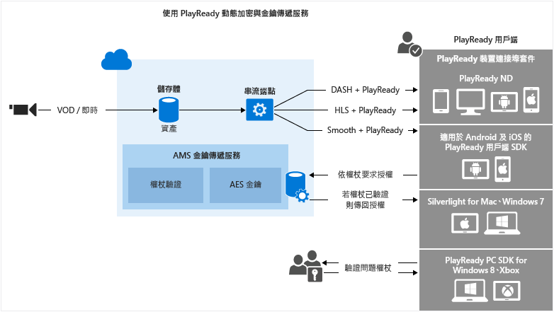

<properties
	pageTitle="使用 PlayReady DRM 動態加密和授權傳遞服務"
	description="Microsoft Azure 媒體服務可讓您傳遞受到 Microsoft PlayReady DRM 保護的 MPEG DASH、 Smooth Streaming 和 Http Live Streaming (HLS) 串流。本主題展示如何利用 PlayReady DRM 動態加密，以及使用金鑰傳遞服務。"
	services="media-services"
	documentationCenter=""
	authors="Juliako"
	manager="dwrede"
	editor=""/>

<tags
	ms.service="media-services"
	ms.workload="media"
	ms.tgt_pltfrm="na"
	ms.devlang="na"
	ms.topic="get-started-article" 
	ms.date="08/06/2015"
	ms.author="juliako"/>

#使用 PlayReady DRM 動態加密和授權傳遞服務

Microsoft Azure 媒體服務可讓您傳遞受到 [Microsoft PlayReady DRM](https://www.microsoft.com/playready/overview/) 保護的 MPEG DASH、 Smooth Streaming 和 Http Live Streaming (HLS) 串流。

媒體服務現在提供一種服務，來傳遞 Microsoft PlayReady 授權。媒體服務也提供 API，可讓您設定您要 PlayReady DRM 執行階段在使用者嘗試播放受保護內容時強制執行的權限和限制。當使用者要求觀看受到 PlayReady 保護內容時，用戶端播放器應用程式會從 Azure 媒體要求內容。然後，Azure 媒體服務會將用戶端重新導向到 Azure 媒體服務 PlayReady 授權伺服器，在這裡會驗證並授權使用者對內容的存取權。PlayReady 授權包含解密金鑰，可被用戶端播放器用來解密和串流處理內容。

媒體服務支援多種方式來驗證提出金鑰要求的使用者。內容金鑰授權原則可能會有一個或多個授權限制：Open、權杖限制或 IP 限制。權杖限制原則必須伴隨著安全權杖服務 (STS) 所發出的權杖。媒體服務支援[簡單 Web 權杖](https://msdn.microsoft.com/library/gg185950.aspx#BKMK_2) (SWT)格式和 [JSON Web 權杖](https://msdn.microsoft.com/library/gg185950.aspx#BKMK_3) (JWT) 格式的權杖。如需詳細資訊，請參閱＜設定內容金鑰的授權原則＞。

若要利用動態加密，您需有一個資源，其中包含一組多位元速率 MP4 檔案或多位元速率 Smooth Streaming 來源檔案。您也需要設定資產的傳遞原則 (本主題稍後會加以描述)。然後，根據串流 URL 中指定的格式，隨選資料流處理伺服器將確保以您所選擇的通訊協定傳遞串流。因此，您只需要儲存及支付一種儲存格式之檔案的費用，媒體服務會根據用戶端的要求建置及提供適當的回應。

本主題將有助於開發人員開發提供受保護媒體的應用程式。本主題將展示如何利用授權原則設定 PlayReady 授權傳遞服務，這樣只有授權的用戶端才會收到 PlayReady 授權。它也會展示如何使用動態加密。

>[AZURE.NOTE]若要開始使用動態加密，您必須先取得至少一個縮放單位 (也稱為串流單位)。如需詳細資訊，請參閱[如何調整媒體服務](media-services-manage-origins.md#scale_streaming_endpoints)。

##PlayReady 動態加密和 PlayReady 授權傳遞服務工作流程

以下是您利用 PlayReady 保護資產、使用媒體服務授權傳遞服務，同時也使用動態加密時將需要執行的一般步驟。

1. 建立資產並將檔案上傳到資產。 
1. 將包含檔案的資產編碼為自適性位元速率 MP4 集。
1. 建立內容金鑰，並將它與編碼的資產產生關聯。在媒體服務中，內容金鑰包含資產的加密金鑰。如需詳細資訊，請參閱 ContentKey。
1. 設定內容金鑰的授權原則。內容金鑰授權原則必須由您設定，而且用戶端必須符合條件，才能將內容金鑰傳遞給用戶端。 
1. 設定資產的傳遞原則。傳遞原則組態包括：傳遞通訊協定 (例如，MPEG DASH、HLS、HDS、Smooth Streaming 或全部)、動態加密的類型 (例如，一般加密)、PlayReady 授權取得 URL。 
 
	您可以將不同的原則套用至相同資產上的每一個通訊協定。例如，您可以將 PlayReady 加密套用到 Smooth/DASH，以及將 AES 信封加密套用到 HLS。傳遞原則中未定義的任何通訊協定 (例如，您加入單一原則，它只有指定 HLS 做為通訊協定) 將會遭到封鎖無法串流。這個狀況的例外情形是您完全沒有定義資產傳遞原則之時。那麼，將允許所有通訊協定，不受阻礙。
1. 若要取得串流 URL，請建立隨選定位器。

您會在本主題結尾處發現完整的.NET 範例。

下圖示範上述的工作流程。這裡的權杖用於驗證。

本主題的其餘部分會提供詳細的說明、程式碼範例，以及展示如何達成上述工作之主題的連結。

##目前的限制

如果您加入或更新您的資產傳遞原則，您必須刪除現有的定位程式 (如果有的話)，並建立新的定位器。

##建立資產並將檔案上傳到資產

為了管理、編碼及串流處理您的視訊，您必須先將內容上傳到 Microsoft Azure 媒體服務。一旦上傳，您的內容就會安全地儲存在雲端，以進一步進行處理和串流處理。

下列程式碼片段展示如何建立資產，並將指定的檔案上傳到資產。

	static public IAsset UploadFileAndCreateAsset(string singleFilePath)
	{
	    if(!File.Exists(singleFilePath))
	    {
	        Console.WriteLine("File does not exist.");
	        return null;
	    }
	
	    var assetName = Path.GetFileNameWithoutExtension(singleFilePath);
	    IAsset inputAsset = _context.Assets.Create(assetName, AssetCreationOptions.StorageEncrypted);
	
	    var assetFile = inputAsset.AssetFiles.Create(Path.GetFileName(singleFilePath));
	
	    Console.WriteLine("Created assetFile {0}", assetFile.Name);
	
	    var policy = _context.AccessPolicies.Create(
	                            assetName,
	                            TimeSpan.FromDays(30),
	                            AccessPermissions.Write | AccessPermissions.List);
	
	    var locator = _context.Locators.CreateLocator(LocatorType.Sas, inputAsset, policy);
	
	    Console.WriteLine("Upload {0}", assetFile.Name);
	
	    assetFile.Upload(singleFilePath);
	    Console.WriteLine("Done uploading {0}", assetFile.Name);
	
	    locator.Delete();
	    policy.Delete();
	
	    return inputAsset;
	}

##將包含檔案的資產編碼為自適性位元速率 MP4 集

使用動態加密時，您只需建立一個資源，其中包含一組多位元速率 MP4 檔案或多位元速率 Smooth Streaming 來源檔案。然後隨選資料流處理伺服器會根據資訊清單或片段要求中的指定格式，確保您以自己選擇的通訊協定接收串流。因此，您只需要儲存及支付一種儲存格式之檔案的費用，媒體服務會根據用戶端的要求建置及提供適當的回應。如需詳細資訊，請參閱[動態封裝概觀](media-services-dynamic-packaging-overview.md)主題。

下列程式碼片段會展示如何將資產編碼為自適性位元速率 MP4 集：

	static public IAsset EncodeToAdaptiveBitrateMP4Set(IAsset inputAsset)
	{
	    var encodingPreset = "H264 Adaptive Bitrate MP4 Set 720p";
	
	    IJob job = _context.Jobs.Create(String.Format("Encoding into Mp4 {0} to {1}",
	                            inputAsset.Name,
	                            encodingPreset));
	
	    var mediaProcessors = 
	        _context.MediaProcessors.Where(p => p.Name.Contains("Media Encoder")).ToList();
	
	    var latestMediaProcessor = 
	        mediaProcessors.OrderBy(mp => new Version(mp.Version)).LastOrDefault();
	
	
	
	    ITask encodeTask = job.Tasks.AddNew("Encoding", latestMediaProcessor, encodingPreset, TaskOptions.None);
	    encodeTask.InputAssets.Add(inputAsset);
	    encodeTask.OutputAssets.AddNew(String.Format("{0} as {1}", inputAsset.Name, encodingPreset), AssetCreationOptions.StorageEncrypted);
	
	    job.StateChanged += new EventHandler<JobStateChangedEventArgs>(JobStateChanged);
	    job.Submit();
	    job.GetExecutionProgressTask(CancellationToken.None).Wait();
	
	    return job.OutputMediaAssets[0];
	}
	
	static private void JobStateChanged(object sender, JobStateChangedEventArgs e)
	{
	    Console.WriteLine(string.Format("{0}\n  State: {1}\n  Time: {2}\n\n",
	        ((IJob)sender).Name,
	        e.CurrentState,
	        DateTime.UtcNow.ToString(@"yyyy_M_d__hh_mm_ss")));
	}

##建立內容金鑰，並將它與編碼的資產產生關聯

在媒體服務中，內容金鑰包含您要加密資產時使用的金鑰。

如需詳細資訊，請參閱[建立內容金鑰](media-services-dotnet-create-contentkey.md)。

##設定內容金鑰的授權原則

媒體服務支援多種方式來驗證提出金鑰要求的使用者。內容金鑰授權原則必須由您設定，而且用戶端 (播放器) 必須符合條件，才能將金鑰傳遞給用戶端。內容金鑰授權原則可能會有一個或多個授權限制：Open、權杖限制或 IP 限制。

如需詳細資訊，請參閱[設定內容金鑰授權原則](media-services-dotnet-configure-content-key-auth-policy.md#playready-dynamic-encryption)。

##設定資產傳遞原則 

設定資產的傳遞原則。資產傳遞原則組態包括：

- PlayReady 授權取得 URL。 
- 資產傳遞通訊協定 (例如，MPEG DASH、HLS、HDS、Smooth Streaming 或全部)。 
- 動態加密類型 (在此案例中，一般加密)。 

如需詳細資訊，請參閱[設定資產傳遞原則](media-services-rest-configure-asset-delivery-policy.md)。

##若要取得串流 URL，請建立隨選串流定位器

您必須為您的使用者提供 Smooth、DASH 或 HLS 的串流 URL。

>[AZURE.NOTE]如果您加入或更新您的資產傳遞原則，您必須刪除現有的定位程式 (如果有的話)，並建立新的定位器。

如需有關如何發行資產，並建置串流 URL 的指示，請參閱[建置串流 URL](media-services-deliver-streaming-content.md)。

##取得測試權杖

根據用於金鑰授權原則的權杖限制取得測試權杖。

	// Deserializes a string containing an Xml representation of a TokenRestrictionTemplate
	// back into a TokenRestrictionTemplate class instance.
	TokenRestrictionTemplate tokenTemplate = 
	    TokenRestrictionTemplateSerializer.Deserialize(tokenTemplateString);
	
	// Generate a test token based on the data in the given TokenRestrictionTemplate.
	//The GenerateTestToken method returns the token without the word “Bearer” in front
	//so you have to add it in front of the token string. 
	string testToken = TokenRestrictionTemplateSerializer.GenerateTestToken(tokenTemplate);
	Console.WriteLine("The authorization token is:\nBearer {0}", testToken);

	
您可以使用 [AMS Player](http://amsplayer.azurewebsites.net/azuremediaplayer.html) 來測試您的串流。

##範例

1. 建立新的主控台專案。
1. 使用 NuGet 來安裝和新增 Azure Media Services .NET SDK 延伸模組。安裝這個封裝，也會安裝 Media Services .NET SDK，並新增所有其他必要相依性。
2. 新增包含帳戶名稱和金鑰資訊的組態檔：

	
		<?xml version="1.0" encoding="utf-8"?>
		<configuration>
		    <startup> 
		        <supportedRuntime version="v4.0" sku=".NETFramework,Version=v4.5" />
		    </startup>
			  <appSettings>
			
			    <add key="MediaServicesAccountName" value="AccountName"/>
			    <add key="MediaServicesAccountKey" value="AccountKey"/>
			
			    <add key="Issuer" value="http://testacs.com"/>
			    <add key="Audience" value="urn:test"/>
			  </appSettings>
		</configuration>

1. 以本章節中所顯示的程式碼覆寫 Program.cs 檔案中的程式碼。
	
	請務必更新變數，以指向您的輸入檔案所在的資料夾。

		using System;
		using System.Collections.Generic;
		using System.Configuration;
		using System.IO;
		using System.Linq;
		using System.Text;
		using System.Threading;
		using System.Threading.Tasks;
		using System.Xml.Linq;
		using Microsoft.WindowsAzure.MediaServices.Client;
		using Microsoft.WindowsAzure.MediaServices.Client.ContentKeyAuthorization;
		using Microsoft.WindowsAzure.MediaServices.Client.DynamicEncryption;
		
		namespace PlayReadyDynamicEncryptAndKeyDeliverySvc
		{
		    class Program
		    {
		        // Read values from the App.config file.
		        private static readonly string _mediaServicesAccountName =
		            ConfigurationManager.AppSettings["MediaServicesAccountName"];
		        private static readonly string _mediaServicesAccountKey =
		            ConfigurationManager.AppSettings["MediaServicesAccountKey"];
		
		        private static readonly Uri _sampleIssuer =
		            new Uri(ConfigurationManager.AppSettings["Issuer"]);
		        private static readonly Uri _sampleAudience =
		            new Uri(ConfigurationManager.AppSettings["Audience"]);
		
		        // Field for service context.
		        private static CloudMediaContext _context = null;
		        private static MediaServicesCredentials _cachedCredentials = null;
		
		        private static readonly string _mediaFiles =
		            Path.GetFullPath(@"../..\Media");
		
		        private static readonly string _singleMP4File =
		            Path.Combine(_mediaFiles, @"BigBuckBunny.mp4");
		
		        static void Main(string[] args)
		        {
		            // Create and cache the Media Services credentials in a static class variable.
		            _cachedCredentials = new MediaServicesCredentials(
		                            _mediaServicesAccountName,
		                            _mediaServicesAccountKey);
		            // Used the cached credentials to create CloudMediaContext.
		            _context = new CloudMediaContext(_cachedCredentials);
		
		            bool tokenRestriction = false;
		            string tokenTemplateString = null;
		
		            IAsset asset = UploadFileAndCreateAsset(_singleMP4File);
		            Console.WriteLine("Uploaded asset: {0}", asset.Id);
		
		            IAsset encodedAsset = EncodeToAdaptiveBitrateMP4Set(asset);
		            Console.WriteLine("Encoded asset: {0}", encodedAsset.Id);
		
		            IContentKey key = CreateCommonTypeContentKey(encodedAsset);
		            Console.WriteLine("Created key {0} for the asset {1} ", key.Id, encodedAsset.Id);
		            Console.WriteLine("PlayReady License Key delivery URL: {0}", key.GetKeyDeliveryUrl(ContentKeyDeliveryType.PlayReadyLicense));
		            Console.WriteLine();
		    
		            if (tokenRestriction)
		                tokenTemplateString = AddTokenRestrictedAuthorizationPolicy(key);
		            else
		                AddOpenAuthorizationPolicy(key);
		
		            Console.WriteLine("Added authorization policy: {0}", key.AuthorizationPolicyId);
		            Console.WriteLine();
		
		            CreateAssetDeliveryPolicy(encodedAsset, key);
		            Console.WriteLine("Created asset delivery policy. \n");
		            Console.WriteLine();
		
		            if (tokenRestriction && !String.IsNullOrEmpty(tokenTemplateString))
		            {
		                // Deserializes a string containing an Xml representation of a TokenRestrictionTemplate
		                // back into a TokenRestrictionTemplate class instance.
		                TokenRestrictionTemplate tokenTemplate =
		                    TokenRestrictionTemplateSerializer.Deserialize(tokenTemplateString);
		
		                // Generate a test token based on the the data in the given TokenRestrictionTemplate.
		                // Note, you need to pass the key id Guid because we specified 
		                // TokenClaim.ContentKeyIdentifierClaim in during the creation of TokenRestrictionTemplate.
		                Guid rawkey = EncryptionUtils.GetKeyIdAsGuid(key.Id);
		
		                //The GenerateTestToken method returns the token without the word “Bearer” in front
		                //so you have to add it in front of the token string. 
		                string testToken = TokenRestrictionTemplateSerializer.GenerateTestToken(tokenTemplate, null, rawkey, DateTime.UtcNow.AddDays(365));
		                Console.WriteLine("The authorization token is:\nBearer {0}", testToken);
		                Console.WriteLine();
		            }
		
		            // You can use the http://smf.cloudapp.net/healthmonitor player 
		            // to test the smoothStreamURL URL.
		            //
		            string url = GetStreamingOriginLocator(encodedAsset);
		            Console.WriteLine("Encrypted Smooth Streaming URL: {0}/manifest", url);
		
		
		            Console.ReadLine();
		        }
		
		        static public IAsset UploadFileAndCreateAsset(string singleFilePath)
		        {
		            if (!File.Exists(singleFilePath))
		            {
		                Console.WriteLine("File does not exist.");
		                return null;
		            }
		
		            var assetName = Path.GetFileNameWithoutExtension(singleFilePath);
		            IAsset inputAsset = _context.Assets.Create(assetName, AssetCreationOptions.StorageEncrypted);
		
		            var assetFile = inputAsset.AssetFiles.Create(Path.GetFileName(singleFilePath));
		
		            Console.WriteLine("Created assetFile {0}", assetFile.Name);
		
		            var policy = _context.AccessPolicies.Create(
		                                    assetName,
		                                    TimeSpan.FromDays(30),
		                                    AccessPermissions.Write | AccessPermissions.List);
		
		            var locator = _context.Locators.CreateLocator(LocatorType.Sas, inputAsset, policy);
		
		            Console.WriteLine("Upload {0}", assetFile.Name);
		
		            assetFile.Upload(singleFilePath);
		            Console.WriteLine("Done uploading {0}", assetFile.Name);
		
		            locator.Delete();
		            policy.Delete();
		
		            return inputAsset;
		        }
		
		
		        static public IAsset EncodeToAdaptiveBitrateMP4Set(IAsset inputAsset)
		        {
		            var encodingPreset = "H264 Adaptive Bitrate MP4 Set 720p";
		
		            IJob job = _context.Jobs.Create(String.Format("Encoding into Mp4 {0} to {1}",
		                                    inputAsset.Name,
		                                    encodingPreset));
		
		            var mediaProcessors =
		                _context.MediaProcessors.Where(p => p.Name.Contains("Media Encoder")).ToList();
		
		            var latestMediaProcessor =
		                mediaProcessors.OrderBy(mp => new Version(mp.Version)).LastOrDefault();
		
		
		
		            ITask encodeTask = job.Tasks.AddNew("Encoding", latestMediaProcessor, encodingPreset, TaskOptions.None);
		            encodeTask.InputAssets.Add(inputAsset);
		            encodeTask.OutputAssets.AddNew(String.Format("{0} as {1}", inputAsset.Name, encodingPreset), AssetCreationOptions.StorageEncrypted);
		
		            job.StateChanged += new EventHandler<JobStateChangedEventArgs>(JobStateChanged);
		            job.Submit();
		            job.GetExecutionProgressTask(CancellationToken.None).Wait();
		
		            return job.OutputMediaAssets[0];
		        }
		
		
		        static public IContentKey CreateCommonTypeContentKey(IAsset asset)
		        {
		            // Create envelope encryption content key
		            Guid keyId = Guid.NewGuid();
		            byte[] contentKey = GetRandomBuffer(16);
		
		            IContentKey key = _context.ContentKeys.Create(
		                                    keyId,
		                                    contentKey,
		                                    "ContentKey",
		                                    ContentKeyType.CommonEncryption);
		
		            // Associate the key with the asset.
		            asset.ContentKeys.Add(key);
		
		            return key;
		        }
		
		    static public void AddOpenAuthorizationPolicy(IContentKey contentKey)
		    {
		
		        // Create ContentKeyAuthorizationPolicy with Open restrictions 
		        // and create authorization policy          
		
		        List<ContentKeyAuthorizationPolicyRestriction> restrictions = new List<ContentKeyAuthorizationPolicyRestriction>
		        {
		            new ContentKeyAuthorizationPolicyRestriction 
		            { 
		                Name = "Open", 
		                KeyRestrictionType = (int)ContentKeyRestrictionType.Open, 
		                Requirements = null
		            }
		        };
		
		        // Configure PlayReady license template.
		        string newLicenseTemplate = ConfigurePlayReadyLicenseTemplate();
		
		        IContentKeyAuthorizationPolicyOption policyOption =
		            _context.ContentKeyAuthorizationPolicyOptions.Create("",
		                ContentKeyDeliveryType.PlayReadyLicense,
		                    restrictions, newLicenseTemplate);
		
		        IContentKeyAuthorizationPolicy contentKeyAuthorizationPolicy = _context.
		                    ContentKeyAuthorizationPolicies.
		                    CreateAsync("Deliver Common Content Key with no restrictions").
		                    Result;
		
		
		        contentKeyAuthorizationPolicy.Options.Add(policyOption);
		
		        // Associate the content key authorization policy with the content key.
		        contentKey.AuthorizationPolicyId = contentKeyAuthorizationPolicy.Id;
		        contentKey = contentKey.UpdateAsync().Result;
		    }
		
		        public static string AddTokenRestrictedAuthorizationPolicy(IContentKey contentKey)
		        {
		            string tokenTemplateString = GenerateTokenRequirements();
		
		            IContentKeyAuthorizationPolicy policy = _context.
		                                    ContentKeyAuthorizationPolicies.
		                                    CreateAsync("HLS token restricted authorization policy").Result;
		
		            List<ContentKeyAuthorizationPolicyRestriction> restrictions = new List<ContentKeyAuthorizationPolicyRestriction>
		            {
		                new ContentKeyAuthorizationPolicyRestriction 
		                { 
		                    Name = "Token Authorization Policy", 
		                    KeyRestrictionType = (int)ContentKeyRestrictionType.TokenRestricted,
		                    Requirements = tokenTemplateString, 
		                }
		            };
		
		            // Configure PlayReady license template.
		            string newLicenseTemplate = ConfigurePlayReadyLicenseTemplate();
		
		            IContentKeyAuthorizationPolicyOption policyOption =
		                _context.ContentKeyAuthorizationPolicyOptions.Create("Token option",
		                    ContentKeyDeliveryType.PlayReadyLicense,
		                        restrictions, newLicenseTemplate);
		
		            IContentKeyAuthorizationPolicy contentKeyAuthorizationPolicy = _context.
		                        ContentKeyAuthorizationPolicies.
		                        CreateAsync("Deliver Common Content Key with no restrictions").
		                        Result;
		            
		            policy.Options.Add(policyOption);
		
		            // Add ContentKeyAutorizationPolicy to ContentKey
		            contentKeyAuthorizationPolicy.Options.Add(policyOption);
		
		            // Associate the content key authorization policy with the content key
		            contentKey.AuthorizationPolicyId = contentKeyAuthorizationPolicy.Id;
		            contentKey = contentKey.UpdateAsync().Result;
		
		            return tokenTemplateString;
		        }
		
		        static private string GenerateTokenRequirements()
		        {
		            TokenRestrictionTemplate template = new TokenRestrictionTemplate(TokenType.SWT);
		
		            template.PrimaryVerificationKey = new SymmetricVerificationKey();
		            template.AlternateVerificationKeys.Add(new SymmetricVerificationKey());
		            template.Audience = _sampleAudience;
		            template.Issuer = _sampleIssuer;
		            template.RequiredClaims.Add(TokenClaim.ContentKeyIdentifierClaim);
		
		            return TokenRestrictionTemplateSerializer.Serialize(template);
		        } 
		
		        static private string ConfigurePlayReadyLicenseTemplate()
		        {
		            // The following code configures PlayReady License Template using .NET classes
		            // and returns the XML string.
		             
		            PlayReadyLicenseResponseTemplate responseTemplate = new PlayReadyLicenseResponseTemplate();
		            PlayReadyLicenseTemplate licenseTemplate = new PlayReadyLicenseTemplate();
		
		            responseTemplate.LicenseTemplates.Add(licenseTemplate);
		
		            return MediaServicesLicenseTemplateSerializer.Serialize(responseTemplate);
		        }
		
		        static public void CreateAssetDeliveryPolicy(IAsset asset, IContentKey key)
		        {
		            Uri acquisitionUrl = key.GetKeyDeliveryUrl(ContentKeyDeliveryType.PlayReadyLicense);
		
		            Dictionary<AssetDeliveryPolicyConfigurationKey, string> assetDeliveryPolicyConfiguration =
		                new Dictionary<AssetDeliveryPolicyConfigurationKey, string>
		            {
		                {AssetDeliveryPolicyConfigurationKey.PlayReadyLicenseAcquisitionUrl, acquisitionUrl.ToString()},
		            };
		
		            var assetDeliveryPolicy = _context.AssetDeliveryPolicies.Create(
		                    "AssetDeliveryPolicy",
		                AssetDeliveryPolicyType.DynamicCommonEncryption,
		                AssetDeliveryProtocol.SmoothStreaming,
		                assetDeliveryPolicyConfiguration);
		
		            // Add AssetDelivery Policy to the asset
		            asset.DeliveryPolicies.Add(assetDeliveryPolicy);
		
		            Console.WriteLine();
		            Console.WriteLine("Adding Asset Delivery Policy: " +
		                assetDeliveryPolicy.AssetDeliveryPolicyType);
		        }
		
		
		        /// 

		        /// Gets the streaming origin locator.
		        /// 

		        /// <param name="assets"></param>
		        /// <returns></returns>
		        static public string GetStreamingOriginLocator(IAsset asset)
		        {
		
		            // Get a reference to the streaming manifest file from the  
		            // collection of files in the asset. 
		
		            var assetFile = asset.AssetFiles.Where(f => f.Name.ToLower().
		                                         EndsWith(".ism")).
		                                         FirstOrDefault();
		
		            // Create a 30-day readonly access policy. 
		            IAccessPolicy policy = _context.AccessPolicies.Create("Streaming policy",
		                TimeSpan.FromDays(30),
		                AccessPermissions.Read);
		
		            // Create a locator to the streaming content on an origin. 
		            ILocator originLocator = _context.Locators.CreateLocator(LocatorType.OnDemandOrigin, asset,
		                policy,
		                DateTime.UtcNow.AddMinutes(-5));
		
		            // Create a URL to the manifest file. 
		            return originLocator.Path + assetFile.Name;
		        }
		
		        static private void JobStateChanged(object sender, JobStateChangedEventArgs e)
		        {
		            Console.WriteLine(string.Format("{0}\n  State: {1}\n  Time: {2}\n\n",
		                ((IJob)sender).Name,
		                e.CurrentState,
		                DateTime.UtcNow.ToString(@"yyyy_M_d__hh_mm_ss")));
		        }
		
		        static private byte[] GetRandomBuffer(int length)
		        {
		            var returnValue = new byte[length];
		
		            using (var rng =
		                new System.Security.Cryptography.RNGCryptoServiceProvider())
		            {
		                rng.GetBytes(returnValue);
		            }
		
		            return returnValue;
		        }
		    }
		}

<!---HONumber=August15_HO7-->