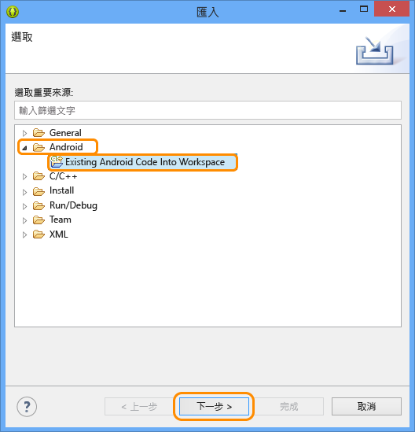
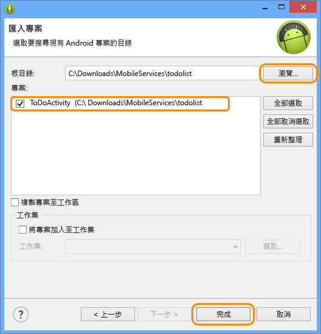

<properties linkid="develop-mobile-tutorials-get-started-with-data-android" urlDisplayName="Get Started with Data - Android" pageTitle="Get started with data (Android) | Mobile Dev Center" metaKeywords="Azure android data, Azure mobile services data, windows droid, windows android, microsoft droid, microsoft android" description="Learn how to get started using Mobile Services to leverage data in your Android app." metaCanonical="" services="" documentationCenter="Mobile" title="Get started with data in Mobile Services" authors="ricksal,glenga" solutions="" manager="" editor="" />

開始使用行動服務中的資料
========================

[Windows 市集 C\#](/en-us/develop/mobile/tutorials/get-started-with-data-dotnet "Windows 市集 C#")[Windows 市集 JavaScript](/en-us/develop/mobile/tutorials/get-started-with-data-js "Windows 市集 JavaScript")[Windows Phone](/en-us/develop/mobile/tutorials/get-started-with-data-wp8 "Windows Phone")[iOS](/en-us/develop/mobile/tutorials/get-started-with-data-ios "iOS")[Android](/en-us/develop/mobile/tutorials/get-started-with-data-android "Android")[HTML](/en-us/develop/mobile/tutorials/get-started-with-data-html "HTML")[Xamarin.iOS](/en-us/develop/mobile/tutorials/get-started-with-data-xamarin-ios "Xamarin.iOS")[Xamarin.Android](/en-us/develop/mobile/tutorials/get-started-with-data-xamarin-android "Xamarin.Android")

本主題說明如何在 Android 應用程式中使用 Azure 行動服務來處理資料。在本教學課程中，您將下載應用程式，並在記憶體中儲存資料、建立新的行動服務、將行動服務與該應用程式整合，然後登入 Azure 管理入口網站查看執行應用程式時所做的資料變更。

[觀看教學課程](http://channel9.msdn.com/Series/Windows-Azure-Mobile-Services/Android-Getting-Started-With-Data-Connecting-your-app-to-Windows-Azure-Mobile-Services) [播放影片](http://channel9.msdn.com/Series/Windows-Azure-Mobile-Services/Android-Getting-Started-With-Data-Connecting-your-app-to-Windows-Azure-Mobile-Services) 15:32

**注意**

本教學課程是為了協助您充分了解行動服務如何讓您從 Android 應用程式中利用 Azure 來儲存和擷取資料。因此，本主題將逐步說明已在行動服務快速入門中完成的許多步驟。如果這是您第一次接觸行動服務，請考慮先完成教學課程[開始使用行動服務](/en-us/develop/mobile/tutorials/get-started-android)。

本教學課程將逐步引導您完成下列基本步驟：

1.  [下載 Android 應用程式專案](#download-app)
2.  [建立行動服務](#create-service)
3.  [新增用於儲存的資料表](#add-table)
4.  [更新應用程式以使用行動服務](#update-app)
5.  [針對行動服務進行應用程式測試](#test-app)

**注意**

若要完成此教學課程，您需要 Azure 帳戶。如果您沒有帳戶，只需要幾分鐘的時間就可以建立免費試用帳戶。如需詳細資訊，請參閱 [Azure 免費試用](http://www.windowsazure.com/zh-tw/pricing/free-trial/?WT.mc_id=AED8DE357)。

本教學課程需要 [Mobile Services Android SDK](http://go.microsoft.com/fwlink/p/?LinkID=280126)、[Android SDK](https://go.microsoft.com/fwLink/p/?LinkID=280125) (含 Eclipse 整合式開發環境 (IDE) 和 Android Developer Tools (ADT) 外掛程式)，以及 Android 4.2 或更新版本。

**注意**

本教學課程提供提示來安裝 Android SDK 和 Mobile Services Android SDK。下載的 GetStartedWithData 專案需要 Android 4.2 或更新版本。不過，Mobile Services SDK 只需要 Android 2.2 或更新版本。

下載專案下載 GetStartedWithData 專案
------------------------------------

### 取得範例程式碼

本教學課程以 Android 應用程式 [GetStartedWithData app](http://go.microsoft.com/fwlink/p/?LinkID=282122) 為基礎。此應用程式的 UI 與 Mobile Services Android 快門入口所產生的應用程式相同，差別在於新增的項目會儲存在本機的記憶體。您將加入必要的程式碼，以便將資料保存至儲存體。

1.  將 `GetStartedWithData` 範例應用程式下載到電腦並解壓縮檔案。

2.  在 Eclipse 中，依序按一下 **[檔案]**、**[匯入]**、展開 **[Android]**，按一下 **[匯入現有的 Android 程式碼至工作區]**，然後按 **[下一步]**。

	

1.  按一下 **[瀏覽]**，瀏覽至已解壓縮的專案檔案的位置，按一下 **[確定]**，並確定已勾選 TodoActivity 專案。如果想要將專案複製到您的工作空間，請勾選 **[將專案複製到工作區]** 方塊。最後，按一下 **[完成]**。

	

    This imports the project files into the current workspace.

### 驗證 Android SDK 版本

[WACOM.INCLUDE [Verify SDK](../includes/mobile-services-verify-android-sdk-version.md)]

### 檢查和執行範例程式碼

1.  在 [套件瀏覽器] 中，依序展開 **[GetStartedWithData]**、**[src]** 和 **[.com.example.GetStartedWithData]**，然後檢查 ToDoActivity.java 檔案。

    

    Notice that there are `//TODO` comments that specify the steps you must take to make this app work with your mobile service.

2.  從 **[執行]** 功能表，按一下 **[執行]**，然後按一下 **[Android 應用程式]** 來啟動專案。

    **注意**

    您可以使用 Android 手機或使用 Android 模擬器來執行此專案。使用 Android 手機來執行需要先下載手機專用的 USB 驅動程式。

    若要在 Android 模擬器中執行專案，您至少必須定義一個 Android 虛擬裝置 (AVD)。請使用 AVD 管理員來建立和管理這些裝置。

3.  在應用程式中輸入有意義的文字 (例如 *Complete the tutorial*)，然後按一下 **[新增]**。

    

    Notice that the saved text is stored in an in-memory collection and displayed in the list below.

建立行動服務在管理入口網站中建立新的行動服務
--------------------------------------------

[WACOM.INCLUDE [mobile-services-create-new-service-data](../includes/mobile-services-create-new-service-data.md)]

新增資料表將資料表新增至行動服務
--------------------------------

[WACOM.INCLUDE [mobile-services-create-new-service-data-2](../includes/mobile-services-create-new-service-data-2.md)]

更新應用程式更新應用程式以使用行動服務進行資料存取
--------------------------------------------------

您的行動服務已準備就緒，現在可以更新應用程式以便在行動服務 (而非本機收集) 中儲存項目。

1.  如果您還沒有 [Mobile Services Android SDK](http://go.microsoft.com/fwlink/p/?LinkID=280126)，請立即下載並將壓縮檔解壓縮。

2.  從 SDK 的 `mobileservices` 資料夾，將 `.jar` 檔案複製到 GetStartedWithData 專案的 `libs` 資料夾。

3.  在 Eclipse 的 [套件瀏覽器] 中，以滑鼠右鍵按一下 `libs` 資料夾，按一下 **[重新整理]**，就會出現複製的 jar 檔案

	這會將 Mobile Services SDK 參考加入至工作空間。

1.  開啟 AndroidManifest.xml 檔案並加入這一行，以便讓應用程式存取 Azure 中的行動服務。

        <uses-permission android:name="android.permission.INTERNET" />

2.  從 [套件瀏覽器] 中，開啟位於 com.example.getstartedwithdata 套件中的 TodoActivity.java 檔案，並取消註解下列這幾行程式碼：

        import com.microsoft.windowsazure.mobileservices.MobileServiceClient;
        import com.microsoft.windowsazure.mobileservices.MobileServiceTable;
        import com.microsoft.windowsazure.mobileservices.NextServiceFilterCallback;
        import com.microsoft.windowsazure.mobileservices.ServiceFilter;
        import com.microsoft.windowsazure.mobileservices.ServiceFilterRequest;
        import com.microsoft.windowsazure.mobileservices.ServiceFilterResponse;
        import com.microsoft.windowsazure.mobileservices.ServiceFilterResponseCallback;
        import com.microsoft.windowsazure.mobileservices.TableOperationCallback;
        import com.microsoft.windowsazure.mobileservices.TableQueryCallback;

        import java.net.MalformedURLException;

3.  我們將會移除應用程式目前使用的記憶體中清單，所以可以將它換成行動服務。在 **ToDoActivity** 類別中，下列這一行程式碼定義現有的 **toDoItemList** 清單，請將它變成註解。

         public List<ToDoItem> toDoItemList = new ArrayList<ToDoItem>();

4.  完成上述步驟時，專案會指出建置錯誤。請搜尋其餘三個用到 `toDoItemList` 變數的地方，並將指出的區段變成註解。另外也移除 `import java.util.ArrayList`。這會完全移除記憶體中的清單。

5.  現在開始加入我們的行動服務。將下列幾行程式碼取消註解：

        private MobileServiceClient mClient;
        private private MobileServiceTable<ToDoItem> mToDoTable;

6.  在檔案底部找出 ProgressFilter 類別並取消註解。此類別會在 MobileServiceClient 執行網路作業時顯示 'loading' 指示。

7.  在管理入口網站中，按一下 **[行動服務]**，然後按一下您剛剛建立的行動服務。

8.  按一下 **[儀表板]** 索引標籤並記下 **[網站 URL]**，然後按一下 **[管理金鑰]** 並記下 **[應用程式金鑰]**。

	

	從應用程式程式碼存取行動服務時，您將會用到這些值。

1.  在 **onCreate** 方法中，下列幾行程式碼定義 **MobileServiceClient** 變數，請將它們取消註解：

        try {
        // Create the Mobile Service Client instance, using the provided
        // Mobile Service URL and key
        	mClient = new MobileServiceClient(
        			"MobileServiceUrl",
        			"AppKey", 
        			this).withFilter(new ProgressFilter());

        	// Get the Mobile Service Table instance to use
        	mToDoTable = mClient.getTable(ToDoItem.class);
        } catch (MalformedURLException e) {
        	createAndShowDialog(new Exception("There was an error creating the Mobile Service.Verify the URL"), "Error");
        }

	這會建立 MobileServiceClient 的新執行個體，可用來存取您的行動服務。也會建立 MobileServiceTable 執行個體，用於代理行動服務中的資料儲存。

1.  在上述程式碼中，依序將 `MobileServiceUrl` 和 `AppKey` 換成您的行動服務中的 URL 和應用程式金鑰。

2.  將 **checkItem** 方法的這幾行取消註解：

        mToDoTable.update(item, new TableOperationCallback<ToDoItem>() { 
        	public void onCompleted(ToDoItem entity, Exception exception,
        			ServiceFilterResponse response) {
        		if(exception == null){
        			if (entity.isComplete()) {
        				mAdapter.remove(entity);
                    }
        		} else {
        			createAndShowDialog(exception, "Error");  
                }
            }
        });

	這會將項目更新傳送至行動服務，並從配接器中移除已核取的項目。

1.  將 **addItem** 方法的這幾行取消註解：

        mToDoTable.insert(item, new TableOperationCallback<ToDoItem>() {
                
        public void onCompleted(ToDoItem entity, Exception exception,
        ServiceFilterResponse response) {
        if(exception == null){
        if (!entity.isComplete()) {
        mAdapter.add(entity);
                    }
        } else {
        createAndShowDialog(exception, "Error");
                }               
            }
        });

	此程式碼會建立新的項目，並將此項目插入至遠端行動服務中的資料表。

1.  將 **refreshItemsFromTable** 方法的這幾行取消註解：

        mToDoTable.where().field("complete").eq(false)
        .execute(new TableQueryCallback<ToDoItem>() {
        	 public void onCompleted(List<ToDoItem> result, 
                 	 int count, Exception exception, 
                 	 ServiceFilterResponse response) {
                            
        				if(exception == null){
        					mAdapter.clear();

        					for (ToDoItem item :result) {
        						mAdapter.add(item);
                            }
        				} else {
        					createAndShowDialog(exception, "Error");
                        }
                    }
                }); 

    這會查詢行動服務，並傳回所有未標示為完成的項目。項目會加入至配接器來繫結。

測試應用程式在新的行動服務上測試應用程式
----------------------------------------

現在，應用程式已更新為使用行動服務做為後端儲存，您可以使用 Android 模擬器或 Android 手機，在行動服務上測試應用程式。

1.  從 **[執行]** 功能表，按一下 **[執行]** 來啟動專案。

    這樣會執行您的應用程式 (以 Android SDK 建立)，該應用程式利用用戶端程式庫傳送查詢，然後從您的行動服務傳回項目。

2.  同樣地，輸入有意義的文字，然後按一下 **[加入]**。

    This sends a new item as an insert to the mobile service.

3.  在[管理入口網站](https://manage.windowsazure.com/)中按一下 **[行動服務]**，然後按一下您的行動服務。

4.  按一下 **[資料]** 索引標籤，然後按一下 **[瀏覽]**。

    
          
    Notice that the **TodoItem** table now contains data, with some values generated by Mobile Services, and that columns have been automatically added to the table to match the TodoItem class in the app.

Android 的**開始使用資料**教學課程到此結束。

後續步驟
--------

本教學課程示範讓 Android 應用程式在行動服務中使用資料的基礎。

接下來，可考慮進入下列其中一個教學課程，這些教學課程都是以您在本教學課程中建立的 GetStartedWithData 應用程式為基礎：

-   [使用指令碼來驗證和修改資料](/en-us/develop/mobile/tutorials/validate-modify-and-augment-data-dotnet)
    深入了解在行動服務中，使用伺服器指令碼來驗證和變更從應用程式傳送的資料。

-   [使用分頁縮小查詢範圍](/en-us/develop/mobile/tutorials/add-paging-to-data-android)
    了解如何在查詢中使用分頁，來控制單一要求中所處理的資料量。

完成資料系列後，可試著閱讀這些另外的 Android 教學課程：

-   [開始使用驗證](/en-us/develop/mobile/tutorials/get-started-with-users-android)
    了解如何驗證應用程式的使用者。

-   [開始使用推播通知](/en-us/develop/mobile/tutorials/get-started-with-push-android)
    了解如何透過行動服務將非常基本的推播通知傳送至應用程式。

