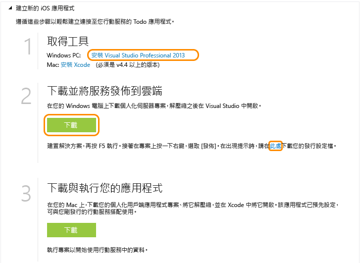

<properties pageTitle="Get Started with Azure Mobile Services for iOS apps" metaKeywords="Azure iOS application, mobile service iOS, getting started Azure iOS" description="Follow this tutorial to get started using Azure Mobile Services for iOS development. " metaCanonical="" services="" documentationCenter="Mobile" title="Get started with Mobile Services" authors="glenga" solutions="" manager="" editor="" />

開始使用行動服務
================

[Windows 市集 C\#](/en-us/documentation/articles/mobile-services-dotnet-backend-windows-store-dotnet-get-started "Windows 市集 C#") [Windows 市集 JavaScript](/en-us/documentation/articles/mobile-services-dotnet-backend-windows-store-javascript-get-started "Windows 市集 JavaScript") [Windows Phone](/en-us/documentation/articles/mobile-services-dotnet-backend-windows-phone-get-started "Windows Phone") [iOS](/en-us/documentation/articles/mobile-services-dotnet-backend-ios-get-started "iOS") [Android](/en-us/documentation/articles/mobile-services-dotnet-backend-android-get-started "Android")

[.NET 後端](/en-us/documentation/articles/mobile-services-dotnet-backend-ios-get-started/ ".NET 後端") | [JavaScript 後端](/en-us/documentation/articles/mobile-services-ios-get-started/ "JavaScript 後端")

本教學課程說明如何使用 Azure 行動服務在 iOS 應用程式中新增雲端型後端服務。在本教學課程中，您將建立新的行動服務，並建立可在新的行動服務中儲存應用程式資料的簡單*待辦事項*應用程式。您所將建立的行動服務，會使用 Visual Studio 與支援的 .NET 語言撰寫伺服器端商務邏輯，並管理行動服務。若要建立可讓您以 JavaScript 撰寫伺服器端商務邏輯的行動服務，請參閱本主題的 [JavaScript 後端版本](/en-us/documentation/articles/mobile-services-ios-get-started)。

以下是完成應用程式的螢幕擷取畫面：

完成本教學課程需使用 XCode 4.5 及 iOS 5.0 或更新版本。

**注意**

若要完成此教學課程，您需要 Azure 帳戶。如果您沒有帳戶，只需要幾分鐘的時間就可以建立免費試用帳戶。如需詳細資訊，請參閱 [Azure 免費試用](http://www.windowsazure.com/en-us/pricing/free-trial/?WT.mc_id=AE564AB28&returnurl=http%3A%2F%2Fwww.windowsazure.com%2Fen-us%2Fdevelop%2Fmobile%2Ftutorials%2Fget-started-ios%2F)。

建立新的行動服務
----------------

[WACOM.INCLUDE [mobile-services-create-new-service](../includes/mobile-services-create-new-service.md)]

將行動服務下載至您的本機電腦
----------------------------

您已建立行動服務，接著請下載可在您的本機電腦或虛擬機器上執行的個人化行動服務專案。

1.  按一下您剛剛建立的行動服務，然後在 [快速入門] 索引標籤中，按一下 **[選擇平台]** 下的 **[iOS]**，並展開 **[Create a new iOS app]**。

    

2.  下載並安裝 Visual Studio Professional 2013 或更新版本 (若您尚未這麼做)。

3.  在 **[Download and publish your service to the cloud]** 下，按一下 **[下載]**。

    這會下載實作行動服務的 Visual Studio 專案。請將壓縮的專案檔案儲存至本機電腦，並記下儲存位置。

4.  此外，請下載您的發佈設定檔、將下載的檔案儲存至本機電腦，並記下儲存位置。

測試行動服務
------------

[WACOM.INCLUDE [mobile-services-dotnet-backend-test-local-service](../includes/mobile-services-dotnet-backend-test-local-service.md)]

發佈行動服務
------------

[WACOM.INCLUDE [mobile-services-dotnet-backend-publish-service](../includes/mobile-services-dotnet-backend-publish-service.md)]

建立新的 iOS 應用程式
---------------------

在本節中，您將建立連線至您行動服務的新 iOS 應用程式。

1.  在管理入口網站中，按一下 **[行動服務]**，然後按一下您剛剛建立的行動服務。

2.  在 [快速入門] 索引標籤中，按一下 **[選擇平台]** 下的 **[iOS]**，然後展開 **[Create a new iOS app]**。

3.  下載並安裝 [Xcode](https://go.microsoft.com/fwLink/p/?LinkID=266532) v4.4 或更新版本 (若您尚未這麼做)。

4.  按一下 **[Create TodoItems table]**，建立表格來儲存應用程式資料。

5.  在 **[Download and run your app]** 下，按 **[下載]**。

  	如此會下載與您行動服務連線之範例應用程式 *To do list* 的專案，以及行動服務 iOS SDK。請將壓縮的專案檔案儲存至本機電腦，並記下儲存位置。

執行新的 iOS 應用程式
---------------------

[WACOM.INCLUDE [mobile-services-ios-run-app](../includes/mobile-services-ios-run-app.md)]

這會說明如何對執行於 Azure 中的行動服務執行新的用戶端應用程式。您必須設定 Web 伺服器和防火牆以允許來自您 iOS 開發電腦的存取，才能對執行於本機電腦上的行動服務測試 iOS 應用程式。如需詳細資訊，請參閱[設定本機 Web 伺服器以允許連接到本機行動服務](/en-us/documentation/articles/mobile-services-dotnet-backend-how-to-configure-iis-express)。

