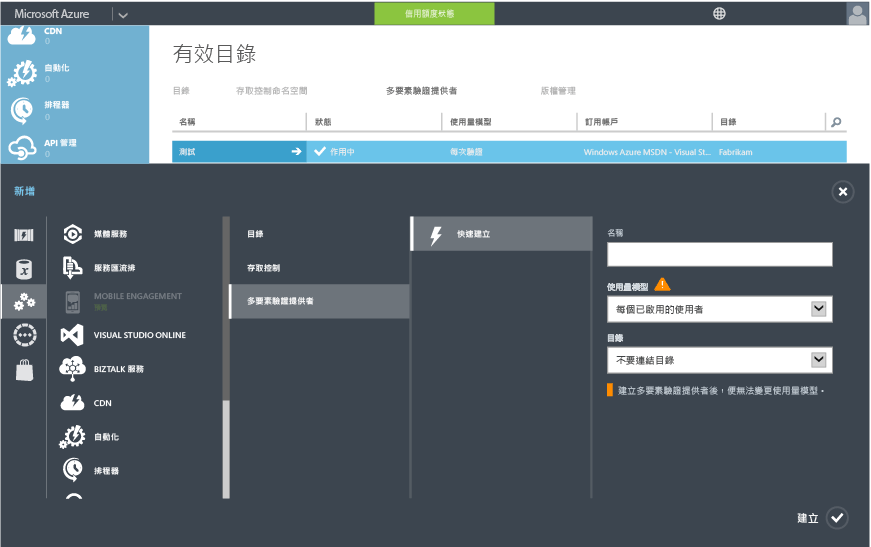

<properties 
	pageTitle="開始在雲端中使用 Azure Multi-Factor Authentication" 
	description="這是說明如何開始在雲端中使用 Azure MFA 的 Azure Multi-Factor Authentication 頁面。" 
	services="multi-factor-authentication" 
	documentationCenter="" 
	authors="billmath" 
	manager="stevenpo" 
	editor="curtand"/>

<tags 
	ms.service="multi-factor-authentication" 
	ms.workload="identity" 
	ms.tgt_pltfrm="na" 
	ms.devlang="na" 
	ms.topic="get-started-article" 
	ms.date="03/31/2016" 
	ms.author="billmath"/>

# 開始在雲端中使用 Azure Multi-Factor Authentication

既然我們已經決定要在雲端中使用 Multi-Factor Authentication，現在就讓我們開始吧！ 只要點按幾下就能迅速開始使用 Azure Multi-Factor Authentication請注意，如果您使用 Multi-Factor Authentication for Office 365 或適用於 Azure 系統管理員的 Multi-Factor Authentication，可以跳到步驟 3。

1. [註冊 Azure 訂用帳戶](https://azure.microsoft.com/pricing/free-trial/)
	- 如果您還沒有 Azure 訂用帳戶，可以免費註冊。如果您剛開始使用 Azure MFA，您可以使用試用版訂用帳戶
2. [建立 Multi-Factor Auth Provider](#creating-an-azure-multi-factor-auth-provider)或[指派授權給使用者](#assigning-an-azure-ad-premium-or-enterprise-mobility-license-to-users)
	- 接下來，您需要執行下列其中一個動作。建立 Azure Multi-Factor Auth Provider 並將它指派給目錄，或將授權指派給使用者。授權的適用對象是擁有 Azure MFA、Azure AD Premium 或 EMS 的使用者。Azure Multi-Factor Authentication 隨附於 Azure Active Directory Premium 中。它也會隨附於 Enterprise Mobility Suite 中。如果您有足夠的授權，則不需要建立 Auth Provider。 
3. [為使用者開啟 Multi-Factor Authentication](#turn-on-multi-factor-authentication-for-users)
	- 透過 Office 365 或 Azure 入口網站為使用者啟用 Azure MFA。 
4. [傳送電子郵件給使用者，通知他們有關 MFA 的資訊](#send-email-to-end-users)
	- 當使用者開啟帳戶的 Multi-Factor Authentication 後，建議您傳送電子郵件來通知他們。系統會提示使用者在下次登入時完成程序，因此電子郵件可讓他們做好心理準備。 

## 建立 Azure Multi-Factor Auth Provider
依預設，擁有 Azure Active Directory 和 Office 365 使用者的全域管理員可以使用 Multi-Factor Authentication。不過，如果您想要充分利用進階功能，則必須購買完整版的 Azure MFA。

Azure Multi-Factor Auth Provider 可用來充分利用完整版 Azure MFA 所提供的功能。它的適用對象是未透過 Azure MFA、Azure AD Premium 或 EMS 取得授權的使用者。Azure MFA、Azure AD Premium 和 EMS 預設會包含完整版 Azure MFA。如果您有授權，則不需要 Azure Multi-Factor Auth Provider。下列步驟示範如何建立 Azure Multi-Factor Auth Provider。

### 建立 Multi-Factor Auth Provider
--------------------------------------------------------------------------------

1. 以系統管理員身分登入 Azure 入口網站。
2. 在左側選取 [Active Directory]。
3. 在 [Active Directory] 頁面頂端，選取 [Multi-Factor Authentication Provider]。接著，在底部按一下 [新增]。
4. 在 [應用程式服務] 之下選取 [Multi-Factor Auth Provider]，然後選取 [快速建立]。
5. 填寫下列欄位並選取 [建立]。
	1. 名稱 – Multi-Factor Auth Provider 的名稱。
	2. 使用模式 – Multi-Factor Authentication Provider 的使用模式。
		- 每次驗證 – 購買依每次驗證付費的模式。通常用於在取用者導向應用程式中使用 Azure Multi-factor Authentication 的案例。
		- 每個啟用的使用者 – 購買依每個啟用使用者付費的模式。通常用於員工存取 Office 365 之類的應用程式。
	2. 目錄 – 與 Multi-Factor Authentication Provider 相關聯的 Azure Active Directory 租用戶。請注意以下事項：
		- 您不需要 Azure AD 目錄即可建立 Multi-Factor Auth Provider。如果您只打算使用 Azure Multi-Factor Authentication Server 或 SDK，只需將方塊保留空白。
		- Multi-Factor Auth Provider 必須與 Azure AD 目錄產生關聯，才能利用進階功能。
		- 如果您要讓內部部署 Active Directory 環境與 Azure AD 目錄同步處理，Azure AD Connect、AAD Sync 或 DirSync 或 AAD Sync 只是一項需求。如果您只使用未同步的 Azure AD 目錄，則不需要同步處理。
		

5. 一旦按一下建立，系統便會建立 Multi-Factor Authentication Provider，而且您應該會看到一則指出「已成功建立 Multi-Factor Authentication Provider」的訊息。按一下 [確定]。

	 
## 將 Azure MFA、Azure AD Premium 或 Enterprise Mobility 授權指派給使用者

如果您已購買 Azure MFA、Azure AD Premium 或 Enterprise Mobility Suite 授權，便不需要建立 Multi-Factor Auth Provider。您只需要將授權指派給使用者，接著就可以開始為使用者啟用 MFA。

### 指派 Azure MFA、Azure AD Premium 或 Enterprise Mobility Suite 授權
--------------------------------------------------------------------------------

1. 以系統管理員身分登入 Azure 入口網站。
2. 選取左邊的 [Active Directory]。
3. 在 [Active Directory] 頁面上，在有您要啟用的使用者之目錄上按兩下。
4. 在目錄頁面頂端，選取 [授權]。
5. 在 [授權] 頁面上，選取 [Multi-Factor Authentication]、[Active Directory Premium] 或 [Enterprise Mobility Suite]，然後按一下 [指派]。
6. 在對話方塊中，選取您要對其指派授權的使用者或群組，然後按一下核取記號圖示，以儲存變更。

## 為使用者開啟 Multi-Factor Authentication

Azure Multi-Factor Authentication 中的使用者帳戶具有下列三種不同狀態：

狀況 | 說明 |受影響的非瀏覽器應用程式| 注意事項 
:-------------: | :-------------: |:-------------: |:-------------: |
已停用 | 未註冊 Multi-Factor Authentication 之新使用者的預設狀態。|否|使用者未使用 Multi-Factor Authentication。
已啟用 |使用者已註冊 Multi-Factor Authentication。|無。它們會繼續運作，直到註冊程序完成為止。|使用者已啟用，但尚未完成註冊程序。系統會提示他們在下次登入時完成程序。
已強制|使用者已註冊，並且已完成使用 Multi-Factor Authentication 的註冊程序。|是。除非建立及使用應用程式密碼，否則這些應用程式將無法運作。 | 使用者可能已完成或可能尚未完成註冊。如果他們已完成註冊程序，表示他們正在使用 Multi-Factor Authentication。否則，系統會提示使用者在下次登入時完成程序。

您可以使用下列程序為使用者啟用 MFA。

### 開啟 Multi-Factor Authentication
--------------------------------------------------------------------------------
1.  以系統管理員身分登入 Azure 入口網站。
2.  在左側按一下 [Active Directory]。
3.  在 [目錄] 下方，針對要啟用的使用者按一下目錄。
4.  在頂端按一下 [使用者]。
5.  在頁面底部，按一下 [管理 Multi-Factor Auth]
6.  找出要啟用 Multi-Factor Authentication 的使用者。您可能需要在頂端變更檢視。請確認狀態為已停用，然後在其名稱旁的方塊打勾。
7.  在右側按一下 [啟用]。按一下 [啟用 Multi-Factor Auth]。
8.  在您啟用您的使用者後，建議您通知他們。您可以透過電子郵件通知他們。電子郵件也應該通知他們如何使用其非瀏覽器應用程式，以避免遭到鎖定。

若要使用 Windows PowerShell 變更狀態，您可以使用下列程式碼。您可以將 `$st.State` 變更為前述任一狀態。

		$st = New-Object -TypeName Microsoft.Online.Administration.StrongAuthenticationRequirement
		$st.RelyingParty = "*"
		$st.State = “Enabled”
		$sta = @($st)
		Set-MsolUser -UserPrincipalName bsimon@contoso.com -StrongAuthenticationRequirements $sta

## 傳送電子郵件給使用者

啟用使用者後，請傳送電子郵件來告知他們必須提供連絡資訊。以下是可用的電子郵件範本。範本中包含使用者可觀看的影片連結。

		Subject: ACTION REQUIRED: Your password for Outlook and other apps needs updated

		Body:

		For added security, we have enabled multi-factor authentication for your account. 

		Action Required: You will need to complete the enrollment steps below to make your account secure with multi-factor authentication.  

		What to expect once MFA is enabled:

		Multi-factor authentication requires a password that you know and a phone that you have in order to sign into browser applications and to access Office 365, Azure portals.

		For Office 365 non-browser applications such as outlook, lync, a mail client on your mobile device etc, a special password called an app password is required instead of your account password to sign in. App passwords are different than your account password, and are generated during the multi-factor authentication set up process. 

		Please follow these enrollment steps to avoid interruption of your Office 365 service:

			1.  Sign in to the Office 365 Portal at http://portal.microsoftonline.com.
			2.  Follow the instructions to set up your preferred multi-factor authentication method when signing into Office 365 using a web browser. 
			3.  Create one app password for each device.
			4.  Enter the same app password in all applicable apps on that device e.g. Outlook, Mail client, Lync, Word, Powerpoint, Excel, CRM etc. 
			5.  Update your Office client applications or other mobile applications to use an app password.

		You can visit http://aka.ms/mfasetup to create app passwords or change your MFA Setting.  Please bookmark this.

		NOTE: Before entering an app password, you will need to clear the sign-in information (delete sign-in info), restart the application, and sign in with the username and app password. Follow the steps documented: http://technet.microsoft.com/library/dn270518.aspx#apppassword.

		Watch a video showing these steps at http://g.microsoftonline.com/1AX00en/175.

		Best Regards,
		Your Administrator

## 後續步驟
現在您已在雲端中設定 Multi-Factor Authentication，接下來您可以設定及安裝您的部署。請參閱[設定 Azure Multi-Factor Authentication](multi-factor-authentication-whats-next.md)。

<!---HONumber=AcomDC_0406_2016-->