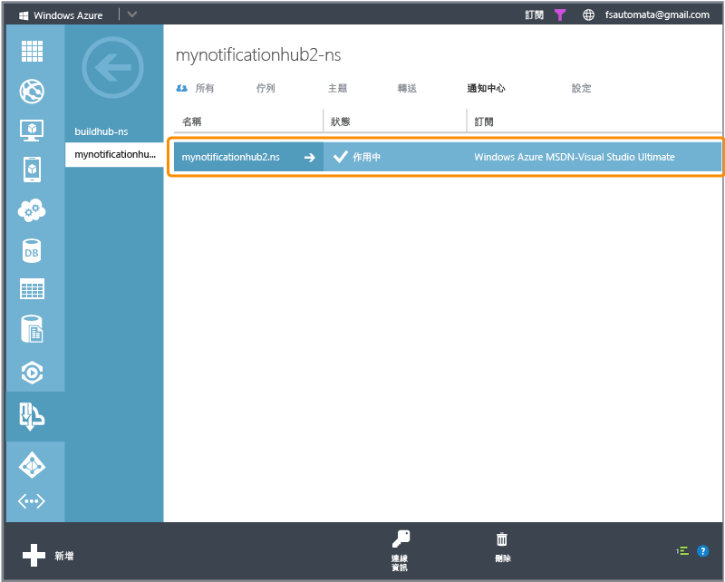
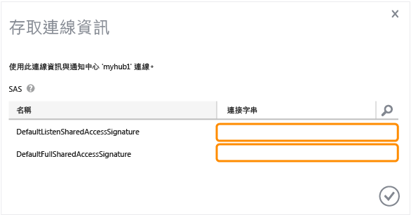

<properties linkid="" urlDisplayName="" pageTitle="Get started with Notification Hubs for Xamarin.Android apps" metaKeywords="" description="Learn how to use Azure Notification Hubs to send push notifications to a Xamarin Android application." metaCanonical="" authors="elioda" solutions="" manager="" editor="" services="mobile-services,notification-hubs" documentationCenter="" title="Get started with Notification Hubs" />

開始使用通知中心
================

[Windows 市集 C\#](/en-us/manage/services/notification-hubs/getting-started-windows-dotnet "Windows 市集 C#")[Windows Phone](/en-us/documentation/articles/notification-hubs-windows-phone-get-started/ "Windows Phone")[iOS](/en-us/documentation/articles/notification-hubs-ios-get-started/ "iOS")[Android](/en-us/documentation/articles/notification-hubs-android-get-started/ "Android")[Kindle](/en-us/documentation/articles/notification-hubs-kindle-get-started/ "Kindle")[Xamarin.iOS](/en-us/documentation/articles/partner-xamarin-notification-hubs-ios-get-started/ "Xamarin.iOS")[Xamarin.Android](/en-us/documentation/articles/partner-xamarin-notification-hubs-android-get-started/ "Xamarin.Android")

本主題將示範如何使用 Azure 通知中心將推播通知傳送至 Xamarin.Android 應用程式。在本教學課程中，您將使用 Google 雲端通訊 (GCM)，建立可接收推播通知的空白 Xamarin.Android 應用程式。完成時，您便能夠使用通知中心，將推播通知廣播到所有正在執行您應用程式的裝置。[NotificationHubs 應用程式](http://go.microsoft.com/fwlink/p/?LinkId=331329)範例中提供完成的程式碼。

本教學課程將逐步引導您完成下列啟用推播通知的基本步驟：

1.  [啟用 Google 雲端通訊](#register)
2.  [設定您的通知中心](#configure-hub)
3.  [將您的應用程式連接到通知中心](#connecting-app)
4.  [使用模擬器執行您的應用程式](#run-app)
5.  [從後端傳送通知](#send)

本教學課程將示範使用通知中心的簡單廣播案例。本教學課程需要下列項目：

-   Xamarin.Android
-   有效的 Google 帳戶

完成本教學課程是 Android 應用程式所有其他通知中心教學課程的先決條件。

**注意**

若要完成此教學課程，您必須具備有效的 Azure 帳戶。如果您沒有帳戶，只需要幾分鐘的時間就可以建立免費試用帳戶。如需詳細資訊，請參閱 [Azure 免費試用](http://www.windowsazure.com/en-us/pricing/free-trial/?WT.mc_id=A9C9624B5&returnurl=http%3A%2F%2Fwww.windowsazure.com%2Fen-us%2Fmanage%2Fservices%2Fnotification-hubs%2Fgetting-started-xamarin-android%2F)。

啟用 Google 雲端通訊啟用 Google 雲端通訊
----------------------------------------

**注意**

若要完成本主題的程序，您必須具有已通過電子郵件地址驗證的 Google 帳戶。若要建立新的 Google 帳戶，請前往 [accounts.google.com](http://go.microsoft.com/fwlink/p/?LinkId=268302)。

1.  瀏覽至 [Google apis](http://go.microsoft.com/fwlink/p/?LinkId=268303) (英文) 網站，並使用 Google 帳戶認證登入，然後按一下 **[Create project...]**。

	

    **注意**

    如果您現已有專案，登入後會將您重新導向至 **[Dashboard]** 頁面。若要從 [Dashboard] 建立新的專案，請展開 **[API Project]**，並按一下 **[Other projects]** 下的 **[Create...]**，然後輸入專案名稱，並按一下 **[Create project]**。

2.  按一下左欄中的 **[Overview]**，並記下 **[Dashboard]** 區段中的專案編號。

    在本教學課程的稍後內容中，您會設定這個值作為用戶端中的 PROJECT\_ID 變數。

3.  在 [Google apis](http://go.microsoft.com/fwlink/p/?LinkId=268303) 頁面上，按一下 **[Services]**，然後按一下切換開關來啟用 **[Google Cloud Messaging for Android]**，並接受服務條款。

4.  按一下 **[API Access]**，然後按一下 **[Create new Server key...]**

	

5.  在 **[Configure Server Key for API Project]** 中，按一下 **[Create]**。

	

6.  記下 **[API key]** 值。

	

接下來，您將使用此 API 金鑰值，讓通知中心能夠使用 GCM 進行驗證並代表您的應用程式傳送推播通知。

設定您的通知中心設定您的通知中心
--------------------------------

1.  登入 [Azure 管理入口網站](https://manage.windowsazure.com/)，並按一下畫面底部的 **[+新增]**。

2.  依序按一下 **[App Services]**、**[服務匯流排]**、**[Notification Hub]**、**[快速建立]**。

	

3.  為您的通知中心輸入名稱、選取所需的區域，然後按一下 **[Create a new Notification Hub]**。

	

4.  按一下您剛才建立的命名空間 (通常為 ***notification hub name*-ns**)，然後按一下頂端的 **[設定]**。

	

5.  按一下頂端的 **[Notification Hubs]** 索引標籤，然後按一下您剛才建立的通知中心。

	

6.  按一下頂端的 **[設定]** 索引標籤，輸入前一節中取得的 **[API Key]** 值，然後按一下 **[儲存]**。

	

7.  選取頂端的 **[儀表板]** 索引標籤，然後按一下 **[連接資訊]**。記下這兩個連接字串。

	

現在已將您的通知中心設定成使用 GCM，而且您已擁有可用來註冊應用程式和傳送推播通知的連接字串。

連接應用程式將您的應用程式連接到通知中心
----------------------------------------

### 建立新專案

1.  在 Xamarin Studio (或 Visual Studio) 中，建立新的 Android 專案 ([檔案] \> [新增] \> [方案] \> [Android Application])。

	

	

2.  按一下 [方案] 檢視中的新專案來開啟專案屬性，並選擇 **[選項]**。選取 **[建置]** 區段中的 **[Android Application]** 項目。

	

3.  將 **[Minimum Android version]** 設定為 API 層級 8。

4.  將 **[Target Android version]** 設定為想要的目標 API 版本 (必須是 API 層級 8 或更高版本)。

5.  確定 **[套件名稱]** 的第一個字母是小寫。

    **注意**

    套件名稱的第一個字母必須是小寫。否則，當您在下文為推播通知註冊 **BroadcastReceiver** 和 **IntentFilter**時，將收到應用程式資訊清單錯誤。

### 將 PushSharp 新增至專案

1.  現在，我們將在專案中新增 **PushSharp** 作為參考。為了這麼做，我們必須編譯最新版 PushSharp，並新增編譯的 DLL 作為我們 Xamarin.Android 專案的參考。

2.  造訪 [PushSharp Github 頁面](https://github.com/Redth/PushSharp) (英文)，並下載最新版本。將檔案集合解壓縮後，瀏覽到下列範例專案資料夾：

    **/Client.Samples/PushSharp.ClientSample.MonoForAndroid/PushSharp.ClientSample.MonoForAndroid.Gcm/**

    .. 並且在 Xamarin Studio (或 Visual Studio) 中開啟下列專案檔案：

    ** PushSharp.ClientSample.MonoForAndroid.Gcm.csproj **

3.  以 **[發行]** 模式建置 MonoForAndroid PushSharp 用戶端範例。

4.  在 Xamarin.Android 專案資料夾中建立 **\_external** 資料夾

5.  將 MonoForAndroid PushSharp 用戶端範例中的下列檔案複製到 Xamarin.Android 專案資料夾中新建立的 **\_external** 資料夾。

    **\\bin\\Release\\PushSharp.Client.MonoForAndroid.dll**

6.  在 Xamarin Studio (或 Visual Studio) 中開啟 Xamarin.Android 專案。

7.  以滑鼠右鍵按一下專案 **[參考]** 資料夾，並選擇 **[編輯參考...]**

8.  移至 **[.Net Assembly]** 索引標籤，瀏覽至專案的 **\_external** 資料夾，並選取稍早建置的 **PushSharp.Client.MonoForAndroid.dll**，然後按一下 **[新增]**。按一下 [確定] 關閉對話方塊。

### 將 Xamarin.NotificationHub 新增至專案

1.  現在我們需要新增程式庫來支援 NotificationHub 類別。造訪 [Xamarin.NotificationHub Github 頁面](https://github.com/SaschaDittmann/Xamarin.NotificationHub) (英文)，下載並建置 source 資料夾。

2.  將編譯後的 **ByteSmith.WindowsAzure.Messaging.Android.dll** 複製到 Xamarin.Android 專案資料夾中的 **\_external** 資料夾。

3.  在 Xamarin Studio (或 Visual Studio) 中開啟 Xamarin.Android 專案。

4.  以滑鼠右鍵按一下專案 **[參考]** 資料夾，並選擇 **[編輯參考...]**

5.  移至 **[.Net Assembly]** 索引標籤，瀏覽至專案的 **\_external** 資料夾，並選取稍早建置的 **ByteSmith.WindowsAzure.Messaging.Android.dll**，然後按一下 **[新增]**。按一下 [確定] 關閉對話方塊。

### 在專案中設定通知中心

1.  建立 **Constants.cs** 類別，並定義下列常數值 (以值取代預留位置)：

        public const string SenderID = "<GoogleProjectNumber>"; // Google API Project Number

        // Azure app specific connection string and hub path
        public const string ConnectionString = "<Azure connection string>"";
        public const string NotificationHubPath = "<hub path>";

2.  在 **MainActivity.cs** 中新增下列 using 陳述式：

        using ByteSmith.WindowsAzure.Messaging;
        using PushSharp.Client;

3.  在 **MainActivity** 類別中建立下列方法：

        private void RegisterWithGCM()
        {
            // Check to ensure everything's setup right
            PushClient.CheckDevice(this);
            PushClient.CheckManifest(this);

            // Register for push notifications
            System.Diagnostics.Debug.WriteLine("Registering...");
            PushClient.Register(this, Constants.SenderID);
        }

4.  建立新類別 **MyBroadcastReceiver**。

    **注意**

    我們將從頭逐步建立 **BroadcastReceiver**。不過，除了手動建立下文的 **MyBroadcastReceiver.cs**，還有個快速的方式，那就是參考 GitHub 上提供之 PushSharp 範例 Xamarin.Android 專案中的 **PushService.cs** 檔案。複製 **PushService.cs** 再變更類別名稱，也是很好的開始。

5.  在 **MyBroadcastReceiver.cs** 中新增下列 using 陳述式：

        using ByteSmith.WindowsAzure.Messaging;
        using PushSharp.Client;

6.  在 **using** 陳述式與 **namespace** 宣告之間新增下列權限要求：

        [assembly:Permission(Name = "@PACKAGE_NAME@.permission.C2D_MESSAGE")]
        [assembly:UsesPermission(Name = "@PACKAGE_NAME@.permission.C2D_MESSAGE")]
        [assembly:UsesPermission(Name = "com.google.android.c2dm.permission.RECEIVE")]

        //GET_ACCOUNTS is only needed for android versions 4.0.3 and below
        [assembly:UsesPermission(Name = "android.permission.GET_ACCOUNTS")]
        [assembly:UsesPermission(Name = "android.permission.INTERNET")]
        [assembly:UsesPermission(Name = "android.permission.WAKE_LOCK")]

7.  在 **MyBroadcastReceiver.cs** 中，變更 **MyBroadcastReceiver** 類別以符合下列內容：

        [BroadcastReceiver(Permission=GCMConstants.PERMISSION\_GCM\_INTENTS)]
        [IntentFilter(new string[] { GCMConstants.INTENT_FROM_GCM_MESSAGE }, Categories = new string[] { "@PACKAGE_NAME@" })]
        [IntentFilter(new string[] { GCMConstants.INTENT_FROM_GCM_REGISTRATION_CALLBACK }, Categories = new string[] { "@PACKAGE_NAME@" })]
        [IntentFilter(new string[] { GCMConstants.INTENT_FROM_GCM_LIBRARY_RETRY }, Categories = new string[] { "@PACKAGE_NAME@" })]
        public class MyBroadcastReceiver :PushHandlerBroadcastReceiverBase<PushHandlerService>
        {
            public static string[] SENDER_IDS = new string[] { Constants.SenderID };

            public const string TAG = "MyBroadcastReceiver-GCM";
        }

8.  在 **MyBroadcastReceiver.cs** 中，新增另一個衍生自 **PushHandlerServiceBase** 且名稱為 **PushHandlerService** 的類別。務必在該類別上使用 **Service** 指示詞：

        [Service] //Must use the service tag
        public class PushHandlerService :PushHandlerServiceBase
        {
            public static string RegistrationID { get; private set; }
            private NotificationHub Hub { get; set; }

            public PushHandlerService() :base(Constants.SenderID) 
            {
                Log.Info(MyBroadcastReceiver.TAG, "PushHandlerService() constructor"); 
            }
        }

9.  **PushHandlerServiceBase** 實作 **OnRegistered()**、**OnUnRegistered()**、**OnMessage()**、**OnRecoverableError()** 和 **OnError()** 方法。我們的實作類別 **PushHandlerService** 必須覆寫這些方法，而且這些方法將在發生與通知中心的互動時受到觸發作為回應。

10. 以下列程式碼覆寫 **PushHandlerService** 中的 **OnRegistered()** 方法：

        protected override async void OnRegistered(Context context, string registrationId)
        {
            Log.Verbose(MyBroadcastReceiver.TAG, "GCM Registered: " + registrationId);
            RegistrationID = registrationId;

            createNotification("PushHandlerService-GCM Registered...", "The device has been Registered, Tap to View!");

            Hub = new NotificationHub(Constants.NotificationHubPath, Constants.ConnectionString);
            try
            {
                await Hub.UnregisterAllAsync(registrationId);
            }
            catch (Exception ex)
            {
                Debug.WriteLine(ex.Message);
                Debugger.Break();
            }

            var tags = new List<string>() { "falcons" }; // create tags if you want

            try
            {
                var hubRegistration = await Hub.RegisterNativeAsync(registrationId, tags);
            }
            catch (Exception ex)
            {
                Debug.WriteLine(ex.Message); 
                Debugger.Break();
            }
        }

    **注意**

    在以上的 **OnRegistered()** 程式碼中，您應該發現能夠指定標籤來註冊特定傳訊通道。

11. 以下列程式碼覆寫 **PushHandlerService** 中的 **OnMessage** 方法：

        protected override void OnMessage(Context context, Intent intent)
        {
            Log.Info(MyBroadcastReceiver.TAG, "GCM Message Received!");

            var msg = new StringBuilder();

            if (intent != null && intent.Extras != null)
            {
                foreach (var key in intent.Extras.KeySet())
                    msg.AppendLine(key + "=" + intent.Extras.Get(key).ToString());
            }

            string messageText = intent.Extras.GetString("msg");
            if (!string.IsNullOrEmpty(messageText))
            {
                createNotification("New hub message!", messageText);
                return;
            }

            createNotification("Unknown message details", msg.ToString());
        }

12. 如前面使用方式一樣，在 **PushHandlerService** 中新增下列 **createNotification** 方法以通知使用者：

        void createNotification(string title, string desc)
        {
            //Create notification
            var notificationManager = GetSystemService(Context.NotificationService) as NotificationManager;

            //Create an intent to show ui
            var uiIntent = new Intent(this, typeof(MainActivity));

            //Create the notification
            var notification = new Notification(Android.Resource.Drawable.SymActionEmail, title);

            //Auto cancel will remove the notification once the user touches it
            notification.Flags = NotificationFlags.AutoCancel;

            //Set the notification info
            //we use the pending intent, passing our ui intent over which will get called
            //when the notification is tapped.
            notification.SetLatestEventInfo(this, title, desc, PendingIntent.GetActivity(this, 0, uiIntent, 0));

            //Show the notification
            notificationManager.Notify(1, notification);
        }

13. 覆寫抽象成員 **OnUnRegistered()**、**OnRecoverableError()** 和 **OnError()**，以便您的程式碼進行編譯。

執行應用程式在模擬器中執行應用程式
----------------------------------

當您在模擬器中執行此應用程式時，請務必使用支援 Google API 的 Android 虛擬裝置 (AVD)。

1.  從 **[工具]** 中，按一下 **[Open Android Emulator Manager]**，選取您的裝置，然後按一下 **[Edit]**。

	

2.  在 **[Target]** 中選取 **[Google API]**，然後按一下 **[OK]**。

	

3.  在頂端工具列上，按一下 **[執行]**，然後選取您的應用程式。這將啟動模擬器，並執行應用程式。

4.  應用程式將從 GCM 擷取 *registrationId*，並向通知中心註冊。

    **注意**

    若要收到推播通知，您必須在 Android 虛擬裝置上設定 Google 帳戶 (在模擬器中，瀏覽至 **Settings** 並按一下 **Add Account**)。另外，確定模擬器已連線到網際網路。

傳送通知從後端傳送通知
----------------------

您可以使用 [REST 介面](http://msdn.microsoft.com/en-us/library/windowsazure/dn223264.aspx)，從任何後端使用通知中心來傳送通知。在本教學課程中，我們將透過 .NET 主控台應用程式，以及使用節點指令碼透過行動服務來傳送通知。

使用 .NET 應用程式傳送通知：

1.  建立新的 Visual C\# 主控台應用程式：

	

2.  使用 [WindowsAzure.ServiceBus NuGet 封裝](http://nuget.org/packages/WindowsAzure.ServiceBus/)來新增 Azure 服務匯流排 SDK 的參照。在 Visual Studio 主功能表中，依序按一下 **[工具]**、**[Library Package Manager]**、**[Package Manager Console]**。接著，在主控台視窗中輸入：

		Install-Package WindowsAzure.ServiceBus

	並按 Enter 鍵。

3.  Open the file Program.cs and add the following using statement:

		using Microsoft.ServiceBus.Notifications;

4.  在 `Program` 類別中，新增下列方法：

        private static async void SendNotificationAsync()
        {
            NotificationHubClient hub = NotificationHubClient.CreateClientFromConnectionString("<connection string with full access>", "<hub name>");
            await hub.SendGcmNativeNotificationAsync("{ \"data\" : {\"msg\":\"Hello from Azure!\"}}");
        }

5.  接著在您的 Main 方法中新增下列程式碼行：

        SendNotificationAsync();
        Console.ReadLine();

6.  按 F5 鍵以執行應用程式。您應會收到快顯通知。

	

若要使用行動服務傳送通知，請依照[開始使用行動服務](/en-us/develop/mobile/tutorials/get-started-xamarin-android/#create-new-service)中的步驟進行，然後執行下列動作：

1.  登入 [Azure 管理入口網站](https://manage.windowsazure.com/)，然後選取您的行動服務。

2.  選取頂端的 **[排程器]** 索引標籤。

	

3.  建立新的排定工作、插入名稱，然後選取 **[隨選]**。

	

4.  在工作建立之後，按一下此工作名稱。然後按一下頂端列中的 **[指令碼]**。

5.  將下列指令碼插入您的排程器函數內。請確定使用您的通知中心名稱和稍早取得的 *DefaultFullSharedAccessSignature* 連接字串，來取代預留位置。按一下 **[儲存]**。

        var azure = require('azure');
        var notificationHubService = azure.createNotificationHubService('<hub name>', '<connection string>');
        notificationHubService.gcm.send(null,'{"data":{"msg" :"Hello from Mobile Services!"}}',
          function (error)
          {
            if (!error) {
               console.warn("Notification successful");
            }
            else
            {
              console.warn("Notification failed" + error);
            }
          }
        );

6.  按一下底列上的 **[執行一次]**。您應會收到快顯通知。

後續步驟
--------

在此簡單範例中，您將廣播通知到您的所有 Android 裝置。若要以特定使用者為目標，請參閱教學課程[使用通知中心來推播通知給使用者](/en-us/manage/services/notification-hubs/notify-users-aspnet)，在此同時，如果您想要按興趣群組分隔使用者，您可以參閱[使用通知中心傳送即時新聞](/en-us/manage/services/notification-hubs/breaking-news-dotnet)。若要深入了解如何使用通知中心，請參閱 [Azure 通知中心概觀](http://msdn.microsoft.com/en-us/library/jj927170.aspx)和 [Android 的通知中心作法](http://msdn.microsoft.com/en-us/library/dn282661.aspx) (英文)。

