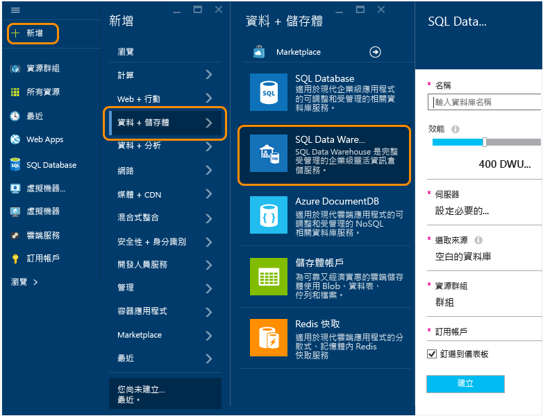
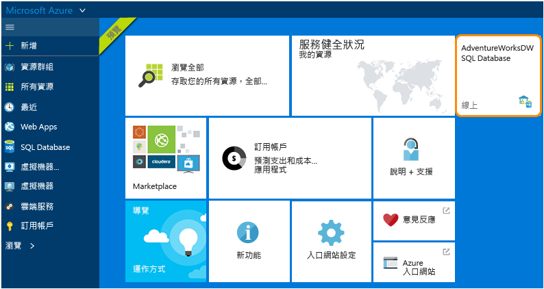

<properties
	pageTitle="在 Azure Preview 入口網站中建立 SQL 資料倉儲資料庫 | Microsoft Azure"
	description="了解如何在 Azure Preview 入口網站中建立 Azure SQL 資料倉儲"
	services="sql-data-warehouse"
	documentationCenter="NA"
	authors="lodipalm"
	manager="barbkess"
	editor=""
	tags="azure-sql-data-warehouse"/>
<tags
   ms.service="sql-data-warehouse"
   ms.devlang="NA"
   ms.topic="article"
   ms.tgt_pltfrm="NA"
   ms.workload="data-services"
   ms.date="09/29/2015"
   ms.author="lodipalm;barbkess"/>

# 在 Azure Preview 入口網站中建立 SQL 資料倉儲#

本教學課程示範在 Azure Preview 入口網站中建立 Azure SQL 資料倉儲有多麼容易，只需數分鐘。

在本逐步解說中，您將：

- 建立新的 SQL 資料倉儲資料庫。
- 為您的資料庫建立伺服器。
- 將 AdventureWorksDW 載入新的資料庫。

[AZURE.INCLUDE [free-trial-note](../../includes/free-trial-note.md)]

## 登入並尋找 SQL 資料倉儲

1. 登入 [Preview 入口網站](https://portal.azure.com)。

2. 在 [中樞] 功能表上，按一下 [新增] > [資料 + 儲存體] > [SQL 資料倉儲]。

	

## 設定效能和其他基本設定

在 [SQL 資料倉儲] 窗格中，填入下列欄位。「伺服器」和「來源」會在下一節設定。

1. **資料庫名稱**：輸入您的 SQL 資料倉儲資料庫的名稱。

2. **效能**：當您在佈建時，可以調整您的執行個體開始時的效能。建議您從 400 DWU 開始，因為它可讓您看到 SQL 資料倉儲提供的更多 MPP 優勢。
     
    

    > [AZURE.NOTE] 我們是以資料倉儲單位 (DWU) 測量效能。當您增加 DWU 時，SQL 資料倉儲會為您的資料倉儲資料庫作業增加可用的運算資源。

	> [AZURE.NOTE] 在資料庫建立後，您可以快速、輕鬆地變更效能等級。例如，如果您目前未使用資料庫，向左移動滑桿可降低成本。或是在需要更多資源時提高效能。這是 SQL 資料倉儲的可擴充功能。
	

2. **資源群組**。保留預設值。資源群組是一種容器，主要是為協助您管理 Azure 資源集合所設計。深入了解[資源群組](../azure-portal/resource-group-portal.md)。
3. **訂用帳戶**。選取為此資料庫付費的訂用帳戶。

## 設定邏輯伺服器

3. 按一下 [伺服器] > [建立新伺服器]。這會建立將與您的資料庫相關聯的邏輯伺服器。如果您已經有想要使用的 V12 伺服器，請選擇現有的伺服器，然後移至下一節。

    

    >[AZURE.NOTE] 在 SQL 資料倉儲和 SQL Database 中，伺服器在設定雲端式資料庫方面提供一致的方式。在 Azure 中，即使某部伺服器繫結至單一資料中心，它仍不算是實體硬體 (但對 SQL Server 內部部署的執行個體而言，則算是實體硬體)；它是服務軟體的一部分。這就是為什麼我們將它稱為邏輯伺服器。請注意，有別於真實世界，同一部伺服器上執行資料庫和資料倉儲的工作負載，將不會影響彼此效能。

1. 在 [新伺服器] 視窗中，填入要求的資訊。

    請務必將伺服器名稱、系統管理員名稱及密碼儲存於他處。您需要此資訊才能登入伺服器。
	- **伺服器名稱**。輸入邏輯伺服器的名稱。
	- **伺服器系統管理員名稱**。輸入伺服器系統管理員帳戶的使用者名稱。
	- **密碼**。輸入伺服器系統管理員密碼。
	- **位置**。選擇靠近您或其他 Azure 資源的地理位置。這會減少網路延遲，因為屬於邏輯伺服器的所有資料庫和資源實際上會在同一區域。

    

1. 按一下 [確定] 以儲存伺服器組態設定。

## 載入範例資料庫

1. 選擇 [來源] > [範例] 以使用範例資料庫 AdventureWorksDW 來初始化新資料庫。 

    

## 完成資料庫的建立

1. 按一下 [建立] 來建立您的 SQL 資料倉儲資料庫。 

1. 現在只需要等待幾分鐘的時間。完成時，您會在首頁上看到範例資料庫。

    

## 後續步驟

現在您已經為 SQL 資料倉儲建立範例資料庫，請在本篇的後續逐步解說中了解如何使用 SQL 資料倉儲。

- [連接和查詢](./sql-data-warehouse-get-started-connect-query.md)。

	> [AZURE.NOTE] 我們想要改善這份文件。如果對於「這篇文章很有幫助嗎？」的問題，您選擇回答「否」，則請填寫有關遺漏的內容或如何改善本文的簡短建議。非常感謝！

<!----HONumber=Oct15_HO1-->