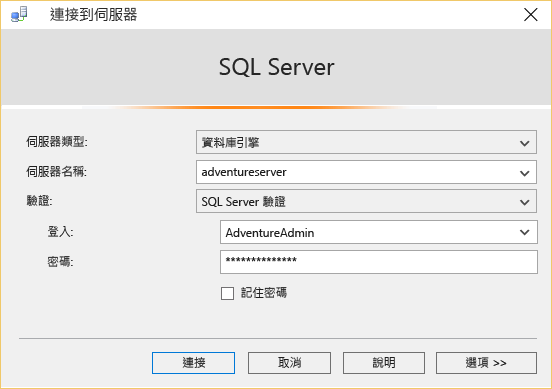
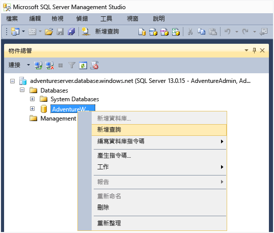

<properties
	pageTitle="如何使用 SSMS 連接到 Azure SQL Database | Microsoft Azure"
	description="了解如何使用 SSMS 連接到 Azure SQL Database。"
	services="sql-database"
	documentationCenter=""
	authors="stevestein"
	manager="jeffreyg"
	editor=""/>

<tags
	ms.service="sql-database"
	ms.workload="data-management"
	ms.tgt_pltfrm="na"
	ms.devlang="na"
	ms.topic="get-started-article"
	ms.date="08/31/2015"
	ms.author="sstein"/>

# 連接 SQL Server Management Studio
本文說明如何安裝 SQL Server Management Studio (SSMS)、連接到 Azure 中的資料庫伺服器，然後使用 TRANSACT-SQL 陳述式執行簡單查詢。

在 Azure 中您需要先有 SQL Database。您可以使用[開始使用 Microsoft Azure SQL Database](sql-database-get-started.md) 中的指示快速建立一個 SQL Database。此處的範例是您在該文章中建立的 AdventureWorks 範例資料庫為基礎，但在您執行查詢前，相同的步驟適用於任何的 SQL Database。

## 安裝並啟動 SQL Server Management Studio (SSMS)
使用 SQL Database 時，您應該使用最新版的 SSMS。請參閱[下載 SQL Server Management Studio](https://msdn.microsoft.com/library/mt238290.aspx) 將其取得。在最新版本中，SSMS 會自動在最新的更新可用時通知您。

## 啟動 SSMS 並連接到您的 SQL Database 伺服器
1. 在 Windows 搜尋方塊中輸入 "Microsoft SQL Server Management Studio"，然後按一下桌面應用程式來啟動 SSMS。
2. 在 [連接到伺服器] 對話方塊的 [伺服器名稱] 方塊中，以 *&lt;servername>*.**database.windows.net** 格式輸入裝載 SQL Database 的伺服器名稱。
3. 從 [驗證] 清單中選擇 [SQL Server 驗證]。
4. 輸入您建立伺服器時設定的 [登入] 和 [密碼]，然後按一下 [連接]。

	

### 如果連接失敗
最常見的連接失敗原因是伺服器名稱、使用者名稱或密碼錯誤，以及基於安全性理由不允許連接伺服器。請確定伺服器的防火牆設定允許從本機電腦的 IP 位址和 SSMS 用戶端使用的 IP 位址連接。它們有時候不同。

如果因為防火牆規則而連接失敗，則會在錯誤訊息中報告 IP 位址。將此 IP 位址加入至伺服器防火牆規則。如需詳細資訊，請參閱[作法：進行防火牆設定 (Azure SQL Database)](sql-database-configure-firewall-settings.md)。

## 執行範例查詢
連接之後，您可以執行範例查詢。如果您未使用[開始使用 Microsoft Azure SQL Database](sql-database-get-started.md) 中的 AdventureWorks 範例建立資料庫，此查詢將無法運作。若要深入了解，直接跳到〈後續步驟〉。

1. 在 [物件總管] 中，瀏覽至 **AdventureWorks** 資料庫。
2. 在資料庫上按一下滑鼠右鍵，然後選取 [新增查詢]。

	

3. 在查詢視窗中，複製並貼上下列程式碼。

		SELECT
		CustomerId
		,Title
		,FirstName
		,LastName
		,CompanyName
		FROM SalesLT.Customer;

4. 按一下 [執行] 按鈕。下列螢幕擷取畫面顯示成功的查詢。

	

## 後續步驟
如同您處理 SQL Server 的方式一樣，您可以使用 Transact-SQL 陳述式來建立及管理 Azure 中的資料庫。如果您已熟悉使用 Transact-SQL 搭配 SQL Server，請參閱 [Azure SQL Database Transact-SQL 資訊)](sql-database-transact-sql-information.md) 中的差異摘要。

如果您是 Transact-SQL 新手，請參閱[教學課程：撰寫 Transact-SQL 陳述式](https://msdn.microsoft.com/library/ms365303.aspx)和 [Transact-SQL 參考 (Database Engine)](https://msdn.microsoft.com/library/bb510741.aspx)。

<!---HONumber=September15_HO1-->