<properties
			pageTitle="在 Windows 上開始使用 Azure 檔案儲存體 | Microsoft Azure"
    		description="使用 Azure 檔案儲存體在雲端中儲存檔案資料，並從 Azure 虛擬機器 (VM) 或執行 Windows 的內部部署應用程式掛接雲端檔案共用。"
            services="storage"
            documentationCenter=".net"
            authors="robinsh"
            manager="carmonm"
            editor="" />

<tags ms.service="storage"
      ms.workload="storage"
      ms.tgt_pltfrm="na"
      ms.devlang="dotnet"
      ms.topic="hero-article"
      ms.date="01/24/2015"
      ms.author="robinsh" />

# 在 Windows 上開始使用 Azure 檔案儲存體

[AZURE.INCLUDE [storage-selector-file-include](../../includes/storage-selector-file-include.md)]

## 概觀

Azure 檔案儲存體是使用標準[伺服器訊息區塊 (SMB) 通訊協定](https://msdn.microsoft.com/library/windows/desktop/aa365233.aspx)，在雲端中提供檔案共用功能的服務。SMB 2.1 和 SMB 3.0 皆受到支援。使用 Azure 檔案儲存體時，您可以快速地將依賴檔案共用功能的舊式應用程式移轉至 Azure，而不必浪費成本來重新撰寫程式。在 Azure 虛擬機器、雲端服務或內部部署中執行的應用程式，可掛接雲端中的檔案共用，就像桌面應用程式掛接一般 SMB 共用一樣。可同時掛接和存取檔案儲存體共用的應用程式元件數量沒有限制。

因為檔案儲存體是標準 SMB 檔案共用，所以 Azure 中執行的應用程式可透過檔案系統 I/O API 來存取共用中的資料。因此，開發人員可利用現有的程式碼和技能來移轉現有的應用程式。IT 專業人員在管理 Azure 應用程式時，可以使用 PowerShell Cmdlet 來建立、掛接和管理檔案儲存體共用。

您可以使用 [Azure 入口網站](https://portal.azure.com)、Azure 儲存體 PowerShell Cmdlet、Azure 儲存體用戶端程式庫或 Azure 儲存體 REST API 來建立 Azure 檔案共用。此外，由於檔案共用為 SMB 共用，因此您可以透過熟悉的標準檔案系統 API 加以存取。

如需搭配 Linux 使用檔案儲存體的詳細資訊，請參閱[如何搭配使用 Azure 檔案儲存體與 Linux](storage-how-to-use-files-linux.md)。

如需檔案儲存體延展性和效能目標的詳細資訊，請參閱 [Azure 儲存體延展性和效能目標](storage-scalability-targets.md#scalability-targets-for-standard-storage-accounts)。

[AZURE.INCLUDE [storage-dotnet-client-library-version-include](../../includes/storage-dotnet-client-library-version-include.md)]

[AZURE.INCLUDE [storage-file-concepts-include](../../includes/storage-file-concepts-include.md)]

## 影片：搭配 Windows 使用 Azure 檔案儲存體

以下影片示範如何在 Windows 上建立和使用 Azure 檔案共用。

> [AZURE.VIDEO azure-file-storage-with-windows]

## 關於本教學課程

本入門教學課程將說明使用 Microsoft Azure 檔案儲存體的基本概念。在此教學課程中，我們將：

- 使用 Azure 入口網站或 PowerShell 建立新的 Azure 檔案服務共用、新增目錄、將本機檔案上傳至共用及列出目錄中的檔案。
- 掛接檔案共用，就如同您掛接任何 SMB 共用一樣。
- 使用 .NET 適用的 Azure 儲存體用戶端程式庫，從內部部署應用程式存取檔案共用。建立主控台應用程式，並使用檔案共用執行這些動作：
	- 將共用中的檔案內容寫入主控台視窗。
	- 設定檔案共用的配額 (大小上限)。
	- 為使用共用上所定義之共用存取原則的檔案建立共用存取簽章。
	- 將檔案複製到相同儲存體帳戶中的另一個檔案。
	- 將檔案複製到相同儲存體帳戶中的 Blob。
- 使用 Azure 儲存體度量進行疑難排解

所有儲存體帳戶現在可支援檔案儲存體，因此您可以使用現有的儲存體帳戶，也可以建立新的儲存體帳戶。如需建立新儲存體帳戶的詳細資訊，請參閱[如何建立、管理或刪除儲存體帳戶](storage-create-storage-account.md#create-a-storage-account)。

## 使用 Azure 入口網站來管理檔案共用

[Azure 入口網站](https://portal.azure.com)提供使用者介面，讓客戶管理檔案共用。從預覽入口網站，您可以：

- 建立檔案共用
- 上傳檔案至檔案共用和從檔案共用下載檔案
- 監視每個檔案共用的實際使用狀況
- 調整共用大小配額
- 取得用來從檔案共用掛接 Windows 用戶端的 `net use` 命令 

### 建立檔案共用

1. 登入 Azure 入口網站。

2. 在導覽功能表中，按一下 [儲存體帳戶] 或 [儲存體帳戶 (傳統)。

	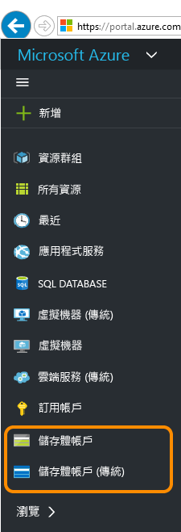

3. 選擇儲存體帳戶

	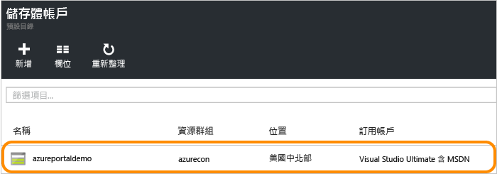

4. 選擇「檔案」服務。

	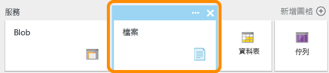

5. 按一下 [檔案共用] 並依連結建立您的第一個檔案共用。

	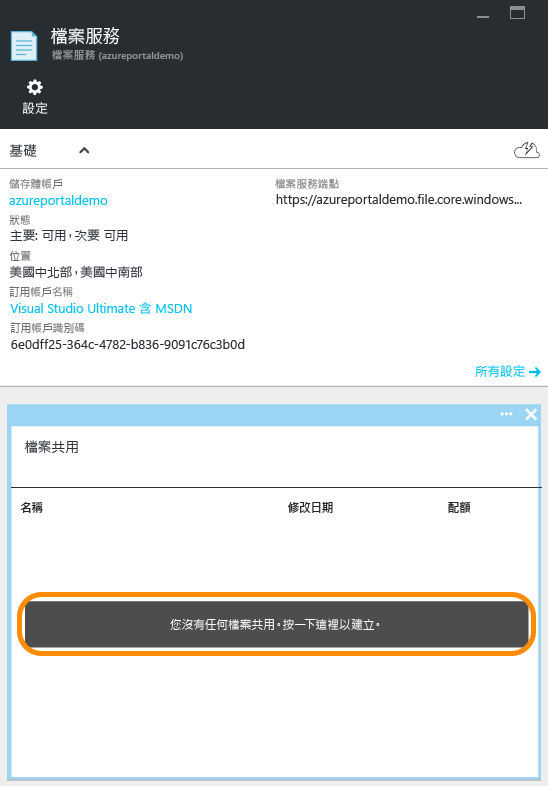

6. 填寫檔案共用名稱和檔案共用大小 (最多 5120 GB)，以建立第一個檔案共用。建立檔案共用之後，您可以從任何支援 SMB 2.1 或 SMB 3.0 的檔案系統掛接此共用。

	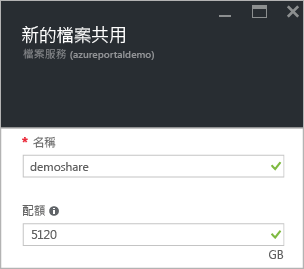

### 上傳及下載檔案

1. 選擇一個您已建立的檔案共用。

	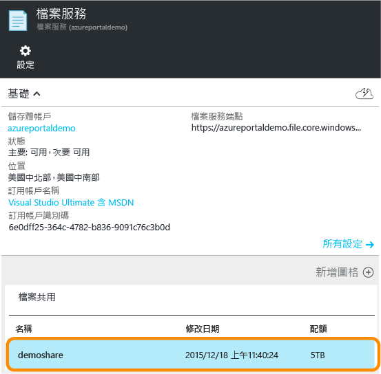

2. 按一下 [上傳] 以開啟使用者介面以進行檔案上傳。

	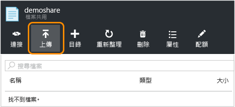

3. 在檔案上按一下滑鼠右鍵，並選擇 [下載]，將檔案下載到本機。

	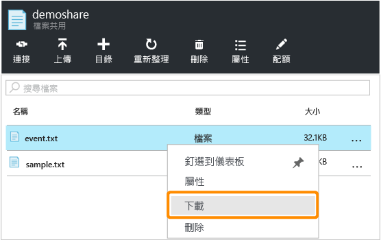

### 管理檔案共用

1. 按一下 [配額] 以變更檔案共用大小 (最多 5120 GB)。

	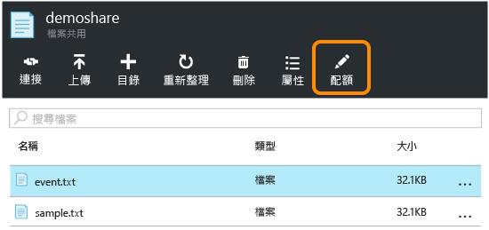

2. 按一下 [連接] 以取得從 Windows 掛接檔案共用的命令列。

	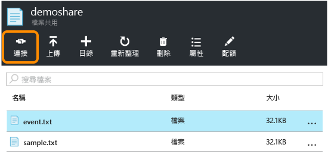

	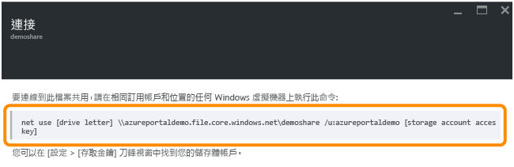

	>[AZURE.TIP] 要尋找掛接的儲存體帳戶存取金鑰，按一下您儲存體帳戶的 [設定]，再按一下 [存取金鑰]。

	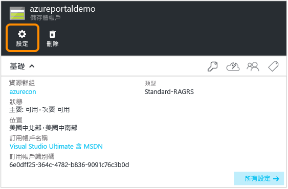

	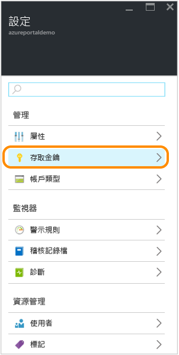

## 使用 PowerShell 管理檔案共用

或者，您可以使用 Azure PowerShell建立及管理檔案共用。

### 安裝適用於 Azure 儲存體的 PowerShell Cmdlet

若要準備使用 PowerShell，請下載並安裝 Azure PowerShell Cmdlet。如需安裝點和安裝指示的詳細資訊，請參閱[如何安裝和設定 Azure PowerShell](../install-configure-powershell.md)。

> [AZURE.NOTE] 建議您下載和安裝或升級至最新的 Azure PowerShell 模組。

透過按一下 [啟動]，然後輸入 **Azure PowerShell** 來開啟 Azure PowerShell 視窗。Azure PowerShell 視窗便會為您載入 Azure Powershell 模組。

### 建立儲存體帳戶和金鑰的內容

現在，請建立儲存體帳戶內容。內容包含儲存體帳戶名稱和帳戶金鑰。如需從 [Azure 入口網站](https://portal.azure.com)複製帳戶金鑰的指示，請參閱[檢視、複製和重新產生儲存體存取金鑰](storage-create-storage-account.md#view-copy-and-regenerate-storage-access-keys)。

使用下列範例中的儲存體帳戶名稱和金鑰來取代`storage-account-name` 和 `storage-account-key`。

	# create a context for account and key
	$ctx=New-AzureStorageContext storage-account-name storage-account-key

### 建立新的檔案共用

接著，建立名為 `logs` 的新共用。

	# create a new share
	$s = New-AzureStorageShare logs -Context $ctx

現在，您的檔案儲存體中便有一個檔案共用。接下來，我們將新增目錄和檔案。

> [AZURE.IMPORTANT] 您的檔案共用名稱必須是全部小寫。如需有關為檔案共用與檔案命名的完整詳細資料，請參閱[命名和參考共用、目錄、檔案及中繼資料](https://msdn.microsoft.com/library/azure/dn167011.aspx)。

### 在檔案共用中建立目錄

接下來，我們將在共用中建立目錄。在下列範例中，目錄的名稱為 `CustomLogs`。

    # create a directory in the share
    New-AzureStorageDirectory -Share $s -Path CustomLogs

### 上傳本機檔案至目錄

現在，請上傳本機檔案至目錄。下列範例會從 `C:\temp\Log1.txt` 上傳檔案。編輯檔案路徑，以指向本機機器上的有效檔案。

    # upload a local file to the new directory
    Set-AzureStorageFileContent -Share $s -Source C:\temp\Log1.txt -Path CustomLogs

### 列出目錄中的檔案

若要查看目錄中的檔案，您可以列出目錄的檔案。此命令也會列出子目錄，但在本範例中因為沒有子目錄，所以只會列出檔案。

	# list files in the new directory
	Get-AzureStorageFile -Share $s -Path CustomLogs

### 複製檔案

從 Azure PowerShell 0.9.7 版開始，您可以將檔案複製到另一個檔案、將檔案複製到 Blob 或將 Blob 複製到檔案。下列示範如何使用 PowerShell Cmdlet 執行這些複製作業。

	# copy a file to the new directory
    Start-AzureStorageFileCopy -SrcShareName srcshare -SrcFilePath srcdir/hello.txt -DestShareName destshare -DestFilePath destdir/hellocopy.txt -Context $srcCtx -DestContext $destCtx

    # copy a blob to a file directory
    Start-AzureStorageFileCopy -SrcContainerName srcctn -SrcBlobName hello2.txt -DestShareName hello -DestFilePath hellodir/hello2copy.txt -DestContext $ctx -Context $ctx

## 掛接檔案共用 

利用對 SMB 3.0 的支援，檔案儲存體現在支援來自 SMB 3.0 用戶端的加密和永續性處理常式。支援加密表示 SMB 3.0 用戶端可以從任何位置掛接檔案共用，包括來自：

- 在相同區域的 Azure 虛擬機器 (SMB 2.1 也支援)
- 在不同區域的 Azure 虛擬機器 (僅限 SMB 3.0)
- 內部部署用戶端應用程式 (僅限 SMB 3.0) 

當用戶端存取檔案儲存體，使用的 SMB 版本取決於作業系統所支援的 SMB 版本。下表提供 Windows 用戶端支援的摘要。請參閱此部落格以深入了解 [SMB 版本](http://blogs.technet.com/b/josebda/archive/2013/10/02/windows-server-2012-r2-which-version-of-the-smb-protocol-smb-1-0-smb-2-0-smb-2-1-smb-3-0-or-smb-3-02-you-are-using.aspx)的詳細資訊。

| Windows 用戶端 | SMB 版本支援 |
|------------------------|----------------------|
| Windows 7 | SMB 2.1 |
| Windows Server 2008 R2 | SMB 2.1 |
| Windows 8 | SMB 3.0 |
| Windows Server 2012 | SMB 3.0 |
| Windows Server 2012 R2 | SMB 3.0 |
| Windows 10 | SMB 3.0 |

### 從執行 Windows 的 Azure 虛擬機器掛接檔案共用

為說明如何掛接 Azure 檔案共用，我們現在將建立執行 Windows 的 Azure 虛擬機器，並遠端進入該虛擬機器以掛接共用。

1. 首先，依照[建立執行 Windows Server 的虛擬機器](../virtual-machines-windows-tutorial.md)中的指示建立新的 Azure 虛擬機器。
2. 接著，依照[如何登入執行 Windows Server 的虛擬機器](../virtual-machines-log-on-windows-server.md)中的指示，遠端進入此虛擬機器。
3. 在虛擬機器上開啟 PowerShell 視窗。

### 在虛擬機器中保留您的儲存體帳戶認證

在掛接到檔案共用之前，請先將儲存體帳戶認證保留在虛擬機器上。此步驟可讓 Windows 在虛擬機器重新開機時自動重新連線到檔案共用。若要保留您的帳戶認證，請從虛擬機器的 PowerShell 視窗內執行 `cmdkey` 命令。使用您的儲存體帳戶名稱來取代 `<storage-account-name>`，並使用您的儲存體帳戶金鑰來取代 `<storage-account-key>`。

	cmdkey /add:<storage-account-name>.file.core.windows.net /user:<storage-account-name> /pass:<storage-account-key>

Windows 現在便可在虛擬機器重新開機時重新連線到檔案共用。您可以驗證是否已重新連線共用，方法是從 PowerShell 視窗執行 `net use` 命令。

請注意，只有在 `cmdkey` 執行的內容中才會保存認證。如果您正在開發以服務方式執行的應用程式，您必須在該內容中保存您的認證。

### 使用保留的認證掛裝檔案共用

在遠端連線到虛擬機器後，您可以使用下列語法執行 `net use` 命令以掛接檔案共用。使用您的儲存體帳戶名稱來取代 `<storage-account-name>`，並使用您的檔案儲存體共用名稱來取代 `<share-name>`。

    net use <drive-letter>: \<storage-account-name>.file.core.windows.net<share-name>

	example :
	net use z: \\samples.file.core.windows.net\logs

由於您已在上一個步驟中保留儲存體帳戶認證，因此您無需使用 `net use` 命令提供這些認證。如果您尚未保存認證，請將它們納入傳送到 `net use` 命令的參數，如下列範例所示。

    net use <drive-letter>: \<storage-account-name>.file.core.windows.net<share-name> /u:<storage-account-name> <storage-account-key>

	example :
	net use z: \\samples.file.core.windows.net\logs /u:samples <storage-account-key>

您現在可以從虛擬機器使用檔案儲存體共用，就好像操作任何其他磁碟機一樣。您可以從命令提示字元中發佈標準檔案命令，或從 [檔案總管] 中檢視掛接的共用及其內容。您也可以使用標準 Windows 檔案 I/O API (例如 .NET Framework 中 [System.IO namespaces](http://msdn.microsoft.com/library/gg145019.aspx) 所提供的那些 API)，在可存取檔案共用的虛擬機器內執行程式碼。

您也可以從在 Azure 雲端服務上執行的角色來掛接檔案共用，方法是透過遠端進入此角色。

### 從執行 Windows 的內部部署用戶端掛接檔案共用 

若要從內部部署用戶端掛接檔案共用，您必須先進行下列步驟：

- 安裝支援 SMB 3.0 的 Windows 版本。Windows 將利用 SMB 3.0 加密來安全地在內部部署用戶端與雲端中的 Azure 檔案共用之間傳輸資料。 
- 如 SMB 通訊協定所要求，在區域網路上開啟通訊埠 445 的網際網路存取 (TCP 輸出)。 

> [AZURE.NOTE] 有些網際網路服務提供者可能會封鎖連接埠 445，因此您可能需要連絡您的服務提供者。

## 使用檔案儲存體開發

若要以程式設計方式使用檔案儲存體，您可以使用 .NET 和 Java 適用的儲存體用戶端程式庫或 Azure 儲存體 REST API。本節的範例將透過桌面上執行的簡單主控台應用程式，使用 [Azure .NET 儲存體用戶端程式庫](http://go.microsoft.com/fwlink/?LinkID=390731&clcid=0x409)來示範如何使用檔案共用。

### 建立主控台應用程式並取得組件

若要在 Visual Studio 中建立新的主控台應用程式，並安裝 Azure 儲存體 NuGet 封裝：

1. 在 Visual Studio 中，依序選擇 [檔案] -> [新增專案]，然後從 Visual C# 範本清單中選擇 [Windows] -> [主控台應用程式]。
2. 提供主控台應用程式的名稱，然後按一下 [確定]。
3. 建立專案後，在 [方案總管] 中以滑鼠右鍵按一下該專案，然後選擇 [管理 NuGet 封裝]。在線上搜尋 "WindowsAzure.Storage"，再按一下 [安裝] 以安裝 Azure 儲存體封裝與相依性。

### 將您的儲存體帳戶認證儲存到 app.config 檔案

接著，將您的認證儲存到專案的 app.config 檔案。編輯 app.config 檔案，使其看起來類似下列範例，並使用您的儲存體帳戶名稱來取代 `myaccount`，以及使用您的儲存體帳戶金鑰來取代 `mykey`。

	<?xml version="1.0" encoding="utf-8" ?>
	<configuration>
	    <startup>
	        <supportedRuntime version="v4.0" sku=".NETFramework,Version=v4.5" />
	    </startup>
	    <appSettings>
	        <add key="StorageConnectionString" value="DefaultEndpointsProtocol=https;AccountName=myaccount;AccountKey=StorageAccountKeyEndingIn==" />
	    </appSettings>
	</configuration>

> [AZURE.NOTE] 最新版本的 Azure 儲存體模擬器不支援檔案儲存體。您的連接字串必須以雲端中的 Azure 儲存體帳戶為目標，才能與檔案儲存體搭配使用。

### 新增命名空間宣告

在 [方案總管] 中開啟 program.cs 檔案，並在檔案的開頭處加入下列命名空間宣告。

	using Microsoft.WindowsAzure;
	using Microsoft.WindowsAzure.Storage;
	using Microsoft.WindowsAzure.Storage.Blob;
	using Microsoft.WindowsAzure.Storage.File;

### 以程式設計的方法擷取連接字串

您可以使用 `Microsoft.WindowsAzure.CloudConfigurationManager` 類別或 `System.Configuration.ConfigurationManager ` 類別，從 app.config 檔案中擷取所儲存的認證。Microsoft Azure 設定管理員套件包含 `Microsoft.WindowsAzure.CloudConfigurationManager` 類別，並且可在 [Nuget](https://www.nuget.org/packages/Microsoft.WindowsAzure.ConfigurationManager) 上使用。

此處的範例說明如何使用 `CloudConfigurationManager` 類別來擷取認證，並將他們包含在 `CloudStorageAccount` 類別中。在 program.cs 的 `Main()` 方法中加入下列程式碼。

    CloudStorageAccount storageAccount = CloudStorageAccount.Parse(
    	CloudConfigurationManager.GetSetting("StorageConnectionString")); 

### 以程式設計方式存取檔案共用

接著，在 `Main()` 方法 (上述程式碼後面) 加入下列程式碼，以擷取連接字串。此程式碼會取得稍早所建立檔案的參考，並將其內容輸出到主控台視窗。

	// Create a CloudFileClient object for credentialed access to File storage.
	CloudFileClient fileClient = storageAccount.CreateCloudFileClient();

	// Get a reference to the file share we created previously.
	CloudFileShare share = fileClient.GetShareReference("logs");

	// Ensure that the share exists.
	if (share.Exists())
	{
	    // Get a reference to the root directory for the share.
	    CloudFileDirectory rootDir = share.GetRootDirectoryReference();

	    // Get a reference to the directory we created previously.
	    CloudFileDirectory sampleDir = rootDir.GetDirectoryReference("CustomLogs");

	    // Ensure that the directory exists.
	    if (sampleDir.Exists())
	    {
	        // Get a reference to the file we created previously.
	        CloudFile file = sampleDir.GetFileReference("Log1.txt");

	        // Ensure that the file exists.
	        if (file.Exists())
	        {
	            // Write the contents of the file to the console window.
	            Console.WriteLine(file.DownloadTextAsync().Result);
	        }
	    }
	}

執行主控台應用程式以查看此輸出。

### 設定檔案共用的大小上限

從 Azure 儲存體用戶端程式庫 5.x 版開始，您可以設定以 GB 為單位的檔案共用配額 (或大小上限)。您也可以檢查有多少資料目前儲存在共用上。

藉由設定共用的配額，您可以限制儲存在共用上的檔案大小總計。如果共用上的檔案大小總計超過共用上設定的配額，則用戶端將無法增加現有檔案的大小或建立新的檔案 (除非這些檔案為空白)。

下列範例示範如何檢查共用的目前使用狀況，以及如何設定共用的配額。

    // Parse the connection string for the storage account.
    CloudStorageAccount storageAccount = CloudStorageAccount.Parse(
        Microsoft.Azure.CloudConfigurationManager.GetSetting("StorageConnectionString"));

    // Create a CloudFileClient object for credentialed access to File storage.
    CloudFileClient fileClient = storageAccount.CreateCloudFileClient();

    // Get a reference to the file share we created previously.
    CloudFileShare share = fileClient.GetShareReference("logs");

    // Ensure that the share exists.
    if (share.Exists())
    {
        // Check current usage stats for the share.
		// Note that the ShareStats object is part of the protocol layer for the File service.
        Microsoft.WindowsAzure.Storage.File.Protocol.ShareStats stats = share.GetStats();
        Console.WriteLine("Current share usage: {0} GB", stats.Usage.ToString());

        // Specify the maximum size of the share, in GB.
        // This line sets the quota to be 10 GB greater than the current usage of the share.
        share.Properties.Quota = 10 + stats.Usage;
        share.SetProperties();

        // Now check the quota for the share. Call FetchAttributes() to populate the share's properties.
        share.FetchAttributes();
        Console.WriteLine("Current share quota: {0} GB", share.Properties.Quota);
    }

### 產生檔案或檔案共用的共用存取簽章

從 Azure 儲存體用戶端程式庫 5.x 版開始，您可以產生檔案共用或個別檔案的共用存取簽章 (SAS)。您也可以在檔案共用上建立共用存取原則，以管理共用存取簽章。建議您建立共用存取原則，因為如果必須洩漏 SAS，它提供了一種撤銷 SAS 的方式。

下列範例會在共用上建立共用存取原則，然後使用該原則為共用中檔案上的 SAS 提供條件約束。

    // Parse the connection string for the storage account.
    CloudStorageAccount storageAccount = CloudStorageAccount.Parse(
        Microsoft.Azure.CloudConfigurationManager.GetSetting("StorageConnectionString"));

    // Create a CloudFileClient object for credentialed access to File storage.
    CloudFileClient fileClient = storageAccount.CreateCloudFileClient();

    // Get a reference to the file share we created previously.
    CloudFileShare share = fileClient.GetShareReference("logs");

    // Ensure that the share exists.
    if (share.Exists())
    {
        string policyName = "sampleSharePolicy" + DateTime.UtcNow.Ticks;

        // Create a new shared access policy and define its constraints.
        SharedAccessFilePolicy sharedPolicy = new SharedAccessFilePolicy()
            {
                SharedAccessExpiryTime = DateTime.UtcNow.AddHours(24),
                Permissions = SharedAccessFilePermissions.Read | SharedAccessFilePermissions.Write
            };

        // Get existing permissions for the share.
        FileSharePermissions permissions = share.GetPermissions();

        // Add the shared access policy to the share's policies. Note that each policy must have a unique name.
        permissions.SharedAccessPolicies.Add(policyName, sharedPolicy);
        share.SetPermissions(permissions);

        // Generate a SAS for a file in the share and associate this access policy with it.
        CloudFileDirectory rootDir = share.GetRootDirectoryReference();
        CloudFileDirectory sampleDir = rootDir.GetDirectoryReference("CustomLogs");
        CloudFile file = sampleDir.GetFileReference("Log1.txt");
        string sasToken = file.GetSharedAccessSignature(null, policyName);
        Uri fileSasUri = new Uri(file.StorageUri.PrimaryUri.ToString() + sasToken);

        // Create a new CloudFile object from the SAS, and write some text to the file.
        CloudFile fileSas = new CloudFile(fileSasUri);
        fileSas.UploadText("This write operation is authenticated via SAS.");
        Console.WriteLine(fileSas.DownloadText());
    }

如需建立與使用共用存取簽章的詳細資訊，請參閱[共用存取簽章：了解 SAS 模型](storage-dotnet-shared-access-signature-part-1.md)和[透過 Blob 服務建立與使用 SAS](storage-dotnet-shared-access-signature-part-2.md)。

### 複製檔案

從 Azure 儲存體用戶端程式庫 5.x 版開始，您可以將檔案複製到另一個檔案、將檔案複製到 Blob 或將 Blob 複製到檔案。在後續各節中，我們將示範如何以程式設計方式執行這些複製作業。

您也可以使用 AzCopy 將檔案複製到另一個檔案，或將 Blob 複製到檔案或反向操作。如需使用 AzCopy 複製檔案的詳細資訊，請參閱[如何搭配使用 AzCopy 與 Microsoft Azure 儲存體](storage-use-azcopy.md#copy-files-in-azure-file-storage-with-azcopy-preview-version-only)。

> [AZURE.NOTE] 如果要將 Blob 複製到檔案，或將檔案複製到 Blob，您必須使用共用存取簽章 (SAS) 驗證來源物件，即使是在相同的儲存體帳戶內進行複製也一樣。

**將檔案複製到另一個檔案**

下列範例會將檔案複製到相同共用中的另一個檔案。由於此複製作業是在相同儲存體帳戶中的檔案間進行複製，所以您可以使用共用金鑰驗證執行複製。

    // Parse the connection string for the storage account.
    CloudStorageAccount storageAccount = CloudStorageAccount.Parse(
        Microsoft.Azure.CloudConfigurationManager.GetSetting("StorageConnectionString"));

    // Create a CloudFileClient object for credentialed access to File storage.
    CloudFileClient fileClient = storageAccount.CreateCloudFileClient();

    // Get a reference to the file share we created previously.
    CloudFileShare share = fileClient.GetShareReference("logs");

    // Ensure that the share exists.
    if (share.Exists())
    {
        // Get a reference to the root directory for the share.
        CloudFileDirectory rootDir = share.GetRootDirectoryReference();

        // Get a reference to the directory we created previously.
        CloudFileDirectory sampleDir = rootDir.GetDirectoryReference("CustomLogs");

        // Ensure that the directory exists.
        if (sampleDir.Exists())
        {
            // Get a reference to the file we created previously.
            CloudFile sourceFile = sampleDir.GetFileReference("Log1.txt");

            // Ensure that the source file exists.
            if (sourceFile.Exists())
            {
                // Get a reference to the destination file.
                CloudFile destFile = sampleDir.GetFileReference("Log1Copy.txt");

                // Start the copy operation.
                destFile.StartCopy(sourceFile);

                // Write the contents of the destination file to the console window.
                Console.WriteLine(destFile.DownloadText());
            }
        }
    }

**將檔案複製到 Blob**

下列範例會建立檔案，並將其複製到相同儲存體帳戶內的 Blob。此範例會建立來源檔案的 SAS，供服務用來在複製作業期間驗證來源檔案存取權。

    // Parse the connection string for the storage account.
    CloudStorageAccount storageAccount = CloudStorageAccount.Parse(
        Microsoft.Azure.CloudConfigurationManager.GetSetting("StorageConnectionString"));

    // Create a CloudFileClient object for credentialed access to File storage.
    CloudFileClient fileClient = storageAccount.CreateCloudFileClient();

    // Create a new file share, if it does not already exist.
    CloudFileShare share = fileClient.GetShareReference("sample-share");
    share.CreateIfNotExists();

    // Create a new file in the root directory.
    CloudFile sourceFile = share.GetRootDirectoryReference().GetFileReference("sample-file.txt");
    sourceFile.UploadText("A sample file in the root directory.");

    // Get a reference to the blob to which the file will be copied.
    CloudBlobClient blobClient = storageAccount.CreateCloudBlobClient();
    CloudBlobContainer container = blobClient.GetContainerReference("sample-container");
    container.CreateIfNotExists();
    CloudBlockBlob destBlob = container.GetBlockBlobReference("sample-blob.txt");

    // Create a SAS for the file that's valid for 24 hours.
    // Note that when you are copying a file to a blob, or a blob to a file, you must use a SAS
    // to authenticate access to the source object, even if you are copying within the same
    // storage account.
    string fileSas = sourceFile.GetSharedAccessSignature(new SharedAccessFilePolicy()
    {
        // Only read permissions are required for the source file.
        Permissions = SharedAccessFilePermissions.Read,
        SharedAccessExpiryTime = DateTime.UtcNow.AddHours(24)
    });

    // Construct the URI to the source file, including the SAS token.
    Uri fileSasUri = new Uri(sourceFile.StorageUri.PrimaryUri.ToString() + fileSas);

    // Copy the file to the blob.
    destBlob.StartCopy(fileSasUri);

    // Write the contents of the file to the console window.
    Console.WriteLine("Source file contents: {0}", sourceFile.DownloadText());
    Console.WriteLine("Destination blob contents: {0}", destBlob.DownloadText());

您可以用相同方式將 Blob 複製到檔案。如果來源物件為 Blob，則請建立 SAS，以便在複製作業期間驗證該 Blob 存取權。

## 使用度量疑難排解檔案儲存體

Azure 儲存體分析現在支援檔案儲存體的度量。利用度量資料，您可以追蹤要求及診斷問題。

您可以從 [Azure 入口網站](https://portal.azure.com)啟用檔案儲存體的度量。您也可以透過 REST API 或儲存體用戶端程式庫中的其中一個同類工具來呼叫設定檔案服務屬性作業，以程式設計方式啟用度量。

## 檔案儲存體常見問題集

1. **檔案儲存體是否支援 Active Directory 式的驗證？** 

	我們目前不支援 AD 式驗證或 ACL，但在我們的功能要求清單中卻有它。目前，Azure 儲存體帳戶金鑰可用來提供檔案共用的驗證。我們的確提供透過 REST API 或用戶端程式庫使用共用存取簽章 (SAS) 的因應措施。使用 SAS 時，您可以產生在一段時間內都是有效的具有特定權限的權杖。例如，您可以產生具有指定檔案的唯讀存取的權杖。擁有此權杖的任何人，在其有效時具有該檔案的唯讀存取。

	僅透過 REST API 或用戶端程式庫才支援 SAS。當您透過 SMB 通訊協定掛接檔案共用時，您無法使用 SAS 來委派其內容的存取。

2. **Azure 檔案共用可公開在網際網路顯示，或只可從 Azure 取得？**
 
	只要已開啟連接埠 445 (TCP 輸出) 且您的用戶端支援 SMB 3.0 通訊協定 (例如：Windows 8 或 Windows Server 2012)，即可透過網際網路使用檔案共用。

3. **Azure 虛擬機器和檔案共用之間的網路流量，會計算為向訂用帳戶收費的外部頻寬嗎？**

	如果檔案共用和虛擬機器位於不同的區域，兩者之間的流量會以外部頻寬收費。
 
4. **如果網路流量是在虛擬機器和相同區域的檔案共用之間，是否免費？**

	是。如果流量位於相同區域則是免費的。

5. **從內部部署虛擬機器連接到 Azure 檔案儲存體是否仰賴 Azure ExpressRoute？**

	沒有。如果沒有 ExpressRoute，您仍然可以從內部部署存取檔案共用，只要您將連接埠 445 (TCP 輸出) 開啟供網際網路存取。不過，您可以搭配使用 ExpressRoute 與檔案儲存體 (如果需要)。

6. **容錯移轉叢集的「檔案共用見證」是Azure 檔案儲存體的其中一個使用案例？**

	這目前不受支援。
 
7. **檔案儲存體目前只能透過 LRS 或 GRS 複寫，正確嗎？**

	我們打算支援 RA-GRS，但時程尚未決定。

8. **何時能對 Azure 檔案儲存體使用現有的儲存體帳戶？**

	Azure 檔案儲存體現在已為所有儲存體帳戶啟用。

9. **重新命名作業也會加入 REST API 嗎？**

	我們的 REST API 中尚未支援重新命名。

10. **可以有巢狀共用，換句話說，共用下的共用嗎？**

	否。檔案共用是您可以掛接的虛擬驅動程式，因此不支援巢狀共用。

11. **可以對共用內的資料夾指定唯讀或唯寫權限嗎？**

	如果是透過 SMB 掛接檔案共用，則您對權限沒有此層級的控制。不過，您可以透過 REST API 或用戶端程式庫來建立共用存取簽章 (SAS)，以達到此目的。

12. 嘗試將檔案解壓縮到檔案儲存體時，執行速度很緩慢。**我該怎麼辦？**

	若要將大量檔案傳輸到檔案儲存體，我們建議您使用 AzCopy、Azure Powershell (Windows) 或 Azure CLI (Linux/Unix)，因為這些工具已針對網路傳輸最佳化。

## 後續步驟

請參閱這些連結以取得 Azure 檔案儲存體的相關詳細資訊。

### 概念性文章和影片

- [Azure 檔案儲存體：適用於 Windows 和 Linux 的無摩擦雲端 SMB 檔案系統](https://azure.microsoft.com/documentation/videos/azurecon-2015-azure-files-storage-a-frictionless-cloud-smb-file-system-for-windows-and-linux/)
- [如何搭配使用 Azure 檔案儲存體與 Linux](storage-how-to-use-files-linux.md)
- [使用 AzCopy 命令列公用程式傳輸資料](storage-use-azcopy)

### 檔案儲存體的工具支援

- [搭配使用 Azure PowerShell 與 Azure 儲存體](storage-powershell-guide-full.md)
- [如何搭配使用 AzCopy 與 Microsoft Azure 儲存體](storage-use-azcopy.md)
- [使用 Azure CLI 搭配 Azure 儲存體](storage-azure-cli.md#create-and-manage-file-shares)

### 參考

- [Storage Client Library for .NET 參考資料](https://msdn.microsoft.com/library/azure/dn261237.aspx)
- [檔案服務 REST API 參考](http://msdn.microsoft.com/library/azure/dn167006.aspx)

### 部落格文章

- [Azure 檔案儲存體現已公開推出](http://go.microsoft.com/fwlink/?LinkID=626728&clcid=0x409)
- [Azure 檔案儲存體的深入探討](http://go.microsoft.com/fwlink/?LinkID=626729&clcid=0x409) 
- [Microsoft Azure 檔案服務簡介](http://blogs.msdn.com/b/windowsazurestorage/archive/2014/05/12/introducing-microsoft-azure-file-service.aspx)
- [保留與 Microsoft Azure 檔案的連線](http://blogs.msdn.com/b/windowsazurestorage/archive/2014/05/27/persisting-connections-to-microsoft-azure-files.aspx)
- [使用 AzCopy 命令列公用程式傳輸資料](storage-use-azcopy)

<!---HONumber=AcomDC_0128_2016-->