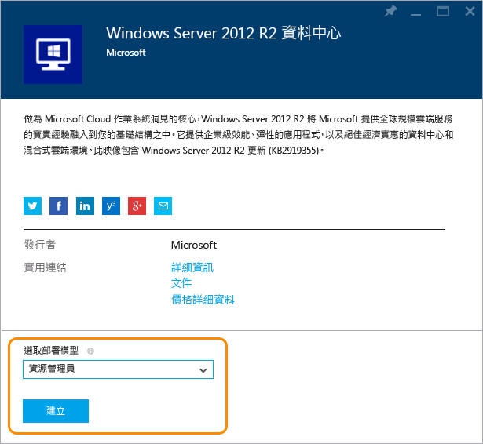
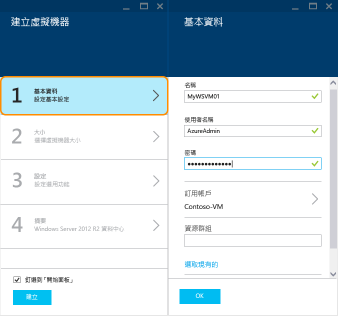
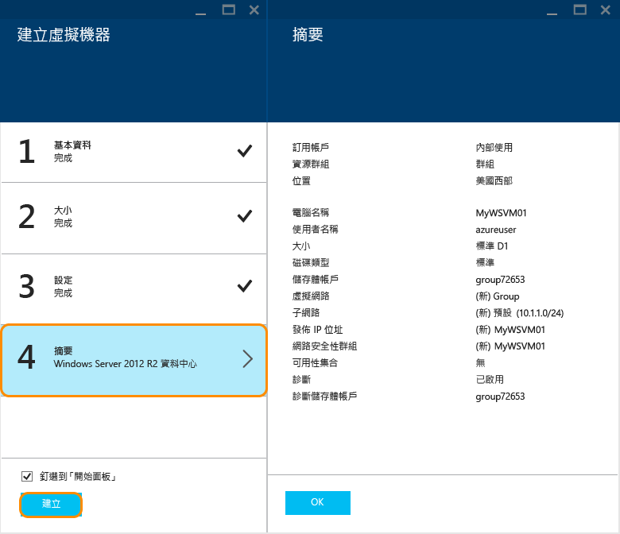
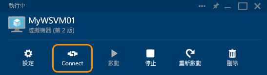

<properties
	pageTitle="在 Azure Preview 入口網站中建立執行 Windows 的虛擬機器 | Microsoft Azure"
	description="了解如何使用 Azure Preview 入口網站中的 Azure Marketplace，建立執行 Windows 的 Azure 虛擬機器 (VM) 資源"
	services="virtual-machines"
	documentationCenter=""
	authors="KBDAzure"
	manager="timlt"
	editor=""
	tags="azure-resource-manager"/>
<tags
	ms.service="virtual-machines"
	ms.workload="infrastructure-services"
	ms.tgt_pltfrm="vm-windows"
	ms.devlang="na"
	ms.topic="get-started-article"
	ms.date="07/13/2015"
	ms.author="kathydav"/>

# 在 Azure Preview 入口網站中建立執行 Windows 的虛擬機器#

> [AZURE.SELECTOR]
- [Azure preview portal](virtual-machines-windows-tutorial.md)
- [Azure portal](virtual-machines-windows-tutorial-classic-portal.md)
- [PowerShell - Resource manager](virtual-machines-deploy-rmtemplates-powershell.md)
- [PowerShell - Service management](virtual-machines-ps-create-preconfigure-windows-vms.md)

本教學課程示範在 Preview 入口網站中建立 Azure 虛擬機器 (VM) 有多麼容易，只需數分鐘。我們將使用 Windows Server 2012 R2 Datacenter 映像做為範例，在 Azure 資源管理員中建立 VM，但這只是 Azure 提供的眾多映像的其中一個。請注意，您可以選擇何種映像取決於您的訂用帳戶。例如，桌面映像可能可供 MSDN 訂閱者使用。

您也可以使用自己的映像，搭配資源管理員範本或搭配自動化工具來建立 VM。若要深入瞭解不同的方法，請參閱[建立 Windows 虛擬機器的不同方式](virtual-machines-windows-choices-create-vm.md)。

[AZURE.INCLUDE [free-trial-note](../../includes/free-trial-note.md)]

## 選取映像

移至 Preview 入口網站中的 Azure Marketplace，以尋找您想要的 Windows Server VM 映像。

1. 登入 [Preview 入口網站](https://portal.azure.com)。

2. 在 [中樞] 功能表上，依序按一下 [**新增**] > [**運算**] > [**Windows Server 2012 R2 Datacenter**]。

	

	>[AZURE.TIP]若要尋找其他映像，請按一下 [**Marketplace**]，然後搜尋或篩選可用的項目。

3. 在 [**Windows Server 2012 R2 Datacenter**] 頁面上，選取 [**使用資源管理員堆疊**]，以在 Azure 資源管理員中建立 VM。(對於大多數新的工作負載，我們建議使用 [資源管理員] 堆疊。如需考量事項，請參閱 [Azure 資源管理員下的 Azure 運算、網路和儲存體提供者](virtual-machines-azurerm-versus-azuresm.md))。 然後按一下 [**建立**]。

	

## 建立虛擬機器

選取映像之後，您可以針對多數組態使用 Azure 的預設設定，並能快速建立 VM。

1. 在 [**建立虛擬機器**] 刀鋒視窗上，按一下 [**基本概念**]。輸入您想要給予 VM 的 [**名稱**]、系統管理 [**使用者名稱**]，以及強式 [**密碼**]。如果您有一個以上的訂用帳戶，請針對新的 VM，以及新的或現有的 [**資源群組**] 和 Azure 資料中心 [**位置**] 指定一個訂用帳戶。

	

	>[AZURE.NOTE]\*\*使用者名稱\*\* 是指要用來管理伺服器的系統管理帳戶。建立一個很難讓人猜到，但您可以記住的密碼。**您將需要使用者名稱和密碼才能登入虛擬機器**。

2. 按一下 [**大小**]，然後選取適當的 VM 大小以符合您需求。每個大小會指定計算核心、記憶體和其他功能的數目，例如支援將會影響價格的進階儲存體。Azure 會自動根據您選擇的映像來建議特定大小。

	

	>[AZURE.NOTE]進階儲存體可供某些區域的 DS 系列虛擬機器使用。進階儲存體對於如資料庫這類資料密集的工作負載是最佳的儲存體選項。如需詳細資訊，請參閱[進階儲存體：Azure 虛擬機器工作負載適用的高效能儲存體](storage-premium-storage-preview-portal.md)。

3. 按一下 [**設定**] 以查看新 VM 的儲存體和網路設定。對於第一個 VM，通常您可以接受預設的設定。如果您選取支援的 VM 大小，您可以藉由選取 [**磁碟類型**] 下的 [**進階 (SSD)**] 嘗試進階儲存體。

	

6. 按一下 [**摘要**] 以檢閱您的組態選擇。當您檢閱或更新完設定時，請按一下 [**建立**]。

	

8. 當 Azure 建立 VM 時，您可以在 [中樞] 功能表的 [**通知**] 中持續追蹤進度。Azure 建立 VM 之後，除非您在 [**建立虛擬機器**] 刀鋒視窗中清除 [**釘選到「開始面板」**]，否則您將會在「開始面板」上看到 VM。

## 登入虛擬機器

建立 VM 之後，您就可以登入 VM 以管理其設定和將在 VM 上執行的應用程式。

>[AZURE.NOTE]如需要求和疑難排解提示，請參閱[透過 RDP 或 SSH 連接至 Azure 虛擬機器](https://msdn.microsoft.com/library/azure/dn535788.aspx)。

1. 如果您尚未登入 [Preview 入口網站](https://portal.azure.com)，請先登入。

2. 在 [開始面板] 上按一下您的 VM。如果您需要尋找它，請按一下 [**全部瀏覽**] > [**最近**]，或 [**全部瀏覽**] > [**虛擬機器**]。然後從清單中選取您的 VM。

3. 在 VM 刀鋒視窗上，按一下 [**連接**]。

	

4. 按一下 [**開啟**]，以使用系統自動為 Windows Server 虛擬機器建立的遠端桌面通訊協定檔案。

5. 按一下 [連接]。

6. 輸入您建立虛擬機器時設定的使用者名稱和密碼，然後按一下 [**確定**]。

7. 按一下 [是] 以驗證虛擬機器的身分識別。

	您現在可以開始使用虛擬機器，就如同操作任何其他伺服器一樣。

## 後續步驟

* 使用 Azure PowerShell 和 Azure CLI [尋找並選取 VM 映像](resource-groups-vm-searching.md)。
* 使用 [Azure 資源管理員](virtual-machines-how-to-automate-azure-resource-manager.md)和 [Azure 資源管理員範本](http://azure.microsoft.com/documentation/templates/)，自動部署和管理 VM 和工作負載。

<!---HONumber=July15_HO5-->