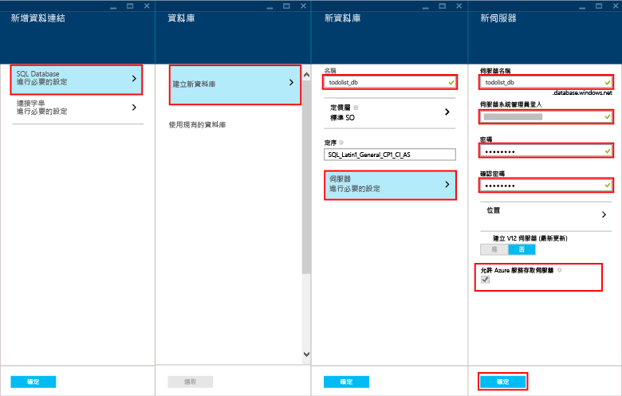

依照下列步驟建立新的行動應用程式後端。

1. 登入 [Azure 入口網站]。

2. 在視窗左上方，依序按一下 [+新增] 按鈕 > [Web + 行動] > [行動應用程式]，然後為您的行動應用程式後端命名。

3. 在 [資源群組] 方塊中，輸入與您應用程式相同的名稱。

4. 系統將會選取預設應用程式服務方案。如果您想要變更應用程式服務方案，可以依序按一下 [應用程式服務方案] > [+ 建立新方案]。為新的應用程式服務方案命名，並選取適當位置。按一下 [定價層]，並選取適當的服務定價層。選取 [檢視全部] 檢視其他價格選項，例如 [免費] 和 [共用]。選取定價層後，請按一下 [選取] 按鈕。返回 [應用程式服務方案] 刀鋒視窗，按一下 [確定]。

5. 按一下 [建立]。如此即會建立您稍後將部署伺服器專案的行動應用程式後端。佈建行動應用程式後端可能需要幾分鐘。行動程式後端佈建完畢後，入口網站將會開啟行動應用程式後端的 [設定] 刀鋒視窗。在下一個步驟中，您將建立新的 SQL Database。

    > [AZURE.NOTE]作為本教學課程的一部分，您需要建立新的 SQL 資料庫執行個體和伺服器。您可以如同任何其他 SQL Database 執行個體般重新使用這個新資料庫，並加以管理。如果您在相同位置後端已有做為新行動應用程式後端的資料庫，可以改選 [使用現有的資料庫]，然後選取該資料庫。不建議您使用位在不同位置的資料庫，因為這會需要額外的頻寬成本和產生更高的延遲。

6. 在新的行動程式後端中，依序按一下 [設定] > [行動應用程式] > [資料] > [+新增]。

7. 在 [新增資料連接] 刀鋒視窗中，依序按一下 [SQL Database - 設定必要設定] > [建立新的資料庫]。在 [名稱] 欄位中輸入新資料庫的名稱。

8. 按一下 [伺服器]。在 [新增伺服器] 刀鋒視窗中，於 [伺服器名稱] 欄位輸入唯一的伺服器名稱，然後提供合適的**伺服器系統管理員登入**和**密碼**。確定已核取 [允許 Azure 服務存取伺服器]。按一下 [確定]。

    

9. 在 [新增資料庫] 刀鋒視窗中，按一下 [確定]。

10. 返回 [新增資料連接] 刀鋒視窗，選取 [連接字串]，輸入您建立資料庫時提供的登入與密碼。如果您使用現有的資料庫，請提供該資料庫的登入認證。輸入之後，按一下 [確定]。

11. 再次返回 [新增資料連接]，按一下 [確定] 以建立資料庫。

建立資料庫可能需要幾分鐘的時間。使用 [通知] 區域監視部署的進度。在資料庫成功部署之前，請勿繼續進行。

您現在已佈建 Azure 行動應用程式後端，可供您的行動用戶端應用程式使用。接下來，您將下載簡易「待辦事項清單」後端的伺服器專案，然後將專案發佈至 Azure。

<!-- URLs. -->
[Azure 入口網站]: https://portal.azure.com/

<!----HONumber=August15_HO8-->