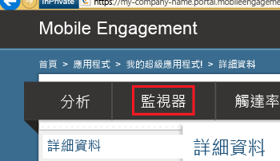
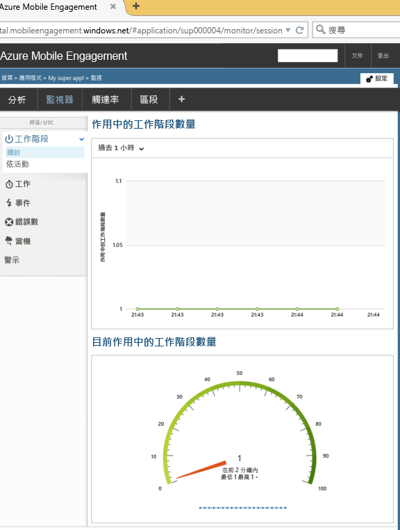

本節說明如何使用 Mobile Engagement 的即時監視功能來檢查您的應用程式是否連線至 Mobile Engagement 後端。

1. 瀏覽至您的 Mobile Engagement 入口網站。確認您正位在用於此專案的 App 內，然後按一下底部的 [接洽] 按鈕：

	 

2. 您將在 Mobile Engagement 入口網站登陸。在這裡按一下 [監視器] 索引標籤。
	 
	

3. 監視器可以即時顯示將會啟動您 App 的任何裝置。
	 
4. 在模擬器 (Emulator/Simulator) 或連接的裝置啟動您的 App。如果您的整合正確，應該會在監視器中看到一個工作階段，這表示您的 App 現在已連線到 Mobile Engagement 後端，並對其傳送資料。
	
	 

<!---HONumber=Oct15_HO3-->