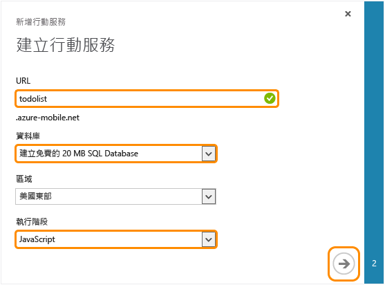



依照下列步驟即可建立新的行動服務。

1.	登入[管理入口網站]。 

2.	在瀏覽窗格的底部，按一下 **[+NEW]**。

	

3.	展開 **[運算]** 和 **[行動服務]**，然後按一下 **[建立]**。

	

	隨即出現 **[新增行動服務]** 對話方塊。

4.	在 **[建立行動服務]** 頁面中，依序選取 **[建立免費 20 MB SQL Database]** 和 **[.NET]** 執行階段，然後在 **[URL]** 文字方塊中輸入新行動服務的子網域名稱，並等候進行名稱驗證。一旦名稱驗證完成之後，按一下向右鍵按鈕前往下一頁。	

	

   	這將顯示 **[指定資料庫設定]** 頁面。

	> [AZURE.NOTE] 作為本教學課程的一部分，您需要建立新的 SQL Database 執行個體和伺服器。您可以重複使用及管理這個新的資料庫，如同操作其他任何 SQL Database 執行個體一般。如果新行動服務的區域已經有資料庫存在，您可以改選 [使用現有資料庫]****，然後選取該資料庫。不建議您使用位在不同區域的資料庫，因為這會需要額外的頻寬成本和產生更高的延遲。	

6.	在 **[名稱]** 中輸入新資料庫的名稱，然後輸入 **[登入名稱]** (也就是新 SQL Database 伺服器的系統管理員登入名稱)，輸入並確認密碼，然後按一下核取按鈕以完成程序。

	

	> [AZURE.NOTE] 當您所提供的密碼不符合最低需求或密碼不相符時，便會顯示一則警告。 
	>
	> 建議您記下您所指定的系統管理員登入名稱和密碼；您日後需要此資訊才能重複使用 SQL Database 執行個體或伺服器。

您現在已經建立可供行動應用程式使用的新行動服務。

<!-- URLs. -->
[管理入口網站]: https://manage.windowsazure.com/

<!--HONumber=42-->
