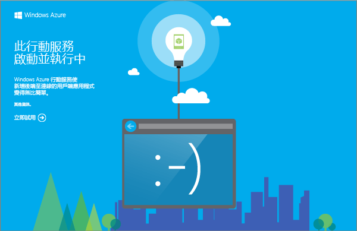

您所下載的行動服務專案，可讓您直接在本機電腦或虛擬機器上執行新的行動服務。如此，您即可在將服務程式碼發佈至 Azure 之前先加以偵錯。

在本節中，您將對執行於本機的行動服務測試新的應用程式。

1. 瀏覽至儲存壓縮專案檔案的位置，在電腦上將檔案解壓縮，然後在 Visual Studio 中開啟方案檔。

2. 按 **F5** 鍵以重新建置專案，並在本機啟動行動服務。

	

	在行動服務成功啟動後，會顯示一個網頁。

3. 在 Visual Studio 的 [方案總管] 中，以滑鼠右鍵按一下您的用戶端應用程式專案，並按一下 **[設定為啟始專案]**，然後按 **F5** 鍵以重新建置專案，並啟動應用程式。

	這會啟動應用程式，並將其連接至本機行動服務執行個體。	

4. 在應用程式的 **[插入 TodoItem]** 中輸入有意義的文字 (例如 _Complete the tutorial_)，然後按一下 **[儲存]**。

	這會將 POST 要求傳送至本機行動服務。要求中的資料會插入 TodoItem 資料表中。行動服務會傳回資料表中儲存的項目，並且在應用程式的第二個資料欄中顯示資料。<!--HONumber=42-->
