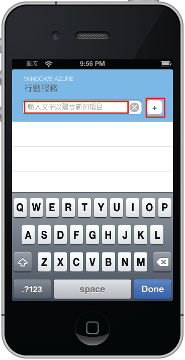



本教學課程的最後階段是建立並執行新的應用程式。

1. 瀏覽至儲存壓縮專案檔案的位置，在電腦上展開檔案，然後使用 Xcode 開啟專案檔案。

   	

2. 按 [**執行**] 按鈕以建立專案，並在 iPhone 模擬器中啟動應用程式 (此專案的預設選項)。

3. 在應用程式中輸入有意義的文字，例如 _Complete the tutorial_，然後按一下加號 (**+**) 圖示。

   	

   	如此會傳送 POST 要求到 Azure 中代管的新行動服務。要求中的資料會插入 TodoItem 資料表中。行動服務會傳回資料表中儲存的項目，而該資料會顯示在清單中。

	>[WACOM.NOTE]您可以檢閱造成存取您行動服務來進行查詢和插入資料的程式碼，該程式碼位於 TodoService.m 檔案中。
 
 	

