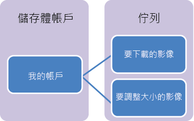

## 什麼是佇列儲存體？

Azure 佇列儲存體是一種服務，用於儲存
可從世界各地，透過
使用 HTTP 或 HTTPS 驗證的呼叫存取的大量訊息。單一佇列訊息的大小
可以高達 64 KB，而且一個佇列可以包含數百萬個訊息，高達儲存體帳戶的
總容量限制。一個儲存體帳戶可包含多達 500 TB 的 Blob、佇列和資料表資料。如需關於儲存體帳戶容量的詳細資訊，請參閱 [Azure 儲存體延展性和效能目標](http://msdn.microsoft.com/library/azure/dn249410.aspx)。

佇列儲存體的一般用途包括：

-   建立積存的工作供非同步處理
-   將訊息從 Azure Web 角色傳遞至 Azure 
    背景工作角色

## 佇列服務概念

佇列服務包含下列元件：

- **URL 格式：**佇列可以使用以下 URL 格式定址：
	http://`<storage account>`.queue.core.windows.net/`<queue>` 
      
下列 URL 可定址圖中的其中一個佇列：  
	http://myaccount.queue.core.windows.net/imagesToDownload

-**儲存體帳戶：**所有對 Azure 儲存體的存取都是透過儲存體帳戶進行。如需關於儲存體帳戶容量的詳細資訊，請參閱 [Azure 儲存體延展性和效能目標](http://msdn.microsoft.com/library/azure/dn249410.aspx)。

- **佇列：**一個佇列包含一組訊息。所有訊息都必須在佇列中。

- **訊息：**任何格式的大小上限為 64KB。

<!--HONumber=49-->