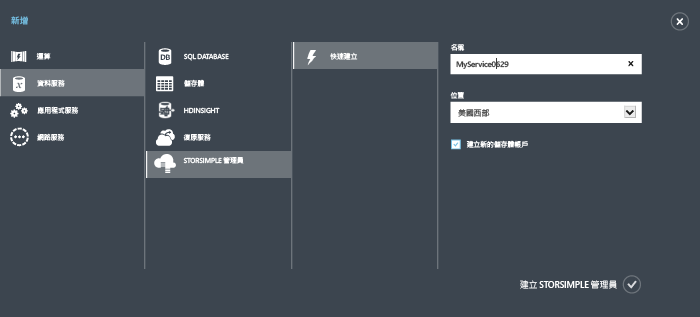
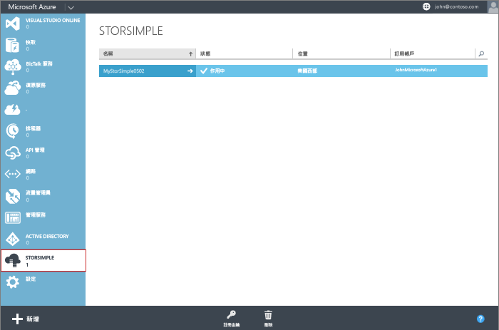

<!--author=alkohli last changed:01/14/2016-->

#### 建立新服務

1. 使用您的 Microsoft 帳戶認證登入 Azure 傳統入口網站，URL 如下：[https://manage.windowsazure.com/](https://manage.windowsazure.com/)。

2. 在 Azure 傳統入口網站中，按一下 [新增] > [資料服務] > [StorSimple Manager] > [快速建立]。

3. 在顯示的表單中，執行下列動作：
  1. 為服務提供唯一的 [名稱]。這是可以用來識別服務的易記名稱。名稱長度可介於 2 到 50 個字元之間，且可以是字母、數字和連字號。名稱必須以字母或數字為開頭或結尾。
  2. 提供服務的 [位置]。一般而言，請選擇最接近您要部署裝置之地理區域的位置。您也可能計入下列因素： 
	 
		- If you have existing workloads in Azure that you also intend to deploy with your StorSimple device, you should use that datacenter.
		- Your StorSimple Manager service and Azure storage can be in two separate locations. In such a case, you are required to create the StorSimple Manager and Azure storage account separately. To create an Azure storage account, go to the Azure Storage service in the Azure classic portal and follow the steps in [Create an Azure Storage account](storage-create-storage-account.md#create-a-storage-account). After you create this account, add it to the StorSimple Manager service by following the steps in [Configure a new storage account for the service](storsimple-deployment-walkthrough.md#configure-a-new-storage-account-for-the-service).
		 
  3. 從下拉式清單選擇 [訂用帳戶]。訂用帳戶會連結到您的帳單帳戶。如果您只擁有一個訂用帳戶，則此欄位不存在。
  4. 選取 [建立新的儲存體帳戶]，自動建立具有此服務的儲存體帳戶。這個儲存體帳戶將具有一個特殊名稱，例如 "storsimplebwv8c6dcnf"。 如果您需要將資料放在不同的位置，取消核取此方塊。 
  5. 按一下 [建立 StorSimple Manager] 來建立服務。

   

  系統會將您導向至 [服務] 登陸頁面。服務建立需要幾分鐘的時間。成功建立服務之後，即會在適當時機通知您，並將服務狀態變更為 [作用中]。
 
   

 **提供的影片**

若要觀看影片示範如何建立新的 StorSimple Manager 服務，請按一下[這裡](https://azure.microsoft.com/documentation/videos/create-a-storsimple-manager-service/)。

<!---HONumber=AcomDC_0128_2016-->